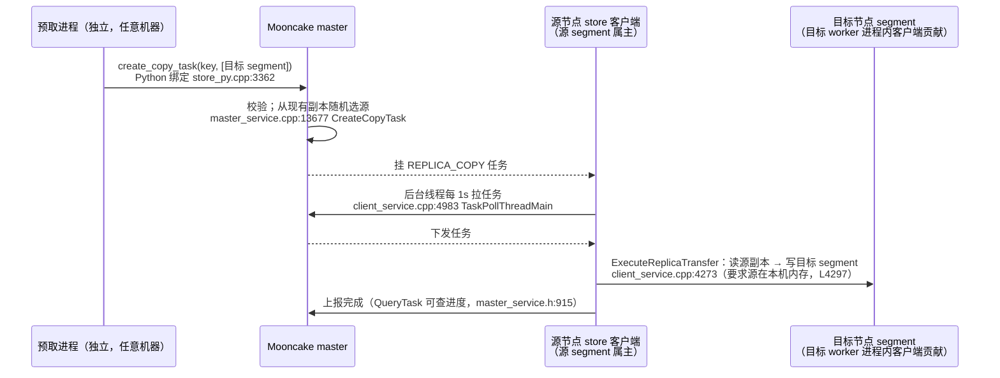
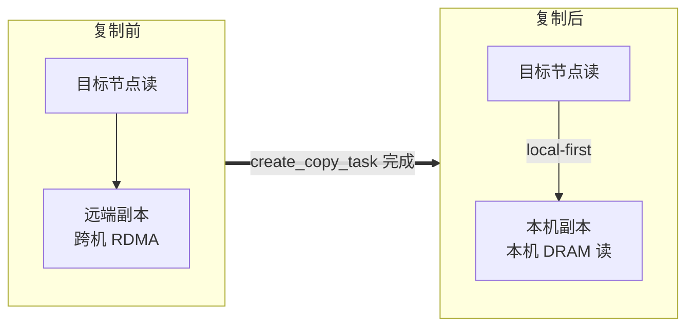
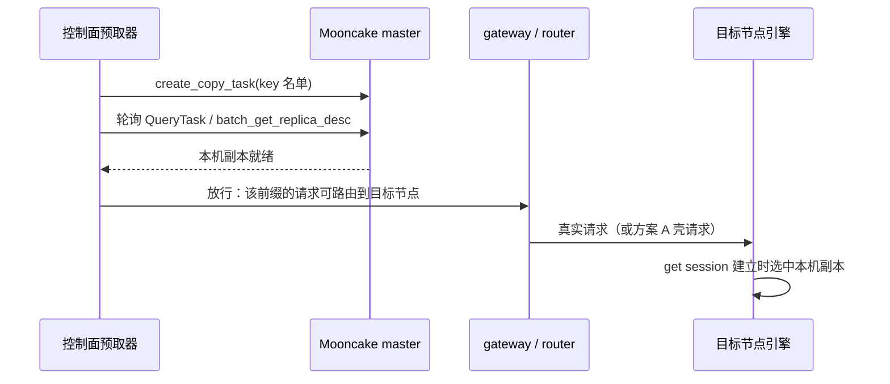

# D003: KV 预取——预取请求 + 显式副本复制

- 日期: 2026-09-28
- 状态: 提议（方案定型；落地前需完成文末实测清单）

## 背景

- 目标场景：vllm-ascend 0.26 + Mooncake Store 做 KV 卸载（`AscendStoreConnector`，`backend=mooncake`）。前缀 KV 已在池中（远端节点 DRAM 副本），真实请求到达前把 KV 预取到目标节点，消除首个请求的远端读延迟。
- 需求形态：SGLang [#27574](https://github.com/sgl-project/sglang/issues/27574)（Programmatic KV）式的控制面可编程预取——外部控制面决定"何时、把哪个前缀、放到哪个节点"，引擎只执行。参考 [`../../research/vllm_vs_sglang/agent-kv-cache.md`](../../research/vllm_vs_sglang/agent-kv-cache.md)、[`../../research/vllm/kv-session-roadmap.md`](../../research/vllm/kv-session-roadmap.md)。
- 形态约束：**预取请求 + 加载完就释放**。预取请求 = prompt 与目标前缀 token 级一致（block hash 才一致）、`max_tokens=1` 的合成请求，唯一目的是触发 connector 的池加载。不加新的带外传输通道，复用现有请求路径与池机制。

代码核实基线：vllm-ascend 源码 `~/vllm-ascend-0.26`；Mooncake submodule `3rdparty/mooncake` @ **1fc27b62**（2026-09-28，含 range 读 API 的 PR [#2881](https://github.com/kvcache-ai/Mooncake/pull/2881) `78726c5c`）；上游 vLLM `3rdparty/vllm` @ 027b6f3a2（2026-09-28）。

**为什么调度行为引用上游 vLLM 代码**：vllm-ascend 是插件，默认调度器就是上游 vLLM 的 `Scheduler`/`AsyncScheduler`——vllm-ascend 自带的调度器子类（ShortRequestFirst / Recompute / DyntraLB / ProfilingChunk / BatchJobAware）全部继承上游且均为条件启用（`platform.py:1051/1122/1359/1365/1377`），默认配置一个都不开。因此 `WAITING_FOR_REMOTE_KVS` 状态机等调度行为，引用上游 `scheduler.py` 就是引用 vllm-ascend 0.26 实际运行的代码；行号以上述快照为准。

## 两种模式的分野

> 「layerwise」在 vllm-ascend 0.26 里有三个同名机制（PD P2P 直推 / 池 block_key / 池 gva 层复用），本文只涉及 `AscendStoreConnector` 的池 layerwise。完整辨析（含 mermaid 图）见 [`../layerwise-taxonomy.md`](../layerwise-taxonomy.md)。

`AscendStoreConnector` 两种用法，读路径与本地命中处理不同；**预取目标介质相同——HBM（APC）与本机 DRAM 两层皆有效**：

| | 非 layerwise | layerwise（Mooncake block_key 数据面） |
|---|---|---|
| 配置 | `use_layerwise=false`（默认） | `use_layerwise=true` |
| 读路径 | 整对象 `batch_get_into_multi_buffers` 直读进 HBM block（`mooncake_backend.py:484` `MooncakeBackend.get`；`kv_transfer.py:1293`） | 每层计算前 range 读 `batch_get_into_multi_buffer_ranges` 进请求的 HBM block（`mooncake_backend.py:410` `batch_copy_get`；适配文档 §3.2） |
| 异步加载 | `load_async=true` 时进 `WAITING_FOR_REMOTE_KVS`（**默认 false**） | 强制同步加载（`load_async` 返回值 `self.load_async and not self.use_layerwise`，`pool_scheduler.py:747`），逐层 range 读夹带在 prefill forward 里 |
| 本地 APC 命中处理 | 调度器侧：APC 命中的 token 不进池加载 | worker 侧：加载起点 `start_block = vllm_cached_tokens // block_size`（`pool_worker.py:2229`；hybrid 路径 `mooncake_layerwise.py:345`），本地已缓存块不重读；本地全命中 → 加载列表为空 → **零池读** |
| HBM 布局 | 标准全层 KV cache | **同左，全层**。block_key 显式不做物理层复用（`mooncake_layerwise.py:77-80` `extract_layout_config` 返回 None，docstring 原文 "Block-key transfer does not opt into GVA-backed physical reuse"）→ worker 不建共享 buffer、不做显存缩放（`worker.py:635-636`）；「逐层」只是**传输流水线**——layer 0 先提交前 `num_prefetch_layers`（默认 2）层的读，之后每算一层提交下一层（`pool_worker.py:2619`），读进请求自己的 block（`pool_worker.py:2263`）后驻留，供后续 chunk 与 decode 使用 |

"逐层计算、加载下一层、卸载上一层"是 **gva 数据面 + 层复用**（`layerwise_num_shared_buffers` < 层数）的行为：物理 HBM 只持有 `num_shared_buffers` 个 staging buffer 轮转复用（`layerwise_cache_layout.py:173-183`），显存预算按比例放大（`worker.py:641-652`）。Mooncake block_key 路径没有这套机制——decode 每步需要全部层的 KV，HBM 不放全层则每个 token 都要从池重读全部层，显然不成立。

官方文档锚点（两个"layerwise"同名不同物，都是 KV 卸载，区别在数据面）：

- [分层与稀疏KV缓存卸载设计](https://docs.vllm.ai/projects/ascend/zh-cn/latest/developer_guide/Design_Documents/layerwise_and_sparse_kv_cache_offloading.html)：Prefill 卸载的 NPU 驻留数据 = "少量可复用的层缓冲区"（N 逻辑层 → I+min(B,R) 物理 buffer）——这是 **Memcache/gva** 设计。其 §8 明确："逐层共享缓冲区卸载需要 **Memcache 后端**和 eager 模式"、"逐层缓冲区重用**目前无法与 `MooncakeLayerwiseConnector` 结合使用**，因为它不提供逐缓冲区传输完成门"
- [Mooncake 分层适配与优化](https://docs.vllm.ai/projects/ascend/zh-cn/latest/user_guide/feature_guide/mooncake_layerwise_adaptation_and_optimization.html)（即本文的"适配文档"）§3.2：加载落点是"将该层的范围加载到**本地 block**"；§2："分层传输改变了传输时机和范围"——没有 HBM 减量语义

两个"强制重读"机制容易被误判为"layerwise 本地命中无效"，对 Mooncake block_key 路径均不成立：

- `layerwise_offload=True` 时 worker 强制从 block 0 整前缀重读（`pool_worker.py:1795`）——但它只在 **gva 数据面 + 层复用布局**下被赋值（`pool_worker.py:224` `use_layerwise_transfer` 门控，L585/L601）；Mooncake block_key 路径恒为 False（L576 初始化后不变）。gva+层复用必须重读的原因：物理块是共享 staging buffer，APC "命中"的块并不真持有该前缀 KV；block_key 路径用标准完整 KV cache 布局，APC 命中 = 数据真在 HBM
- `force_layerwise_load`（`pool_scheduler.py:726`）在池有命中时强制建 load spec——但只建 spec；worker 侧 `start_block` 机制兜底，本地全命中时加载列表为空，实际零池读

本机 DRAM 层（池副本）的现状——分两种场景：

- **场景一：同机写读**（chunked prefill 主场景）——写路径 local-first，天然有本机副本
  - 写：`_build_replicate_config` 带两个放置参数（`mooncake_backend.py:346-351`；layerwise PutStart 同，L376-383）：
    - `prefer_alloc_in_same_node`：默认 true
    - `preferred_segment=local_seg`：需 mooncake.json 显式配 `preferred_segment:true`（默认 false——不配则 local-first 落空）
  - 读：副本选择 local-first（`replica_selection.h:122` `SelectBestReplica`，L149-151 本机内存副本优先）
  - 结果：本节点写出的 KV 落本机 segment，后续读（含 chunk 间重读，见下）命中本机副本，无跨机流量
- **场景二：跨机**（副本在别的节点：他机写入的会话复用、P≠D、故障迁移）——默认代码没有任何机制把读到的 KV 留在本机 DRAM
  - 读路径只进 HBM，不建本机 DRAM 副本：`BatchGetWhenPreferSameNode` 名字有 prefer，实际只是按源 segment 聚合批量传输，不建副本（`client_service.cpp:1493`）
  - 加载过的前缀不回写本机：`skip_save`（`metadata.py:1150-1151`）
  - HBM 侧也留不住：APC 是 LRU，**驱逐即丢弃，没有"驱逐时写回本机 DRAM"的机制**
    - 本节点自己算出的 KV：计算时已写池（写穿），local-first 配置下本机 segment 有副本 → 驱逐无所谓
    - 池命中加载的 KV：`skip_save` 不写回 → 驱逐后本地无任何副本，下次使用重新远端读
  - → **跨机场景的本机 DRAM 落地就是方案 B 要补的空白**

chunk 间重读机制的准确图景（易误读，单独说清）：

- 机制：同请求 chunked prefill，已加载/已提交的 key 留在该请求的加载集里，后续每个 chunk 都逐层重读（`session_tracker.py:46-71` `commit_put_keys` + `prepare_load_entries`；适配文档 §3.3）
- 看似冗余：继续中的 chunk，其前缀 KV 仍在请求的 HBM block 里（block 随请求持有），重读 = 覆盖相同数据。设计目的是抢占/重试的统一处理（`release_for_retry` 保留 entries 供重试），正常路径上确实多读了
- 重读的源分两部分，成本完全不同：
  - 本请求自算部分：local-first 写 → 重读命中**本机副本** → 本机 DRAM 读，无 RDMA
  - 跨机池命中部分：副本在他机 → **每个 chunk 每层都是远端 RDMA** ← 性能问题在这里
- 两个无关机制，不要误当成解决方案：
  - master promotion-on-hit（`--promotion_on_hit`，默认 false，`master_config.h:202`）：只把 **SSD-only** 对象在读命中后晋升回 DRAM（`master_service.cpp:395`），不管远端 DRAM→本机 DRAM
  - 客户端 LocalHotCache：只挂整对象读路径，layerwise 的 range 读用不到（见 B1 节证伪）

## 方案 A：预取请求 → 预取进 HBM（两种模式通用）

机制链（全部已核实，上游 = `3rdparty/vllm`；按非 layerwise 写，layerwise 变体见本节末）：

1. 发预取请求。调度器 `get_num_new_matched_tokens` 查池命中（`pool_scheduler.py:624`）；全命中时少记 1 个 token——末 token 必重算（`pool_scheduler.py:703-704`）
2. `load_async=true`（`kv_connector_extra_config`，**默认 false**，`pool_scheduler.py:107`；返回值 `self.load_async and not self.use_layerwise`，`pool_scheduler.py:747`）时请求进 `WAITING_FOR_REMOTE_KVS`（`scheduler.py:1267`）：
   - 传输期**不占** `max_num_seqs` 槽位——槽位只数 running + streaming-paused（`scheduler.py:877-879`）
   - 传输期**零计算**——等待中的请求被直接跳过调度（`scheduler.py:890-898`）
3. worker 异步把整对象直读进 HBM block（`kv_transfer.py:1293`；目标地址 = KV cache 基址 + block 偏移，`kv_transfer.py:176/206`）
4. 传输完成 → `_update_waiting_for_remote_kv` → `cache_blocks` 入 APC（`scheduler.py:3032/3064`）→ 请求转 WAITING（`scheduler.py:3091`）
5. 释放：前缀 KV 已在 HBM 且入 APC，预取请求在此结束

释放方式两选：

- **零代码**：`max_tokens=1` 自然结束。代价 = 1 token prefill（末 token 重算）+ 1 token decode + 短暂占一个 running 槽
- **patch（finish-at-promotion）**：改上游**现有**函数 `_try_promote_blocked_waiting_request`（`scheduler.py:3079`，现职责 = 把加载完的请求从 `WAITING_FOR_REMOTE_KVS` 提升回 WAITING），提升成功即结束请求。零计算零槽位，但要改调度器

注意：

- `load_async=false`（默认）走同步加载：请求正常占 running 槽，worker 首次 forward 前同步读完。预取仍成立，只是传输期占槽
- 预取进 APC 后是标准前缀缓存：LRU、无 pin、压力下可驱逐 → 预取与使用的时间窗要短
- 池命中即 `skip_save=True`（`metadata.py:1150-1151`），预取请求不回写池；对已存在的 key，Put 是静默 no-op（`client_service.cpp:1958-1961`，`OBJECT_ALREADY_EXISTS` 按成功返回）

layerwise 变体（同一预取请求形态，三点差异）：

- 同步加载：`load_async` 强制 false（`pool_scheduler.py:747`），壳请求占 running 槽，逐层 range 读夹带在 prefill forward 中完成（每层计算前读该层）
- 加载落点同样是壳请求的 HBM block（`pool_worker.py:2263`，目标 = `request.block_ids[block_index]`），`max_tokens=1` 结束后块同样入 APC
- 真实请求本地全命中 → `start_block = end_block`（`pool_worker.py:2229`）→ 加载列表为空、零池读，直接复用 HBM

## 方案 B：本机 DRAM 层 → 显式副本复制（两种模式通用）

### B1: LocalHotCache 读路径自动回填——**已证伪（layerwise 不适用）**

Mooncake 客户端有本地热缓存（`LocalHotCache`，`local_hot_cache.h`）：读远端内存副本成功后异步填充本机 DRAM，后续读重定向到本机副本。但它**只挂在整对象读路径上**，layerwise 的 range 读完全绕过：

- 热缓存只集成在 `Client::Get` / `Client::BatchGet` / `Client::BatchGetWhenPreferSameNode`（`client_service.cpp:1377/1419`、`1527/1607`、`1702/1860` 的 `RedirectToHotCache` / `ShouldAdmitToHotCache`）
- layerwise range 读走独立路径：`batch_get_into_multi_buffer_ranges`（`real_client.cpp:6975`）→ `execute_session_memory_range_reads`（`real_client.cpp:6545`）→ `Client::BatchTransferReadRanges`（`client_service.cpp:4669`）——纯 scatter 传输（`ScatterRangeBuilder` + `CompleteScatterRanges`），**无任何热缓存钩子**
- → 开热缓存对 layerwise 模式没有任何效果，B1 排除

对非 layerwise 模式热缓存理论上可用（整对象读有集成），但仍有未排除的风险：填充 = 提交时**同步** `std::memcpy`，源是读的目的缓冲区（`local_hot_cache.cpp:541-542`），而 vllm-ascend 整对象读的目的缓冲区是 **HBM 地址**（`kv_transfer.py:176/206`）——主机 memcpy 设备内存在 Ascend 默认配置下不一定合法（热缓存设计意图是"SSD 对象前的 DRAM 读缓存"，即目的缓冲区为主机内存的场景，部署指南 `mooncake-store-deployment-guide.md` L1365）。启用参数（全 env：`MC_STORE_LOCAL_HOT_CACHE_SIZE` 默认关、`MC_STORE_LOCAL_HOT_ADMISSION_THRESHOLD` 默认 2 需读两次才填充（`client_service.h:1116`）、`MC_STORE_LOCAL_HOT_BLOCK_SIZE` 默认 16MB、`MC_STORE_LOCAL_HOT_CACHE_USE_SHM`；`client_service.cpp:5376` `InitLocalHotCache`，部署指南 L1369 起）。本方案不依赖它。

### B2: 显式副本复制 `create_copy_task`（全 Python API，无引擎参与）——**选定**

一句话：调 Mooncake 的副本复制 API，让池把指定 key 复制一份到目标节点的 segment；之后该节点的读自动走本机副本。

前提：Mooncake 支持一个 key 多个副本（已核实）——

- 写时副本数：`ReplicateConfig.replica_num`（`replica.h:105`，默认 1）。**默认 1 不影响 B2 生效**：`replica_num` 管的是写入时一次性建几个副本；`create_copy_task` 是事后追加副本的独立通道，master 侧只校验 key 存在、目标 segment 已挂载且可分配（`master_service.cpp:13677` `CreateCopyTask`），不要求写入时多副本。vllm-ascend 写入路径未设 `replica_num`（`mooncake_backend.py:346` `_build_replicate_config`），即默认 1——B2 复制后该 key 有 2 个副本
- 查询返回副本列表：`QueryResult.replicas`（`client_service.h:47`）
- 已存在的 key 再 Put 是幂等 no-op（`OBJECT_ALREADY_EXISTS` 按成功返回，`client_service.cpp:1958-1961`）→ **建第二副本不能用 Put，必须用 `create_copy_task`**

#### 复制流程

要点：

- 引擎（vllm worker）全程不参与计算与调度：复制是 store 客户端之间的后台传输
- 复制粒度 = 整个对象（全层 KV），不是单层 range——对预取正好
- 产出是池正式副本：不受热缓存 LRU 影响，只受池级驱逐策略影响

#### 生效原理：读路径自动选中本机副本

副本选择是读路径的既有行为，不需任何配置：

- **非 layerwise**（整对象读）：`SelectBestReplica` local-first（`replica_selection.h:122`，L149-151 本机内存副本优先）
- **layerwise**（range 读）：get session 建立时选一次副本，本机内存副本优先（`real_client.cpp:470-488` `SelectCompleteMemoryReplica`）；session 锁定该副本（`real_client.cpp:6470-6474`），之后每层 range 读都用它

复制不删远端副本——远端副本仍在池中作冗余，读路径只是优先选本机。

#### 约束

- **时序**：`create_copy_task` 必须在目标节点的 get session 建立**之前**完成——session 建立时锁定单副本，复制晚于 session 则该请求仍读远端。进阶联动见下节
- **目标指定**：segment 名 = worker 的 `local_seg`（`hostname:rpc_port`，`mooncake_backend.py:263`；fabric-mem 路径为裸 hostname，L276）
- **key 名单**：**不要从头写 hash 链**——copy 与 put/get/exists 共用同一 key 字符串命名空间，直接复用 vllm-ascend 调度侧的现成计算（纯 Python，可移植进预取进程）：`get_block_hashes`（`pool_scheduler.py:478` 调用处）+ `block_hash_to_str` + `make_hit_check_keys`（`pool_scheduler.py:377`，按 block hash 枚举全 rank 的 key）；非 layerwise 路径对照 `_generate_store_query_keys`。`QueryByRegex` 无 Python 绑定；放置结果用 `batch_get_replica_desc` 核验（`store_py.cpp:3340`）
- **依赖**：源属主客户端必须在线（即贡献了源 segment 的 worker 进程内客户端）

#### 进阶：与请求调度联动（解决时序约束）

时序约束的解法在控制面，引擎不改。编排顺序：

- **与方案 A 的联动**：layerwise 下壳请求自己也会建 get session——壳请求若先于复制完成到达，session 锁定远端副本，本次复制对它无效。正确顺序：先 B2 复制完成，再发壳请求（壳请求读本机副本进 HBM，传输也更快）
- **错过时序的缓解**：session 随请求结束释放，下一个请求重新选副本——错过只影响当前请求，不自毁
- **职责边界**：确认就绪再放行是 gateway/router 侧编排，推理引擎无改动

## 决策

**为什么有了方案 A 还要方案 B**——A（壳请求进 HBM）够用的条件是：前缀集装得进 HBM、预热-使用窗口短（APC 不驱逐）、预取量小。三条任一不满足就需要 B：

- **容量**：HBM 可用于 KV 的空间（几十 GB 级）<< 本机 DRAM（数百 GB 级）。要预热的前缀集超过 HBM 可容纳量时，只能落 DRAM
- **窗口**：APC 是 LRU 无 pin，真实流量会挤出预取前缀；DRAM 副本只受池级驱逐，存活周期长得多。agent 会话停顿这类长窗口场景，HBM 层收益流失
- **成本**（分路径，已核实）：非 layerwise + `load_async=true` 时壳请求传输期不占槽零计算，patch 释放路径零 forward——成本≈0；零代码释放（`max_tokens=1`）需 1 token prefill + 1 token decode + 短暂占槽；**layerwise 下壳请求同步占槽，槽位被占满整个逐层传输期**，批量预热时与真实流量竞争。B2 完全不经引擎（带外 API，复制走源端后台线程，可限速）
- **兜底**：layerwise 跨机默认无本机落地（见「两种模式的分野」）；HBM 层失效（驱逐/未预热）时，本机 DRAM 副本把「每层远端 RDMA」降为「本机 DRAM 读」（get session 建立时本机副本优先）

因此不是二选一：**A 为主**（短窗口、小前缀集、即时预热），**B 为容量/窗口层**（长窗口、大前缀集、批量预热）。

- 预取 = 两层可叠加，两种模式皆有效：**HBM 层**（方案 A 预取请求进 HBM/APC，零额外通道、窗口短）+ **本机 DRAM 层**（方案 B2 `create_copy_task` 建本机副本，容量大、窗口长、需带外 API 调用）
- B1（LocalHotCache）已证伪：layerwise range 读绕过热缓存；非 layerwise 有"HBM 目的缓冲区被主机 memcpy"风险（证据链见 B1 节）
- 不加新的带外传输通道；不改池的放置策略；不做 pin（HBM APC 是 LRU；池副本受池级驱逐策略管理）
- 代码改动总量：A 路径一个可选 patch（finish-at-promotion）；B2 零改动（预取器用现成 Python API）

## 后果

落地前实测清单（按序）：

1. A 路径端到端（非 layerwise）：预取请求 → 真实请求 APC 命中
2. A 路径端到端（layerwise）：预取请求 → 真实请求本地全命中、加载列表为空（`start_block` 全覆盖，读路径日志核验零池读）
3. B2 端到端：`create_copy_task` → 本机副本 → layerwise get session 选中本机副本（用 `batch_get_replica_desc` + 读路径日志核验）

风险：

- 预取后无 pin：HBM APC 可被 LRU 驱逐；池副本受池级驱逐影响——预取-使用间隔长时收益流失
- B2 的复制流量走源客户端后台任务，与正常读共享带宽；批量预取需控制面限速
