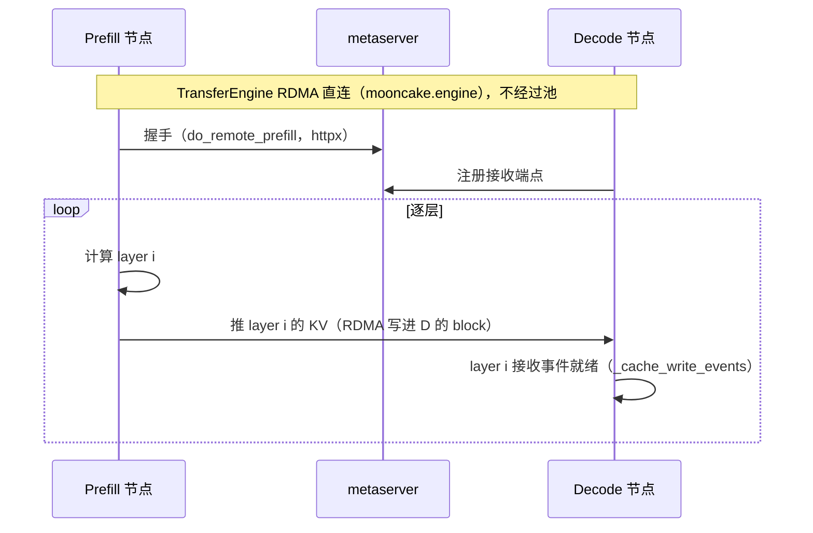
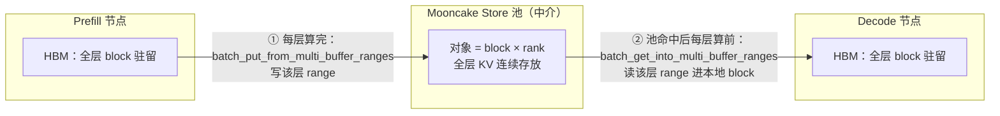
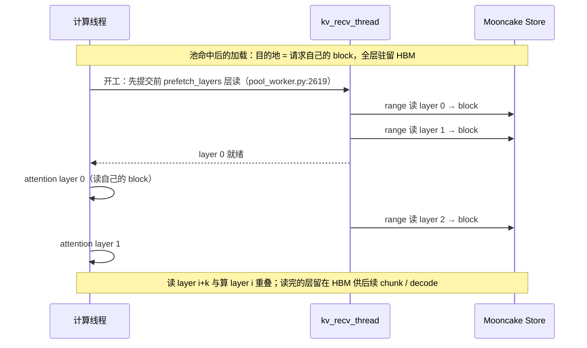
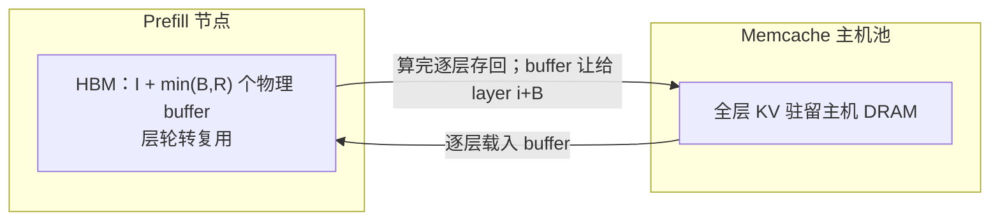

# 三个「layerwise」辨析（vllm-ascend 0.26）

vllm-ascend 0.26 里有**三个**同名「layerwise」的机制。都是 KV 传输/卸载，但传输双方、HBM 布局、用途完全不同。混淆会直接导致错误结论——例如「layerwise 下 HBM 不放全层 KV」只对其中一个成立。

代码核实基线：vllm-ascend 源码 `~/vllm-ascend-0.26`（0.26.0rc1）。

## 总表

| | ① PD P2P layerwise | ② 池 layerwise（block_key） | ③ 池 layerwise（gva 层复用） |
|---|---|---|---|
| 连接器 | `MooncakeLayerwiseConnector` | `AscendStoreConnector` + `backend=mooncake` + `use_layerwise=true` | `AscendStoreConnector` + `backend=memcache` + `use_layerwise=true` |
| 代码 | `kv_p2p/mooncake_layerwise_connector.py:742` | `kv_pool/ascend_store/`（`mooncake_layerwise.py:27` `LAYERWISE_DATA_PLANE="block_key"`） | 同目录（`memcache_backend.py:81` `LAYERWISE_DATA_PLANE="gva"`） |
| 传输双方 | **P → D 直连** | engine ↔ **Mooncake Store 池** | engine ↔ **Memcache 主机池** |
| 用的 Mooncake 组件 | TransferEngine（RDMA P2P，`mooncake.engine.TransferEngine`） | Mooncake Store（master + segment 对象池） | 不用 Mooncake |
| 元数据 | metaserver（httpx）+ zmq side channel | Store master（对象元数据） | Memcache MetaService |
| HBM 布局 | 标准全层 KV cache | 标准全层 KV cache，**驻留** | **共享 buffer 轮转**（I+min(B,R) 个物理 buffer，HBM 减量） |
| 「逐层」语义 | P 算完一层推一层；D 按层接收 | 池读/写在层粒度**流水线化**（计算-传输重叠） | 逐层换入换出（真卸载） |
| dynamo 视角 | 第三种线格式（`do_remote_prefill` + metaserver，见 [pd-mooncake.md](pd-mooncake.md)「为什么协议挂到 Nixl」） | 池连接器，不产生 PD `kv_transfer_params` | 同左 |
| 官方文档 | — | [Mooncake 分层适配与优化](https://docs.vllm.ai/projects/ascend/zh-cn/latest/user_guide/feature_guide/mooncake_layerwise_adaptation_and_optimization.html) | [分层与稀疏KV缓存卸载设计](https://docs.vllm.ai/projects/ascend/zh-cn/latest/developer_guide/Design_Documents/layerwise_and_sparse_kv_cache_offloading.html) |

快速判别：看连接器名 + `backend` + `use_layerwise` 三件套，对照上表首两行。

## ① PD P2P layerwise：`MooncakeLayerwiseConnector`

P 和 D 之间**直连**按层传 KV，不经过任何池：

关键事实（`kv_p2p/mooncake_layerwise_connector.py`）：

- 调度侧 `_reqs_need_send_layerwise`（L880）记录待逐层发送的请求；worker 侧 `save_kv_layer`（L839）逐层触发发送
- D 侧 `kv_recv_layer_thread` 按层接收，每层一个就绪事件（`start_load_kv`，L1744-1747）
- `supports_layerwise_buffer_reuse = True`（L744）——注意官方设计文档 §8 说「逐层缓冲区重用目前无法与 `MooncakeLayerwiseConnector` 结合使用……计划在后续更新中提供支持」，0.26 代码已见该标志，实际可用性以版本为准
- pd-mooncake.md 已记载：它是**第三种线格式**，dynamo 现有两个协议类都套不上

## ② 池 layerwise（block_key）：`AscendStoreConnector` + Mooncake Store

**D003 预取方案的目标路径。** 池是中介，P↔D 无直连；PD 场景 = P 逐层写池 + D 逐层读池：

「逐层」只是**传输流水线**（计算-传输重叠），不改变 HBM 布局——读进请求自己的 block 后驻留：

关键事实：

- 对象布局：一个 `(block, rank)` 一个对象，全层 KV 连续存放（适配文档 §2；`mooncake_layerwise.py:83` `make_block_key`）
- HBM 全层驻留：`extract_layout_config` 返回 None（`mooncake_layerwise.py:77-80`，docstring 原文 "Block-key transfer does not opt into GVA-backed physical reuse"）→ worker 不建共享 buffer（`worker.py:635-636`）
- 读落点 = 请求自己的 block：`pool_worker.py:2263`（`request.block_ids[block_index]`）
- 本地 APC 命中的块不重读：`start_block = vllm_cached_tokens // block_size`（`pool_worker.py:2229`；hybrid 路径 `mooncake_layerwise.py:345`）
- → **HBM 预热成立**（见 [decisions/D003-kv-prefetch.md](decisions/D003-kv-prefetch.md) 方案 A）

## ③ 池 layerwise（gva 层复用）：`AscendStoreConnector` + Memcache

先拆词：「gva 层复用」= **gva 数据面** + **层复用**两件事，没有「gva 层」这个东西：

- **GVA** = Global Virtual Address，MemFabric 的全局虚拟编址：把集群各节点的 HBM/DRAM 编进统一地址空间，传输按 GVA 地址跨机跨介质直接读写（OneCopy：RH2D/D2RH 等）；memcache 元数据里 key → 副本位置 + 介质 + GVA（见 [`../research/memcache/architecture.md`](../research/memcache/architecture.md)）
- **层复用** = 物理 HBM buffer 跨层轮转复用（下述）

「逐层计算、加载下一层、卸载上一层」描述的是这条路径——**真卸载，HBM 减量**：

关键事实：

- N 逻辑层映射到 I+min(B,R) 个物理 buffer，层轮转复用（`layerwise_cache_layout.py:173-183`）；显存预算按比例放大（`worker.py:641-652`）
- 复用不变量与「逐缓冲区传输完成门」：物理 buffer 被覆盖（给 layer i+B 用）之前，上一任内容的所有消费者必须完成——① 上一任层的 attention 算完；② 其 KV 存回主机池完成；③（联合 PD 部署）decode 侧远端读完这个 buffer。代码形态：load 任务带 `wait_for_save_layer` 字段，等前一任的 save 完成才启动（`pool_worker.py:2610-2615`），完成状态按**物理存储槽位**而非逻辑层名跟踪（多个逻辑层可指向同一 NPU 地址）
- 官方设计文档 §8「`MooncakeLayerwiseConnector` 不提供逐缓冲区传输完成门」的含义：①（P2P 直推）只负责把层推给 D，没有按 buffer 回报「内容已被消费、可以覆盖」的同步机制，所以层复用挂不上它
- APC「命中」的块不真持有 KV → `layerwise_offload=True` 强制整前缀从池重读（`pool_worker.py:1795`；赋值点 L585/L601，门控 `use_layerwise_transfer` L224）
- 官方设计文档 §8：逐层共享缓冲区卸载**需要 Memcache 后端**和 eager 模式
- → 这条路径上 **HBM 预热不成立**，只能暖本机 DRAM（D003 方案 B2）

## ② 的逐层流水线 vs 异步整体加载

疑问：② 既然 HBM 全层驻留，逐层流水线省不了显存；每层远端读又慢，遮掩不住还拖住整个 batch——为什么不用「异步整体加载、先算别的请求、加载完再算」？

**流水线的目的本来就不是省 HBM，是 TTFT 与传输-计算重叠**：

- 整体加载：该请求延迟 = 全前缀传输 + 全前缀计算（串行）
- 逐层流水线：layer 0 到了就开算，延迟 ≈ max(传输, 计算)；长前缀传输是秒级，差异巨大
- 遮掩可行性：prefill 每层计算量随前缀长增长（attention O(T²)），百 Gbps RDMA 下每层 KV 传输通常小于每层计算——官方设计文档的立论即"Prefill 有足够的每层计算量来隐藏大部分加载和保存延迟"

**但「遮掩不住」的场景真实存在**，代价也确实是全 batch 算力：

- 短前缀（每层计算量小）、网络拥塞、decode（每 token 计算量极小——所以官方设计里 decode 不用逐层，用稀疏 top-k）
- 遮掩不住时：`wait_for_layer_load` 在 attention 层路径上**同步阻塞**（`attention/utils.py:475`），一个请求的层读没到，整个 batch 的 forward 停在层边界——浪费的是全 batch 的算力，不只是该请求的

**「异步整体加载、加载完再算」的形态已经存在——就是非 layerwise + `load_async=true`**：

- 请求进 `WAITING_FOR_REMOTE_KVS`：不占 `max_num_seqs` 槽（`scheduler.py:877-879`）、零计算（`scheduler.py:890-898`）、传输完 `cache_blocks` 入 APC 再调度（`scheduler.py:3032/3064`）
- vllm-ascend 对 layerwise **强制** `load_async=false`（`pool_scheduler.py:747`）——layerwise 模式下该形态不可用，这是它的真实短板
- 因此是部署时的模式选择：追 TTFT、前缀长、网络好 → layerwise；保吞吐、求稳、网络不可控 → 非 layerwise + `load_async=true`

对 D003 预取的含义：壳请求在 layerwise 下同步占槽，批量预热会与真实流量竞争——这正是方案 B2（带外复制、零引擎侵入）的成本优势场景；若部署形态主要为预取服务，非 layerwise + `load_async=true` 是更干净的壳请求路径。

## 与 D003 的关系

一句话：D003 的目标场景是 **②**（`backend=mooncake`）。① 是 PD 直连传输（无池、无「预取进池/进 HBM」概念）；③ 是 Memcache 卸载（HBM 减量，预取只能到本机 DRAM）。讨论「layerwise」时先对齐三件套：连接器名、`backend`、`use_layerwise`。
