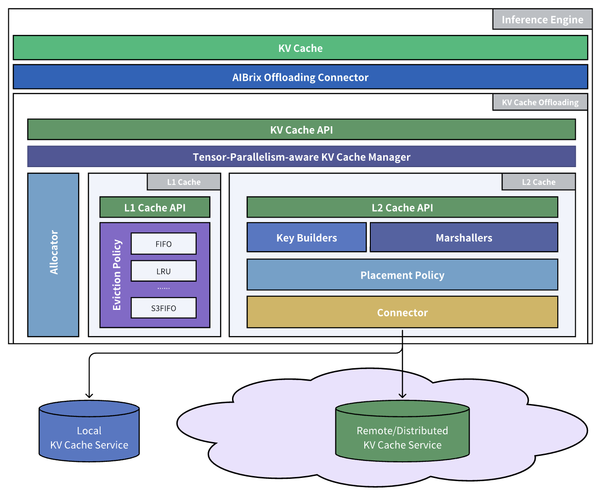

# AIBrix — 架构深潜

> [overview.md](overview.md) · [pain-points.md](pain-points.md)。调研快照:`3rdparty/aibrix` @ `fe7db93e`(2026-09-08)。  
> 本文按数据面(§1–§3)→ 卸载框架(§4)→ 控制面(§5–§6)展开,每节末尾有小结。

## 1. 网关数据面:Envoy ExtProc 请求路径

AIBrix 的数据面只有一条链:**客户端 → Envoy →(ExtProc gRPC)gateway-plugins → 引擎 pod**。网关插件不代理流量本体,只在请求转发前被 Envoy 回调,返回"打到哪个 pod"的决策。

1. **入口**:`cmd/plugins/main.go::main` 启动 gRPC 服务,注册 `extProcPb.RegisterExternalProcessorServer`。
2. **处理管线**(`pkg/plugins/gateway/gateway.go::Process`):
   1. `HandleRequestHeaders`:鉴权、用户识别。
   2. `checkLimits`(`gateway_ratelimit.go`):Redis 计数的 RPM/TPM 限流——**过载拒绝发生在网关,不下放给引擎**。
   3. `HandleRequestBody`(`gateway_req_body.go`):解析模型名,`validateModelAvailability`;若模型挂了 ModelClaim,可触发 runtime 唤醒(`modelclaim_wake.go::runtimeModelWakeRequester.RequestWake`)。
   4. `selectTargetPod`:进路由层(§2),拿到目标 pod。
   5. 回写响应头 `target-pod` / `target-pod-ip` / `routing-strategy`(`pkg/plugins/gateway/types.go`),Envoy 按头转发。
3. **响应路径**可选再经 ExtProc:解析 usage、累计 TPM。

**小结**:网关是无状态服务 + 进程内索引的组合;所有"拦请求"的职责(鉴权/限流/模型可用性)都在进引擎前完成。这与 lake"过载控制归 gateway、推理系统只管执行"的职责划分完全一致——AIBrix 是该原则的生产级样本。

## 2. 路由层:策略注册表与加权组合

### 2.1 插件形态

1. 接口:`pkg/types/router_context.go::PodScorer`(`ScoreAll(ctx, pods) → ([]float64, []bool, error)` + `Polarity`)。
2. 注册:`pkg/plugins/gateway/algorithms/router.go::Register` + `RouterManager`;每个策略在 `init()` 里自注册。
3. 组合:`ParseMultiRouterConfig` 解析 `"least-request:2,throughput:1"` 这样的权重串,`multiRouter` 把各策略归一化得分按权重求和。

### 2.2 prefix-cache 的两条索引路线(重点)

AIBrix 是"近似派 vs 精确派"在同一代码库里的对照实验:

| | 路线 A:本地哈希表 | 路线 B:KV 事件同步 |
|---|---|---|
| 实现 | `prefixCacheRouter.ScoreAll` | `kvSyncPrefixCacheRouter.ScoreAll` |
| 索引 | `PrefixHashTable`(`pkg/utils/prefixcacheindexer/hash.go`):固定 20 万块槽、4 token/块 xxhash、淘汰线程清 20 分钟前条目 | `SyncPrefixHashTable`:vLLM ZMQ 事件驱动(`pkg/cache/kvcache/`) |
| 数据源 | 网关自己经手的请求(见过即记下) | 引擎真实块存储/删除事件 |
| 变体 | `prefix_cache_and_load.go` 换 RadixTree;`prefix_cache_preble.go` 树版 Preble | — |
| 开启 | 默认 | `AIBRIX_PREFIX_CACHE_KV_EVENT_SYNC_ENABLED=true` + `-tags=zmq` 构建 |

两条路线的分野正是 model-routing.md §5 归纳的"自己记 vs 引擎上报"。路线 B 的管线:引擎 ZMQ PUB → `pkg/cache/kvcache/zmq_client.go`(msgpack 解码)→ `pkg/kvevent/manager.go::Manager` → `ProcessBlockStored` 更新同步索引。依赖 remote tokenizer 把 prompt 切成与引擎一致的块键。

### 2.3 其余策略(一句话各)

1. `least-request` / `least-latency` / `least-busy-time`:按本地计数或指标选最闲 pod。
2. `least-kv-cache` / `least-gpu-cache`:按 KV/显存占用选。
3. `vtc-basic`:虚拟 token 计数的租户公平(论文 2401.00588);`vtc-fair` 等变体未实现(代码 TODO)。
4. `prefix-cache-preble`:树版 Preble(2407.00023);其成本模型系数按"模型 × GPU"硬编码,issue #677 自认换硬件要重标定。

**小结**:路由层对 lake 的最大借鉴是**形态**——插件注册表 + 归一化加权打分,而非任何单一策略。lake 的代价函数 `f(请求, 集群状态)` 目前是单一式,演化为 scorer 组合时可照此形态;但 lake 的输入是存储池权威位置视图,不需要路线 A 这种"见过才记下"的估计索引。

## 3. 网关多副本状态:默认各自为政,可选 Redis 最终一致

1. **默认**:每个网关副本只维护自己见过的前缀表与计数,副本间零同步——多副本下同一前缀可能被散到不同 pod。
2. **可选同步**:`AIBRIX_STATESYNC_ENABLED` 开启后,`pkg/plugins/gateway/statesync/redissync.go::RedisSync` 周期地把本地表 push/pull 到 Redis,`prefixcacheindexer/sync.go::PrefixHashTableSyncable` 做适配。**最终一致**:同步周期内副本视图仍分叉。
3. **仍不同步的**:least-request 的 in-flight 计数(issue #761 自认)、VTC 的 token tracker(`vtc/token_tracker.go` 注释 TODO 接 Redis)。

**小结**:这是"网关侧缓存亲和"的固有天花板——亲和状态本质是引擎侧 KV 的派生物,却由网关估计并横向同步。lake 的解法是换一个方向:位置知识只在存储控制面产生一份,Router 读镜像,不存在副本间同步问题。

## 4. aibrix_kvcache:引擎旁 L1/L2 卸载框架

这是 AIBrix 里与 lake 存储层最对标的组件(`python/aibrix_kvcache/`,Python 编排 + C++/CUDA 内核,可 `pip install aibrix-kvcache` 独立用)。

(图源:AIBrix 官方文档。引擎 connector 之下是 L1 DRAM 与 L2 远端后端,逐出策略层决定哪些块下沉。)

1. **分层**:
   - L1 = 引擎进程内 DRAM 缓存(`l1/l1_cache.py::L1Cache`),避免频繁打远端;
   - L2 = 外部集群(`l2/l2_cache.py::L2Cache`),connector 可插拔:InfiniStore / HPKV / RocksDB / 共享文件系统(`l2/connectors/`)。
2. **K8s 化运营**:`KVCache` CRD(`api/orchestration/v1alpha1/kvcache_types.go`)+ `KVCacheReconciler` 建 L2 集群;`cmd/kvcache-watcher` watch 成员变化写 Redis 成员表(`hpkv_cluster_metadata` 等),connector 从 Redis 发现节点。
3. **TP 感知对齐**(`cache_manager.py::GroupAwareKVCacheManager`):TP>1 时各 rank 独立从 L2 取 KV,命中长度可能不同;prefill 前必须先对齐到共同前缀长度,否则各 rank 视图不一致。这是跨引擎 KV 复用的真实工程坑,AIBrix 明确处理了。
4. **选择性卸载**:逐出策略层(LRU / FIFO / S3FIFO)决定"只卸热块/只卸冷块/全卸",动机是低配集群里多 GPU 共享一张 VPC 网卡,全量卸载会打爆带宽。
5. **传输**:`transport/rdma.py` 支持 RDMA;限制:目前只支持 FlashAttention/XFormers 后端的 KV 布局。

**小结**:形态上与 FlexKV / LMCache 完全同层(引擎 connector + 本机 L1 + 远端 L2)。对照 lake:L1 在引擎进程内、pod 重启全丢;L2 的成员发现与元数据走 Redis 而非强一致控制面;"卸哪些块"由逐出策略在引擎侧决定,而不是由池按全局热度决定。lake 可借鉴的是 **TP 对齐**与**选择性卸载的动机建模**(带宽受限场景),不照搬的是权威归属。

## 5. 控制面:CRD 全家桶

一个 controller manager(`cmd/controllers`)跑全部 reconcile,功能开关在 `pkg/features/features.go`:

| CRD / controller | 干什么 | 锚点 |
|---|---|---|
| **PodAutoscaler** | HPA/KPA/APA 三种策略扩缩推理 pod | `pkg/controller/podautoscaler/` |
| **StormService / RoleSet / PodSet** | 三层编排:多角色(如 prefill/decode)一组 pod 的生命周期 | `pkg/controller/stormservice/` |
| **ModelAdapter** | LoRA adapter 的加载/卸载编排 | `pkg/controller/modeladapter/` |
| **ModelRouter** | 按模型名自动建 Gateway API 路由 | `pkg/controller/modelrouter/` |
| **KVCache** | L2 集群编排(§4) | `pkg/controller/kvcache/` |
| **RayClusterFleet** | Ray 集群舰队管理 | `pkg/controller/rayclusterfleet/` |

**小结**:编排期望态的权威是 K8s etcd,这是 K8s 平台的天然选择。lake 不做这一层(worker 编排归外部),但 StormService 的"多角色一组"模型值得知道——它把 PD 分离当成**静态部署拓扑**,而 lake 把 PD 分离当成**逐请求的运行时模式**,这是两种根本不同的 PD 观。

## 6. 自动扩缩:指标选择比算法更值参考

1. **三种策略**(`api/autoscaling/v1alpha1`)：HPA（原生）、KPA（Knative 风格）、APA（自研，可接 GPU Optimizer 做异构感知）。
2. **指标源**：`POD` / `RESOURCE` / `CUSTOM` / `EXTERNAL` / `DOMAIN`；推理相关指标有 `gpu_cache_usage_perc`、`num_requests_waiting`、`e2e_request_latency_seconds` 等——**按 KV 使用率与排队长度扩缩**，而不是只看 GPU 利用率。
3. **决策链**:`metrics/fetcher.go` 拉指标 → `algorithm.go::NewScalingAlgorithm` 选算法 → `autoscaler.go::ComputeDesiredReplicas` 算目标副本 → `workload_scale.go::SetDesiredReplicas` 写回。
4. **限制**:`GetPaMetricSources` 目前只支持**单一**指标源。

**小结**:扩缩在 lake 的职责边界之外（归外部控制面），但"KV 使用率/排队长度是推理扩缩的一等指标"这一经验值得写进 lake 的上报信号清单——lake 推理系统要向 gateway/外部控制面暴露的正是这类信号。

## 7. 与 lake 的逐层对照

| 层 | AIBrix | lake | 差异要点 |
|----|--------|------|---------|
| 入口选路 | Envoy ExtProc + 加权 scorer 组合 | Go Router,模式+节点联合决策 | lake 多一个维度：执行模式（PD/混部/D-direct) |
| 亲和索引 | 本地哈希表 / ZMQ 事件索引，副本各自收敛 | 存储控制面权威位置视图 + Router 镜像 | 权威有无；lake 可回查 |
| KV L0(HBM) | 引擎私有，不进任何池索引 | 存储池统一管理放置 | lake 更彻底 |
| KV L1 | 引擎进程内 DRAM | 池化 DRAM，统一编址 | lake 的 L1 是池不是进程 |
| KV L2 | 外部集群 + Redis 成员表 | 池化 NVMe,F4 恢复点 | 元数据权威:Redis vs 控制面 |
| 卸载决策 | 引擎侧逐出策略（LRU/FIFO/S3FIFO) | 池按全局热度 + 引用计数冻结 | 局部策略 vs 全局策略 |
| 编排 | StormService 静态角色 | 运行时逐请求模式 | 静态拓扑 vs 动态选路 |
| 过载控制 | 网关 Redis 限流 | 同（归 gateway) | **一致**,互为证据 |
| 扩缩 | PodAutoscaler,KV 感知指标 | 不做，只上报信号 | 职责边界一致 |
