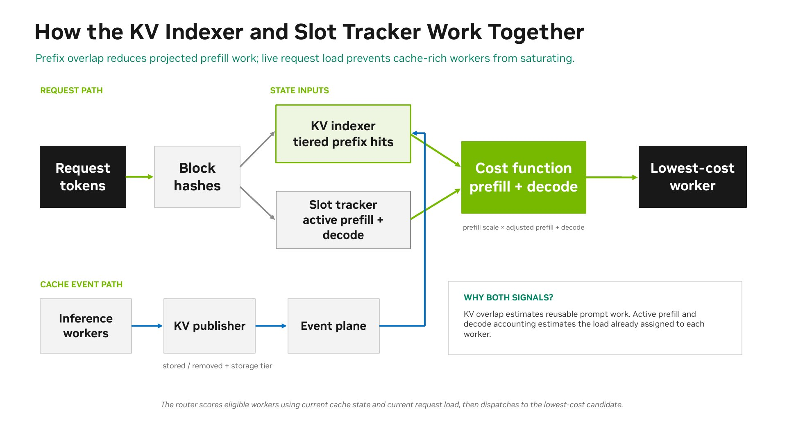
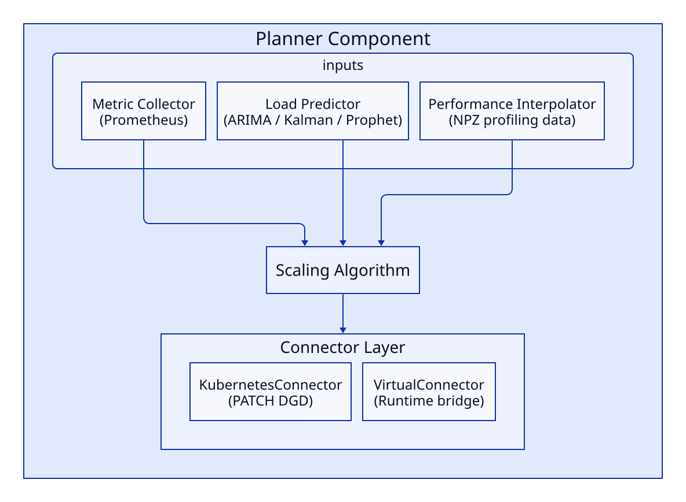
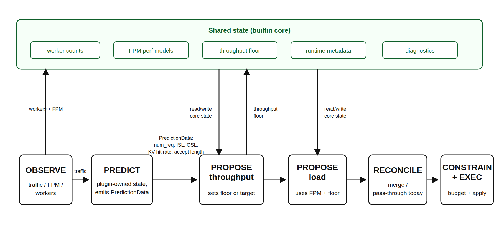
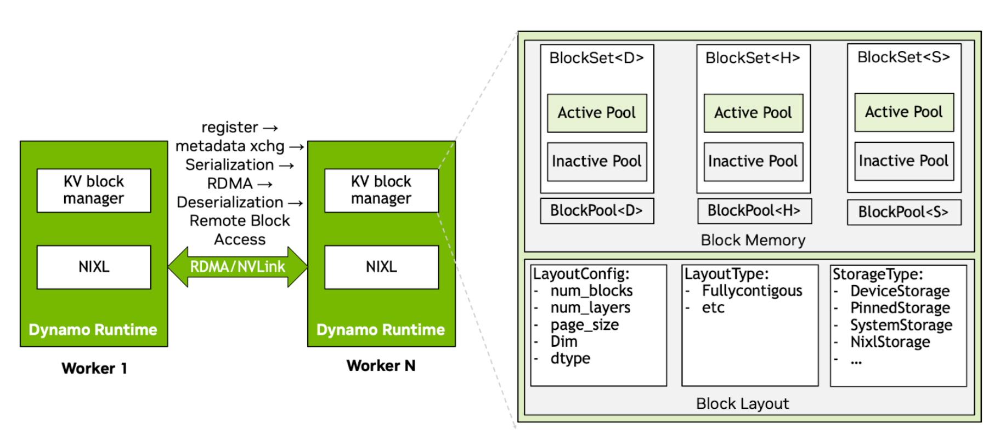
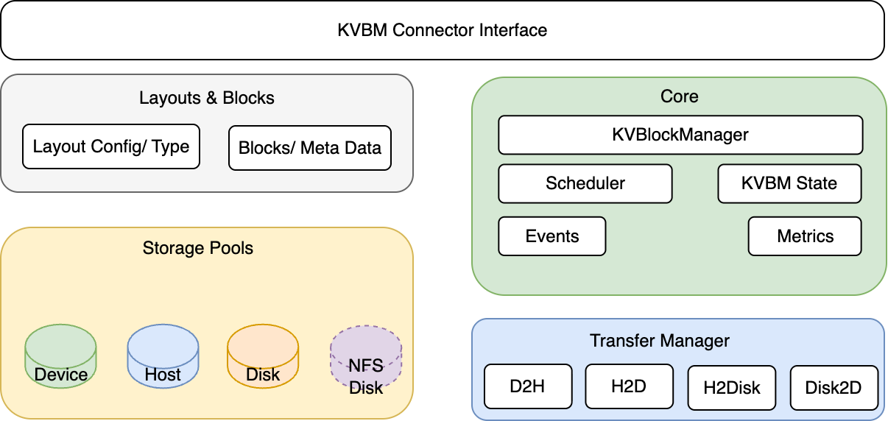
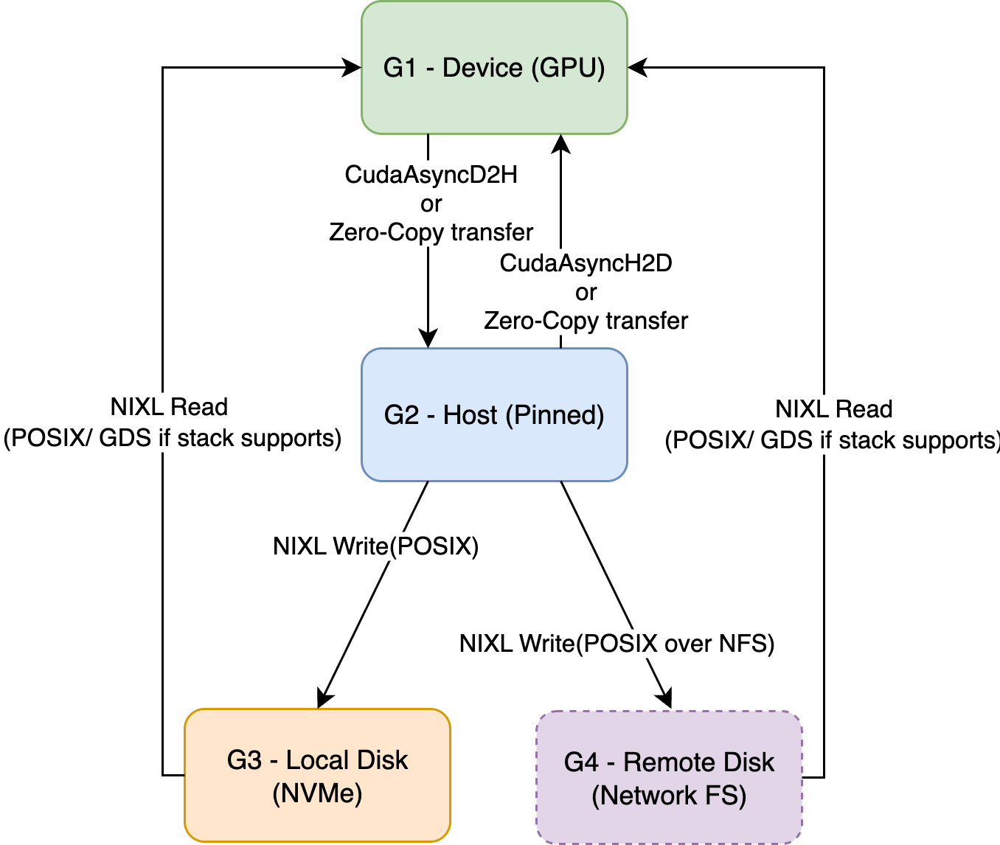
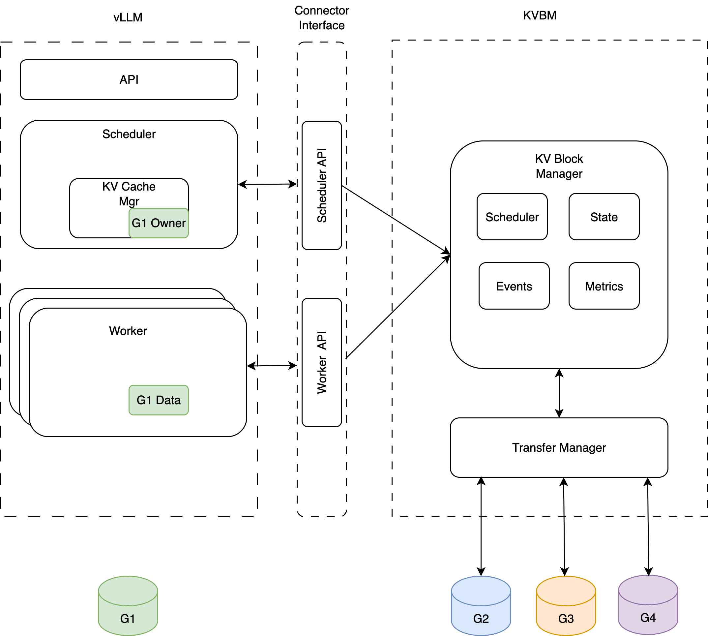

# Dynamo — 数据中心级分布式推理编排框架

> 源码:`3rdparty/dynamo/`(NVIDIA ai-dynamo/dynamo,Apache-2.0,检出 `705796fccf`,2026-09-03)。Rust(~52%)+ Python(~34%)+ Go(~12%,K8s 相关)。本文为**核实后的分析**(读 README + `lib/` 源码结构与关键符号)。
>
> ⚠️ **2026-09 重大变局**:KVBM v1 已被官方宣布 **sunset**,继任者是独立仓 **[KVCR](../kvcr/overview.md)**(KV Cache Runner,2026-08 公开)。本文 KVBM 各节描述的机制仍成立(代码仍在 main),但**不再代表 Dynamo 的未来方向**——详见下文「KVBM 变局(2026-09 核实)」。

## 定位

Dynamo 是"**推理引擎之上的编排层**"——不替代 vLLM/SGLang/TensorRT-LLM,而是把它们作为可插拔 worker,协调成多节点推理系统。这与 lake 的"控制面 + 存储池编排计算 worker"定位**高度同构**,且 Dynamo 用 Rust 写核心性能路径——是 lake 三语言分层(Rust 存储 / Go 控制 / Python 计算)的直接参照系,尤其 Rust 控制面/编排这一块。

## 整体架构:三个平面

Dynamo 把系统分成三个平面,各用各的通信栈(官方架构页 `architecture.md`):


(图源:`3rdparty/dynamo/docs/fern/assets/img/dynamo-architecture.svg`)

- **请求面(Request Plane)**:Client → Frontend → Router → Prefill/Decode workers。承载 RPC 请求,默认 TCP 直连(`DYN_REQUEST_PLANE=tcp`),可选 NATS 中转。
- **控制面(Control Plane)**:Planner(含 AIConfigurator 配置估计)→ Dynamo Operator → Grove(gang 调度);ModelExpress 负责权重下发。承载监控指标、容量与放置决策、容错信号。
- **存储与事件面(Storage & Events Plane)**:KVBM、NIXL 与底层存储;KV block 的增删事件经事件面广播(`DYN_EVENT_PLANE`,**默认 ZMQ**,可选 NATS),Router 订阅事件流维护 KV 位置视图。

服务发现独立于三平面:K8s 部署用 `DynamoWorkerMetadata` CRD + EndpointSlice,本地/裸机用 etcd(`DYN_DISCOVERY_BACKEND`)。所有组件按 `Namespace(一个部署/模型组)→ Component(同角色 workers)→ Endpoint(具体 RPC 端点)` 三级组织(`lib/runtime` 的 `DistributedRuntime`)。

### 请求流(PD 分离,官方 architecture.md 的 S1–S9)

1. Client 发 HTTP 请求到 Frontend(OpenAI 兼容,8000 端口);
2. Frontend 预处理(套 chat 模板、tokenize、校验);
3. **PrefillRouter** 按 KV 命中 + 负载选 prefill worker;
4. Prefill worker 算前缀,生成 KV cache;
5. Prefill worker 返回 `disaggregated_params`(后端相关的传输元数据);
6. PrefillRouter 把传输元数据注入 decode 请求,选 decode worker;
7. Decode worker 凭元数据与 prefill worker 直接 GPU→GPU 传 KV(NIXL);
8. Decode worker 逐 token 生成;
9. token 流经 Frontend 后处理(detokenize)回 Client。

要点:KV 传输是 **worker 间直连**,无共享存储瓶颈,且传输不阻塞 GPU 前向计算;传输协调方式因后端而异(vLLM 用 block ID、SGLang 用 bootstrap 连接、TRT-LLM 用不透明状态)。路由失败时本地运行时会把该 worker 临时拉黑(默认 5 秒,`DYN_RUNTIME_INHIBITED_DURATION_SECS`),等服务发现收敛。

两种路由拓扑:
- **Dynamo-native Frontend 路由**:`client → Frontend → Router → workers`,Frontend 内置 router,无外部 gateway。
- **Gateway API + GAIE**:K8s Gateway API Inference Extension → Endpoint Picker Plugin(EPP)→ Frontend sidecar(direct router 模式)。

## 主要组件

| 组件 | 角色 | lake 对应 |
|------|------|----------|
| **Frontend** | OpenAI 兼容 HTTP 入口;预处理/后处理 | Gateway |
| **Router**(KV-aware,含 PrefillRouter) | 按 worker 负载 + KV cache overlap 选 worker,省重算 prefill;编排 PD 分离的 prefill→decode 交接 | Router |
| **KVBM**(KV Block Manager) | GPU→CPU→SSD→远端 多层 KV offload(**已 sunset**,继任者 [KVCR](../kvcr/overview.md)) | Tiered Store(L0-L3) |
| **Planner** | SLA 驱动 autoscaler,持续读 GPU 容量指标,决定 PD 分离还是聚合、各相加减 GPU | (弹性,远期) |
| **DistributedRuntime**(`lib/runtime`) | 所有组件的地基:服务发现、端点注册、请求传输、生命周期;Rust 实现,Python 经绑定复用 | (lake 三语言各自的运行时) |
| **NIXL** | 独立传输库:同一套 API 搬 HBM/DRAM/SSD/对象存储("memory sections"),屏蔽 NVLink/InfiniBand/RoCE/以太网差异 | 传输引擎(规划 RDMA 旁路) |
| **ModelExpress** | NIXL/NVLink GPU 间流式传权重,7x 冷启动(已独立成仓 ai-dynamo/modelexpress) | 权重加载(远期) |
| **Grove** | K8s operator,拓扑感知 gang 调度(机架/主机/NUMA,NVL72)(独立仓 ai-dynamo/grove) | (部署,远期) |
| **Dynamo Operator** | K8s 部署调和:按 Planner 给的期望 worker 数 reconcile | (部署,远期) |
| **AISimulate** | 离线仿真:不起 GPU 集群就预测服务行为、搜索部署配置 | (无) |
| **Fault Tolerance** | canary 健康检查 + 在途请求迁移;路由失败临时拉黑 worker | F4(部分对应) |
| **mocker** | 模拟引擎,压测/验证路由与 KVBM 行为用 | (无) |

NVIDIA 官方宣传文(2025-03 GTC 发布博客)把 Dynamo 归纳为四个创新:**Planner、Smart Router、Distributed KV Cache Manager(即 KVBM)、NIXL**——KV 数据面组件(KVBM)被 KVCR 取代后,剩下三个恰好都是控制面/传输层,印证了"Dynamo 的本体是编排层"的判断(见「KVBM 变局」节)。

## 模块详解(modular-components + concepts)

> 来源:main 上 `docs/fern/pages/developer-guide/knowledge-base/` 下的 `modular-components/`(frontend / router / planner / profiler / ai-simulate / backends)与 `concepts/`(fault-tolerance / observability / simulation / system-architecture)两组文档。以下按模块核实整理,官方页名在括号内标注。

### Frontend

API 网关,OpenAI 兼容 HTTP + KServe gRPC 双入口(Anthropic Messages API 为实验性)。负责预处理(chat 模板、tokenize)与后处理(detokenize)——因此它**只需要模型的配置文件与 tokenizer 文件,不需要权重**;推荐配 ModelExpress + 共享 PVC 让全集群只下载一次。内嵌 router,`--router-mode` 七种:`round-robin` / `random` / `power-of-two` / `kv` / `direct` / `least-loaded` / `device-aware-weighted`。支持 `nvext`(NVIDIA 请求扩展字段,可带路由 hint 与缓存控制)和 Python 自定义路由扩展。

### Router(KV-aware)

文档量最大的模块(20 页),核心内容:

**成本模型**(`router-design.md`):对每个候选 worker 算代价,取最低者:

```text
adjusted_prefill = max(0, prefill_blocks
                     - device_overlap_credit      # GPU 上命中
                     - host_hit_weight * host_overlap      # 主机内存命中
                     - disk_hit_weight * disk_overlap      # SSD 命中
                     - shared_multiplier * shared_beyond)  # 共享层命中
cost = prefill_load_scale * adjusted_prefill
     + potential_decode_blocks          # 该请求 decode 将占的块数
     + active_request_weight * active_requests
```

三个输入信号:设备/主机/磁盘/共享层的前缀命中(来自全局索引)、预计 decode 占用、在途请求数。命中权重越高越偏 TTFT,越低越偏负载均衡(ITL);`router_temperature` 非零时对代价做 softmax 采样引入随机性。



(图源:`3rdparty/dynamo/docs/fern/assets/img/router-kv-routing-overview.jpg`;三个 worker 的 Cached/Prefill/Decode 块数与代价计算,选代价最低的 Worker 2)

**状态来源**:两条互补链路——
- **缓存块**:worker 上的 `KVPublisher` 在块创建/删除时发事件,Router 的 `KvIndexer` 用前缀树(节点上带 worker id)维护全局视图,`find_matches_for_request` 返回每个 worker 命中多少块。两种实现:单线程 RadixTree 或默认的 ConcurrentRadixTree(N 线程池 + sticky 分区,读写并发)。
- **在途块**:Router 本地"slot manager"即时预测(路由时 +、首 token 时改、结束时 -),不等事件。

**可靠性设计**(对 lake 位置视图很有对照价值):
- **gap 检测与恢复**:每个 worker 给自己的事件编单调递增序号,Router 发现序号跳变就向该 worker 的**本地索引**要全量快照重建;worker 新加入时全量灌入,移除时整棵子树删掉。事件面是 fire-and-forget,权威在 worker 本地索引。
- **多 Router 副本同步**(`--router-replica-sync`):副本间经事件面互发三类生命周期事件(`AddRequest` / `MarkPrefillCompleted` / `Free`),只为让各副本的**在途负载估计**更全;明确"不同步前缀缓存状态、不保证选路一致",队列满了丢最新消息,CLOCK 回收器清闲置租约(默认 300 秒)。

**其余专题页**(未逐一深读,留作指针):worker 过滤(`worker-filtering.md`)、按优先级类别做差额轮询调度(`deficit-round-robin.md`)、PD 分离路由、多数据中心 KV 路由(`multi-dc-kv-routing.md`)、拓扑感知 KV 传输(`topology-aware-kv-transfer.md`)、router 三件套独立部署(standalone indexer/selection/slot tracker)、offload 后端支持矩阵(`offloading-support-matrix.md`)。

### Planner

自动扩缩容控制器,`planner-design.md` 描述的内部结构:



(图源:`3rdparty/dynamo/docs/fern/assets/img/planner-architecture.svg`)

- **双环控制**:慢环(throughput-based)用流量预测 + 性能模型算容量下限;快环(load-based)用引擎实时指标做 ±1 步进的 SLA 纠偏,只能在下限之上调。慢环防短噪声误扩缩,快环补预测误差。
- **插件流水线**:OBSERVE(采指标)→ PREDICT(预测下一时段请求数/ISL/OSL)→ PROPOSE(各插件提扩缩建议)→ RECONCILE/CONSTRAIN(合并、卡 GPU 预算)→ EXECUTE(经 connector 下发)。内置算法就是走这条流水线的插件,外部可用 gRPC 插件扩展。



(图源:`3rdparty/dynamo/docs/fern/assets/img/planner-plugin-pipeline.png`)

- **负载预测器**四种:Constant(稳定负载)/ ARIMA(趋势季节)/ Kalman(突发)/ Prophet(复杂季节),都支持用 trace 文件预热;KV 命中率与投机解码接受率不预测,用最近一次观测值。
- **容量估计**来源按优先级:worker 自基准 > AIConfigurator 插值 > profiling 产出的 NPZ 文件 > 在线回归冷启动。快环用三个回归模型(输入"本迭代 prefill token 总数/decode KV token 总数",输出单次前向耗时,再模拟调度估 TTFT/ITL)。
- **下发(connector)**:`KubernetesConnector` 直接 PATCH DGD 资源由 operator 调和;`VirtualConnector` 把决策写进运行时,供非 K8s 的外部编排器轮询执行。一个本地 Planner 只管一个 DGD;跨 DGD 共享 GPU 预算用 GlobalPlanner。

### Profiler

给 Planner 供数据的 profiling 工具:输入模型 + 负载(ISL/OSL)+ SLA(TTFT/ITL 目标),输出 prefill/decode 各自的最优 TP 度、性能插值数据、以及一份可直接部署的 DGD 清单。两种途径:**AI Configurator 离线估计**(约 30 秒,不起 GPU,默认)与 **AIPerf 在线实测**(2-4 小时,要 GPU,更准)。推荐经 `DynamoGraphDeploymentRequest`(DGDR)声明式发起,`autoApply: true` 可自动应用结果。

### AISimulate / DynoSim(仿真,实验性)

不起 GPU 集群就能预测服务行为的离线仿真器:**mocker 引擎核**(模拟调度、KV 分配、前缀缓存、抢占、前向耗时)+ 可选的 router 仿真与 planner-in-the-loop 仿真。trace 摄入兼容 Mooncake JSONL 与 Dynamo 自己的 request trace;`Sweeper` 做配置空间搜索(如 GLM-5 FP8 的 PD 配置帕累托扫描)。lake 的 `tools/cmx-sim/` 计算器是同类思路的极简化版本。

### Backends(引擎接入)

两种接入方式:
- **集成式(integrated)**:Dynamo worker 与引擎同进程,功能最全,生产路径。
- **Sidecar(实验性)**:引擎不动,旁边跑一个纯 CPU 的 Dynamo sidecar 进程——目标设计是**请求面由 Frontend 直连引擎原生 gRPC,sidecar 只管服务发现与事件转发**(当前版本请求仍过 sidecar)。意义:不 import 引擎私有 API、依赖隔离、故障可归因。vLLM/SGLang 支持聚合与分离两种拓扑,TRT-LLM 仅聚合。

KV offload 走后端各自的 connector(vLLM 的 `kv-cache-offloading.md` 推 LMCache/FlexKV/HiCache;SGLang 有 HiCache 页)——KVBM 撤下后的官方推荐路径。

### 容错(concepts/fault-tolerance,四机制)

| 机制 | 做法 | 关键点 |
|------|------|--------|
| **优雅退出** | SIGTERM → 先从发现面注销端点(秒级停止收新流量)→ 宽限期(默认 5s)→ drain 在途请求(总上限默认 15 分钟)→ 清资源 | "先注销再 drain"的顺序保证不再接新请求 |
| **请求迁移** | pipeline 里的 Migrator 算子拦截所有请求/响应,逐 token 累积已生成内容;worker 中途挂了就把"原 prompt + 已生成 token"作为新请求发给健康 worker 续算 | 客户端无感;迁移次数上限在 Frontend 级配置 |
| **请求取消** | 客户端断开时沿 pipeline 传播取消,释放 KV 块 | (未深读,见 `request-cancellation-architecture.md`) |
| **请求拒绝(过载)** | 两层:Frontend 的 Router 按 worker 上报的负载事件维护"忙碌集合"并排除(全忙则回 HTTP 529,可配);worker 侧另有硬上限 `--engine-request-limit N` + 溢出队列 Q(默认 16),满则拒 | 529(过载)与 503(无可用路径)区分;worker 是否忙碌按 DP rank 判定,**所有 rank 都忙才算忙** |

另有 **canary 主动健康检查**(observability 概念页):空闲超时的端点会被发一个真实的最小请求验证推理通路;正常流量天然抑制 canary。默认关闭。

### 可观测性(concepts/observability)

- **指标拉、轨迹推**:Prometheus 拉 `/metrics`;trace 与日志经 OTLP 推到 collector(可接 Tempo/Loki)。
- **三键关联**:调用方可传 `x-request-id`,加上 OTLP 的 `trace_id` / `span_id`,结构化日志(JSONL)里三键并列,可互查。
- **前向指标(FPM)持久化**:从发布路径旁路一份进**有界队列**落盘(gzip JSONL),队列满就丢记录——明确"不为观测性拖慢推理"。

## KV 路由协议源码(lib/kv-router)

> 路由器的成本模型、事件流与可靠性设计见上文「模块详解 → Router」;本节是 `lib/kv-router/src/` 的源码级协议细节。核心数据结构在 `protocols.rs`:

- **`LocalBlockHash(pub u64)` / `ExternalSequenceBlockHash(pub u64)`**:block 哈希。`ExternalSequenceBlockHash` 注释明示"engine 从 token IDs + 可选 metadata + **parent block hash** 计算"——即**前缀链式哈希**,与 lake `block_hash = hash(parent || 本块 tokens)` 同构。这是 lake 链式哈希防误复用的直接工业印证。
- **`Placement { owner: PlacementOwner, tier: StorageTier }`**:block 的位置 = owner + tier。
  - `PlacementOwner`:`LocalWorker(WorkerWithDpRank)` | `Shared`——区分"某 worker 私有"vs"共享池"。
  - `StorageTier`:`Device`(GPU)| `HostPinned`(CPU)| `Disk`(NVMe)| `External`(远端/网络)。`from_kv_medium` 把字符串 medium 映射到 tier。**这正是 lake L0/L1/L2/L3 四层的对应**——且 tier=介质非位置,与 lake"层=介质非位置"原则一致。
- **`PlacementEvent { placement, event: KvCacheEvent }`**:位置变更事件,推送用。对应 lake"位置视图权威变更触发推送(放置/驱逐/迁移/满块注册)"。
- **`RouterRequest`/`RouterResponse`**:Router 的 RPC 协议,`RouterResponse` 含 `overlap_blocks`(命中重叠块数)、`effective_overlap_blocks`——KV-aware 路由的命中量化。
- **`KvTransferEnforcement`**:强制 KV 传输的策略枚举(对应 lake PD 分离/D-direct 的模式选择边界)。

## KVBM(KV Block Manager)三层架构

源码入口:`lib/kvbm-{logical,physical,engine}/`。分层清晰,是 lake 存储池分层最直接的参考:

| 层 | 职责 | lake 对应 |
|----|------|----------|
| **kvbm-logical** | 逻辑 block 管理(blocks/pools/manager/events)、pubsub 事件 | radix + locations 元数据 + 位置视图 |
| **kvbm-physical** | 物理布局(layout)、传输(transfer)、manager | 分块流水线 + 传输引擎 |
| **kvbm-engine** | 运行时(runtime)、offload、leader、collectives、object(S3/Azure) | 池运行时 + L3 SSOT + 副本/leader |

KVBM offload 路径:`GPU → CPU → SSD → 远端存储(S3/Azure blob)`,1.0 新增"global KV events for cluster-wide cache visibility"(集群级缓存可见性)——对应 lake 控制面强一致位置视图。

### KVBM v1 设计细节(源自 v0.7.1 设计文档)

> KVBM 的设计文档已从 main 删除(随 sunset),本节内容取自 v0.7.1 tag 的 `docs/kvbm/kvbm_design_deepdive.md` 与 `kvbm_components.md`,描述的是 v1(`lib/llm/src/block_manager/`)架构。这是理解 KVCR 重做动机(KVBM 哪里耦合重了)的直接材料。



(图源:`3rdparty/dynamo` v0.7.1 `docs/images/kvbm-internal-arch.png`;两个 worker 经 NIXL 交换布局元数据后 RDMA 直传)

**编排层**:`KvBlockManager<H, D>` 是协调者,持有 device/host 两个 `BlockPool`、一个 NIXL agent(跨节点通信与内存共享)、一个 block set 注册表(远端查找与导入导出)。它管四层:**G1 = GPU 显存、G2 = 主机内存(可跨节点)、G3 = 本地/池化 SSD、G4 = 远端存储**;G4 被当作不透明 blob 存储,KVBM 不关心其内部布局。

**块布局与存储后端**:每个块是二维数组 `[num_layers][page_size × inner_dim]`,默认布局 `FullyContiguous`(所有块的所有层放在一个连续区域,步长按对齐计算)。同一布局下按介质选存储后端:`DeviceStorage`(CUDA 显存)/ `PinnedStorage`(锁页主机内存)/ `SystemStorage`(普通堆内存,测试用)/ `NixlStorage`(经 NIXL 注册的远端内存)。

**块状态机**:每个 `BlockPool` 分 ActivePool(正在用)与 InactivePool(空闲链表)两个子池;块的生命周期是 `Reset → Partial(填充中)→ Complete(填满,未发布)→ Registered(已注册,可被前缀查找复用)→ 句柄 drop 后自动回 Reset`。注册动作同时向事件面发 Register 事件,句柄析构发 Remove 事件——**用 RAII 句柄把"块可见性"和"事件发布"绑在一起**,不需要显式的反注册逻辑。



(图源:`3rdparty/dynamo` v0.7.1 `docs/images/kvbm-components.png`)

**数据流四条路径**(由 connector 的 Scheduler 按模型进度门控,`TransferManager` 按路径各建一条异步队列):



(图源:`3rdparty/dynamo` v0.7.1 `docs/images/kvbm-data-flows.png`)

- **Device→Host(offload)**:connector 显式请求;CUDA D2H 或自定义 kernel 拷贝,host 池按序列哈希去重注册;
- **Host→Disk(offload)**:NIXL 写(本地 SSD 走 POSIX,有 GDS 用 GDS;网络文件系统 NFS/Lustre/GPFS 同路径);
- **Host→Device(onboard)**:CUDA H2D 或自定义 kernel;
- **Disk→Device(onboard)**:NIXL 读直灌 GPU(可走 GDS)。

**NIXL 远端内存集成(跨 worker 共享的关键机制)**:两个 worker 各自 `nixl_register()` 注册内存后,要**先交换序列化的布局元数据**(`SerializedNixlBlockLayout`:层数、page size、inner dim、dtype、基址、步长、设备号、内存类型)才能互传——因为两侧 TP 度可能不同(如 TP=4 对 TP=8),布局假设不同,不交换元数据直接 RDMA 会读到错位的数据。这正是 KVBM 需要自定义 kernel 做布局变换、以及 KVCR 重做时把"布局标准化"推给引擎的原因(见 [KVCR 分析](../kvcr/overview.md)「与 KVBM 的区别」)。

**G4 存储厂商集成模式**(storage advisor 概念设计):存储系统不被 Dynamo 管理,而是**被动订阅事件面**——厂商先用 NIXL Storage Agent 的 `registerVolume()` 注册卷,KVBM 只用 `get()/put()` 块级读写;事件面广播 `StoreEvent`/`RemoveEvent`(每条约 100 字节:序列哈希、前缀哈希、块大小、卷标识、事件类型,约 10 秒批量一次),厂商的订阅进程据此自建前缀树/索引,自行做热点提升、冷块降层、碎片压实。Dynamo 完全不参与这些优化。这个"事件面 + 厂商自建索引"的解耦思路,与 KVCR 的"router 持全局视图"是两种相反的全局知识组织方式,对 lake 的位置视图设计有对照价值。



(图源:`3rdparty/dynamo` v0.7.1 `docs/images/kvbm-integrations.png`;KVBM 作为抽象层对接多家存储后端)

### KVBM 变局(2026-09 核实)

**KVBM 已被官方放弃,继任者是独立仓 [KVCR](../kvcr/overview.md)。** 时间线(全部经 issue/PR 与 git 历史核实):

- **v1 = `lib/llm/src/block_manager/` + `lib/bindings/kvbm/`**(生产 vLLM/TRT-LLM 绑定至今依赖它):跨实例共享两次尝试 [#4887](https://github.com/ai-dynamo/dynamo/pull/4887)(G4 对象存储 + ZMQ registry hub)/ [#5243](https://github.com/ai-dynamo/dynamo/pull/5243)(+23k 行分布式 KVBM)**均未合并**;v1 生产匹配**仅本机** G2/G3(`lib/bindings/kvbm/src/block_manager/vllm/connector/leader/slot.rs`::`acquire_local_matches`)。
- **v2 = `lib/kvbm-{engine,logical,physical,common,config}/`**:2026-04-08 经 [#6773](https://github.com/ai-dynamo/dynamo/pull/6773) 合入 main,含 session 化跨实例 remote search/pull 协议(`lib/kvbm-engine/docs/session.md`)——但**只合了库,生产绑定仍走 v1**,仅 mocker 使用;接线工作在未合并分支(`ryan/kvbm-bindings`/`ryan/kvbm-engine-service`,契约先行 `lib/kvbm-connector/CONTRACT.md`)。
- **2026-07-16** [DEP #11673](https://github.com/ai-dynamo/dynamo/issues/11673) 官方原话:"**KVBM v1 is being sunset**";新方向 = "引擎原生 offload(如 vLLM OffloadingConnector)+ P2P 连接各节点 CPU 层"。
- **2026-08-24** 新实现公开为 **[KVCR](https://github.com/ai-dynamo/kvcr)**(KV Cache Runner):框架无关 Python 库,不管 GPU,复用 router 全局视图 + 请求级 hint,NIXL P2P。分析见 [`../kvcr/overview.md`](../kvcr/overview.md)。
- **2026-08-27** [#12993](https://github.com/ai-dynamo/dynamo/pull/12993) 文档把 KVBM 从 offload 推荐后端撤下(改推 LMCache/FlexKV/HiCache);KVBM 代码仍保留在 main("keep it alive until the new solution is ready")。设计文档页(`kvbm-design` 等)已从 main 的文档站删除,只剩 `reference/components/kvbm-configuration.mdx` 一页配置参考;设计细节需查 v0.7.1 等历史 tag(本文「KVBM v1 设计细节」节即取自该版本)。

**对 lake 的影响**:`rust/vendor/` vendor 的 kvbm-logical 上游已冻结(见 [`../../architecture/kv-virtual-memory.md`](../../architecture/kv-virtual-memory.md));v2/KVCR 的演进方向(引擎原生布局 + router hint + P2P)与 vendor 拷贝无关,不影响其正确性,但后续不会再有上游修复可同步。

## 运行时与通信(transports / discovery)

源码:`lib/runtime/src/transports.rs` + `discovery/`。Dynamo 的通信后端是**多后端可插拔**,三个平面各自独立选型(2026-09 以 main 上 `architecture.md` 为准,比本文早期版本更细):

- **发现面(discovery)**:K8s 部署用 `DynamoWorkerMetadata` CRD + EndpointSlice(operator 设 `DYN_DISCOVERY_BACKEND=kubernetes`);本地/裸机默认 etcd。另有 memory/file 后端供开发用。etcd 模式下租约(lease)自动清理失联端点。
- **请求面(request plane)**:组件间 RPC。**默认 TCP 直连池**(`DYN_REQUEST_PLANE=tcp`),可选 NATS 中转;编解码可选 msgpack/json,由目的端点宣告。
- **事件面(event plane)**:KV cache 增删、worker 遥测等异步信号。**默认 ZMQ**(经发现面找发布者),可选 NATS。不想收 KV 事件可用 `--no-router-kv-events` 起 frontend,路由降级为按负载预测。
- **transports 源码层**:`etcd` / `nats` / `tcp` / `zmq` / `event_plane` 多套栈并存;**discovery**:`kube` / `etcd` / `kv_store` / `mock`(本地 file-based)。
- **失败临时拉黑**:路由到的 worker 请求失败后,本地运行时先把它拉黑(默认 5 秒,`DYN_RUNTIME_INHIBITED_DURATION_SECS`),等服务发现权威收敛——发现面是权威,拉黑只是本地缓存的临时修正。

关键洞察:Dynamo **不把 etcd 当唯一控制面存储**——K8s 部署用 CRD/EndpointSlices 做 discovery,etcd 只在非 K8s 部署用;KV 事件走独立事件面(默认 ZMQ)而非 etcd。这与 lake 的分工同向不同位——lake 的位置视图权威在**存储控制面进程内存**(单写者线性一致),etcd 只存降频 checkpoint;Dynamo 没有这一跳内存权威,事件流放专用事件面(更适合高频事件流,etcd 不善长高频写)。

## 分布式模型

> 跨项目汇总对比见 [../distributed-models.md](../distributed-models.md);与 lake 一致性对照另见 [`../../architecture/consistency.md`](../../architecture/consistency.md) §8.6。

- **拓扑**:编排层星型 + 事件流。`Frontend → Router(KV-aware)→ workers(vLLM/SGLang/TRT-LLM)`;Router 内置 indexer(`lib/kv-router/`)维护各 worker 的 KV block 哈希集合(radix 副本)。KVBM 三层(logical/physical/engine)管 offload,KV 仍归引擎。
- **元数据权威**:分层分离——服务发现与权威元数据走 etcd(或 K8s CRD/EndpointSlices);高频 KV 位置事件走事件面(默认 ZMQ,可选 NATS),不进 etcd。说明"高频位置写不进 etcd"是常见工程取舍,与 lake"权威在 CP 内存、etcd 只存降频 checkpoint"结论同向、实现不同位。
- **同步机制**:KV 事件经事件面推送(`PlacementEvent` 位置变更),Router indexer 消费事件流更新本地 radix(`ListenerLoop::apply_live_batch`,带 gap/replay);无事件源时降级为预测式路由(按负载)。事件 best-effort,`distributed.rs` 明示 approximate mode 允许丢事件。
- **一致性**:无全局强一致位置视图。Router 索引为事件流构建的最终一致副本;kvbm-engine 的 leader 搬 KV 时查本地视图(`find_matches`),属 flat memory 式 pull,但无全局目录(无副本失效)、无 release 屏障(无写回屏障),见 consistency.md §8.6。
- **HA 与故障**:canary 健康检查 + 在途请求迁移;worker 存活经 etcd lease 绑定自动收敛(`transports/etcd/lease.rs`)。
- **扩展性**:事件流适合高频更新,Router 可水平扩展(无状态 + 索引副本);代价是索引最终一致,误判以重算兜底。
- **与 lake 对照**:Dynamo 为事件流编排,lake 为内存强一致权威 + 镜像推送 + 回查兜底。两家均不将高频位置写压入 etcd;分叉在于 lake 将权威放进 CP 进程内存(单写者线性一致),Dynamo 无可同步查询的权威,选错 worker 的代价是重算 prefill。

## PD 分离 / E/P/D

PD 分离为"独立可伸缩的 GPU 池",三后端(vLLM/SGLang/TRT-LLM)都支持。多模态扩展为 **E/P/D**(encode/prefill/decode)三路 + embedding cache。对应 lake PD 分离 + 混部 + D-direct 三模式(但 lake 多一档 D-direct 本地命中,Dynamo 侧重 PD 物理隔离)。

## 借鉴点(对应 lake 设计)

| Dynamo 设计 | lake 对应 | 说明 |
|------|----------|------|
| `ExternalSequenceBlockHash`(父哈希链式) | `block_hash = hash(parent ‖ tokens)` | lake 链式哈希防误复用的工业印证,见 [`../architecture/kv-cache-pool.md`](../../architecture/kv-cache-pool.md) "Block 寻址" |
| `StorageTier`(Device/HostPinned/Disk/External) | L0/L1/L2/L3 | tier=介质非位置,与 lake"层=介质非位置"一致;`from_kv_medium` 字符串映射可参考 wire 格式 |
| `Placement { owner, tier }` | `locations` 多层位置 | owner 区分私有/共享,对应 lake"副本归池非 worker 私有" |
| `PlacementEvent` 位置变更推送 | 位置视图权威变更触发推送 | 事件驱动推送镜像,见 [`../../architecture/scheduling.md`](../../architecture/scheduling.md) §1 |
| KVBM logical/physical/engine 三层 | 存储池 元数据/传输/运行时 | 分层组织可直接借鉴,见 [`../../architecture/storage-layer.md`](../../architecture/storage-layer.md) |
| KVBM 块状态机 + RAII 注册事件 | KV block 生命周期管理 | `Reset→Partial→Complete→Registered`,注册/析构自动发事件,免显式反注册;lake 块生命周期可参考(见 [`../sglang/block-lifecycle.md`](../sglang/block-lifecycle.md)) |
| KVBM G4 "storage advisor" 模式 | (lake 不采用,作对照) | 存储厂商订阅事件面自建索引、自行冷热分层——与 lake"位置视图归存储控制面权威"相反,是有价值的反面对照 |
| 三平面分离(请求/控制/事件) | lake 通信分层 | 请求面 TCP、事件面 ZMQ/NATS、发现面 etcd/K8s 各自独立选型,印证"按流量特征选栈" |
| Router 成本函数(分层命中加权) | Router 命中感知选路 | device/host/disk/shared 四层命中各有权重,可直接对照 lake"Pool 命中 vs 本地命中"的差异化计价 |
| 事件 gap 检测 + worker 本地索引快照恢复 | 位置视图推送的可靠性兜底 | 事件面 fire-and-forget + 序号 gap 触发全量快照,与 lake"镜像推送 + 回查兜底"同构 |
| 多 Router 副本只同步在途负载、不同步缓存状态 | (lake Router 扩展时参考) | 明确区分"易失负载估计"(副本间 best-effort)与"缓存状态"(worker 本地索引为权威),边界划得干净 |
| Planner 双环(慢预测环给下限 + 快反应环 ±1) | (lake 弹性,远期) | 慢环防噪声、快环纠偏的分工,以及"扩缩间隔必须长于扩缩完成时间"的工程约束 |
| 请求迁移的 token 累积重发 | F4 故障恢复 | Migrator 在 pipeline 里累积已生成 token,worker 挂了带全量上下文换 worker 续算——lake F4 重路由时的状态携带可参考 |
| 过载拒绝两层(router 忙碌集合 + worker 硬上限 N+Q) | (lake 归 gateway,不采用) | Dynamo 在推理系统内做了 shedding;lake 明确把过载控制划给 gateway,这是两家职责边界的差异点 |
| KV-aware router(overlap 量化) | Router 命中感知选路 | `overlap_blocks` 命中量化,见 [`../../architecture/scheduling.md`](../../architecture/scheduling.md) "缓存命中感知调度" |
| transports 多后端可插拔 | 通信选型(见 #3) | etcd/nats/tcp/zmq 按部署形态选,印证"控制面存储 vs 事件面"可分离 |
| KV events 走 NATS 而非 etcd | (lake 待定) | 高频事件流用 NATS、权威元数据用 etcd 的分工,值得 lake 评估 |

## 关键差异(lake 更彻底)

G1 是传输句柄（无 `BlockManager<G1>`）、与 KV event / 本机 G2/G3 的分工，以及和 Mooncake / MemCache / FlexKV 等的 HBM 对照，见 [`../hbm-tier-and-offload.md`](../hbm-tier-and-offload.md)。Dynamo 也可把 FlexKV 当 worker connector（`--connector flexkv`），与 KVBM 不是同一套本机索引。

- **存算分离彻底度**:Dynamo 的 KV 仍由 engine(vLLM/SGLang)持有,KVBM 是"offload 层"(把 engine 的 KV 卸到 CPU/SSD/远端);G1 无 `BlockManager`。lake **HBM 归池、worker 不拥有任何内存**,KVBM 式 offload 在 lake 是池的统一放置,非引擎私有缓存的延伸。
- **控制面一致性**:Dynamo KV 事件走 NATS(best-effort 事件流)、discovery 多后端,无全局强一致位置视图;lake 位置视图权威在存储控制面进程内存(单写者线性一致)、etcd 降频 checkpoint,Router 本地镜像一跳命中(见 [`../architecture/consistency.md`](../../architecture/consistency.md) §1)。Dynamo 更偏"事件流编排",lake 更偏"强一致权威 + 镜像"。
- **radix 前缀复用**:Dynamo KV-aware router 用 block 哈希 overlap,但 radix 前缀树/内容寻址复用仍依赖底层 engine(SGLang RadixAttention);lake 把 radix 归存储池统一管。
- **执行模式**:Dynamo 侧重 PD/E-P-D 物理隔离 + KV-aware 路由;lake 多 D-direct(本地命中零传输直跳)与混部,Dynamo 无明确对应。
- **多模型/池生命周期**:Dynamo 以单集群服务为主;lake 存储池是长期存续、模型无关的独立基础设施(F11),配额/GC/碎片整理/多模型命名空间。

## 代码索引

> 沿代码回溯用。符号名锚定,行号会漂移——找不到时 `grep -n "符号名" 3rdparty/dynamo/<文件路径>`。

| 机制 | 文件:符号 |
|------|-----------|
| Router 协议(Placement/StorageTier/RouterRequest 等) | `lib/kv-router/src/protocols.rs`::`StorageTier` / `PlacementOwner` / `Placement` / `PlacementEvent` / `RouterRequest` / `RouterResponse` / `KvTransferEnforcement` |
| 链式 block 哈希 | `lib/kv-router/src/protocols.rs`::`LocalBlockHash` / `ExternalSequenceBlockHash`(注释含 parent block hash) |
| KV-aware 路由命中量化 | `lib/kv-router/src/protocols.rs`::`WorkerSelectionResult`(`overlap_blocks`/`effective_overlap_blocks`) |
| KV 路由主循环 | `lib/kv-router/src/{active_set,lookup_update,scheduling}/` |
| 官方架构文档(请求流 S1-S9/三平面) | `docs/fern/pages/.../system-architecture/architecture.md`(main);KVBM 设计文档仅存于 v0.7.1 tag `docs/kvbm/` |
| KVBM v1 编排层 | `lib/llm/src/block_manager/state.rs::KvBlockManagerState` / `config.rs::KvBlockManagerConfig` |
| KVBM v1 块状态机 | `lib/llm/src/block_manager/block/state.rs::BlockState`(Reset/Partial/Complete/Registered) |
| KVBM v1 块池(Active/Inactive) | `lib/llm/src/block_manager/pool/managed.rs` |
| KVBM v1 连续布局 | `lib/llm/src/block_manager/layout.rs::FullyContiguous` |
| KVBM v1 offload 管理 | `lib/llm/src/block_manager/offload.rs` |
| KVBM 逻辑层 | `lib/kvbm-logical/src/`(`blocks`/`pools`/`manager`/`events`/`pubsub`) |
| KVBM 物理层(布局/传输) | `lib/kvbm-physical/src/`(`layout`/`transfer`/`manager`) |
| KVBM 引擎层(运行时/offload/leader/object) | `lib/kvbm-engine/src/`(`runtime`/`offload`/`leader`/`collectives`/`object`) |
| Router 索引器(前缀树 + gap 恢复) | `lib/kv-router/src/indexer/`;副本同步与租约见 `lib/kv-router/src/{active_set,recovery}/` |
| Router 成本模型 | `lib/kv-router/src/protocols.rs` + `scheduling/`;文档 `modular-components/router/router-design.md` |
| Planner 双环与插件流水线 | `components/src/dynamo/planner/core/{load_scaling,throughput_scaling,state_machine}.py` + `plugins/`;文档 `modular-components/planner/planner-design.md` |
| Profiler / DGDR | `components/src/dynamo/profiler/`;文档 `modular-components/profiler/` |
| 仿真(mocker / replay) | `components/src/dynamo/{mocker,replay}/`;文档 `concepts/simulation/dynosim-architecture.md` |
| Frontend / 全局路由 | `components/src/dynamo/{frontend,global_router,global_planner}/` |
| 通信后端(多后端) | `lib/runtime/src/transports.rs`::`etcd`/`nats`/`tcp`/`zmq`/`event_plane` |
| 服务发现 | `lib/runtime/src/discovery/`(`kube`/`kv_store`/`mock`) |
| 组件抽象 | `lib/runtime/src/component.rs` / `pipeline/` |
| worker/LLM 抽象 | `lib/llm/src/`(`backend.rs`/`block_manager.rs`/`block_manager.md`) |
