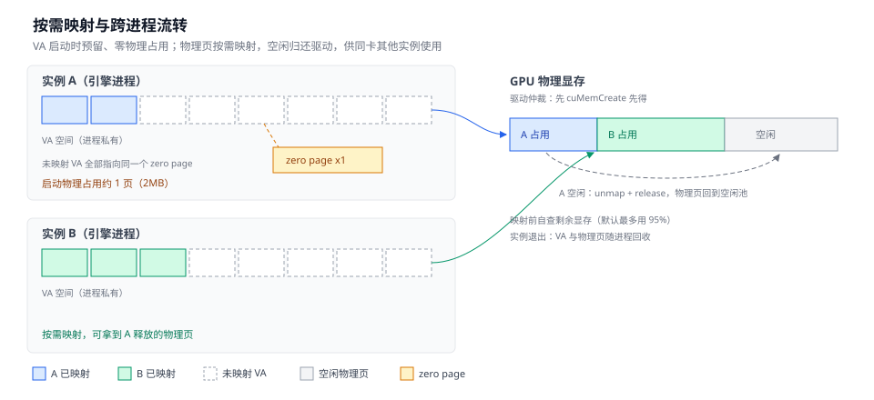
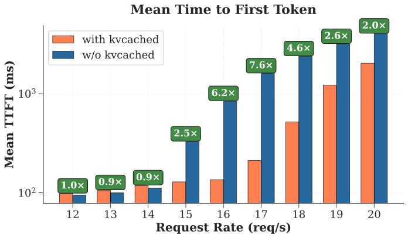
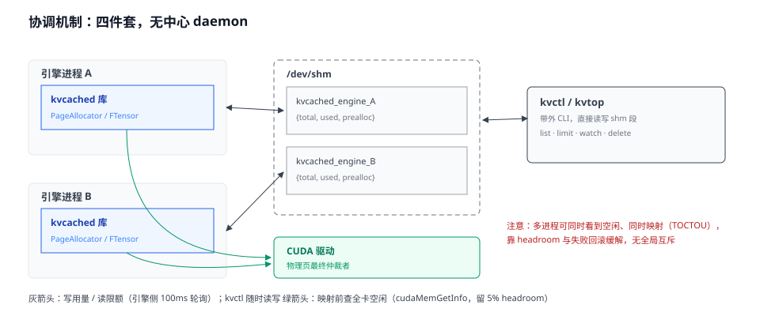
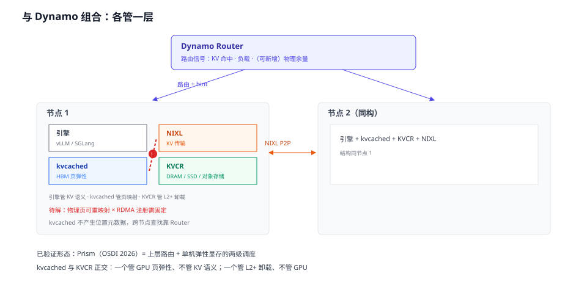

# kvcached — GPU 虚拟内存弹性 KV（总览）

> 源码：`3rdparty/kvcached`（submodule，HEAD `60cad94`，v0.1.5，2026-08-22）。上游 [ovg-project/kvcached](https://github.com/ovg-project/kvcached)（OVG，Prism/OSDI 2026 的开源底座）。许可：**Apache-2.0**。PyPI：`kvcached`；Python 包本体约 8.9k 行 + C++ 核心约 3.1k 行（`csrc/`）+ 示例前端约 2.4k 行（`controller/`）。  
> 论文：Prism（OSDI 2026，[arXiv 2505.04021](https://arxiv.org/abs/2505.04021)）、GPU OS 愿景（[arXiv 2508.08448](https://arxiv.org/abs/2508.08448)）；官网 [kvcached.org](https://kvcached.org/)。  
> 与 Dynamo/lake 的结合与进一步空间见「想象空间」；HBM 归属对照见 [`../hbm-tier-and-offload.md`](../hbm-tier-and-offload.md)。

## 一句话定位

kvcached 把 OS 虚拟内存的做法搬到 GPU KV cache：虚拟地址（VA）与物理页解耦，物理页按需映射、空闲即释放。同一张卡上的多个 vLLM/SGLang 实例由此共享显存，不再需要启动时静态切分。

它不做的事：

- 不分层：不管 DRAM/SSD/对象存储（那是 HiCache/LMCache/KVCR 的层）；
- 不索引：不维护前缀树或位置视图，前缀复用仍是引擎自己的 APC；
- 不是 daemon：名字来自 "KV cache daemon"，实现是嵌在引擎进程里的库（见「核心机制 → 无 daemon 的协调」）；
- 不碰权重：只虚拟化 KV 张量，权重的 sleep/wake 靠引擎自身能力。

生态：Red Hat 的 [Sardeenz](https://github.com/rh-aiservices-bu/sardeenz) 基于 kvcached 做 k8s/OpenShift 多模型动态 serving（2026-04 官方博客）。支持 vLLM ≥0.8.4、SGLang ≥0.4.9，MHA/GQA/MLA/滑窗/hybrid 注意力，TP/PP。

## 与本系统的关系

| kvcached 概念 | 本系统对应 | 关系 |
|---------------|-----------|------|
| `FTensor`（VA 预留 + 页级映射） | L0 物理页按需分配 | **机制样板**；lake 把分配者从进程内库换成池 agent（见「想象空间」第 8 条） |
| `PageAllocator`（热页缓存/resize） | 池 agent 的 HBM 页管理 | 工程细节可照搬：2MB 同尺寸页无碎片、5–10 页热缓存、失败回滚 |
| `MemInfoTracker`（`/dev/shm` 记账） | 配额/用量上报 | 带外、不占请求路径；lake 归控制面权威 |
| kvctl（revision 状态机） | 池配额下发通道 | applied/deferred/stale/conflict 语义可直接用 |
| `get_page_occupancy`（页级存活块） | 「引用数>0 冻结」 | 页可否 unmap 的判定依据 |
| autopatch（`.pth` + import 钩子） | 计算层引擎接入方式 | 引擎零改动；代价是补丁面跟随版本 |
| controller（路由 + sleep） | （lake 职责外，归 gateway） | 示例级；唤醒/限流决策属外部控制面 |

**核心结论**：kvcached 与其他参考项目不在同一层——不分层、不索引前缀、不做跨节点，只做一件事：把 GPU KV 张量的 VA 与物理页解耦。对 lake 的意义在 L0：池 agent 管理 HBM 物理页时，这是唯一在真实引擎（vLLM/SGLang）上验证过的工程闭环。

## 设计哲学

- 把 OS 虚拟内存思想搬上 GPU：VA 稳定（引擎无感、CUDA graph 安全），物理页按需供给。
- 不碰 KV 语义：不知道页里装的是哪个块，索引留给引擎 APC——这是它与 KVBM 命运分野的根因（KVBM 管 block 布局被 sunset，见 [`../kvcr/overview.md`](../kvcr/overview.md)）。
- 无中心协调：物理页由 CUDA 驱动仲裁（先 `cuMemCreate` 先得），记账走 `/dev/shm`，不设 daemon。
- 引擎零改动：autopatch 运行时注入，而非 fork 引擎。

## 核心机制

官方宣传四个特性，逐条对源码核实如下（细节见对应小节）：

| # | 宣称 | 结论 | 实际机制 |
|---|------|------|----------|
| 1 | 跨进程显存超卖 | 成立 | VA 私有 + 物理页按需映射，闲置页经驱动流转 |
| 2 | 独立 daemon 全局统筹 | 与宣传不符 | 无 daemon；进程内库 + /dev/shm 记账 + 驱动仲裁 |
| 3 | 零物理分配冷启动 | 成立（仅 KV） | VA 预留 + 全段先指向同一 zero page，启动物理占用约一页 |
| 4 | 多租户硬配额 | 成立（有边界） | 硬在分配拒绝；在用页不能强收 |

### 按需页映射与跨进程流转（超卖）



- 每个实例启动时 `cuMemAddressReserve` 一段私有 VA（`csrc/ftensor.cpp::alloc_virtual_mem`）。KV block 落到 2MB 页；页被使用时才 `cuMemCreate`+`cuMemMap` 物理页（`csrc/page.cpp::GPUPage`），页全空时 unmap+release 还给驱动（`csrc/page_allocator.cpp::PageAllocator::free_page`）。
- 虚拟容量不因他实例占用而折减：vLLM 侧调度器可见容量固定为 `总显存 × gpu_memory_utilization`（`integration/vllm/patches.py::_get_virtual_kv_capacity_bytes`）。同卡每个实例都可按 90% 规划自己的虚拟 KV 空间。
- 实例 A 空闲时物理页回到驱动空闲池；实例 B 映射前先查全卡剩余物理显存，且默认最多只用总量的 95%（留 5% 安全余量）。
- 分配性能：后台线程维持 5–10 页已映射缓存（`KVCACHED_MIN/MAX_RESERVED_PAGES`），分配快速路径为微秒级。
- 前缀缓存与弹性共存：被 APC 引用的页保持映射，按页统计存活块（`KVCacheManager::get_page_occupancy`）；APC 占用上界由 `KVCACHED_MAX_CACHED_TOKENS` 控制。

官方 benchmark：3 个 Llama-3.1-8B 实例共享一张 A100-80G，间歇峰值负载下 TTFT 降 2–28×。


（图源：`3rdparty/kvcached/assets/ttft_results/ttft_mean.svg`）

### 无 daemon 的协调



名字是 daemon，实现不是。全局协调由四件套完成，没有中心进程：

1. 引擎进程内的 C++ 库（PageAllocator/FTensorAllocator）自决映射；
2. 每进程一段 `/dev/shm` 共享内存做记账（文件锁保护，就三个数：上限、已用、预分配，`csrc/inc/mem_info_tracker.hpp::MemInfoTracker`）；
3. kvctl CLI 带外读写这些段（`kvcached/cli/kvctl.py`）；
4. CUDA 驱动仲裁物理页：先 `cuMemCreate` 先得。

防 OOM 也是各进程自理：映射前自己查一次全卡空闲显存，并且默认最多用物理总量的 95%。但「查」和「用」之间没有全局锁——两个进程可能同时查到空闲、同时映射，合计超出物理容量。真发生时靠这 5% 余量兜底；还放不下，这次映射就失败回滚（页退回空闲列表，分配报错）。

`controller/` 是示例级前端：OpenAI 兼容路由 + 流量监控 + sleep 管理（tmux 编排），管「请求发给谁、闲了睡」，不管显存分配。

### 零物理分配冷启动

- 启动时整段 VA 先全部指向同一个物理页（zero page，2MB），物理占用约一页（`csrc/ftensor.cpp::FTensor::init_with_zero_`）。首次使用某页时才把它改指到真实物理页（`FTensor::map`）。
- 省掉的是 KV 物理预分配，以及「按空闲显存反推 KV 容量」的 profiling 依赖；权重加载、CUDA graph 不省。
- VA 稳定、张量地址不变，物理页重映射对 kernel 和 CUDA graph 透明。这是这条路线成立的关键性质。
- 完整的 serverless 拉起 = kvcached（KV 零占用）+ 引擎 sleep/wake（权重）+ controller 按流量唤醒（`examples/06_serverless_serving`）。

### 硬配额

链路：`kvctl limit <实例> <大小>` → 写该实例 shm 段的 total 字段 → 引擎内线程 100ms 轮询发现变化（`PageAllocator::resize_watcher`）→ `resize()` 收缩或扩张可用页。

- 收缩只能回收空闲页；在用页高于新限额时记为 deferred（延迟生效），等引擎自己释放。不能强收在用的页。
- 「硬」体现在分配拒绝：可用页收缩后，超限分配直接失败，引擎表现为 KV 满。单个长请求吃不光整卡。
- 配额上限是启动时定的虚拟容量；粒度是单个引擎进程组；并发写用 revision 防冲突（`kvcached/control.py::set_instance_memory_limit`，状态：applied/deferred/stale/conflict）。

## 仓库与架构

### 仓库布局

| 目录 | 内容 |
|------|------|
| `csrc/` | C++ 核心：VMM 原语、页分配器、FTensor、shm 记账，经 torch 绑定暴露给 Python |
| `kvcached/` | Python 层：KVCacheManager、autopatch、kvctl CLI、引擎适配 |
| `engine_integration/` | 早期静态 patch（vllm v0.8.4/v0.9.2、sglang v0.4.6/v0.4.9）；当前主路径是 autopatch |
| `controller/` | 示例前端：OpenAI 兼容路由 + 流量监控 + sleep 管理 |
| `examples/` | 01–09：双模型、限额、路由+sleep、推理+微调混部、多 agent、serverless、推理+diffusion、hybrid 注意力、前缀缓存 |
| `benchmarks/` | 12 个专项：分配、碎片、闲置占用、开销、延迟收益、布局、映射并行度、TP IPC、VMM 微基准等 |
| `docker/` | vLLM/SGLang 预集成镜像 |

### 组件

| 组件 | 职责 |
|------|------|
| `FTensor`（C++） | KV 张量的 VA 视图：VA 预留、zero page、页级 map/unmap |
| `PageAllocator`（C++） | 物理页生命周期：按需分配、热页缓存、配额 resize |
| `gpu_vmm`（C++） | CUDA/HIP VMM 原语封装 |
| `MemInfoTracker`（C++/Py） | `/dev/shm` 记账（上限/已用/预分配） |
| `KVCacheManager`（Py） | 引擎侧 block→page 管理、alloc/free、与 APC 共存、页占用统计 |
| autopatch（Py） | `.pth` + import 钩子，运行时注入，引擎零改动 |
| kvctl / kvtop | 带外 CLI：设限额、列实例、监控 |
| controller（Py） | 示例前端（非生产）：请求路由 + sleep 管理 |

### 架构

```
kvctl / kvtop（带外 CLI）── 读写 ──▶ /dev/shm/kvcached_engine_<pgid>
                                          ▲ 100ms 轮询（resize_watcher）
controller/（示例前端：路由 + sleep 管理）
引擎进程（vLLM/SGLang，autopatch 注入）
  └─ KVCacheManager(py)：block→page、alloc/free、APC 共存、占用统计
     └─ PageAllocator(C++)：页生命周期、热页缓存、resize
        └─ FTensor(C++)：VA 预留、zero page、页级 map/unmap
           └─ gpu_vmm：cuMemAddressReserve/Create/Map/Unmap/Release（含 HIP 移植层）
```

数据流：引擎分配 KV block → KVCacheManager 定位所属页 → 页未映射则 FTensor 映射物理页（热页缓存命中则微秒级返回）→ 引擎写 KV。释放反向：块被 APC 驱逐 → 页内无存活块 → unmap + 物理页还驱动。

### 接入

- `ENABLE_KVCACHED=true` + `KVCACHED_AUTOPATCH=1`，`.pth` 在 Python 启动时注册 import 钩子，引擎零改动。代价是补丁面跟随引擎版本（vLLM 补丁约 1900 行，按版本分段 0.8.x/0.9.x/0.10+，官方标注测到 v0.24.0 / SGLang v0.5.15）。
- 布局：默认每层一对 K/V 张量；`KVCACHED_CONTIGUOUS_LAYOUT` 为全层单张量 + compound page；MLA 单 buffer。
- TP/PP：TP 各 worker 经 IPC 广播 map/unmap；C++ 线程不持锁回调 Python（GIL 死锁教训，issue #371）。

## 分布式模型

> 跨项目汇总对比见 [../distributed-models.md](../distributed-models.md)。

- **拓扑**：单机多进程、无中心。各引擎进程内嵌 kvcached 库自决页映射；进程间只共享两样东西——CUDA 驱动的物理页空闲池、`/dev/shm` 记账段。
- **元数据权威**：无。物理页归属由驱动仲裁（先映射先得）；shm 段只记账（上限/已用/预分配），不是位置权威；页内 KV 身份只有引擎 APC 知道。
- **同步机制**：无显式同步。配额经 kvctl 写 shm、引擎侧 100ms 轮询生效；用量实时写 shm。
- **一致性**：无全局锁。「查空闲」与「映射」两步之间可并发超分，靠 5% 安全余量与失败回滚兜底。
- **HA 与故障**：进程退出，其 VA 与物理页由驱动回收，shm 段 unlink；无跨进程状态需要恢复。
- **扩展性**：无协调成本，但边界是单机单卡；跨节点、分层、全局视图均不在 scope。
- **与 lake 对照**：kvcached 是「无中心」的极端——连事件流/快照都没有，因为不需要：物理页分配是驱动内的原子操作，不产生位置索引需求。lake 需要块级位置权威（D-direct/F4），故必须有 CP；但 L0 物理页的按需供给机制可直接借 kvcached（见「想象空间」第 8 条）。

## 技术栈

- **语言**：Python（编排/适配/CLI）+ C++（VMM 调用与页管理，经 torch 绑定暴露）。
- **依赖**：CUDA driver VMM API（`cuMem*`），含 HIP 移植层；无重型运行时依赖。
- **构建/接入**：pip 包 + `.pth` autopatch；`docker/` 有 vLLM/SGLang 预集成镜像。

## 想象空间：能结合什么、能进一步做什么

kvcached 和 lake 是同一思想在两个尺度：kvcached 把 OS 虚拟内存搬进单张 GPU（VA 与物理页解耦）；lake 把 KV 编址统一到集群的 L0–L3。两者缺的东西正好互为对方有的——kvcached 缺全局视图、内容身份、跨节点（lake 控制面已有）；lake 缺引擎无感的页级弹性机制（kvcached 已在真实引擎验证）。以下按确定性分四层。



### 直接可组合（低风险，已有验证）

1. **单机多模型超卖 + Dynamo 集群编排**。Dynamo 管跨节点调度，kvcached 管单机显存弹性。Prism（OSDI 2026）已验证这个两级结构，Red Hat Sardeenz 在 k8s/OpenShift 上产品化。不依赖 PD/RDMA，风险最低。
2. **serverless：实例数量与显存解耦**。闲置实例的物理占用可压到接近零（KV 解映射 + 权重 sleep offload），一张卡可挂载大量冷实例；实例数上限从物理显存变成 VA 空间（近乎无限）和唤醒延迟（权重 reload）。Dynamo Planner 拉起 worker 时同时省掉 KV 预分配和 profiling 定容。

### 机制级借鉴（拿来就用）

3. **碰 GPU 的正确层次**。KVBM 被官方放弃的原因之一是直接管理 GPU 侧 block 布局、和引擎抢资源（见 [`../kvcr/overview.md`](../kvcr/overview.md)）。kvcached 示范了更安全的层次：只管页映射，不碰 KV 语义。Dynamo 若重做 GPU 侧弹性，应在虚拟内存页层做，不在 block 层做。
4. **页分配器工程细节**。2MB 同尺寸页 → 物理页完全互换、长期运行无碎片（变长分配器做不到）；5–10 页热缓存，分配快速路径微秒级；映射失败回滚。任何页粒度 GPU 分配器都用得上。
5. **活进程改配额的协议**。带外写 shm + 100ms 轮询 + revision 状态机（applied/deferred/stale/conflict）。不占请求路径，Dynamo/KVCR 做动态限额可照搬。
6. **页级占用统计**。`get_page_occupancy` 按页统计存活块，决定页能否释放。KVCR 做 GPU→DRAM 卸载的驱逐粒度判断时需要同类信息。
7. **路由信号：驱动级物理余量**。shm 段暴露每实例 used/limit/prealloc。Dynamo Router 目前按 KV 命中和负载路由，可加「可映射物理余量」信号，避免把请求打到映射会失败的实例。对 lake 更进一步：D-direct 要求本地 HBM 放得下前缀 KV，物理余量是选路的必要输入，且驱动级真实值比引擎自报更可靠。

### 进一步可做（要自己设计/验证）

8. **lake L0 的落地形态：VA 归引擎、物理页归池**。lake 断言「L0 HBM 归池」，但一直没回答：引擎张量要稳定地址（CUDA graph），池要按需供给物理页，怎么兼得？kvcached 给了工程答案——VA 段归引擎（地址稳定），物理页归分配者（按需 map/unmap）。lake 可把 PageAllocator 的角色换成池 agent（Rust）：worker 启动预留 VA 段，池 agent 按放置决策供页，位置视图记录块→（节点，页）映射。这把存算分离推进到最内层：HBM 不再是 worker 私有资源，而是池按页供给的。
9. **F4 边拉边映射**。执行节点故障后，恢复实例的 VA 段立即可用，物理页随传输到达逐页映射，decode 不必等整段 KV 就位——恢复时间从「传完」降到「第一页到达」。需要 Transfer Bus 按 decode 消费顺序排传输序。
10. **权重 VMM 化 / MoE 专家懒加载**。kvcached 只虚拟化 KV；同一机制可用于权重：MoE 专家 VA 预留，热专家常驻物理页，冷专家释放（字节在 DRAM/SSD，用时换入），单卡逻辑容量超物理容量。与 TensorCast 权重 artifact 化、lake Weight Cache 同方向。风险也最大：专家切换在 decode 路径上，换入延迟直接进 ITL，必须按路由分布做预测性预取。
11. **RDMA 冲突的精确化与 ODP 路线**。先把冲突范围说准：只有 RDMA 端点是 GPU 显存时才冲突（NixlConnector 式 G1→G1 直传、Mooncake TE 注册 GPU 内存）；KVCR 的主层中转模式（GPU→DRAM 走 cudaMemcpy，DRAM→对端走 NIXL，注册的是 DRAM）天然规避。所以「kvcached + KVCR」组合的冲突面比直觉小。正解调研方向是 RDMA ODP（On-Demand Paging）：注册 VA 区域、物理页由驱动按需换入换出，正是为「注册区域物理页可变」设计的机制；GPU 显存的 ODP 依赖 HMM/ATS 与 NIC 驱动支持，需实测。次选：传输期间临时钉住、整段 VA 预注册 + 物理页池化。

### 风险与边界

- **超卖依赖负载错峰**。同时高峰时物理页耗尽，分配失败，引擎表现为 KV 满、触发自身 evict/preempt。kvcached 没有准入控制——与 lake 的边界一致（准入归 gateway），但意味着生产部署必须配 gateway 限流，否则失败语义难看。
- **多进程映射无全局锁**。「查空闲」和「映射」是两步，并发时可能合计超分；kvcached 靠 5% 安全余量和失败回滚兜底。集群级部署时这个责任应交给控制面统一记账（lake 的做法），而不是各进程自查。
- **冷映射在请求路径上**。热页缓存微秒级；缓存空了走 `cuMemCreate`+`cuMemMap`，延迟高得多。prefill 集中分配可摊销，decode 每装满一个 block 才分配一次，官方 benchmark TTFT 占优；ITL 尾部值得自测。
- **配额生效有延迟**。100ms 轮询 + deferred 语义，突发场景限额调整不及时。
- **补丁面维护成本**。vLLM 补丁约 1900 行，跟随引擎版本。长期应推动引擎原生支持（SGLang Elastic Pool 已是原生先例）。

## 对照

### SGLang Elastic Memory Pool

同为 CUDA VMM 按需 commit，目标不同（详见 [`../sglang/elastic-memory-pool.md`](../sglang/elastic-memory-pool.md)）：

| 维度 | kvcached | SGLang Elastic Pool |
|------|----------|---------------------|
| 共享单位 | 同卡多进程 | 单进程内两个子池 |
| 物理页归还 | 有（unmap+release） | 当前只增 |
| 协调 | 驱动仲裁 + shm 记账 | 进程内 v2p 重映射 |
| 接入 | 引擎无关 autopatch | SGLang 原生 |
| 配额 | 有（kvctl） | 无 |

两者可叠加：kvcached 管进程间，Elastic Pool 管进程内形态间。

### lake

值得参考：VMM 页弹性在真实引擎上的工程闭环（TP 广播、布局约束、async 调度下 unmap 前先同步）；zero page 懒分配；带外配额通道；页级占用统计（对应 lake「引用数>0 冻结」）。对 lake 最重要的一条是 L0 落地形态——VA 归引擎、物理页归池 agent，见「想象空间」第 8 条。

不照搬：kvcached 无全局视图、不知页内 KV 身份、RDMA 是后补、弹性止步单机单卡。lake 的 L0 归池要求控制面权威位置、块级身份；Transfer Bus 按传输端点定路线——经 DRAM 中转天然规避重映射冲突，G1→G1 直传才需正面解（候选 ODP，见「想象空间」第 11 条；另见 [`../hbm-tier-and-offload.md`](../hbm-tier-and-offload.md) §5）。

## 代码索引

| 机制 | 文件:符号 |
|------|-----------|
| VA 预留（2MB 对齐） | `csrc/ftensor.cpp::alloc_virtual_mem` |
| zero page 初始化（全段先指向同一页） | `csrc/ftensor.cpp::FTensor::init_with_zero_` |
| 页级 map（unmap zero → cuMemCreate → cuMemMap） | `csrc/ftensor.cpp::FTensor::map`、`csrc/page.cpp::GPUPage` |
| CUDA/HIP VMM 原语封装 | `csrc/inc/gpu_vmm.hpp::gpu_vmm::{address_reserve,mem_create,mem_map,mem_unmap,mem_release}` |
| 页生命周期 + 热页缓存（min5/max10） | `csrc/page_allocator.cpp::PageAllocator::{alloc_page,free_page,prealloc_worker}` |
| 物理余量自查（默认最多用 95% 显存） | `csrc/page_allocator.cpp::PageAllocator::get_avail_physical_pages` |
| 配额 resize + 100ms 轮询 | `csrc/page_allocator.cpp::PageAllocator::{resize,resize_watcher}` |
| shm 记账（flock+mmap） | `csrc/inc/mem_info_tracker.hpp::MemInfoTracker/RwLockedShm` |
| block→page、APC 页占用 | `kvcached/kv_cache_manager.py::KVCacheManager.{alloc,free,get_page_occupancy}` |
| 配额状态机（revision） | `kvcached/control.py::set_instance_memory_limit` |
| kvctl CLI | `kvcached/cli/kvctl.py::cmd_limit/cmd_limit_percent` |
| 虚拟容量超卖（不折减 peer 占用） | `kvcached/integration/vllm/patches.py::_get_virtual_kv_capacity_bytes` |
| APC 内存上界 | `kvcached/integration/vllm/patches.py::_get_max_cached_blocks`（`KVCACHED_MAX_CACHED_TOKENS`） |
| vLLM/SGLang 补丁面 | `kvcached/integration/{vllm,sglang}/patches.py::patch_*` |
| TP 广播 IPC | `kvcached/tp_ipc_util.py::broadcast_kv_tensors_created` |
| PD/NIXL 兼容 | `kvcached/integration/vllm/nixl_compat.py`、`docs/PD_DISAGGREGATION.md` |
| 示例前端（路由+sleep） | `controller/{router,sleep_manager,frontend}.py` |

## 参考链接

- 上游：[github.com/ovg-project/kvcached](https://github.com/ovg-project/kvcached)；官网 [kvcached.org](https://kvcached.org/)
- 论文：Prism（OSDI 2026，[arXiv 2505.04021](https://arxiv.org/abs/2505.04021)）；GPU OS 愿景（[arXiv 2508.08448](https://arxiv.org/abs/2508.08448)）
- 本仓：`3rdparty/kvcached` @ `60cad94`
- 对照：[`../hbm-tier-and-offload.md`](../hbm-tier-and-offload.md)、[`../dynamo/overview.md`](../dynamo/overview.md)、[`../kvcr/overview.md`](../kvcr/overview.md)、[`../sglang/elastic-memory-pool.md`](../sglang/elastic-memory-pool.md)
