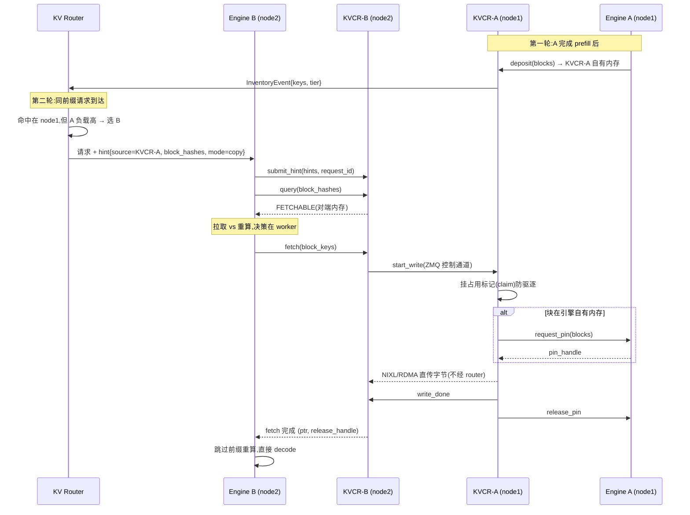

# KVCR(KV Cache Runner)— NVIDIA 分布式 KV 缓存组件

> 源码:`3rdparty/kvcr/`(NVIDIA [ai-dynamo/kvcr](https://github.com/ai-dynamo/kvcr),Apache-2.0)。纯 Python,18 个文件约 8.8k 行(2026-09-04 快照;上游迭代快,submodule 定期跟进)。2026-08-24 在 Dynamo 的设计提案 [DEP #11673](https://github.com/ai-dynamo/dynamo/issues/11673) 中公布,官方定位为早期代码,非生产就绪。本文依据 README、`docs/design_overview.md`、`PROVENANCE.md` 与源码写成。
>
> 背景:KVCR 是 KVBM 的继任者。KVBM v1 已被官方宣布停止维护(sunset),KVBM v2(kvbm-engine)合入 main 但未接生产绑定,随后开发停止。过程见 [`../dynamo/overview.md`](../dynamo/overview.md)「KVBM 变局」节。

## 定位

KVCR 是一个运行在推理引擎进程里的库,职责有两块:一是把 KV 缓存从 GPU 显存卸到更便宜的介质上(主机内存、SSD、对象存储);二是在不同节点的 KVCR 之间直接传输 KV(点对点,不经过中转)。它和其他组件的职责边界:

- GPU 显存归引擎管理,KVCR 不参与 GPU 侧的分配、驱逐与调度;
- KVCR 管理自己名下的 DRAM/SSD/对象存储池(下称 KVCR 自有内存),并执行跨节点搬运;
- 全局"哪块 KV 在哪"的信息归 router(路由层,如 Dynamo KV Router);KVCR 实例只掌握本节点的状态,跨节点查找依赖 router 随请求下发的 hint(提示信息,详见「hint 协议」节)。

数据搬运统一经 NIXL 执行(NVIDIA 的传输库,封装了 RDMA 等能力;RDMA 指网卡直接读写对端内存、不占用 CPU)。

## 出处

据 `3rdparty/kvcr/PROVENANCE.md`([GitHub 链接](https://github.com/ai-dynamo/kvcr/blob/main/PROVENANCE.md);CI 不检出 submodule,文档一律不相对链接进 `3rdparty/`):

- 核心代码抽自 NVIDIA 私有 vLLM fork 的 `vllm/v1/kv_offload/tiering/kvcc/`(6 个生产模块),2026-08-21 从内部仓 `NVIDIA-dev/kvcc` 初始化公开仓,提交历史重新起算。
- 即 KVCR 最初就是 vLLM 原生 `kv_offload` 框架的一个后端,不是 Dynamo 的组件。Dynamo KV Router 只是它对接的 router 之一(另支持 sgl-router、llmd-router)。
- vLLM 接入 PR:[vllm#53624](https://github.com/vllm-project/vllm/pull/53624)(KVCR 后端适配,截至 2026-09-03 仍 open);官方 quick-start 容器按该 PR 指定的提交构建。

## 在推理栈中的位置

(图源:`3rdparty/kvcr/docs/figures/kv-architecture-light.svg`)

以 vLLM 为例,KVCR 接在 `vllm/v1/kv_offload/tiering/` 的多层卸载框架下。该框架的模型(见 `tiering/manager.py` 头注释)是:

- **主层(primary tier)= 引擎自有的 CPU 内存**,是唯一能直接读写 GPU 显存的卸载层;
- **从层(secondary tier)**,如存储、网络类后端,不能直接读写 GPU 显存:写入时数据须经主层中转,读回时也先提升到主层再供 GPU 使用;
- KVCR 就是一个从层(PR #53624 新增 `tiering/kvcr/`)。本仓 vllm submodule 该目录已有 `example/`、`fs/`、`obj/`、`p2p/` 等后端。

SGLang 侧则作为 HiCache 的外部存储后端接入(HiCacheStorage 接口,[sglang#32903](https://github.com/sgl-project/sglang/issues/32903)),位置相当于 HiCache 的外部存储层。

## DRAM 归属:两套内存域并存

"KVCR 是否接管 DRAM"的准确回答是:**DRAM 被分成两个所有域,KVCR 只管自己那部分**。

| 内存域 | 所有者 | KVCR 的角色 |
|--------|--------|-------------|
| 引擎自有内存(GPU 显存 + 引擎自己管理的主机内存,如 vLLM kv_offload 的主层) | 引擎:分配、驱逐、调度均归引擎 | 只读使用:把引擎内存注册进自己的 NIXL 传输端点,作为跨节点传输的数据源 |
| KVCR 自有内存池(主机内存,及 SSD、对象存储) | KVCR:驻留、驱逐、分层放置由 KVCR 按策略管理 | 全部管理职责;池的物理内存可由引擎申请后交给 KVCR,或由 KVCR-Guard 持有 |

上表涉及三个机制,首次出现说明一下:**描述符**是引擎交给 KVCR 的内存句柄(地址 + 长度),KVCR 凭它访问引擎内存;**pin** 是临时锁定——传输期间防止这块内存被引擎驱逐或改作他用,传完解锁;**NIXL agent** 是 KVCR 的传输端点,负责实际的数据搬运。

依据(design_overview.md):

- "KVCR leaves local KV cache offloading to host memory under the engine's control"(README)——本机 GPU→主机内存的卸载路径由引擎控制;
- "Manages KVCR-owned DRAM and SSD residency"——KVCR 管理的是 KVCR 自有层的驻留;
- "A deployment may choose to use only framework-owned memory. In that case, it uses the pinning mechanism together with `deliver` and does not use `deposit`/`fetch`/`release`"——部署可以只用引擎自有内存,此时 KVCR 退化为纯搬运层;
- API 上两者分明:`deposit` 把数据从引擎内存拷入 KVCR 池;`fetch` 要求 KVCR 把块安置在 KVCR 自有内存并锁定;`deliver` 把块放进引擎提供的目的地(从哪个源拿,由 KVCR 和 router 决定)。

因此"KVCR 是 vLLM offload / HiCache 的后端"与"KVCR 管 DRAM"不矛盾:作为后端它新增的是自己名下的存储层;引擎原有的内存层仍归引擎。

## 与 KVBM 的区别

DEP #11673 指出现有方案(含 KVBM)的两种失败模式:一是 GPU 紧耦合——外部组件直接管理 GPU 侧的 KV block,既要和引擎的 kernel 调度抢资源,又要持续和引擎同步状态;二是过于简单——内存压力下被动驱逐,无准入过滤与跨节点协调。KVBM 两条都符合:v1 管理 GPU 显存层(KVBM 称 G1)的布局与搬运,并自带 CUDA kernel;跨实例方案(#4887/#5243,自建全局注册中心)均未合并。KVCR 按相反的边界重做:

| 维度 | KVBM(v1) | KVCR |
|------|----------|------|
| 归属/语言 | Dynamo 子组件,Rust | 独立仓,框架无关,Python(依赖 msgspec/pyzmq/nixl) |
| GPU 显存 | 管理 G1 布局注册与搬运,自带 CUDA kernel 做布局变换 | 不参与 GPU 管理;引擎提供指针,KVCR 经 NIXL 代为搬运 |
| 全局视图 | 曾尝试自建全局注册中心(未合并)/ NATS 消息事件流 | 不自建,复用 router 的全局位置表;KVCR 只知本地 |
| 跨机共享 | v1 无(仅本机内存/SSD 层);v2 有协议未接生产 | 主要能力:hint 驱动、目的地发起、NIXL 点对点直传(远端内存→本地内存,或直接写入 GPU) |
| 接入方式 | 自定义接入插件(connector)+ CUDA kernel | 走引擎原生的卸载接口(vLLM kv_offload / SGLang HiCache);布局标准化由框架负责 |
| 弹性 | 引擎退出则缓存失效 | KVCR-Guard 旁挂进程持有内存池,引擎故障后缓存仍可供远端读取,重启后交接恢复(见「组件角色」) |
| 策略 | 固定 | 可插拔策略(准入/驱逐/放置/恢复),默认 LRU(最近最少使用优先驱逐) |
| 状态 | 已停止维护(2026-07-16 官方宣布;2026-08-27 [dynamo#12993](https://github.com/ai-dynamo/dynamo/pull/12993) 将其从 offload 推荐后端撤下) | 早期开发,最小可行版本(MVP)目标 2026 年 9 月中 |

重做的理由(DEP #11673 及讨论):

1. GPU 管理归引擎:引擎已持有全部调度上下文(调度状态、活跃请求、decode 步数),外部实体要获得同等上下文只能持续同步,协调工作必然落到请求的实时处理路径上。KVCR 遵守的不变量是 GPU 内存所有权与调度归引擎,谁物理发起搬运不重要。
2. 框架原生 offload 已成熟:vLLM kv_offload 输出的已是标准布局(canonical form),SGLang 类似;KVBM 自带布局变换 kernel 的必要性消失。因此框架负责布局,KVCR 只做数据搬运。
3. 全局视图不重复建设:router 为路由本就追踪 KV 位置,自建注册中心与之重复。router 持全局位置表(按 `BlockKey` 组织,尽量小),KVCR 实例不维护其他节点的库存。同节点与跨节点复用走同一套"router 指明来源"的模型:同节点时 NIXL 自动选本机传输方式,所有权与协调流程不变。
4. 拉取与重算的取舍下放给 worker:router 只发 hint,是否拉取由目的地按自身负载决定;集中式成本决策难以做好。

## KVBM v2 为什么也被放弃

没有单独的官方废弃声明;公开记录显示的过程是:

1. v2(kvbm-engine)2026-04-08 经 [#6773](https://github.com/ai-dynamo/dynamo/pull/6773) 合入 main,但只合入库代码;生产环境用的引擎接入插件(connector)仍是 v1 的,v2 只有模拟引擎(mocker)在用。
2. v2 的生产接线在功能分支上进行(`ryan/kvbm-engine-service`,含 `lib/kvbm-connector/CONTRACT.md` 契约与分阶段实现),2026-06 仍在活跃开发——Intel 同期还在做 v2 的 XPU(Intel GPU)适配([#9313](https://github.com/ai-dynamo/dynamo/issues/9313)、[#7946](https://github.com/ai-dynamo/dynamo/pull/7946)、[#10520](https://github.com/ai-dynamo/dynamo/pull/10520)),6 月 10 日已有 XPU 端到端用例跑在该分支上。
3. 2026-07-14 DEP #11673 提出 KV Cache Controller,边界与 v2 不同;07-16 官方宣布架构转向与 v1 停止维护。此后 v2 接线分支停止更新(`ryan/kvbm-engine-service` 最后提交 2026-06-05;`ryan/kvbm-bindings` 已删除),XPU 适配 PR 搁浅。
4. 2026-08-24 KVCR 公开,v2 的 Rust 包(kvbm-engine/logical/physical 等)仍留在 main,但不再有接线计划。

从技术上看,v2 与 v1 共享同一类耦合,KVCR 针对的问题在 v2 上同样存在:

- v2 仍管理 GPU 侧布局(`LogicalLayoutHandle::G1`、`g1_handle`),仍带自定义 CUDA kernel(`kvbm-kernels`,含 FP8 数据重排等),仍需要自定义接入插件——`CONTRACT.md` 及其后续修复提交(版本守卫、跨生命周期竞态、对端故障清理)显示这条集成路径的复杂度在持续增长;
- v2 是 Dynamo 自有、Rust 实现的组件;KVCR 是框架无关的 Python 库,hint 协议在 TRT-LLM/vLLM/SGLang 三个社区同时推进 RFC(征求意见稿),生态对齐发生在 hint 协议上,不在 KVBM 上;
- v2 的分布式协调(session/hub)是自建的全局视图,与 router 重复。

即:v2 的生产化尚未完成时方向已变,NVIDIA 把剩余投入放到了新边界上,而不是继续完成 v2 接线。

## 架构

(图源:`3rdparty/kvcr/docs/figures/kv-architecture-detailed-light.svg`)

### 组件角色

**Framework/Engine(推理引擎,如 vLLM)**

- GPU 显存的唯一所有者,GPU 侧的分配、驱逐、调度都归它。
- 决定哪些 KV block 进入或离开自己的内存,以及何时进出。
- 通过内存描述符(和可选的 pin 接口)把自己的 GPU/主机内存暴露给 KVCR,KVCR 据此代为搬运这些数据。
- 把自己内存中有哪些 block 上报给 router。

**KV Router**

- 汇总所有引擎和 KVCR 实例的上报,维护一份全局的 `BlockKey → 位置` 表(最终一致——允许短暂不一致、事后收敛;每条带层级标签)。
- 路由请求时综合考虑前缀命中情况和节点负载。
- 命中的 KV 在其他节点时,向目的地 KVCR 发 hint(内含源节点地址)。

**KVCR(引擎进程内的库)**

- 管理自己名下的 DRAM/SSD 和可选的对象存储:哪些 block 驻留、驱逐哪些、放在哪层。
- 向 router 上报自己这一层的库存。
- 所有数据搬运经 NIXL 执行;准入、驱逐、放置策略可替换(内建 LRU)。
- 响应引擎的"这些 block 是否在"查询;所有操作异步,不阻塞引擎的推理热路径。

**KVCR-Guard(可选的旁挂进程)**

- 作用:让 KVCR 的内存池在引擎进程崩溃后仍然存活。引擎自有内存不在保障范围内。
- 开启弹性后,内存池由 Guard 进程持有,而不是由引擎进程内的 KVCR 持有。KVCR 通过本机 unix socket 向 Guard 注册(attach),之后直接映射同一块共享内存读写,正常读写没有进程间通信开销。
- Guard 内还运行一个 backup KVCR(带自己的 NIXL 传输端点)。引擎崩溃时,Guard 先对旧 KVCR 做 fencing——即隔离失效者、确保它不会再写这块池——然后由 backup KVCR 接管池,其他节点仍可读取其中已提交的 KV。
- 引擎重启后,新的 KVCR 重新 attach,恢复全部已提交状态,再通过一次同样的 fencing 交接把池的所有权拿回来。

**kvcr_service(内存服务常驻进程)**

- Guard 的内存供应方,负责池的生命周期。
- 启动时预分配 `--guard-count` 份连续内存,每份对应一个 Guard;每份内部可含多个池(如 `--pool-sizes-gb 48,16` 表示 48 GiB + 16 GiB 两个池),外加固定 100 MiB 的恢复日志(journal,记录元数据变更,供崩溃后恢复)。
- worker 按 Guard 索引认领。[kvcr#17](https://github.com/ai-dynamo/kvcr/pull/17) 起认领协议从按池改为按 Guard,为一个 Guard 管多个池做准备;当前实现仍把一份内的多个池合并成一个数据区暴露。

### 数据面:hint 驱动的点对点传输

(图源:`3rdparty/kvcr/docs/figures/kvcr-masthead.jpg`;引擎经控制面 API 调用进程内 KVCR,KVCR 数据面经 NIXL/RDMA 与对端 KVCR 直传)

- hint 协议的格式与标准化状态见下节「hint 协议」。
- KVCR 之间的传输由目的地发起;router 不在数据路径上。两端之间的控制通道(用 ZMQ 消息库)只传连接信息、确认和传输控制信令,KV 字节本身经 NIXL 直接传输。
- NIXL 后端可按路径配置([kvcr#16](https://github.com/ai-dynamo/kvcr/pull/16)):`local_dram_backend`(本机内存传输)与 `remote_fw_dram_backend`(对端内存传输)分开指定。
- 引擎用 `query` 查询块是否可用,返回四种状态:`HIT`(本地已有,带所在层)/ `FETCHING`(正在拉取中)/ `FETCHABLE`(本地没有,但 router hint 指明了远端来源)/ `MISS`(没有)。`query` 只读本地状态,不问 router;`FETCHABLE` 的块最终能不能读到,要等传输和 pin 都成功才确定。

跨机共享的完整时序(目的地侧 `hint/query → fetch/deliver → start_write → write_done`,源侧 `start_write → claim/pin → write → write_done`,见 `src/kvcr/remote_fw_dram.py` 头注释):

### hint 协议

hint 是 router 把全局 KV 知识按请求捎给数据面的元数据约定。存在理由:KVCR 实例不维护其他节点的库存,全局视图只在 router;而数据搬运由 KVCR 之间点对点完成,router 不在数据路径上——hint 补上了这两者之间的接缝。

当前快照(pin `9cd4e08`)的传输格式(`src/kvcr/hint_parser.py`):挂在请求元数据的 `router_hint` 键下,JSON 对象,4 个字段。

| 字段 | 含义 |
|------|------|
| `source_control_endpoint` | 源 KVCR 的控制通道地址;为空表示用本地存储或查对象存储 |
| `block_hashes` | 前缀块的 u64 哈希列表(即 `BlockKey` 集合),必填非空 |
| `mode` | `copy`(默认,保留源副本)/ `move`(传输成功后源可驱逐) |
| `no_retain` | 建议目的地用完不留副本(一次性共享场景) |

语义要点:

- **是提示不是命令**:目的地引擎自行决定用不用(`query` 返回 `FETCHABLE` 后,按自身负载决定 `fetch` 还是重算);router 也可按自己的成本模型选择不发。
- **请求级生命周期**:`submit_hint(hints, request_id)` 注册,`discard_hint` 丢弃;源地址信息只活在请求作用域内,不进入任何全局状态——KVCR 侧因此永远不需要维护其他节点的库存。
- **可扩展**:解析器注释说明"其他字段待 KVCR 消费时再加"——先把外层格式定下来,字段逐步增加。

**标准化状态(2026-09-04 核实):未达成一致,是 NVIDIA 单方推动的早期提案。** Dynamo 团队在同一周(08-12 ~ 08-24)向四个社区同时发出 RFC,目前无一被接受:

| RFC | 状态 |
|-----|------|
| [dynamo#13134](https://github.com/ai-dynamo/dynamo/pull/13134) typed KV hint contract | open;review 中格式大改——从扁平的 4 字段 JSON 改为带版本号的信封格式(外层 `protocol_version`,内部每个动作带 `action_type`/`action_version`) |
| [vllm#53421](https://github.com/vllm-project/vllm/issues/53421) KV Hint Envelope | open,零评论 |
| [sglang#36224](https://github.com/sgl-project/sglang/issues/36224) KV Hint Envelope | open,零评论 |
| [TRT-LLM#18151](https://github.com/NVIDIA/TensorRT-LLM/issues/18151) router hint P2P | open,零评论 |
| [kvcr#18](https://github.com/ai-dynamo/kvcr/pull/18) 解析器适配新版信封格式(取第一个 `kv.fetch` 取数动作) | open,与 dynamo#13134 需同步合并;版本不匹配只告警不拒绝 |

即:外部社区尚无响应,格式本身还在演化(扁平 → 带版本的信封),短期内以 Dynamo/KVCR 自家实现为准,对接其他引擎前需重新核对当时格式。

### 状态模型

这一节回答一个问题:KVCR 怎么知道每个 block"在哪里、能不能用、能不能删"。

KVCR 为本节点的所有 block 维护一张索引表(`block_index`,`src/kvcr/core.py`)。键是 block 的哈希(`BlockKey`);值是这个块的档案(`BlockRecord`),内容包括:它当前在哪些地方(引擎内存 / 本地内存 / SSD,可同时存在于多处)、有没有正在对它执行的操作、访问统计。这张表只记本节点的信息,集群再大它也不变大。

每个块的信息分两类:

- **位置**:块在哪里、是否就绪(还在写入中的不算就绪);
- **使用情况**:此刻有没有操作正在用它(例如正在传给另一个节点)。

分开记录,是为了安全地回答"这个块现在能不能驱逐"。规则是**正在使用的块不能驱逐**,实现手段是占用标记(claim):任何操作要用一个块,先在它上面挂一个标记,用完摘掉。只有"已就绪且没有标记"的块才进入驱逐候选队列,谁先被驱逐由策略(默认 LRU)打分决定。

### 异步执行

这一节回答的问题是:KVCR 跑在引擎进程里,怎么保证搬数据时不会卡住引擎的推理。

做法是两条线程分工:

- **event loop 线程**:负责全部元数据工作——查索引表、改状态、算驱逐顺序。它从不执行任何会阻塞等待的调用。
- **progress 线程**:持有 NIXL 传输端点,负责提交传输、轮询进度;传输完成后把结果回报给 event loop 线程,由后者更新状态。

每个操作都带超时时间。超时或被取消时,先立即向调用方上报失败,再在后台清理现场——调用方不用等清理完成。

清理现场有一条安全规则:从引擎借用的内存(pin)用完后尽快归还;但如果 NIXL 仍可能在读写某块内存,这块内存的物理释放要推迟到传输完全停止之后——否则会出现"内存已经还给引擎、网卡还在往里写"的错误。

### API 表面

- 引擎 → KVCR:`deposit`(把块写入 KVCR 池,可标记 `no_evict` 禁止驱逐)/ `query`(查询块是否可用)/ `fetch`(把块安置到 KVCR 内存并锁定)/ `deliver`(把块写进引擎提供的目的地)/ `release`(释放)/ `poll_completed`(轮询完成情况)/ `abort`(中止)/ `close`(关闭)。
- KVCR → 引擎:`capacity_needed`(容量不足时向引擎发出的减压信号)/ `request_pin`(请求锁定引擎内存)/ `poll_pin_results` / `cancel_pin_request` / `release_pin`(解除锁定)。
- Router ↔ KVCR:KVCR 上报 `InventoryEvent{keys, tier, removed}`(库存变更,只报受影响的 key);router 下发 `submit_hint` / `discard_hint`。
- 策略:`decide_ingest` / `eviction_score` / `decide_eviction` / `on_ingest` / `on_remove` / `decide_recovery`,详见下节;放置动作四选一:KEEP(保留)/ DROP(丢弃)/ COPY_TO(复制到某层)/ MOVE_TO(移动到某层)。`no_evict` 是硬约束,`no_retain` 是建议,冲突时 `no_evict` 优先。

### 可插拔 policy

KVCR 把"收不收、放哪层、驱逐谁、驱逐时怎么处置"全部抽象成策略接口(`src/kvcr/policy.py::KVCachePolicy`),部署方可整体替换;机制(怎么搬数据)不变,策略(收放谁)可换。六个钩子的调用时机:

| 钩子 | 何时被调 | 能决定什么 |
|------|----------|-----------|
| `decide_ingest(meta, source, required_local, router_hints, framework_hints)` | 一个块要写入 KVCR 池之前 | 收不收(KEEP/DROP)、放哪层;**入参带 router hint 和引擎 hint**,可按来源做准入过滤 |
| `eviction_score(meta, source) → float` | 块进入驱逐候选队列时 | 冷热打分,分数低的先被驱逐——LRU(最近最少使用)、LFU(使用频率最低)或自定义热度都插在这里 |
| `decide_eviction(meta, source)` | 某个块被选中驱逐之后 | 怎么处置:DROP(直接丢)或 MOVE_TO(降到下层,如内存→SSD) |
| `on_ingest` / `on_remove` | 块首次入池 / 最后一份被移除后 | 观察事件,供有状态的策略维护自己的统计(如频率计数) |
| `decide_recovery(meta, failure)` | 策略要求的放置失败时 | 补救动作(当前只支持 DROP) |

内建四个策略(`policy.py`):`FIFOPolicy`(收了就不丢,按先进先出驱逐)、`LRUPolicy`(按最近使用打分)、`G3FIFOPolicy` / `G3LRUPolicy`(驱逐时不直接丢,改为移动到 SSD 层)。

**对照"按冷热 tier up / tier down"的完整形态,KVCR 目前实现到哪一步(2026-09-04 快照):**

- **冷热判定**:已有,即 `eviction_score` 钩子;
- **tier down(降层)**:已有。驱逐时经 `decide_eviction → MOVE_TO G3` 把块从内存移到 SSD 而不是丢弃,内建 G3 策略就是这个行为;
- **tier up(从下往上提升/预取)**:只有被动路径——引擎 `fetch` 发现块不在本地时,KVCR 才把块从 SSD 或远端拉进内存(即读 miss 回填:要用的时候不在,才临时拉上来)。**主动预取(按热度或 hint 提前把块从下层/远端搬到上层)尚未实现**,证据有三:入池时的 COPY_TO/MOVE_TO 放置还没接线(`policy_runtime.py` 中 `TODO(kvcr-g3): Wire ingest-time COPY_TO and MOVE_TO placement`);`submit_hint` 只建立对端连接、不启动数据搬运,设计文档注明"proactive fetching, staging, or pinning may be added later";router hint 的主动 copy/move(用于缓存再平衡)也标注为后续扩展。

## 时间线

| 时间 | 事件 |
|------|------|
| 2025-12 ~ 2026-01 | KVBM v1 的两次分布式尝试:[#4887](https://github.com/ai-dynamo/dynamo/pull/4887)(对象存储层 + 自建全局注册中心)、[#5243](https://github.com/ai-dynamo/dynamo/pull/5243)(+23k 行分布式 KVBM),均未合并 |
| 2026-04-08 | [#6773](https://github.com/ai-dynamo/dynamo/pull/6773) kvbm-engine(v2)合入 main,仅库代码,生产绑定仍 v1 |
| 2026-07-14 | [DEP #11673](https://github.com/ai-dynamo/dynamo/issues/11673)「KV Cache Controller」发布 |
| 2026-07-16 | 官方宣布 KVBM v1 停止维护;新方向为引擎原生 offload + 跨节点内存层点对点传输,最小可行版本目标 9 月中 |
| 2026-08-21 / 08-24 | KVCR 仓初始化 / 在 DEP #11673 公开 |
| 2026-08-27 | [dynamo#12993](https://github.com/ai-dynamo/dynamo/pull/12993) 文档将 KVBM 从 offload 推荐后端撤下 |
| 2026-09-03 | [kvcr#16](https://github.com/ai-dynamo/kvcr/pull/16) NIXL 后端按路径可配;[kvcr#17](https://github.com/ai-dynamo/kvcr/pull/17) Guard 多池改造(认领协议改为按 Guard 索引,不兼容变更) |
| 并行 | 生态对接(以下 RFC 截至 2026-09-04 均 open,外部社区尚无响应,详见「hint 协议」节):TRT-LLM [#18151](https://github.com/NVIDIA/TensorRT-LLM/issues/18151)(router hint 点对点传输)、vLLM [#53421](https://github.com/vllm-project/vllm/issues/53421)(hint 信封格式)与 [#53624](https://github.com/vllm-project/vllm/pull/53624)(KVCR 后端适配)、SGLang [#36224](https://github.com/sgl-project/sglang/issues/36224)(hint)与 [#32903](https://github.com/sgl-project/sglang/issues/32903)(KVCR 作 HiCache 后端)、Dynamo router [#13134](https://github.com/ai-dynamo/dynamo/pull/13134)(hint 契约) |

外部贡献者曾给 KVBM 提交点对点传输实现([#7879](https://github.com/ai-dynamo/dynamo/pull/7879),g2pb global peer offloading,draft),因官方转向 KVCR 而搁置。

## 与 lake 对照

- **全局视图归属**:KVCR 复用 router(最终一致、最小 key 集、可水平扩展);lake 的位置视图权威在存储控制面进程内存(单写者线性一致、一跳命中、etcd 降频 checkpoint)。KVCR 说明 router 持全局视图 + hint 在工程上可行;lake 的存储池是长期存续基础设施、router 无状态,权威仍归池。
- **GPU 所有权方向相反**:KVCR 是引擎拥有一切(含显存)、KVCR 服务引擎;lake 是池拥有一切(显存为 L0)、引擎无状态可随时销毁。KVCR-Guard 是在"引擎长期存活"假设上的容错补丁;lake 的假设本身是引擎随时销毁。两者服务的前提不同:KVCR 面向"引擎自有缓存"的部署形态,lake 面向存算分离。
- **hint(拉模式,决策在 worker)与位置视图推送(放置归池、调度读视图)**:KVCR 的 `submit_hint` + `query` + worker 侧成本决策,对应 lake「池放置·调度读视图」的单向耦合;差别在于 lake 的放置主动权在池(按热度预放置),KVCR 的搬运主动权在目的地 worker(router 只发 hint)。
- **分层**:KVCR 的 `CacheTier`(引擎内存 / KVCR 内存 / SSD / 对象存储 / 对端)同为介质分层,与 lake L0–L3 同构;但 KVCR 按所有权再细分(引擎自有 / KVCR 自有),lake 不区分所有权(全归池)。
- **层间迁移的主动性**:lake 设计是主动为主(按热度提升/降层 + L0 预放置)加被动兜底(读 miss 回填);KVCR 目前只有被动回填(`fetch` 读 miss)和驱逐降层(`MOVE_TO G3`),主动提升/预取是设计意图但尚未实现(见「可插拔 policy」节)。lake 的"池主动预放置"在 KVCR 体系里没有对应物——它的"主动"最多到 router hint 驱动的目的地拉取。
- **可借鉴的机制**:pin/claim(传输中防驱逐与共享获取的取消安全)、操作超时(安全释放可超超时时间、调度响应不可)、策略接口形态(`decide_ingest` / `eviction_score` / COPY_TO / MOVE_TO)、`no_retain` 建议性 hint、Guard 的 fencing 交接与共享内存直访(对应 lake F4 恢复与 L2 恢复点)。

## 代码索引

> 沿代码回溯用。符号名锚定,行号会漂移——找不到时 `grep -n "符号名" 3rdparty/kvcr/<文件路径>`。

| 机制 | 文件:符号 |
|------|-----------|
| 对引擎的公开 API | `src/kvcr/api.py`::`KVCR` / `KVCRBindings`(pin 回调、inventory_sink、capacity_needed) |
| 核心状态(block 索引表) | `src/kvcr/core.py`::`_KVCRCore` / `_BlockRecord`(`fw_mem`/`local_dram`/`g3`/`in_flight_ops`) |
| KVCR 自有内存层 | `src/kvcr/local_dram.py` |
| SSD 层 | `src/kvcr/local_disk.py` |
| 对端内存的点对点传输(跨机共享) | `src/kvcr/remote_fw_dram.py`(全仓最大,1.6k 行;目的地侧: hint/query→fetch/deliver→start_write→write_done) |
| NIXL progress 线程 | `src/kvcr/progress.py`::`_KVCRProgress` / `_Op` |
| 对端控制通道(ZMQ) | `src/kvcr/control_channels.py` |
| router hint 协议解析 | `src/kvcr/hint_parser.py`::`ROUTER_HINT_KEY` / `_parse_kv_hint` |
| 策略接口与运行时 | `src/kvcr/policy.py`::`KVCachePolicy`(内建 `FIFOPolicy`/`LRUPolicy`/`G3FIFOPolicy`/`G3LRUPolicy`);`src/kvcr/policy_runtime.py`::`_PolicyInvoker`(决策校验与白名单) |
| Guard(旁挂进程/接管/恢复) | `src/kvcr/guard.py` / `guard_protocol.py` / `recovery_journal.py` / `memory.py`(共享内存池)/ `kvcr_service.py`(内存服务常驻进程) |
| 设计文档 | `docs/design_overview.md`(Goals/Architecture/四个 API 面) |
