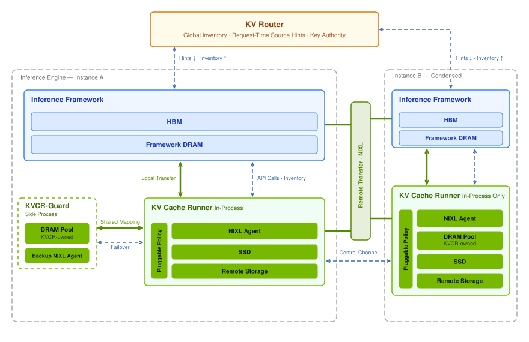
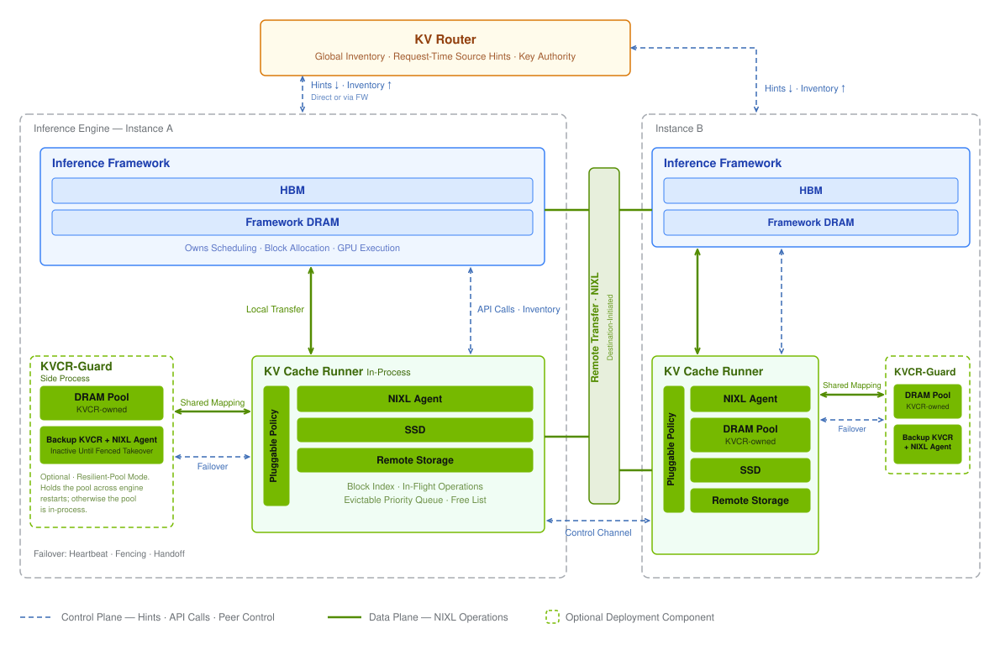
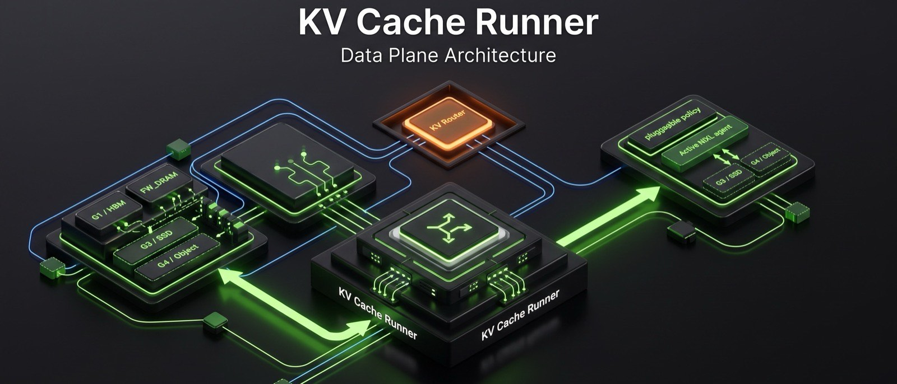

# KVCR(KV Cache Runner)— NVIDIA 分布式 KV 缓存组件

> 源码:`3rdparty/kvcr/`(NVIDIA [ai-dynamo/kvcr](https://github.com/ai-dynamo/kvcr),Apache-2.0)。纯 Python,18 个文件约 8.7k 行。2026-08-24 在 [Dynamo DEP #11673](https://github.com/ai-dynamo/dynamo/issues/11673) 公布,官方定位为早期代码,非生产就绪。本文依据 README、`docs/design_overview.md`、`PROVENANCE.md` 与源码写成。
>
> 背景:KVCR 是 KVBM 的继任者。KVBM v1 已被官方宣布 sunset,KVBM v2(kvbm-engine)合入 main 但未接生产绑定,随后开发停止。过程见 [`../dynamo/overview.md`](../dynamo/overview.md)「KVBM 变局」节。

## 定位

KVCR 是引擎进程内的 KV 缓存二级存储库,同时承担跨节点 P2P 数据面。其职责边界:

- GPU 显存归引擎管理,KVCR 不参与 GPU 侧的分配、驱逐与调度;
- KVCR 管理自己名下的 DRAM/SSD/对象存储池(下称 KVCR 自有内存),并执行跨节点搬运;
- 全局"哪块 KV 在哪"的信息归 router,KVCR 实例只掌握本地状态,跨节点查找依赖 router 下发的请求级 hint。

## 出处

据 `3rdparty/kvcr/PROVENANCE.md`([GitHub 链接](https://github.com/ai-dynamo/kvcr/blob/main/PROVENANCE.md);CI 不检出 submodule,文档一律不相对链接进 `3rdparty/`):

- 核心代码抽自 NVIDIA 私有 vLLM fork 的 `vllm/v1/kv_offload/tiering/kvcc/`(6 个生产模块),2026-08-21 从内部仓 `NVIDIA-dev/kvcc` 初始化公开仓,历史重起。
- 即 KVCR 最初就是 vLLM 原生 `kv_offload` 框架的一个 tiering 后端,不是 Dynamo 的组件。Dynamo KV Router 只是其对接的 router 之一(另支持 sgl-router、llmd-router)。
- vLLM 接入 PR:[vllm#53624](https://github.com/vllm-project/vllm/pull/53624)(KVCR secondary-tier adapter,截至 2026-09-03 仍 open);quick-start 容器以该 PR 的 pin commit 构建。

## 在推理栈中的位置

(图源:`3rdparty/kvcr/docs/figures/kv-architecture-light.svg`)

以 vLLM 为例,KVCR 接在 `vllm/v1/kv_offload/tiering/` 的多层卸载框架下。该框架的模型(见 `tiering/manager.py` 头注释)是:

- **primary tier = 引擎自有的 CPU DRAM**,唯一可直访 GPU 的卸载层;
- **secondary tier**(Storage/Network 等)不能直访 GPU,数据须经 primary tier 中转,读回时也先提升到 primary tier 再供 GPU 使用;
- KVCR 即一个 secondary tier(PR #53624 新增 `tiering/kvcr/`)。本仓 vllm submodule 该目录已有 `example/`、`fs/`、`obj/`、`p2p/` 等后端。

SGLang 侧则作为 HiCacheStorage 后端接入([sglang#32903](https://github.com/sgl-project/sglang/issues/32903)),位置相当于 HiCache 的外部存储层。

## DRAM 归属:两套内存域并存

"KVCR 是否接管 DRAM"的准确回答是:**DRAM 被分成两个所有域,KVCR 只管自己那部分**。

| 内存域 | 所有者 | KVCR 的角色 |
|--------|--------|-------------|
| 引擎自有内存(GPU HBM + 引擎管理的 host DRAM,如 vLLM kv_offload 的 CPU primary tier) | 引擎:分配、驱逐、调度均归引擎 | 只读使用:经描述符 + pin 接口把引擎内存注册进自己的 NIXL agent,作为传输源(例如跨节点 P2P 的源) |
| KVCR 自有 DRAM 池(及 SSD、对象存储) | KVCR:驻留、驱逐、分层放置由 KVCR 按 policy 管理 | 全部管理职责;池的物理分配可由引擎申请后交给 KVCR,或由 KVCR-Guard 持有 |

依据(design_overview.md):

- "KVCR leaves local KV cache offloading to host memory under the engine's control"(README)——本地 GPU→host 的卸载路径由引擎控制;
- "Manages KVCR-owned DRAM and SSD residency"——KVCR 管理的是 KVCR 自有层的驻留;
- "A deployment may choose to use only framework-owned memory. In that case, it uses the pinning mechanism together with `deliver` and does not use `deposit`/`fetch`/`release`"——部署可以只用引擎自有内存,KVCR 退化为纯搬运层;
- API 上两者分明:`deposit` 把数据从引擎内存拷入 KVCR 池;`fetch` 要求 KVCR 把块安置在 KVCR 自有 DRAM 并 pin 住;`deliver` 把块放进引擎提供的目的地(源选择归 KVCR + router)。

因此"KVCR 是 vLLM offload / HiCache 的后端"与"KVCR 管 DRAM"不矛盾:作为后端它新增的是自己名下的存储层;引擎原有的 DRAM 层仍归引擎。

## 与 KVBM 的区别

DEP #11673 指出现有方案(含 KVBM)的两种失败模式:一是 GPU 紧耦合——外部组件管理 GPU 侧 KV block,占用 kernel launch 带宽且需与引擎持续同步;二是过于简单——内存压力下被动驱逐,无准入过滤与跨节点协调。KVBM 两条都符合:v1 管理 G1 布局与搬运并带自定义 CUDA kernel;跨实例方案(#4887/#5243,自建 ZMQ registry hub)均未合并。KVCR 按相反的边界重做:

| 维度 | KVBM(v1) | KVCR |
|------|----------|------|
| 归属/语言 | Dynamo 子组件,Rust | 独立仓,框架无关,Python(依赖 msgspec/pyzmq/nixl) |
| GPU 显存 | 管理 G1 layout 注册与搬运,自定义 kernel 做 reshape | 不参与 GPU 管理;引擎提供指针,KVCR 经 NIXL 代做 DMA |
| 全局视图 | 曾自建 registry hub(未合并)/ NATS 事件流 | 不自建,复用 router 的最终一致 inventory;KVCR 只知本地 |
| 跨机共享 | v1 无(仅本机 G2/G3);v2 有协议未接生产 | 主要能力:hint 驱动、目的地发起、NIXL P2P(远端 DRAM→本地 DRAM 或直灌 GPU) |
| 接入方式 | 自定义 connector + kernel | 引擎原生 kv_offload / HiCache 后端;框架负责 canonical 布局 |
| 弹性 | 引擎退出则缓存失效 | KVCR-Guard sidecar 持有内存池,引擎故障后缓存仍可供远端读取,重启后 fenced handoff 恢复 |
| 策略 | 固定 | 可插拔 policy(准入/驱逐/放置/恢复),默认 LRU |
| 状态 | sunset(2026-07-16 官方宣布;2026-08-27 [dynamo#12993](https://github.com/ai-dynamo/dynamo/pull/12993) 将其从 offload 推荐后端撤下) | 早期开发,MVP 目标 2026-09 月中 |

重做的理由(DEP #11673 及讨论):

1. GPU 管理归引擎:引擎已持有全部调度上下文(调度状态、活跃请求、decode 步数),外部实体要获得同等上下文只能持续同步,协调必然落到热路径。KVCR 遵守的不变量是 GPU 内存所有权与调度归引擎,谁物理发起 DMA 不重要。
2. 框架原生 offload 已成熟:vLLM kv_offload 输出 canonical 布局,SGLang 类似;KVBM 自定义 reshape kernel 的必要性消失。因此框架负责布局,KVCR 只做数据搬运。
3. 全局视图不重复建设:router 为路由本就追踪 KV 位置;registry hub 与之重复。router 持全局 inventory(按 `BlockKey`,尽量小),KVCR 实例不维护 peer 库存。同节点与跨节点复用使用同一 source 模型,共置只改变传输方式,不改变所有权与协调模型。
4. 拉取与重算的取舍下放给 worker:router 只发 hint,是否拉取由目的地按自身负载决定;集中式成本决策难以做好。

## KVBM v2 为什么也被放弃

没有单独的官方废弃声明;公开记录显示的过程是:

1. v2(kvbm-engine)2026-04-08 经 [#6773](https://github.com/ai-dynamo/dynamo/pull/6773) 合入 main,但只合入库代码;生产绑定(vLLM/TRT-LLM connector)仍在 v1 上,v2 仅 mocker 使用。
2. v2 的生产接线在功能分支上进行(`ryan/kvbm-engine-service`,含 `lib/kvbm-connector/CONTRACT.md` 契约与分阶段实现),2026-06 仍在活跃开发——Intel 同期还在做 v2 的 XPU 适配([#9313](https://github.com/ai-dynamo/dynamo/issues/9313)、[#7946](https://github.com/ai-dynamo/dynamo/pull/7946)、[#10520](https://github.com/ai-dynamo/dynamo/pull/10520)),6 月 10 日已有 XPU 端到端用例跑在该分支上。
3. 2026-07-14 DEP #11673 提出 KV Cache Controller,边界与 v2 不同;07-16 官方宣布架构转向与 v1 sunset。此后 v2 接线分支停止更新(`ryan/kvbm-engine-service` 最后提交 2026-06-05;`ryan/kvbm-bindings` 已删除),XPU 适配 PR 搁浅。
4. 2026-08-24 KVCR 公开,v2 的 crate(kvbm-engine/logical/physical 等)仍留在 main,但不再有接线计划。

从技术上看,v2 与 v1 共享同一类耦合,KVCR 针对的问题在 v2 上同样存在:

- v2 仍管理 GPU 侧布局(`LogicalLayoutHandle::G1`、`g1_handle`),仍带自定义 CUDA kernel(`kvbm-kernels`,含 FP8 permute 等),仍需要自定义 connector——`CONTRACT.md` 及其分阶段硬化提交(epoch guard、跨生命周期竞态、peer 故障清理)显示这条集成路径的复杂度在持续增长;
- v2 是 Dynamo 自有、Rust 实现的组件;KVCR 是框架无关的 Python 库,hint 协议在 TRT-LLM/vLLM/SGLang 三个社区同时推进 RFC,生态对齐发生在 hint 协议上,不在 KVBM 上;
- v2 的分布式协调(session/hub)是自建的全局视图,与 router 重复。

即:v2 的生产化尚未完成时方向已变,NVIDIA 把剩余投入放到了新边界上,而不是继续完成 v2 接线。

## 架构

(图源:`3rdparty/kvcr/docs/figures/kv-architecture-detailed-light.svg`)

### 组件角色

- **Framework/Engine**:GPU 内存唯一所有者;决定哪些 block 进出自有内存;经描述符与可选 pin 接口把自有 GPU/host 内存暴露给 KVCR;向 router 上报自有内存。
- **KV Router**:维护各 engine/KVCR 实例上报的最终一致全局 `BlockKey` inventory(带 tier 标签);按 overlap 与负载做缓存感知路由;向目的地 KVCR 发 hint(跨机检索时含源节点与 peer control endpoint)。
- **KVCR**:引擎进程内库;管理 KVCR 自有 DRAM/SSD 驻留与配置的对象存储;上报 KVCR 层 inventory;经 NIXL 执行数据移动;执行内建或用户策略;响应引擎的可用性查询;不阻塞引擎热路径。
- **KVCR-Guard(可选 sidecar)**:弹性开启时持有 KVCR 的 DRAM 池;提供一个 socket 端点供 active KVCR attach 并恢复已提交状态;attach 后经共享内存直访池,正常操作无 IPC 往返;宿主 backup KVCR(自带 NIXL agent),fencing 失效 owner 后可服务已提交的 KV;引擎重启后热启动并交还所有权。不覆盖引擎自有内存。

### 数据面:hint 驱动的 P2P

(图源:`3rdparty/kvcr/docs/figures/kvcr-masthead.jpg`;Framework 经控制面 API 调用进程内 KVCR,KVCR 数据面经 NIXL/RDMA 与 peer KVCR 直传)

- hint 协议(JSON,`src/kvcr/hint_parser.py`):`source_control_endpoint`、`block_hashes`(u64 列表)、`mode`(`copy` 保留源 / `move` 成功后源可驱逐)、`no_retain`(建议目的地不留副本)。超时或取消保留源副本。
- KVCR 间传输由目的地发起;router 不在数据路径上;peer 控制通道(ZMQ)只传连接元数据、确认与传输控制,字节经 NIXL 直传。
- `query` 返回 `HIT(tier)` / `FETCHING(tier)` / `FETCHABLE(source_tier)` / `MISS`,只读本地状态,不查 router;远端源信息仅经 `submit_hint` 到达。`FETCHABLE`(peer DRAM) 的实际可读性在传输与 pin 成功后才确认。

### 状态模型

中心结构为 `block_index: BlockKey → BlockRecord`(`src/kvcr/core.py`)。`BlockRecord` 记录该块的全部已知位置(`fw_mem` / `local_dram` / `g3`)、`in_flight_ops` 与访问统计;只含本地状态,不随集群规模增长。驻留状态与操作状态分离;claim 挂在具体驻留上防止使用中被驱逐;就绪且无 claim 的驻留进入 policy 打分的驱逐队列。

### 异步执行

event loop 负责全部元数据变更,不执行阻塞调用;独立的 progress 线程持有 NIXL agent,提交并轮询传输,完成后回投 event loop。每个操作有 deadline;超时或取消立即上报并开始安全释放;framework pin 在依赖工作完成后尽快释放;若 NIXL 仍可能访问相关描述符,物理释放等待传输静止。

### API 表面

- Framework→KVCR:`deposit`(写入 KVCR 池,可 `no_evict`)/ `query` / `fetch`(安置于 KVCR DRAM 并 pin)/ `deliver`(写入引擎提供的目的地)/ `release` / `poll_completed` / `abort` / `close`。
- KVCR→Framework:`capacity_needed`(容量背压)/ `request_pin` / `poll_pin_results` / `cancel_pin_request` / `release_pin`。
- Router↔KVCR:`InventoryEvent{keys, tier, removed}` 上报(只报受影响的 key);`submit_hint` / `discard_hint` 下发。
- Policy:`decide_ingest` / `eviction_score` / `decide_eviction` / `on_ingest` / `on_remove` / `decide_recovery`;`PlacementAction` = KEEP/DROP/COPY_TO/MOVE_TO;默认 LRU。`no_evict` claim 为硬约束,`no_retain` 为建议,冲突时 `no_evict` 优先。

## 时间线

| 时间 | 事件 |
|------|------|
| 2025-12 ~ 2026-01 | KVBM v1 的两次分布式尝试:[#4887](https://github.com/ai-dynamo/dynamo/pull/4887)(G4 对象存储 + registry hub)、[#5243](https://github.com/ai-dynamo/dynamo/pull/5243)(+23k 行分布式 KVBM),均未合并 |
| 2026-04-08 | [#6773](https://github.com/ai-dynamo/dynamo/pull/6773) kvbm-engine(v2)合入 main,仅库代码,生产绑定仍 v1 |
| 2026-07-14 | [DEP #11673](https://github.com/ai-dynamo/dynamo/issues/11673)「KV Cache Controller」发布 |
| 2026-07-16 | 官方宣布 KVBM v1 sunset;新方向为引擎原生 offload + 跨节点 CPU 层 P2P,MVP 目标 9 月中 |
| 2026-08-21 / 08-24 | KVCR 仓初始化 / 在 DEP #11673 公开 |
| 2026-08-27 | [dynamo#12993](https://github.com/ai-dynamo/dynamo/pull/12993) 文档将 KVBM 从 offload 推荐后端撤下 |
| 并行 | 生态对接:TRT-LLM [#18151](https://github.com/NVIDIA/TensorRT-LLM/issues/18151)(router hint P2P)、vLLM [#53421](https://github.com/vllm-project/vllm/issues/53421)(hint envelope)与 [#53624](https://github.com/vllm-project/vllm/pull/53624)(KVCR adapter)、SGLang [#36224](https://github.com/sgl-project/sglang/issues/36224)(hint)与 [#32903](https://github.com/sgl-project/sglang/issues/32903)(KVCR 作 HiCache 后端)、Dynamo router [#13134](https://github.com/ai-dynamo/dynamo/pull/13134)(typed KV hint contract) |

外部贡献者曾给 KVBM 提交 P2P 实现([#7879](https://github.com/ai-dynamo/dynamo/pull/7879),g2pb global peer offloading,draft),因官方转向 KVCR 而搁置。

## 与 lake 对照

- **全局视图归属**:KVCR 复用 router(最终一致、最小 key 集、可水平扩展);lake 的位置视图权威在存储控制面进程内存(单写者线性一致、一跳命中、etcd 降频 checkpoint)。KVCR 说明 router 持全局视图 + hint 在工程上可行;lake 的存储池是长期存续基础设施、router 无状态,权威仍归池。
- **GPU 所有权方向相反**:KVCR 是引擎拥有一切(含 HBM)、KVCR 服务引擎;lake 是池拥有一切(HBM 为 L0)、引擎无状态可随时销毁。KVCR-Guard 是在"引擎长期存活"假设上的容错补丁;lake 的假设本身是引擎随时销毁。两者服务的前提不同:KVCR 面向"引擎自有缓存"的部署形态,lake 面向存算分离。
- **hint(拉模式,决策在 worker)与位置视图推送(放置归池、调度读视图)**:KVCR 的 `submit_hint` + `query` + worker 侧成本决策,对应 lake「池放置·调度读视图」的单向耦合;差别在于 lake 的放置主动权在池(按热度预放置),KVCR 的搬运主动权在目的地 worker(router 只发 hint)。
- **分层**:KVCR 的 `CacheTier`(framework mem / KVCR DRAM / SSD / object / peer)同为介质分层,与 lake L0–L3 同构;但 KVCR 按所有权再细分(framework-owned / KVCR-owned),lake 不区分所有权(全归池)。
- **可借鉴的机制**:pin/claim(传输中防驱逐与共享获取的取消安全)、操作 deadline(安全释放可超 deadline、调度不可)、policy 接口形态(`decide_ingest` / `eviction_score` / COPY_TO / MOVE_TO)、`no_retain` 建议性 hint、Guard 的 fenced handoff 与共享内存直访(对应 lake F4 恢复与 L2 恢复点)。

## 代码索引

> 沿代码回溯用。符号名锚定,行号会漂移——找不到时 `grep -n "符号名" 3rdparty/kvcr/<文件路径>`。

| 机制 | 文件:符号 |
|------|-----------|
| 公开北向 API | `src/kvcr/api.py`::`KVCR` / `KVCRBindings`(pin 回调、inventory_sink、capacity_needed) |
| 核心状态(block 索引/驻留) | `src/kvcr/core.py`::`_KVCRCore` / `_BlockRecord`(`fw_mem`/`local_dram`/`g3`/`in_flight_ops`) |
| KVCR 自有 DRAM 层 | `src/kvcr/local_dram.py` |
| G3 磁盘层 | `src/kvcr/local_disk.py` |
| P2P 远端 DRAM(跨机共享) | `src/kvcr/remote_fw_dram.py`(全仓最大,1.6k 行;target: hint/query→fetch/deliver→start_write→write_done) |
| NIXL progress 线程 | `src/kvcr/progress.py`::`_KVCRProgress` / `_Op` |
| peer 控制通道(ZMQ) | `src/kvcr/control_channels.py` |
| router hint 协议解析 | `src/kvcr/hint_parser.py`::`ROUTER_HINT_KEY` / `_parse_kv_hint` |
| 策略接口与运行时 | `src/kvcr/policy.py`::`KVCachePolicy`;`src/kvcr/policy_runtime.py` |
| Guard(sidecar/接管/热恢复) | `src/kvcr/guard.py` / `guard_protocol.py` / `recovery_journal.py` / `memory.py`(共享内存池)/ `kvcr_service.py`(独立 daemon) |
| 设计文档 | `docs/design_overview.md`(Goals/Architecture/四个 API 面) |
