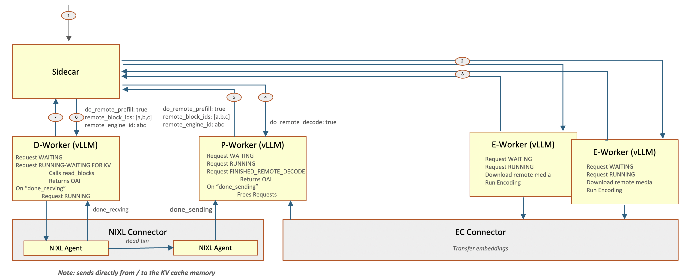

# llm-d Router — 架构深潜

> [overview.md](overview.md) · [pain-points.md](pain-points.md)。调研快照:`3rdparty/llm-d-router` @ `abb404ef`(2026-09-08)。  
> §1 请求路径 → §2 块索引 → §3 事件管线 → §4 推测索引 → §5 插件体系 → §6 PD 编排 → §7 多副本与 HA。每节末尾有小结。

## 1. 请求路径:ext-proc 回调里的完整选路

EPP 是 Envoy 的 External Processing 后端,只实现 `FULL_DUPLEX_STREAMED` 一种 body 模式。一个请求的处理顺序:

1. `StreamingServer.Process`(`pkg/epp/handlers/server.go`)收到 ext-proc 流。
2. `HandleRequestHeaders` → 解析请求体。
3. `Director.HandleRequest`(`pkg/epp/requestcontrol/director.go`)编排全流程:
   1. header 处理插件;
   2. screener(请求能不能进);
   3. **data producers**:为调度准备数据——`precise-prefix-cache-producer` 在这里把 prompt 切成块键、确保对该 pod 的事件订阅存在(`Extract` / `ensureSubscriber`);
   4. admission(准入);
   5. `Scheduler.Schedule`(`pkg/epp/scheduling/scheduler.go`)。
4. 调度内部(`SchedulerProfile`):Filter 链筛掉不合格 pod → 各 **Scorer** 打分,`enforceScoreRange(score) × Weight` 后**累加** → Picker(默认 max-score)定终点。
5. 决策写回 ext-proc 响应:目标 endpoint;若走 PD,同时写 `x-prefiller-host-port` / `x-encoder-hosts-ports` 等头。
6. Envoy 转发到 decode pod;pod 上的 sidecar 按头执行多阶段编排(§6)。

**小结**:EPP 把"选路"做成了 Envoy 回调里的一段纯计算——无自有数据面,无自有协议。代价是 Envoy 限制(单 InferencePool 单 EPP、流式 body 模式)直接进入架构假设。

## 2. 块索引:`pkg/kvcache` 的"块 → pod"映射

### 2.1 数据结构

| 件 | 说明 | 锚点 |
|----|------|------|
| `Index` 接口 | `Lookup` / `Add` / `Evict` / `Clear` / `GetRequestKey` | `pkg/kvcache/kvblock/index.go::Index` |
| 键 | `BlockHash`(uint64);引擎块键与请求块键多对一映射(`engineToRequestMapping`) | 同上 |
| 值 | `PodEntry{PodIdentifier, DeviceTier, Speculative, GroupIdx}` | 同上 |
| 默认后端 | `InMemoryIndex`:外层 LRU(块哈希)→ `PodCache`(内层 LRU,pod 条目) | `kvblock/in_memory.go` |
| 可选后端 | Redis / CostAwareMemory | `NewIndex` 分支 |
| 切块 | `TokenProcessor.TokensToKVBlockKeys`:tokenize → 按块切 → xxh64 | `kvblock/token_processor.go` |

### 2.2 打分怎么算

1. 入口 `Indexer.ScoreTokens` → `MatchBlockKeys`(`pkg/kvcache/prefix_match.go`)。
2. `prefixAccumulator` 沿请求的块键序列走,连续命中才累计(前缀断链即停)。
3. 命中介质分权重:默认 gpu=1.0、cpu=0.8(`DefaultKVCacheBackendConfig`);推测条目单独计入 `"speculative"` 层。
4. 输出 `PodMatch{WeightedScore, MatchedBlocks, BlocksByTier}`,交给 scorer 插件折算成调度分。

**小结**:索引本身只回答"哪个 pod 持有这个块(可能在哪层介质)",不含字节级位置、不含生命周期——它是给打分用的摘要,不是存储元数据。这正是它与 lake 位置视图的本质区别:够选路用,但不足以驱动放置、迁移、恢复。

## 3. 事件管线:ZMQ 订阅 → 索引更新

```
引擎 ZMQ PUB → zmqSubscriber.Start → Pool.AddTask → worker
  → EngineAdapter.ParseMessage(vLLM / SGLang 两种适配)
  → processEventBatch(BlockStored / BlockRemoved / AllBlocksCleared)
  → Index.Add / Evict / Clear
```

韧性设计三件套:

1. **序列号 gap 检测**:发现跳号 → 触发重放(`replayTimeout=2m`、`replayCooldown=30s`);重放不全时清掉部分状态重来。
2. **去重过滤器**(`event_dedup_filter.go::eventDedupFilter`):防重复事件把计数搞漂;注释承认 ZMQ 丢 remove 会留幽灵条目。
3. **订阅生命周期**(`subscriber_manager.go::EnsureSubscriber`):producer 首次需要某 pod 数据时确保订阅存在。

**小结**:这是"消费引擎 KV 事件"的完整工程模板——订阅管理、解码适配、gap 重放、去重,四层各司其职。任何要消费同类事件流的系统(包括 lake 存储控制面)都可对照这个分层。

## 4. 推测索引:决策与确认之间的 2 秒空窗

问题:调度决策做完,到引擎真的把块存好、事件传播回来,中间有毫秒到秒级空窗;同前缀的后续请求在此期间到达,会以为没有亲和可打。

解法(`.../preciseprefixcache/prerequest.go`):

1. 调度完成后 `Producer.PreRequest` 立刻写入 `PodEntry{Speculative: true}`(只带请求块键,不带引擎键)。
2. 条目放 `ttlcache`,默认 TTL **2 秒**(`defaultSpeculativeTTL`);到期 `OnEviction` 回调里 `Index.Evict` 清掉。
3. 引擎真实 `BlockStored` 事件到达后写入非推测条目——**两者可共存**(`TestSpeculativeAndConfirmedCoexist`),确认不依赖推测条目过期。
4. 打分时推测命中计入单独的 `"speculative"` 层,scorer 可区别对待。

**小结**:推测索引是"最终一致 + 决策先行"系统的标准补窗手法,2 秒 TTL 是经验值。它解决的严格说是**路由器自己造成的问题**(索引是派生的才有窗口)——权威视图系统没有这个窗口,但这个思路对任何带异步确认的控制回路都通用。

## 5. 插件体系:四层接口 + 一份 YAML

### 5.1 接口分层

| 层 | 干什么 | 例 |
|----|--------|----|
| Filter | 筛掉不合格 pod | `prefill-filter` / `decode-filter` / `label-selector-filter` |
| Scorer | 打分,带权重 | 见下表 |
| Picker | 从打分结果定一个 | max-score(默认) |
| ProfileHandler | 整档调度档案(如 PD) | `disagg-profile-handler` |

### 5.2 in-tree scorer(注册于 `cmd/epp/runner/runner.go::registerInTreePlugins`)

| 类别 | scorer |
|------|--------|
| 前缀亲和 | `precise-prefix-cache-scorer`(精确,走事件索引)、`prefix-cache-scorer`(近似)、`no-hit-lru-scorer`、`mm-embeddings-cache-scorer`(多模态) |
| 负载 | `load-aware-scorer`、`queue-scorer`、`kv-cache-utilization-scorer`、`token-load-scorer`、`running-requests-size-scorer`、`active-request-scorer` |
| 亲和/其他 | `session-affinity-scorer`、`lora-affinity-scorer`、`latency-scorer`、`topology-affinity-scorer`、`multicluster-*` |

组合方式:每个 scorer 得分截断到值域后乘权重累加;profile 里声明用哪些插件。

### 5.3 配置形态

`EndpointPickerConfig` YAML(`apiVersion: llm-d.ai/v1alpha1`)四块:`plugins`(实例化哪些插件)+ `schedulingProfiles`(filter/scorer 组合)+ `dataLayer` + `featureGates`。加载:`LoadRawConfig` → `InstantiateAndConfigure`(`pkg/epp/config/loader/configloader.go`)。加自定义 filter/scorer 不需要动框架,教程见 `docs/create_new_filter.md`。

**小结**:llm-d 的插件体系是四个项目里最规整的——接口分层少而清楚,配置即组合。lake Router 的代价函数若演化为多 scorer 组合,这套"接口 + YAML profile"是最直接的形态参照。

## 6. PD 编排:sidecar 与 coordinator 两条路



(图源:`3rdparty/llm-d-router` 官方文档图。)

### 6.1 路径 A:pd-sidecar(主路径)

1. EPP 侧:`disagg-profile-handler` 管整档调度;`prefix-based-pd-decider`(前缀命中够多就不拆 prefill)或 `always-disagg-pd-decider` 决定是否分离;`prefill-filter` / `decode-filter` / `encode-filter` 按角色标签筛 pod。
2. 决策顺序:**先选 decode**,再按需选 encode,再按需选 prefill(官方文档明确此序)。
3. 执行侧:请求先到 decode pod,pod 上的 sidecar 代理(`pkg/sidecar/proxy/proxy.go::NewProxy`)读 `x-prefiller-host-port` 等头,先向远端 prefill worker 发请求并接 KV,再本地 decode。

### 6.2 路径 B:coordinator

独立部署的流水线服务(`pkg/coordinator/pipeline`),**每个阶段单独过网关经 EPP 选路**,不依赖 sidecar;step 可注册扩展(`pipeline.Register` + `Step`)。encode 分离(E/P/D)标为 **PoC/experimental**。

### 6.3 官方自认的代价

`docs/disaggregation.md` 的 Drawbacks 节:TTFT 上升、多一跳传输、prefill 崩溃会留下 stranded memory、必须有 timeout/retry。

**小结**:llm-d 的 PD 是"**部署时分开、运行时串接**"——prefill/decode 是静态角色,sidecar 把两跳串成一跳的外观。lake 的 PD 是逐请求模式选择,同一集群里分离/混部/D-direct 并存,不需要 sidecar 这个中间人;但 llm-d 把 PD 工程问题(stranded memory、超时重试、先选 decode)摆到明处,这些坑 lake 同样要过。

## 7. 多副本与 HA

| 模式 | 做法 | 限制 |
|------|------|------|
| Active-Active | 多副本并列,各自订阅全部事件流 | **近似前缀路由下官方建议避免**——副本不共享该状态(issue #1290);精确前缀可靠各自收敛 |
| Active-Passive | K8s Lease 选主(readiness=leader)或 Envoy 优先级路由 | 切换期索引重建 |
| Fail-open | EPP 全挂时 Envoy 直打后端 | 失去亲和与负载感知 |

跨副本前缀状态同步:peer discovery 已就位(`docs/peer-discovery.md`),但**只为未来 syncer 铺路**,当前副本间不交换前缀元数据。

**小结**:EPP 的 HA 答案本质是"让派生缓存可以快速重建"——因为索引本来就不是权威,丢了重建即可。这再次印证其定位:决策辅助层,不是状态权威层。
