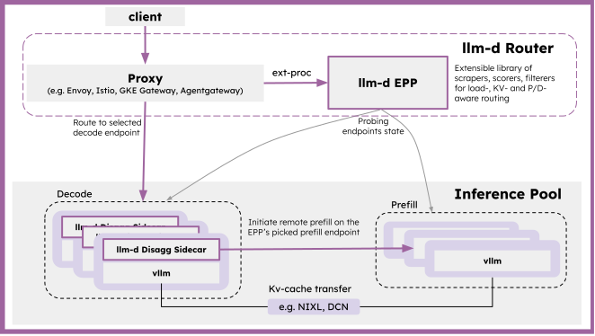

# llm-d Router — 总览

> 源码:`3rdparty/llm-d-router`(submodule,HEAD `abb404ef`,2026-09-08)。上游 [llm-d/llm-d-router](https://github.com/llm-d/llm-d-router)(llm-d 项目的路由仓;llm-d 由 Red Hat / Google / IBM 等联合发起)。许可:**Apache-2.0**。  
> 文档站 [llm-d.ai](https://llm-d.ai)。架构/索引/PD 细节见 [architecture.md](architecture.md);与 lake 对照见 [pain-points.md](pain-points.md)。路由策略横评见 [`../model-routing.md`](../model-routing.md) §5。

## 一句话定位

llm-d Router 是 K8s 上推理流量的**智能入口**:核心是 EPP(Endpoint Picker)——挂在 Envoy ext-proc 扩展点上的选路服务,消费各引擎 pod 的 KV 事件流维护全局块索引,做精确的前缀亲和 + 负载感知选路;同仓还带 PD 分离 sidecar 与可选的多阶段编排 coordinator。

> 术语沿革:项目原名 Inference Scheduler,已更名 llm-d Router;EPP 代码与 `InferenceObjective`/`InferenceModelRewrite` API 从 Gateway API Inference Extension(GIE)仓并入本仓,GIE 仓现在只留 `InferencePool` API 与 EPP 协议定义。



(图源:`3rdparty/llm-d-router` 官方文档图。EPP 在网关路径上,经 ext-proc 与 Envoy 交互。)

## 与本系统的关系

| llm-d 概念 | 本系统对应 | 关系 |
|------------|-----------|------|
| EPP(ext-proc 选路服务) | Go Router | **同层对照**;EPP 只选 endpoint,lake Router 还做执行模式选择(PD/混部/D-direct) |
| `pkg/kvcache` 全局块索引 | 存储池位置视图 | **形态对照最直接**:都是"块哈希 → pod"索引;但 EPP 索引是事件流派生的**副本视图**,lake 位置视图是存储控制面的**权威状态** |
| 推测索引(决策后先写 TTL 2s 条目) | 无对应(lake 不需要) | **思路可借鉴**:湖镜像推送若引入决策-确认窗口,同类机制可补空窗;lake 目前由权威放置直接出视图 |
| `pkg/kvevents` ZMQ 事件管线 | 引擎 → 存储控制面的状态上报 | **机制同源**:BlockStored/BlockRemoved/AllBlocksCleared 三类事件 + gap 检测重放 |
| pd-sidecar / coordinator(PD 编排) | lake PD 分离模式 | **两种 PD 观对照**:llm-d 把 PD 当部署拓扑(sidecar 挂在 decode 上),lake 把 PD 当逐请求选路结果 |
| InferenceObjective(优先级) | SLO/优先级上报 | 优先级语义由外部声明、EPP 执行;lake 的优先级裁决归 gateway |
| InferenceModelRewrite(模型名改写) | 无 | A/B、灰度的网关侧做法,lake 不涉及 |

**核心结论**:llm-d Router 代表了"**网关侧精确派**"的最高完成度——事件驱动、逐块精确、推测索引补传播窗口、十余种 scorer 插件化组合。但它的索引始终是**路由器为自己决策维护的派生缓存**:引擎才是 KV 真相,EPP 只是尽可能快地逼近它。lake 把这个关系倒过来:存储池就是真相,Router 读的视图不需要"逼近"谁。

## 设计哲学

1. **标准优先**:全面压在 K8s Gateway API + Inference Extension 标准上,选路逻辑收敛到 EPP 这一个扩展点,不发明新协议。
2. **插件化一切**:filter / scorer / picker / profile / data-producer 全部可插拔,配置(`EndpointPickerConfig` YAML)声明组合,不动框架代码。
3. **事件逼近真相**:引擎每存/删一个块就发事件,EPP 订阅后维护索引;承认传播有窗口,用推测索引(TTL 2s)补。
4. **PD 即编排**:prefill/decode(/encode)是部署时就分开的角色,sidecar 或 coordinator 负责把多阶段串起来。

## 架构

```
Client → Envoy / Gateway(API HTTPRoute → InferencePool)
  → ext-proc gRPC → EPP
      ├─ Director:header 处理 → screener → data producers(含精确前缀)
      │     → admission → Scheduler.Schedule
      ├─ Profile:Filter 链 → 加权 Scorer 求和 → Picker(max-score)
      └─ 回写目标 endpoint(+ PD 时写 x-prefiller-host-port 等头)
  → Envoy 转发到 decode pod
      └─ pd-sidecar:按头先打远端 encode/prefill,再本地 decode
引擎 pod(vLLM 等)→ ZMQ PUB KV 事件 → 每个 EPP 副本各自订阅 → 各自维护块索引
```

| 组件 | 职责 | 入口 |
|------|------|------|
| **EPP** | 选路大脑:ext-proc 服务 + 插件框架 + KV 索引 | `cmd/epp/main.go` |
| **pd-sidecar** | 挂在 decode pod 上的代理,编排 encode/prefill 阶段 | `cmd/pd-sidecar/main.go` |
| **coordinator** | 可选的独立流水线服务,每阶段单独过网关选路(与 sidecar 二选一) | `cmd/coordinator/main.go` |

两种部署模式:**Standalone**(Envoy 与 EPP 同 pod,自管理)与 **Gateway 模式**(生产推荐,EPP 作为 `InferencePool` 的后端挂在共享 Gateway 上)。

## 分布式模型

> 跨项目汇总对比见 [../distributed-models.md](../distributed-models.md);细节见 [architecture.md](architecture.md)。

- **拓扑**:以 Envoy/Gateway 为入口的星型;EPP 多副本并列在网关后;引擎 pod 通过 ZMQ 向**所有** EPP 副本扇出事件。
- **元数据权威**:**引擎侧 KV 事件为真相**;EPP 的块索引是派生缓存,默认在本进程内存(可选 Redis 后端);没有集中式强一致存储。
- **同步机制**:每个 EPP 副本独立订阅全部引擎 pod 的事件流,各自收敛到(近似)相同的索引;序列号 gap 触发重放(`replayTimeout=2m`);事件去重靠 `eventDedupFilter`。
- **一致性分级**:索引最终一致且允许短暂失真;丢 remove 事件会留下幽灵条目(代码注释自认);推测条目与确认条目共存,TTL 到期只清推测。
- **HA 与故障**:三种模式——Active-Active(但近似前缀路由下应避免,副本间不共享该状态)、Active-Passive(租约选主或 Envoy 优先级)、fail-open(EPP 全挂时 Envoy 直打后端)。peer discovery 已就位,但跨副本前缀状态同步**尚未实现**,只铺路。
- **扩展性**:副本即订阅者,加法简单;代价是每副本全量订阅、全量索引,事件吞吐 × 副本数是固定放大。架构假设单 InferencePool 单 EPP(Envoy 限制)、每 pool 单一 base 模型。
- **与 lake 对照**:llm-d 的多副本各自收敛,是 lake"单写者权威 + 镜像推送"的反面对照——同样消费事件流,lake 让事件流汇入存储控制面形成唯一权威,Router 副本读的是权威推送的镜像,副本间天然一致,且误判可回查权威。llm-d 没有可回查的权威点,幽灵条目只能靠后续事件自然修正。

## 技术栈

| 层 | 技术 |
|----|------|
| 语言 | 几乎纯 Go(go 1.26,约 900 个 `.go` 文件) |
| 网关协议 | Envoy ext-proc gRPC(仅支持 `FULL_DUPLEX_STREAMED` body 模式) |
| 标准 | K8s Gateway API + Inference Extension(`InferencePool`/`InferenceObjective`/`InferenceModelRewrite`) |
| KV 事件 | ZMQ PUB/SUB(zmq4),引擎适配器 vLLM / SGLang |
| 索引 | 进程内 LRU(可选 Redis / CostAwareMemory 后端)+ ttlcache(推测条目) |
| 部署 | Helm charts + Kustomize;Standalone / Gateway 两模式 |

## 优势与局限

**优势**:

1. 网关侧精确缓存感知的完成度最高:逐块索引、介质分权重(gpu=1.0/cpu=0.8)、推测索引补窗口,都有生产级实现。
2. 插件体系最规整:filter/scorer/picker/profile 四层接口清晰,加策略不改框架(`docs/create_new_filter.md` 有教程)。
3. PD 编排给出两种可部署形态(sidecar / coordinator),并按"先选 decode、再按需 encode、再按需 prefill"的顺序做决策,工程细节(超时、stranded memory 警告)写在明处。
4. 标准化程度最高:全部构建在 Gateway API Inference Extension 之上,是 K8s 推理路由生态收敛的方向。

**局限**(详见 [pain-points.md](pain-points.md)):

1. 索引是派生视图:无权威可回查,丢事件留幽灵条目,多副本不共享近似前缀状态。
2. encode 分离是 PoC、chunked decode 是 experimental;PD 的 TTFT 代价与多跳开销自认存在。
3. 架构假设单 pool 单 EPP、每 pool 单模型——多模型混部场景不在设计内。
4. DP rank 不进索引与去重(TODO #370),内存索引按 key 数而非字节计容。

## 借鉴点与关键差异

**借鉴点**(展开见 [architecture.md](architecture.md)):

1. **推测索引**:调度决策后立刻写入"预计这些块将在此 pod"的短 TTL 条目,等真实事件确认——任何"决策→状态确认"有窗口的系统都用得上这个补窗手法。
2. **事件管线韧性设计**:序列号 gap 检测 + 重放 + 去重过滤器的组合,是消费引擎事件流的标准三件套。
3. **插件配置形态**:`EndpointPickerConfig` 一份 YAML 声明插件与 profile 组合,框架零改动。
4. **PD 决策顺序**:先选 decode(承载状态最重),再倒推 prefill——与 lake"调度器读位置视图组 batch"的方向一致。

**关键差异**(lake 更彻底,不照搬):

1. EPP 索引是**决策辅助的派生缓存**,lake 位置视图是**存储控制面的权威状态**——前者逼近真相,后者就是真相。
2. llm-d 的 PD 是**部署拓扑**(sidecar/coordinator 串阶段),lake 的 PD 是**逐请求模式选择**,同一集群内混部/分离/D-direct 并存。
3. EPP 索引只覆盖"块在哪个 pod",不区分块在哪层介质(仅打分权重区分);lake 统一编址 L0–L3,层是介质不是位置。
4. 多副本靠各自收敛保一致,lake 由权威推送镜像,副本间无收敛问题。

## 代码索引

> 路径相对 `3rdparty/llm-d-router/`;符号为锚点,行号漂移时 `grep -rn "符号名" 3rdparty/llm-d-router/<路径>`。

| 概念 | 文件:符号 |
|------|-----------|
| EPP 入口 | `cmd/epp/main.go`::`main`;`cmd/epp/runner/runner.go`::`NewRunner` / `Runner.Run` |
| 插件总注册 | `cmd/epp/runner/runner.go`::`registerInTreePlugins` |
| ext-proc 服务 | `pkg/epp/server/runserver.go`::`RegisterExternalProcessorServer`;`pkg/epp/handlers/server.go`::`StreamingServer.Process` |
| 调度编排 | `pkg/epp/requestcontrol/director.go`::`Director.HandleRequest` |
| 调度器 | `pkg/epp/scheduling/scheduler.go`::`Scheduler.Schedule` |
| 加权打分 | `pkg/epp/scheduling/scheduler_profile.go`::`runScorerPlugins`;`weighted_scorer.go`::`NewWeightedScorer` |
| 配置加载 | `pkg/epp/config/loader/configloader.go`::`LoadRawConfig` / `InstantiateAndConfigure` |
| KV 索引器 | `pkg/kvcache/indexer.go`::`Indexer` / `ScoreTokens` |
| 前缀匹配 | `pkg/kvcache/prefix_match.go`::`MatchBlockKeys` / `SpeculativeTier` / `prefixAccumulator` |
| 块索引接口 | `pkg/kvcache/kvblock/index.go`::`Index` / `PodEntry` / `BlockHash` |
| 内存索引 | `pkg/kvcache/kvblock/in_memory.go`::`InMemoryIndex` / `PodCache` |
| Token→块键 | `pkg/kvcache/kvblock/token_processor.go`::`TokenProcessor.TokensToKVBlockKeys` |
| ZMQ 订阅 | `pkg/kvevents/zmq_subscriber.go`::`zmqSubscriber.Start`(含 gap 重放) |
| 订阅管理 | `pkg/kvevents/subscriber_manager.go`::`SubscriberManager.EnsureSubscriber` |
| 事件批处理 | `pkg/kvevents/pool.go`::`processEventBatch` |
| 事件去重 | `pkg/kvevents/event_dedup_filter.go`::`eventDedupFilter` |
| 引擎适配 | `pkg/kvevents/engineadapter/vllm_adapter.go` / `sglang_adapter.go` |
| 精确前缀 producer | `pkg/epp/scheduling/plugins/producer/preciseprefixcache/producer.go`::`Producer.Produce` / `Extract` |
| 推测索引 | `.../preciseprefixcache/prerequest.go`::`defaultSpeculativeTTL` / `buildSpeculativeCache` / `PreRequest` |
| 精确前缀 scorer | `.../scorer/preciseprefixcache/precise_prefix_cache.go`::`PrecisePrefixCachePluginType` |
| 负载 scorer | `.../scorer/loadaware/load_aware.go`::`LoadAwareType` |
| PD profile | `.../profilehandler/disagg/disagg_profile_handler.go`::`DisaggProfileHandlerType` |
| PD 决策器 | `.../decider/prefix_based_pd_decider.go` / `always_disagg_pd_decider.go` |
| sidecar | `cmd/pd-sidecar/main.go`;`pkg/sidecar/proxy/proxy.go`::`NewProxy` |
| coordinator | `cmd/coordinator/main.go`;`pkg/coordinator/pipeline/pipeline.go`::`Pipeline.Execute` |

## 参考

- 上游:[github.com/llm-d/llm-d-router](https://github.com/llm-d/llm-d-router) @ `abb404ef`;父项目 [llm-d/llm-d](https://github.com/llm-d/llm-d)
- 标准:[Gateway API Inference Extension](https://gateway-api-inference-extension.sigs.k8s.io)(GIE)
- 路由横评:[`../model-routing.md`](../model-routing.md) §5(llm-d 节)
- 分布式模型归类:[`../distributed-models.md`](../distributed-models.md)
- 四栈对比(Dynamo / FlexKV / llm-d / AIBrix):[`../serving-stack-comparison.md`](../serving-stack-comparison.md)
