# 路由与调度调研:模型级路由与实例级缓存亲和调度

调研范围:LLM 服务的两层路由——模型级(选哪个模型/哪家 API/哪种 harness)与实例级(选哪个 worker 进程)。
调研目的:为 Dynamo / lake 的实例级 Router 找可借鉴的机制。
文档结构:第 1 节区分两层;第 2、3 节是模型级(产品、学术);第 4、5、6 节是实例级(约束来源、开源实现、学术原型);第 7 节是跨层结论;第 8 节是对 Dynamo / lake 的借鉴;第 9 节存档相邻主题的链接。

## 1. 两类路由

| | 模型级路由(model routing) | 实例级路由(instance routing) |
|---|---|---|
| **决策** | 这个请求发给哪个模型、哪家 API、哪种 agent harness | 确定模型后,发给哪个 worker 进程 |
| **目标** | 质量与成本的权衡(便宜模型能答就不调贵的) | 缓存命中与负载均衡(谁存着前缀 KV、谁空闲) |
| **典型位置** | gateway / 产品层 | 推理系统内部 |
| **代表** | OpenAI GPT-5 router、Databricks Smart Routing、RouteLLM | Dynamo Router、lake Router |

两层独立存在,可以串联:gateway 的模型路由先选模型,推理系统的实例路由再选 worker。

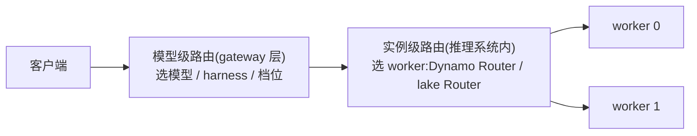

## 2. 模型级路由:厂商产品

### OpenAI:GPT-5 的 real-time router

GPT-5 不是单个模型,而是一个系统:快速模型 `gpt-5-main` 答大多数问题,深度推理模型 `gpt-5-thinking` 处理难题,前面放一个实时路由器决定用哪个([GPT-5 System Card](https://openai.com/index/gpt-5-system-card/))。

- **路由依据**:对话类型、复杂度、工具需求、显式意图(用户写 "think hard about this" 就强制走推理模型)。
- **训练方式**:路由器持续用真实线上信号训练——用户手动切换模型的行为、回答偏好率、实测正确率。
- **兜底**:用量超限后由 mini 版接管剩余请求。
- **不对外暴露**:API 里仍是显式指定模型,路由器只在 ChatGPT 产品内工作。

### Anthropic:无官方路由

Anthropic 没有模型路由产品,Claude Code 里是用户手动 `/model` 选择。生态位由社区项目 [claude-code-router](https://github.com/musistudio/claude-code-router)(约 3.6 万 star)占据:本地代理拦截 Claude Code 请求,按场景规则分流——`background`(后台任务→便宜模型)、`think`(规划模式→推理模型)、`longContext`(超阈值→长上下文模型)、`webSearch`、`default`。纯规则,无学习成分。

### Databricks:Smart Routing + Omnigent(任务级,选模型也选 harness)

2026 年发布,Beta 状态,文档见 [Smart Routing for coding agents](https://docs.databricks.com/aws/en/ai-gateway/smart-routing),设计细节见官方博客 [Smart Routing in Unity AI Gateway](https://www.databricks.com/blog/smart-routing-unity-ai-gateway-match-frontier-quality-30-lower-cost-task)。面向编程 agent。

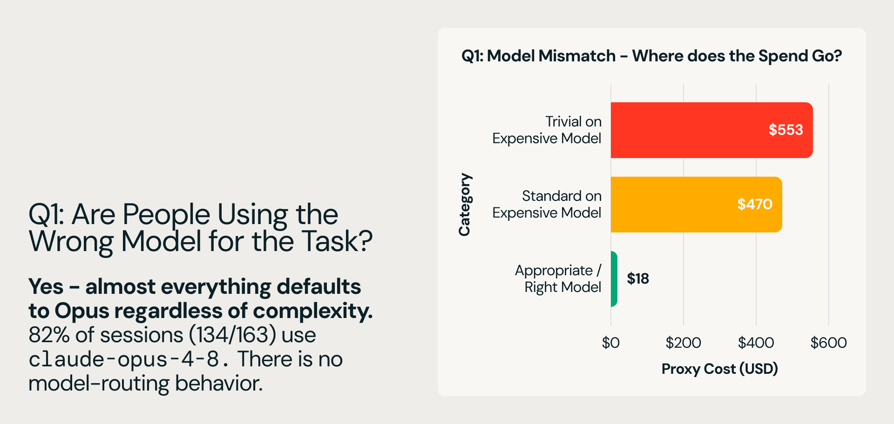

(图源:[Databricks 博客](https://www.databricks.com/blog/smart-routing-unity-ai-gateway-match-frontier-quality-30-lower-cost-task)。编程任务的成本-质量前沿上,模型与 harness 的组合高度分散,大量日常工作不需要最贵组合——这是路由存在的理由。)

要点:

1. **任务级而非请求级**。任务开始时定一次模型和 harness,整个会话不再换。原因:大规模下成本由 prompt cache 命中率主导,逐请求换模型会显著拉低命中率,省下的费用抵不过命中率下降的损失。
2. **分类器要便宜**。用一个低延迟小模型读任务描述和元数据,打几个语义标签:改系统的哪部分、提示词带什么代码证据(片段/报错栈/无)、失败形态、改动是否局部、项目类型。由此得出任务族和语言族。
3. **默认中等,双向调整**。路由器默认选中档模型,按标签向上升档(需要前沿能力)或降档(任务简单)。一个策略覆盖整个模型谱系。
4. **模型和 harness 联合选择**。harness(决定每轮发多少上下文、何时调工具、何时压缩上下文)对成本的影响可以超过 2 倍,只换模型不换 harness 就得不到这部分收益。联合选择由 Omnigent(元 harness,编排多个编程会话)执行;子 agent 启动时独立再过一次路由——初始 prompt 往往欠定义,子任务边界更清晰,路由更准。

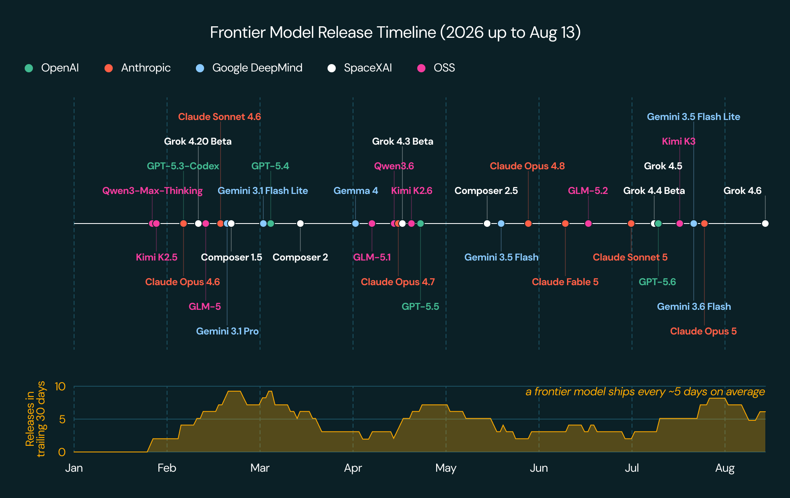

(图源:Databricks 博客,同上。任务级路由的流程:分类器读任务描述打标签 → 默认中档、按标签升/降档 → 整个会话保持该模型与 harness。)

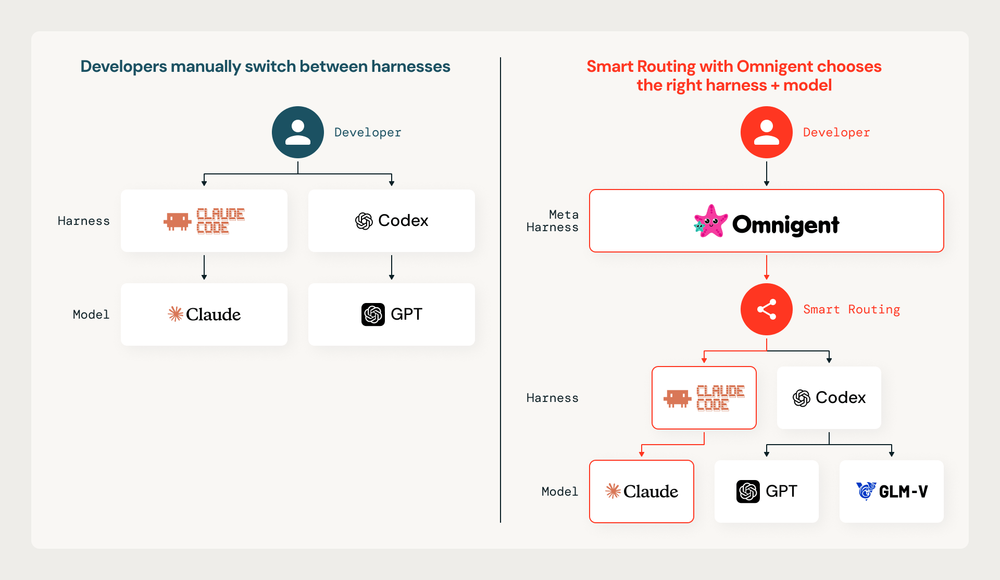

(图源:Databricks 博客,同上。Omnigent 作为元 harness 编排多个编程会话:主任务过一道路由,每个子 agent 启动时独立再过一道。)

效果(博客给出的实测数字):

| 评测集 | 成本 | 质量 |
|--------|------|------|
| 内部 coding workload | Opus 5 单模型的 65%(省 35%) | 超过任一单模型 |
| 公开 coding benchmark | 省 56% | 追平 Opus 5 |

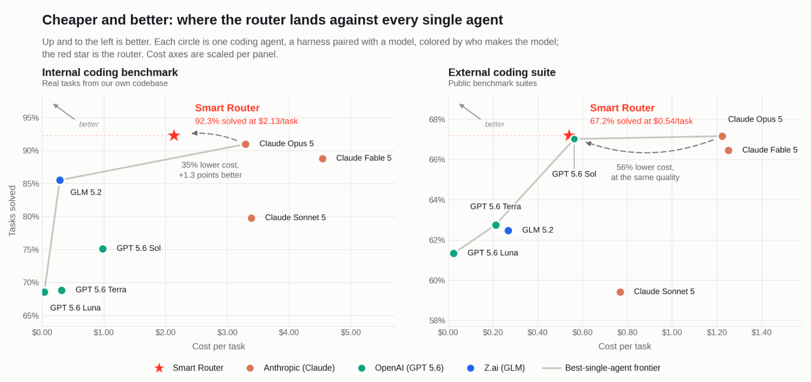

(图源:Databricks 博客,同上。路由把成本-质量权衡曲线推向左上:同等质量下成本更低。)

博客给出的四个后续方向:

- **先做任务边界免费的场景**:PR 评审、子 agent、批量迁移、定时任务——任务描述由机器生成、一开始就完整,不用猜。
- **晚几轮再路由**:首轮 prompt 是信息最差的决策点;让便宜模型先聊几轮澄清需求,任务成形后再路由。
- **会话做小**:一个会话一件事,主题变了就开会话,路由更准也更便宜。
- **换模型要在缓存失效点**:会话中途换模型意味着 cache miss;压缩(compaction)事件天然在丢缓存,是换模型的低成本时机(提到 Cognition Devin Fusion 就这么做)。长期目标是路由层把 cache miss 显式计价。

### OpenSquilla:开源 agent 的轮次级路由

[TokenRhythm/opensquilla](https://github.com/TokenRhythm/opensquilla)(Apache 2.0,基元律动)是微内核架构的开源 AI agent,模型路由是它的省钱手段之一,实现为 **SquillaRouter**:本机运行的 LightGBM + ONNX 分类器,按长度、语言、代码片段、关键词加语义嵌入给**每一轮**打分,分派到 C0–C3 四档里能胜任的最便宜模型。分类在本机完成,提示词不出本机。技术报告《OpenSquilla: Token-Efficient Agent = Models + Routing Harness》([aiXiv 260822.000001](https://aixiv.science/abs/aixiv.260822.000001),[中文 ChinaXiv 202608.00176](https://chinaxiv.org/abs/202608.00176));另有一篇讲 harness 原生路由数据飞轮的 [arXiv 2607.11399](https://arxiv.org/abs/2607.11399)。

与 Databricks 对照,它的差异点:

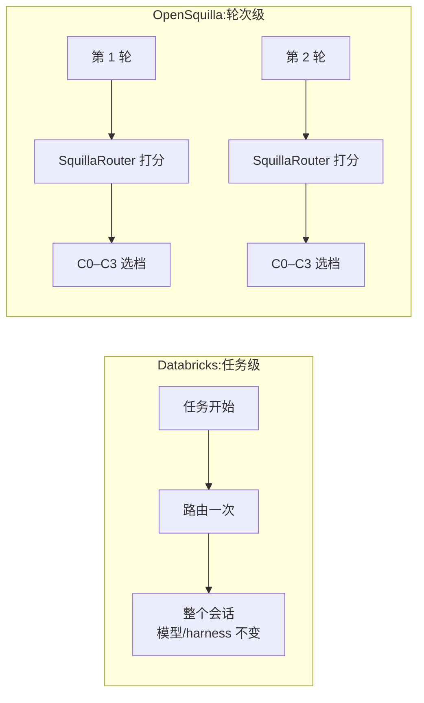

1. **粒度更细:轮次级**。Databricks 是任务级(任务开始定一次,保缓存);OpenSquilla 每一轮都重新选模型。代价是频繁换模型会丢 prompt cache——它的解法是 **prompt 缓存隔离**(按档位隔离缓存命名空间)加自适应提示词(简单轮次连系统提示都换轻量版,缓存代价同步缩小)。两种粒度谁更优,取决于 provider 侧缓存价格与命中形态,没有通用答案。
2. **路由之外还有集成**。难题不只路由给一个模型,而是分发给多个候选模型再聚合作答(mixture-of-agents 思路),报告声称在深度研究任务上以 Fable 5 的 31% 成本拿到更高分;带成本感知回退——单模型够用时自动跳过集成。
3. **思维深度分级**:简单轮次直接关闭推理(reasoning)输出,不为"你好"付推理 token 的钱。

技术报告的实测数字:

| 评测 | 对比对象 | 质量 | 成本 |
|------|----------|------|------|
| 全量任务 | 固定旗舰模型 | 保留 99.96% | 降 88.9% |
| PinchBench 25 任务 | OpenClaw + Opus 4.7 | 同分 0.925 | $0.688 vs $6.233 |

### OpenRouter:auto → auto-beta(市场信号)

API 聚合商,`openrouter/auto` 自动选模型。2026 年 8 月换掉原 NotDiamond 引擎,新机制自称 "wisdom of the market"([公告](https://openrouter.ai/blog/announcements/introducing-the-new-auto-router/)):把 prompt 分到约 30 类任务,按**全平台最近 7 天开发者真实消费份额**(周 55T+ token)给该类任务选模型。用户用 `cost_tier`(low/medium/high/xhigh/max 五档)控制价格带;多轮对话传 `session_id` 保持模型粘连。不收路由费,按选中模型原价计费。

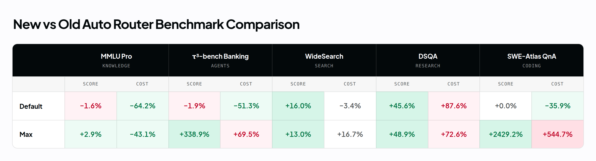

(图源:[OpenRouter 公告](https://openrouter.ai/blog/announcements/introducing-the-new-auto-router/)。每个任务类别下各模型的近期平台消费份额——"市场信号"的具体形态:不同类别胜出的模型不同,路由就是把请求分到该类别的胜出者。)

反例:[Martian](https://www.linkedin.com/pulse/martian-vs-openrouter-optimization-trap-vidhi-vashishth-ney8c) 是最早做模型路由的创业公司,已从路由器转型。教训:模型选择是开发者最在乎、也最难验证对错的决策(看不到"另一个模型会怎么答"),纯黑盒自动路由难以建立信任;OpenRouter 先把接入、计费、failover 做好,自动路由只作为可选项。

### vLLM Semantic Router(开源)

[vllm-project/semantic-router](https://github.com/vllm-project/semantic-router):Envoy 的外挂处理器(ext_proc),Rust(Candle/ONNX)跑分类器、Go 对接 Envoy。内置一组 ModernBERT 分类器作为信号(意图/领域、PII、越狱、幻觉、反馈),信号经布尔规则组合成路由决策,落到配置的模型池。论文见 [When to Reason(arXiv 2510.08731)](https://arxiv.org/html/2510.08731v1):按"需不需要推理"分流,MMLU-Pro 上延迟与 token 消耗减半且精度不降。另有工作把分类链路本身优化了 98 倍([arXiv 2603.12646](https://arxiv.org/html/2603.12646v1))——佐证"路由器的开销必须远小于省下的钱"。

### LiteLLM / Portkey 等 AI 网关

路由策略是负载均衡与容错型(least-busy、最低延迟、成本上限、顺序 fallback),不做"这个请求哪个模型答得好"的质量预测。与模型级路由是近邻但不同类。

## 3. 模型级路由:学术与评测

### 成本-质量路由主线

| 工作 | 年份/出处 | 机制 | 备注 |
|------|----------|------|------|
| FrugalGPT([arXiv 2305.05176](https://arxiv.org/abs/2305.05176)) | 2023,Stanford | **级联**:先调便宜模型,DistilBERT 给回答打分,不够再升级更贵的 | 最高省 98% 成本;级联与路由的区别:级联是串行试错,路由是一次决策 |
| HybridLLM([ICLR 2024](https://arxiv.org/abs/2404.14618)) | 2024 | BERT 预测查询难度,小/大模型二选一 | 难度预测路线的代表 |
| RouteLLM([arXiv 2406.18665](https://arxiv.org/abs/2406.18665),[lm-sys/RouteLLM](https://github.com/lm-sys/RouteLLM)) | 2024,LMSYS | 用 Chatbot Arena 偏好数据训练四种路由器(矩阵分解/加权 Elo/BERT/causal LLM);**阈值标定**控制强模型调用比例 | MT-Bench 上省 85% 成本、保持 95% GPT-4 质量;开源、模型数据在 HuggingFace |
| GraphRouter([ICLR 2025](https://arxiv.org/abs/2410.03834)) | 2025 | 任务-查询-模型建异构图,路由=边预测 | 利用任务间结构信息 |
| Avengers([arXiv 2408.12683](https://arxiv.org/abs/2408.12683)) | 2024 | 查询聚类,每类选最优小模型 | 不训练神经网络也有竞争力 |
| 综述([arXiv 2603.04445](https://arxiv.org/html/2603.04445v2)) | 2026 | 路由/级联统一分类 | 入门地图 |

(图源:[RouteLLM 论文](https://arxiv.org/abs/2406.18665) Figure 2。横轴是强模型调用比例(成本),纵轴是质量;路由器的价值体现在把权衡曲线推向左上。)

### 评测:方法多,有效的少

- [RouterBench](https://arxiv.org/abs/2403.12031)(2024):11 个模型 × 7 个任务,40 万条预计算输出,路由策略离线评测的事实标准。
- [LLMRouterBench](https://aclanthology.org/2026.findings-acl.1881.pdf)(ACL 2026 Findings):40 万实例、21 个数据集、33 个模型,统一重测 10 个代表性路由方法。结论值得注意:**多数方法在统一评测下拉不开差距;若干商业路由器跑不过"永远选最好单模型"这个基线;与理论上限(Oracle)的差距主要来自"该升档的没升"**。Embedding 模型的选择影响有限,模型池越大收益越递减。

## 4. 实例级路由的约束来源:缓存命中率

实例级路由为什么以缓存命中为核心变量,两个层面各有原因:harness 侧的设计纪律决定前缀的形态(能不能命中),调度侧的策略决定请求落到哪个实例(命中发生在哪)。本节先看 harness 侧,下一节看调度侧。

### Anthropic 的 Claude Code 经验(harness 侧)

[Lessons from building Claude Code: Prompt caching is everything](https://claude.com/blog/lessons-from-building-claude-code-prompt-caching-is-everything)(2026-04,Anthropic 官方)。核心事实:prompt 缓存是**前缀匹配**——前缀里任何一处变了,其后全部失效。Claude Code 的整个 harness 围绕这条约束设计。

提示词的排布顺序(原文无配图,按文中描述整理):

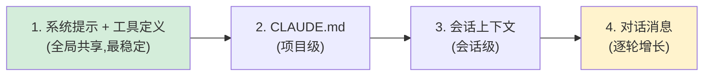

越靠前越稳定、共享面越大;任何一处的改动使其后全部缓存失效。

- **提示词排布:静态在前,动态在后**。系统提示与工具定义(全局共享)→ CLAUDE.md(项目级)→ 会话上下文(会话级)→ 对话消息。他们实际打破过缓存的几种方式:在静态系统提示里放了精确时间戳、工具定义顺序不稳定、改了工具参数。
- **更新走消息,不改提示词**。时间、文件变更这类易变信息,塞进下一轮 user 消息或工具结果里,而不是改系统提示。
- **会话中途不换模型**。缓存按模型隔离:对话进行到 100k token 时,哪怕问题很简单,换便宜模型也比留在贵模型上更贵——要重建整个前缀缓存。要换模型就用子 agent,让主 agent 写交接消息。
- **会话中途不增删工具**。工具定义在缓存前缀里。Plan Mode 的实现方式是把 `EnterPlanMode`/`ExitPlanMode` 本身做成工具,工具集恒定;大量 MCP 工具用 `defer_loading` 发轻量占位(名字+标记),模型需要时再加载完整 schema,占位恒定所以前缀稳定。
- **压缩(compaction)用缓存安全的 fork**:压缩请求复用父会话完全相同的系统提示、上下文和工具定义,把压缩指令作为新的 user 消息追加在末尾——对 API 来说这几乎就是父会话的上一次请求,前缀缓存全部命中。
- **把缓存命中率当可用性指标监控**:命中率掉太多就当事故(SEV)处理。几个百分点的命中率波动对成本和延迟影响巨大。

这篇博客从 provider 侧解释了为什么 Databricks 选任务级路由:换模型的真实成本是缓存重建,不是 token 单价差。

## 5. 实例级路由:开源实现

各家的差别主要在三点:缓存状态从哪来(推测 / 集中记账 / 事件订阅 / 无状态)、命中与负载怎么结合、多副本怎么一致。

一个常见疑问:production-stack 和 AIBrix 都在 vllm-project 下、都有路由器,是否重复开发?出身不同——production-stack 是 vLLM 团队自孵化的**参考实现**(Python,轻量,教你怎么把单实例扩成分布式);AIBrix 是字节跳动**捐赠**的生产级基础设施(Go,K8s 原生控制面,路由只是其九大功能之一)。路由重叠是因为路由是任何分布式栈的必备件;维护者在 [#177](https://github.com/vllm-project/production-stack/issues/177) 明确了两家分工,且随着生态向 Gateway API Inference Extension + llm-d EPP 收敛([#1032](https://github.com/vllm-project/production-stack/issues/1032)),两家自研 router 都在退为参考/过渡实现。

### vLLM production-stack

[vllm-project/production-stack](https://github.com/vllm-project/production-stack) 是 vLLM 项目下的 K8s 分布式部署栈(已引入 `3rdparty/production-stack`),其请求路由器(`vllm_router`)的 `routing_logic.py`(本地 `3rdparty/production-stack/src/vllm_router/routers/routing_logic.py`)实现了多种策略。

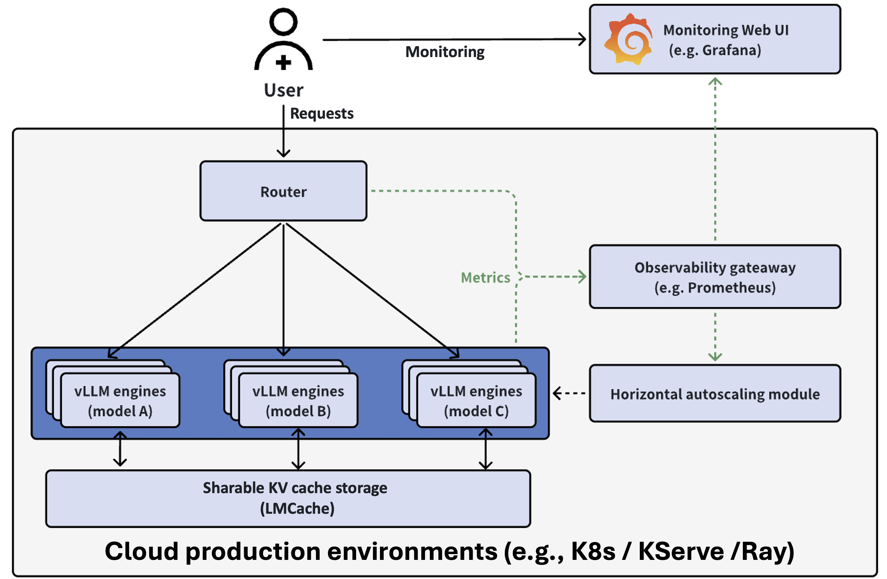

(图源:[production-stack README](https://github.com/vllm-project/production-stack)。路由器位于客户端与 vLLM 实例之间,是缓存亲和策略的落点。)

| 策略 | 机制 | 适用 |
|------|------|------|
| `roundrobin` | 轮询 | 负载均匀,无缓存亲和 |
| `session` | 按请求头里的 session id 粘连;无 session id 时选 QPS 最低者 | 多轮对话 |
| `prefixaware` | 路由器本地维护前缀树,同前缀永远发同一实例——**即使缓存已被驱逐** | 前缀形态稳定 |
| `kvaware` | 经 **LMCache controller** 集中查询各实例实际持有的前缀,路由到最长命中的实例;低于 `--kv-aware-threshold`(默认 2000 token)或不命中则回退 QPS/轮询 | 缓存状态实时可见 |
| `disaggregated-prefill` 系列 | PD 分离部署的 prefill/decode 分流 | PD 分离 |

`kvaware` 与 `prefixaware` 的差别值得注意:前者查的是**实例真实持有的缓存**(LMCache controller 集中记账),后者查的是**路由器自己的历史记录**(发过的就以为还在)。驱逐之后,后者会把请求发到已经没有数据的实例上。

**设计源头**是 [RFC #59](https://github.com/vllm-project/production-stack/issues/59)(prefix-cache-aware routing),其中明确了一个关键取舍:**token-ID 匹配准但 tokenize 太慢(每请求数微秒起),路由器承担不起,所以改用字符串匹配**;初版用 SQL 库存"链式内容哈希"(`hash(c0+...+ci)` 逐块前缀哈希)加按实例 LRU 淘汰。这个"路由器不做 tokenize"的判断,与后面 #1016 的事故互为印证。

**issue 里的工程教训**:

- **热路径不能阻塞**([#1016](https://github.com/vllm-project/production-stack/issues/1016)):`KvawareRouter` 在 uvicorn 事件循环里做三件同步事——`AutoTokenizer.from_pretrained` 联网拉 tokenizer(模型用别名时永远失败,每请求重试)、把完整 prompt 同步 POST 给 `/tokenize`、同步等 controller 的 ZMQ 往返——结果是路由器自己的 `/health` 答不出来,K8s 探针超时,持续流量下 CrashLoop(实测一小时重启 25 次,请求零完成)。
- **回退路径的信号质量**([#1073](https://github.com/vllm-project/production-stack/issues/1073)):PrefixAwareRouter 低于命中阈值时按 QPS 回退,但用的是过期 QPS 值,把所有回退请求打到同一个后端上。
- **输入信号本身要被监控**([#1074](https://github.com/vllm-project/production-stack/issues/1074)):指标名对不上时,EngineStats 全零——看起来"很空闲很健康",负载均衡被静默喂了假数据。
- **端点生命周期**([#1008](https://github.com/vllm-project/production-stack/issues/1008)):pod 被驱逐后路由器残留幽灵端点,请求超时。
- 2026 roadmap([#855](https://github.com/vllm-project/production-stack/issues/855))里与路由相关的:XpYd 分离 prefill、路由到外部 provider(OpenAI/Anthropic)、router 侧请求排队、**基于未来负载的预测式路由**、优先级路由、用 Rust/Go/Nginx 重写路由器前端(Python 性能到顶)、agent 工作负载的智能路由。

**issue 里的跨仓讨论**:

- **与 AIBrix 的定位之争**([#177](https://github.com/vllm-project/production-stack/issues/177)):维护者答复——production-stack 走轻量、Python 可编程、紧跟 vLLM 上游(经 upstream connector);AIBrix 走 K8s 原生、Go、当时需要修改 vLLM 0.6.1 才能做 KV 操作。评论区的定位:替代 LiteLLM/MLflow 这类通用代理,但深度绑定 vLLM 的指标与运维。
- **agent 负载的路由需求**([#244](https://github.com/vllm-project/production-stack/issues/244)):feature request 要三样东西——跨 agent 的 KV 复用(同一 workflow 的 agent 共享上下文)、按 `session_id`/workflow 元数据的 agent 感知路由、workflow 级指标(跨 agent 命中率、workflow TTFT)。说明"agent 感知路由"已是社区显性需求。
- **K8s 网关生态收敛**([#1032](https://github.com/vllm-project/production-stack/issues/1032)):kgateway 在 2.1 弃用、2.2 移除了 inference extension 支持,production-stack 迁移到 agentgateway + llm-d Router。信号:K8s 原生的推理路由正在向 **Gateway API Inference Extension + llm-d EPP** 这一组合收敛,各家自研 router 的定位都在向"参考实现"退(Kthena 官方也这么自述)。

### SGLang

SGLang 的路由组件(`sgl-model-gateway`,Rust)的策略列表在 `src/policies/` 下,与 APC 相关的两个:

- **`cache_aware`**(`cache_aware.rs` + `tree.rs`):路由器为每个 worker 维护一棵**近似前缀树**(存原始文本而非 token id,省 tokenize 开销),按请求历史推断各 worker 的缓存内容,不查引擎真实状态。匹配率超阈值就发最匹配的 worker,否则发树最小(缓存容量最空)的;后台 LRU 驱逐叶子防内存膨胀。**负载不均衡时**(max-min 超绝对阈值且 max/min 超相对阈值)自动切到最短队列优先,均衡时切回缓存感知——缓存亲和与负载均衡按系统状态二选一,不是加权求和。
- **`consistent_hashing`**(`consistent_hashing.rs`):会话粘连。优先级:显式 `X-SMG-Routing-Key` 请求头 > 隐式稳定头(`authorization` / `x-forwarded-for` / `cookie`)> 匿名请求随机。一致性哈希环保证 worker 上下线时只有少量会话换节点。

### AIBrix

[AIBrix](https://github.com/vllm-project/aibrix)(字节跳动发起,现属 vllm-project;已引入 `3rdparty/aibrix`):K8s 推理基础设施,网关插件的路由策略数量最多([文档](https://aibrix.readthedocs.io/latest/features/gateway-plugins.html))。

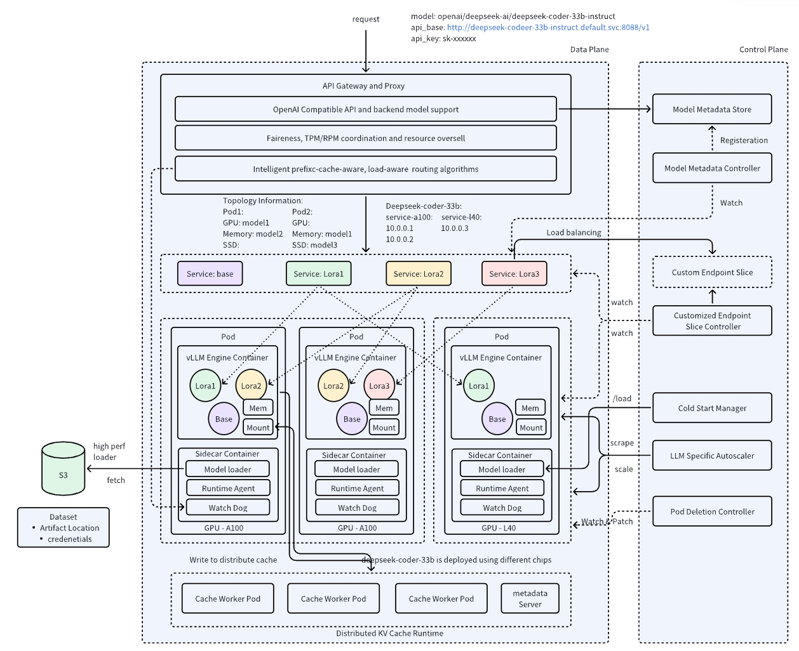

(图源:[AIBrix README](https://github.com/vllm-project/aibrix)。路由策略在 Gateway Plugins 层,与元数据服务、自动扩缩容并列。)

策略分四类。负载类:least-request / least-busy-time / least-latency / least-kv-cache / throughput / power-of-two;缓存类:`prefix-cache`(token 块哈希匹配 + 负载均衡防热点 + 多轮对话识别,官方数据:TTFT 比随机路由改善约 45%)和 `prefix-cache-preble`(实现 ICLR'25 的 Preble,前缀长度 + prompt 感知的成本模型);公平类:`vtc-basic`(实现 OSDI'24 的 VTC,按用户 token 用量做公平调度);SLO 类:`slo` / `slo-pack-load` / `slo-least-load`。

两个工程点:**可组合策略**——多策略归一化软打分后按权重混合(如 `"least-request:2,throughput:1"`),不是单一代价函数;**多副本状态同步**——网关插件多副本时前缀缓存状态经 Redis 增量同步,且必须显式开 `AIBRIX_STATESYNC_ENABLED`,否则各副本各算各的、路由结果不一致(官方文档点名这是最常见的踩坑点)。

实现细节与演进方向(来自源码与 issue):

- `prefix-cache` 的索引是**固定大小哈希表**:默认 20 万个块槽位、每块 4 token 做 xxhash、淘汰线程每秒最多跑 1 秒、清掉 20 分钟前的条目(`3rdparty/aibrix/pkg/plugins/gateway/algorithms/prefix_cache.go` 常量;`prefix_cache_and_load.go` 变体改用 RadixTree)。
- [#672](https://github.com/vllm-project/aibrix/issues/672):考虑从 xxhash 精确匹配转向**一致性哈希 + LSH**(局部敏感哈希)——牺牲一点匹配精度换取扩展性;该 issue 直接引用了 production-stack #59 的讨论。
- [#677](https://github.com/vllm-project/aibrix/issues/677):树版 Preble 实现已完成(`prefixcacheindexer` + `algorithms`),并指出 Preble 的一个实际痛点:**prefill/decode 的成本模型是线性回归,系数按"模型 × GPU"硬编码**——换个硬件就要重新标定。后续参考方向点名了 Preble、SGLang 和 D²LPM。
- CHWBL(见 KubeAI 节)曾被列入计划,因人力原因推迟。

### llm-d

[llm-d](https://github.com/llm-d/llm-d)(Red Hat/Google/IBM 等联合,K8s 原生分布式推理):路由在 EPP(Endpoint Picker,Gateway API Inference Extension 的扩展点)里,代表"精确派"缓存感知([文档](https://llm-d.ai/docs/architecture/advanced/kv-management/kv-indexer);EPP 代码已引入 `3rdparty/llm-d-router`,索引实现见 `pkg/kvcache/`)。

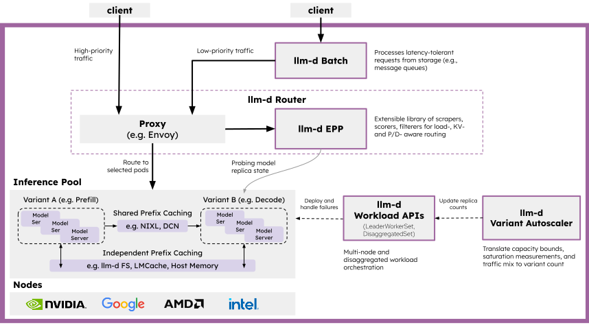

(图源:[llm-d README](https://github.com/llm-d/llm-d)。EPP 在网关路径上,消费各 pod 的 KV 事件流。)

工作方式:vLLM/SGLang/TRT-LLM 通过 ZMQ 发布 KV 事件(BlockStored / BlockRemoved / AllBlocksCleared),EPP 的 KV-Cache Indexer 维护全局"块→pod"索引,scorer 按最长连续前缀给候选 pod 打分、按介质层加权。独有的机制是**推测索引**(speculative indexing):路由决策做完、KV 事件还没传播到的窗口期里,先往索引写一条短期预测条目(TTL 默认 2 秒),等确认事件到达或过期——解决"连续两个同前缀请求,第二个在事件到达前被路由"的亲和断裂问题。多副本:每个 EPP 副本独立订阅所有 pod 的事件流,天然收敛到同一索引,active-active。KV 事件流正在成为生态标准接口(vLLM/SGLang/TRT-LLM 都发)。

### Kthena

[Kthena](https://github.com/volcano-sh/kthena)(Volcano 社区,华为系):K8s LLM serving 平台,数据面是 kthena-router,filter-score 插件框架。

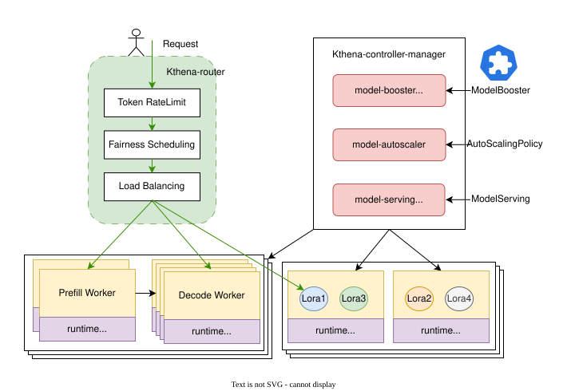

(图源:[Kthena README](https://github.com/volcano-sh/kthena)。kthena-router 是数据面,缓存感知以插件形式挂入。)

`kvcache-aware` 插件([文档](https://kthena.volcano.sh/docs/user-guide/kvcache-aware)):Runtime sidecar 订阅 vLLM 的 ZMQ KV 事件,把 token 块哈希写进 **Redis**;router 请求时查 Redis(块大小默认 16 token,最多匹配 128 块)给 pod 打分。PD 分离的调度顺序与别家相反:**先给 decode pod 打分排序,再为选中的 D 配同组 prefill pod**(保证 KV 局部性)。官方自述 router 是参考实现,因为 Gateway Inference Extension 不原生支持 PD 分离。

### KubeAI:无状态路线

[KubeAI](https://github.com/substratusai/kubeai) 的 PrefixHash 策略([博客](https://www.kubeai.org/blog/2025/02/26/llm-load-balancing-at-scale-chwbl/))与上面所有"记状态"的方案相反,**不维护任何缓存状态**:提取请求前缀(如首条 user 消息)+ LoRA 适配器名,xxHash 后用**带界负载一致性哈希**(CHWBL,Google Research 提出的经典算法,在视频分发等缓存敏感场景有大规模验证)选副本。相同前缀天然落同一副本;副本增减时一致性哈希只迁移少量映射;"有界负载"参数(如 `meanLoadFactor: 125`)防止热点。他们明确否决了 sticky session:agent 场景没有浏览器 cookie,客户端 IP 经 NAT 不可靠,且一个 agent 程序会模拟 N 个逻辑会话。

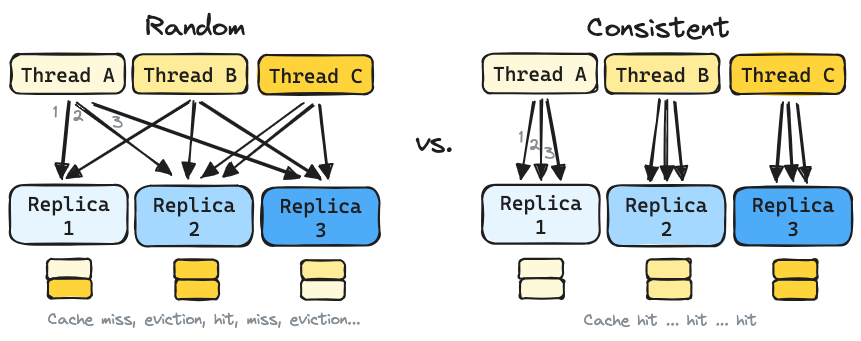

(图源:[KubeAI 博客](https://www.kubeai.org/blog/2025/02/26/llm-load-balancing-at-scale-chwbl/)。左:随机路由下同一会话的各轮被打散,缓存难以命中;右:一致性哈希让同前缀请求稳定落同一副本。)

实测(8×L4、Llama 3.1 8B、ShareGPT 会话):

| 指标(1200 并发线程) | 相对 K8s 默认随机路由 |
|---|---|
| TTFT | **降 95%** |
| 吞吐 | **升 127%** |

且并发越高,与随机路由的差距越大(低并发时三者接近):

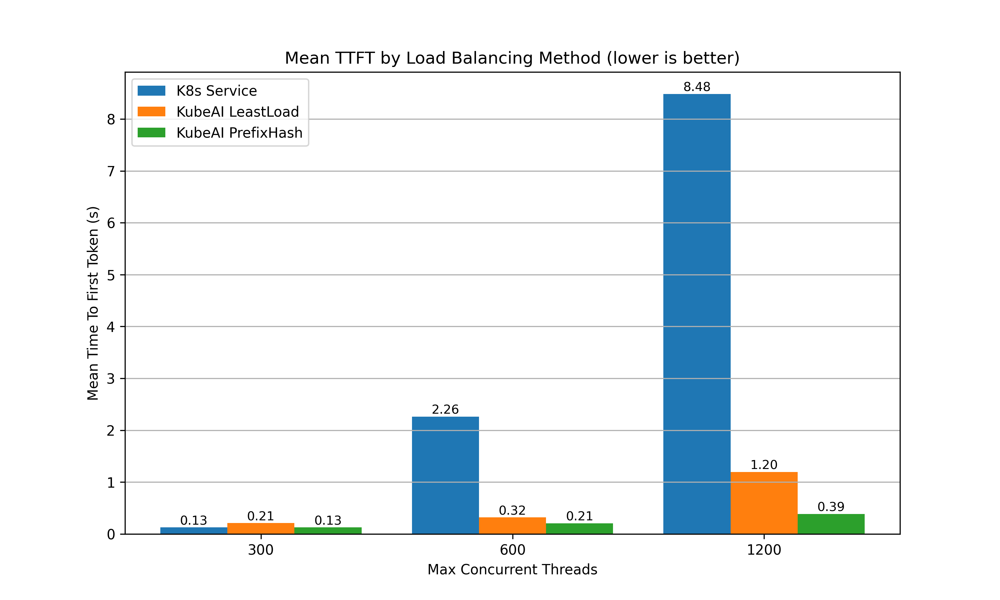

(图源:KubeAI 博客,同上。横轴为并发线程数,纵轴为 TTFT(对数坐标);并发越高,PrefixHash 与随机路由的差距越大。)

代价:哈希只保证"同前缀同副本",不知道缓存是否已被驱逐,也不感知实时负载(只在超界时让位)。

### 对照表

| 系统 | 缓存状态来源 | 命中与负载的结合 | 多副本一致性 |
|---|---|---|---|
| Dynamo Router | worker 主动发 KV 事件,router 建全局索引(权威在 worker) | 同一 cost 函数加权和 | 各副本订阅事件流收敛;在途负载副本间 best-effort 同步 |
| production-stack `kvaware` | LMCache controller 集中记账 | 命中优先,不达标回退 QPS/轮询 | 单副本为主 |
| SGLang `cache_aware` | router 本地近似树,按历史推测(无权威) | 失衡时整体切最短队列 | — |
| AIBrix `prefix-cache` | 前缀块哈希 + pod 指标周期拉取 | 命中+负载组合打分;多策略可加权混合 | Redis 增量同步(需显式开启) |
| llm-d EPP | KV 事件(ZMQ)→ 全局块索引 + 推测条目 | prefix scorer 与 load scorer 组合 | 各副本独立订阅全部 pod,收敛到同一索引 |
| Kthena | sidecar 订 KV 事件写 Redis,router 请求时查 | filter-score 插件链;PD 先选 D 再配同组 P | 状态外置 Redis |
| KubeAI(CHWBL) | **无状态**:前缀+LoRA 名哈希即路由 | 有界负载防热点,超界才让位 | 无状态,天然一致 |

lake 在这张表里的位置:缓存状态由存储池权威维护(强于推测、记账、事件收敛三种),会话亲和靠前缀命中自然获得。

## 6. 实例级调度:学术原型

### 预测输出长度

实例级路由的负载项需要知道"这个请求会占多久",而 decode 长度事先未知。这一支工作专门解决这个问题:

| 工作 | 机制 | 效果 |
|------|------|------|
| SSJF([arXiv 2404.08509](https://arxiv.org/abs/2404.08509),LMSYS) | BERT-base 代理模型预测输出长度,投机式最短作业优先 | 平均完成时间降 30-40%,吞吐 2.2-3.6× |
| ELIS([arXiv 2505.09142](https://arxiv.org/abs/2505.09142)) | BGE 编码器预测长度 + 最短剩余时间优先 | 平均完成时间降 19.6% |
| PARS([arXiv 2510.03243](https://arxiv.org/abs/2510.03243)) | 成对排序(learning-to-rank)预测相对长度,vLLM 实现 | 优于 FCFS 与既有 SJF 变体 |
| TIE([arXiv 2604.00499](https://arxiv.org/pdf/2604.00499)) | 预测长度**分布**而非点估计,按尾部风险惩罚长请求 | 每 token 延迟再降 2.9×(对 SSJF) |

### 调度算法

| 工作 | 出处 | 机制 | 与路由的关系 |
|------|------|------|--------------|
| Preble([2407.00023](https://arxiv.org/abs/2407.00023)) | ICLR 2025 | 全局前缀树 + 负载感知放置 | 缓存亲和调度的学术原型;AIBrix `prefix-cache-preble` 与 SGLang `cache_aware` 都源自它 |
| VTC([2401.00588](https://arxiv.org/abs/2401.00588)) | OSDI 2024 | 虚拟 token 计数的多租户公平 | AIBrix `vtc-basic`;lake 里公平性归 gateway |
| DLPM / D²LPM([2501.14312](https://arxiv.org/abs/2501.14312)) | 2025 | **公平 + 局部性统一**:deficit counter 版的 LPM;分布式版 D²LPM 用"每客户端 × 每 worker"双级配额 + 全局 radix 树,异步同步驱逐信息 | 首个同时保公平与前缀局部性的调度;吞吐最高 2.87× VTC;AIBrix #677 点名参考 |
| Llumnix([2406.03243](https://arxiv.org/abs/2406.03243),[开源](https://github.com/AlibabaPAI/llumnix)) | OSDI 2024 | **运行时重调度**:请求连 KV 一起在实例间热迁移,像 OS 的进程调度 | 路由是"决策时最优",迁移是"运行时纠偏"——第三条路;尾延迟改善一个数量级 |
| FastServe([2305.05920](https://arxiv.org/abs/2305.05920)) | NSDI 2026 | skip-join MLFQ,按输出 token 粒度抢占 | 解决实例内队头阻塞;与输出长度预测一支互补 |
| Autellix([2502.13965](https://arxiv.org/abs/2502.13965)) | 2025 | **程序级调度**:把 agent 程序当一等公民,按程序累计服务时间(PLAS)与关键路径(ATLAS)排优先级 | agent 多调用场景的调度;同延迟下吞吐 4-15× |
| Parrot([OSDI'24](https://www.usenix.org/system/files/osdi24-lin-chaofan.pdf)) | OSDI 2024 | Semantic Variable 暴露应用层数据流图 | 让调度器看见请求间依赖,而非孤立请求 |
| Mélange([2404.14527](https://arxiv.org/abs/2404.14527)) | OSDI 2024 | 成本感知的 GPU 选型:按请求尺寸分布 + SLO 解整数线性规划,混配异构 GPU | 模型级路由在基础设施侧的对应物;省 15-77% 部署成本 |
| Mooncake([2407.00079](https://arxiv.org/abs/2407.00079)) | FAST 2025 | KVCache-centric 全局调度器(Conductor):缓存亲和选 P/D 对 + 热点感知 + **预测式早拒**(过载时预测性拒绝而非排队) | 生产级缓存亲和调度的代表;分析见 [`mooncake/overview.md`](mooncake/overview.md) |
| Marconi([2411.19379](https://arxiv.org/abs/2411.19379)) | MLSys 2025 | 前缀缓存的**准入**与 FLOP 感知驱逐(按命中场景分类预测复用概率) | 缓存管理侧:不是什么前缀都值得缓存;对混合模型(SSM+Attention)尤其关键 |

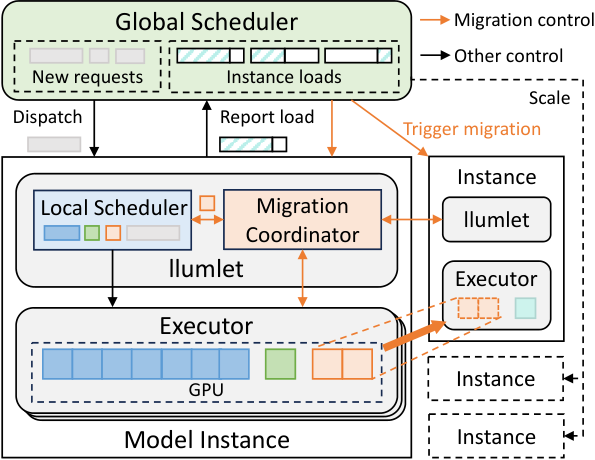

(图源:[Llumnix 论文](https://arxiv.org/abs/2406.03243) Figure 5。请求分发、KV 热迁移、自动扩缩容由同一个运行时调度器统一决策——路由是决策时最优,迁移是运行时纠偏。)

PD 分离一系(DistServe / Splitwise / PD-Serve 等)与本文主题相邻但已在 [`pd-disaggregation.md`](pd-disaggregation.md) 覆盖,不重复。

## 7. 跨层结论

1. **路由粒度受缓存约束**。逐请求换模型/换实例都会破坏缓存命中:Databricks 因此选任务级,OpenRouter 提供 `session_id` 粘连,Anthropic 从 provider 侧给出原因(换模型=重建整个前缀缓存),SGLang/production-stack 用一致性哈希和 session 策略做粘连。"换档要在缓存失效点做"是共同的纪律。OpenSquilla 的轮次级路由是反例,但它用缓存隔离+自适应提示词把换档代价本身改小了——粒度之争的实质是缓存代价之争。
2. **判断必须便宜**。没有任何一家拿前沿模型当路由器:Databricks 用小模型打标签,vLLM-SR 用 ModernBERT,RouteLLM 用矩阵分解/BERT,OpenSquilla 用本机 LightGBM。路由器成本必须远小于它省下的钱。
3. **评测比方法难**。benchmark 任务太规整,真实会话首轮 prompt 欠定义(Databricks 原话);LLMRouterBench 显示大量发表方法无效。任何路由策略上线前都要用真实 trace 回放评测。
4. **缓存命中率是一等运维指标**。Anthropic 把命中率下跌当事故(SEV)处理;harness 的提示词排布、工具集恒定、压缩 fork 都是围绕命中率的设计纪律。推理系统侧同理:命中率应进 SLO 与告警,而不只是性能计数器。

## 8. 对 Dynamo / lake Router 的借鉴

Dynamo Router 是实例级路由([分析见 dynamo/overview.md](dynamo/overview.md) "Router" 节):cost = prefill 负载 × 调整后 prefill 块数 + 预计 decode 块数 + 权重 × 在途请求数;缓存信号来自 worker KV 事件,负载信号来自本地记账,权重手工设定。

公式的演进方向值得注意:Dynamo 早期版本(`lib/llm/src/kv_router/scheduler.rs`)的打分只有一行 `logit = 2.0 * overlap_score - gpu_cache_usage - normalized_active`——命中、显存占用、在途请求三项线性组合;现在的 `lib/kv-router` 演成了多层命中分别计价(device/host/disk/shared 各有权重)加温度采样的多信号代价函数。信号在增加、计价在变细,但权重仍是手工设定的——这是"权重在线学习"一条的动机。

可做的方向,按类型分组:

**给代价函数加信号**

1. **decode 长度预测**。cost 里的 `potential_decode_blocks` 目前是粗估;SSJF/ELIS/PARS 证明轻量预测器(BERT 级)可行且收益明确。预测输出长度还能辅助执行模式选择:预计 decode 很短的请求倾向混部,长的倾向 PD 分离。lake 可做:Router 挂一个可选预测器,先用历史请求离线 replay 验证,不进关键路径。
2. **难度信号跨层传递**。模型级路由按 lake 的职责划分归 gateway,不在推理系统内实现;但 gateway 判出的难度/任务类型可以作为请求元数据传下来,推理系统用它做调度分级和预放置决策。这与 KVCR hint 协议同构:hint 传 KV 位置,这类元数据传请求属性,都是"上层知道得多、下层执行"的单向传递。
3. **agent / workflow 级上下文**。production-stack #244、Autellix、Parrot 说明社区已在要 workflow 级路由与指标。lake 的对应面:KVCR hint 协议传会话/工作流元数据,Router 按程序级上下文(而非单请求)做亲和;可复用 agentic workload 的 trace 分析([agentic-cache-workload.md](agentic-cache-workload.md))。

**代价函数本身**

4. **代价权重在线学习**。RouteLLM 证明路由器可以从反馈数据训练;Dynamo 有 FPM 指标回路(每次前向的结构化指标),可用观测到的 TTFT/ITL 对代价权重做闭环调整。用 bandit 级别的方法就够,不需要 RL;先在仿真里跑(Dynamo 侧对应物是 AISimulate/DynoSim)。
5. **可组合打分**(AIBrix)。多策略归一化后按权重混合(`"least-request:2,throughput:1"`),比单一代价函数灵活,且每种策略可独立灰度。lake 的代价函数目前是单一式,演化为 scorer 组合是低风险的扩展路径。

**亲和的边界与降级**

6. **命中阈值与失衡切换**。短请求设命中阈值,不做亲和查询直接负载均衡(production-stack 默认 2000 token);负载严重失衡时缓存亲和整体让位(SGLang 的双阈值切换)。lake 的亲和信息比各家都强(存储池权威视图,非推测),这些阈值与切换逻辑可以直接移植。
7. **推测索引**(llm-d)。路由决策到 KV 位置视图更新之间存在窗口期,连续同前缀请求会在窗口期内失去亲和。llm-d 的做法是决策后立即写入短期预测条目(TTL 2 秒),等确认或过期。lake Router 读存储池位置视图,同样有"决策-放置"窗口,这个机制可直接借用。
8. **无状态保底**(KubeAI CHWBL)。位置视图不可用或存储池控制面故障时,Router 可以退到"前缀+模型/LoRA 一致性哈希"——零状态、天然多副本一致、仍保前缀亲和,优于随机,也比"按负载预测"的降级路径更便宜。
9. **公平与局部性兼得**(D²LPM)。deficit counter 版的最长前缀匹配,分布式下用"客户端 × worker"双级配额。lake 里公平性决策归 gateway,但这套配额机制是 gateway 侧现成可参考的算法。

**工程纪律**

10. **热路径不阻塞,输入信号要监控**(production-stack #1016/#1074 的教训):路由决策路径上不能有同步阻塞调用(tokenize、RPC 要等);全零的负载数据看起来和"很空闲"一模一样,指标本身要被监控。lake Router 是 Go,异步不是问题,但 tokenize 的位置和信号质量监控要在设计里写明。
11. **换档代价显性计价**。Databricks 的工程结论——路由决策要把 cache miss 计入成本;Anthropic 从 provider 侧给出量化直觉(100k token 会话换便宜模型反而更贵)。lake 的执行模式选择函数里 D-direct / PD 分离的传输与重算代价已是显式项,这条已对齐;后续若做"会话中途换档"(如长会话压缩后重选模式),同样要在失效点做并计价。
12. **评测先行,命中率进 SLO**。RouterBench 式离线回放 + 仿真,优于直接上线调参;Anthropic 把命中率下跌当事故处理,lake 同理应把前缀命中率纳入 SLO 与告警,而不只是性能计数器。

**职责边界的确认**

13. **迁移归池,不归 Router**(Llumnix)。路由只能保证决策时刻最优,负载随 decode 推进不断变化,Llumnix 用 KV 热迁移做运行时纠偏。lake 架构下"迁移"就是存储池的重新放置——归池管,Router 不管;这印证了"池放置·调度读视图"的单向耦合划分,Router 侧对应的补偿机制是第 7 条的推测索引。

不照搬的:

- **级联逐档升级**(FrugalGPT 式):质量层机制,职责在 gateway;与 lake "故障不设降级链"不冲突(那是故障处理),但也不在推理系统内做。
- **语义相似度选模型**(embedding 路由):实例级路由要的是精确的块命中,语义相近不等于 KV 可复用;语义缓存在提示词层的复用是另一个课题,不在 Router 内。

## 9. 相邻主题存档(链接备查,不在本文展开)

以下来自个人技术笔记的整理,与路由相邻但属于别的层次,存档备查:

- **KV 显存管理(分配器层)**:vLLM 的 [cache policy framework(#11928)](https://github.com/vllm-project/vllm/pull/11928)、[unify allocating slots(#12608)](https://github.com/vllm-project/vllm/pull/12608)、[Hybrid Memory Allocator RFC(#11382)](https://github.com/vllm-project/vllm/issues/11382)、[Hybrid KV Cache Manager 设计文档](https://docs.vllm.ai/en/latest/design/hybrid_kv_cache_manager.html);蚂蚁 [glake](https://github.com/antgroup/glake) 仓里的 GMLake([arXiv 2401.08156](https://arxiv.org/abs/2401.08156),ASPLOS'24,训练侧显存碎片)、vTensor(VMM 虚拟张量管理)、LayerKV([arXiv 2410.00428](https://arxiv.org/abs/2410.00428),按层粒度的 KV 管理降 TTFT)。lake 对应层:存储池的块管理与碎片整理,见 [`architecture/kv-cache-pool.md`](../architecture/kv-cache-pool.md)。
- **实例内调度**:vLLM [prefix sorting(#13762)](https://github.com/vllm-project/vllm/pull/13762)(batch 内按前缀排序,提高 APC 命中)——batch 内优化,与实例间路由正交。
- **PD 间 KV 传输工程**:MLA 冗余拉取的随机映射、GQA 切分不对齐的先传后转、HCCL 的 2M 地址对齐、小块聚合成大传输 + 双流拷贝——见 [vllm-ascend#1568](https://github.com/vllm-project/vllm-ascend/pull/1568)、[Mooncake#502](https://github.com/kvcache-ai/Mooncake/pull/502)、[Mooncake#619](https://github.com/kvcache-ai/Mooncake/pull/619)、[知乎分析](https://zhuanlan.zhihu.com/p/1946608360259577576)。lake 对应层:Transfer Bus,见 [`mooncake/overview.md`](mooncake/overview.md) 与 [`hbm-tier-and-offload.md`](hbm-tier-and-offload.md)。

## 参考链接

- OpenAI:[GPT-5 System Card](https://openai.com/index/gpt-5-system-card/)、[Introducing GPT-5](https://openai.com/index/introducing-gpt-5/)
- Databricks:[Smart Routing 博客](https://www.databricks.com/blog/smart-routing-unity-ai-gateway-match-frontier-quality-30-lower-cost-task)、[产品文档](https://docs.databricks.com/aws/en/ai-gateway/smart-routing)
- OpenRouter:[Auto Router 公告](https://openrouter.ai/blog/announcements/introducing-the-new-auto-router/)、[文档](https://openrouter.ai/docs/guides/routing/routers/auto-router)
- OpenSquilla:[GitHub](https://github.com/TokenRhythm/opensquilla)、[技术报告](https://aixiv.science/abs/aixiv.260822.000001)([中文](https://chinaxiv.org/abs/202608.00176))、[数据飞轮论文 arXiv 2607.11399](https://arxiv.org/abs/2607.11399)、[官网](https://opensquilla.ai/zh/)
- Anthropic:[Prompt caching is everything](https://claude.com/blog/lessons-from-building-claude-code-prompt-caching-is-everything)
- 开源:[lm-sys/RouteLLM](https://github.com/lm-sys/RouteLLM)、[vllm-project/semantic-router](https://github.com/vllm-project/semantic-router)、[vllm-project/production-stack](https://github.com/vllm-project/production-stack)([KV-aware routing 文档](https://docs.vllm.ai/projects/production-stack/en/vllm-stack-0.1.11/use_cases/kv-cache-aware-routing.html);相关 issue:[#855 2026 roadmap](https://github.com/vllm-project/production-stack/issues/855)、[#1016 热路径阻塞](https://github.com/vllm-project/production-stack/issues/1016)、[#1073 回退信号过期](https://github.com/vllm-project/production-stack/issues/1073)、[#1074 全零负载假健康](https://github.com/vllm-project/production-stack/issues/1074))、[musistudio/claude-code-router](https://github.com/musistudio/claude-code-router)、[LiteLLM](https://github.com/BerriAI/litellm)
- 调度栈:[vllm-project/production-stack](https://github.com/vllm-project/production-stack)、[vllm-project/aibrix](https://github.com/vllm-project/aibrix)、[llm-d/llm-d-router](https://github.com/llm-d/llm-d-router) 三个已引入 `3rdparty/` 同名 submodule;[AIBrix 路由策略文档](https://aibrix.readthedocs.io/latest/features/gateway-plugins.html)(issue:[#672 LSH 路由](https://github.com/vllm-project/aibrix/issues/672)、[#677 树版 Preble](https://github.com/vllm-project/aibrix/issues/677))、[llm-d KV-Cache Indexer](https://llm-d.ai/docs/architecture/advanced/kv-management/kv-indexer)、[volcano-sh/kthena](https://github.com/volcano-sh/kthena)([kvcache-aware 插件](https://kthena.volcano.sh/docs/user-guide/kvcache-aware))、[substratusai/kubeai](https://github.com/substratusai/kubeai)([CHWBL 博客](https://www.kubeai.org/blog/2025/02/26/llm-load-balancing-at-scale-chwbl/))
- SGLang 调度源码(本地 `3rdparty/sglang/sgl-model-gateway/src/policies/`,[GitHub](https://github.com/sgl-project/sglang/tree/main/sgl-model-gateway/src/policies)):`cache_aware.rs`(近似前缀树+失衡切换)、`consistent_hashing.rs`(`X-SMG-Routing-Key` 会话粘连)、`tree.rs`
- 论文:FrugalGPT [2305.05176](https://arxiv.org/abs/2305.05176) · HybridLLM [2404.14618](https://arxiv.org/abs/2404.14618) · RouteLLM [2406.18665](https://arxiv.org/abs/2406.18665) · GraphRouter [2410.03834](https://arxiv.org/abs/2410.03834) · RouterBench [2403.12031](https://arxiv.org/abs/2403.12031) · LLMRouterBench [ACL 2026](https://aclanthology.org/2026.findings-acl.1881.pdf) · 路由综述 [2603.04445](https://arxiv.org/html/2603.04445v2) · When to Reason [2510.08731](https://arxiv.org/abs/2510.08731) · SSJF [2404.08509](https://arxiv.org/abs/2404.08509) · ELIS [2505.09142](https://arxiv.org/abs/2505.09142) · PARS [2510.03243](https://arxiv.org/abs/2510.03243) · TIE [2604.00499](https://arxiv.org/abs/2604.00499) · Preble [2407.00023](https://arxiv.org/abs/2407.00023) · VTC [2401.00588](https://arxiv.org/abs/2401.00588) · Llumnix [2406.03243](https://arxiv.org/abs/2406.03243) · FastServe [2305.05920](https://arxiv.org/abs/2305.05920) · Autellix [2502.13965](https://arxiv.org/abs/2502.13965) · Mélange [2404.14527](https://arxiv.org/abs/2404.14527) · Mooncake [2407.00079](https://arxiv.org/abs/2407.00079) · Marconi [2411.19379](https://arxiv.org/abs/2411.19379) · D²LPM [2501.14312](https://arxiv.org/abs/2501.14312) · GMLake [2401.08156](https://arxiv.org/abs/2401.08156) · LayerKV [2410.00428](https://arxiv.org/abs/2410.00428)
