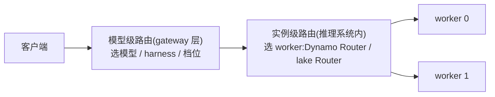
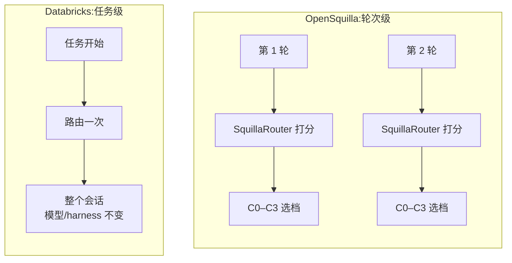
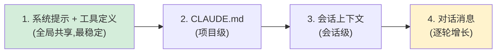
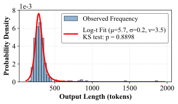

# 路由与调度调研:模型级路由与实例级缓存亲和调度

调研范围:LLM 服务的两层路由——模型级(选哪个模型/哪家 API/哪种 harness)与实例级(选哪个 worker 进程)。
调研目的:为 Dynamo / lake 的实例级 Router 找可借鉴的机制。
文档结构:第 1 节区分两层;第 2、3 节是模型级(产品、学术);第 4、5、6 节是实例级(约束来源、开源实现、学术原型);第 7 节是跨层结论;第 8 节是对 Dynamo / lake 的借鉴;第 9 节存档相邻主题的链接。

## 1. 两类路由

| | 模型级路由(model routing) | 实例级路由(instance routing) |
|---|---|---|
| **决策** | 这个请求发给哪个模型、哪家 API、哪种 agent harness | 确定模型后,发给哪个 worker 进程 |
| **目标** | 质量与成本的权衡(便宜模型能答就不调贵的) | 缓存命中与负载均衡(谁存着前缀 KV、谁空闲) |
| **典型位置** | gateway / 产品层 | 推理系统内部 |
| **代表** | OpenAI GPT-5 router、Databricks Smart Routing、RouteLLM | Dynamo Router、lake Router |

两层独立存在,可以串联:gateway 的模型路由先选模型,推理系统的实例路由再选 worker。



## 2. 模型级路由:厂商产品

归类之前先分清两个正交的维度,很多"路线之争"其实是把两个维度混在了一起:

- **决策形式**:发请求前一次性选定(路由),还是先跑便宜模型、不行再升级(级联);
- **判断依据从哪来**:人工规则、请求内容分类、效果数据学习、结构相似性、平台统计。

"轻量分类器"和"偏好数据学习"不是并列的两条路线——分类器是**手段**,偏好数据是**饲料**,完全可以用偏好数据训练一个分类器。所以下面按"判断依据从哪来"归类,决策形式在代表一列标出:

| 判断依据 | 怎么工作 | 训练/数据来源 | 代表(决策形式) |
|----------|----------|----------------|----------------|
| **人工规则** | 按场景/阈值写死规则 | 不学习 | claude-code-router、LiteLLM(路由) |
| **请求内容分类** | 分类器给请求打难度/类型标签,标签映射到模型档位 | 分类器本身怎么来,各家不同:推理时 prompt 小模型现打、是否专门训练未公开(Databricks);本地训练的 LightGBM,数据来自自家 harness 日志回流(OpenSquilla,飞轮机制公开);公开数据集微调的 ModernBERT,训练流程与数据集全部公开(vLLM-SR,见下文) | Databricks、OpenSquilla、vLLM-SR、HybridLLM(路由) |
| **效果数据学习** | 直接学习"这个请求哪个模型能答好" | 人类对战偏好(RouteLLM 用 Chatbot Arena);线上隐式反馈(OpenAI 用**用户手动切换模型的行为**当"选错了"的监督信号,再加偏好率与实测正确率);事后回放打分(FrugalGPT 的打分器) | RouteLLM、OpenAI(路由) |
| **先试再升** | 不预测,先跑便宜模型,给实际回答打分,不够再升级更贵的 | 打分器用回放数据训练(标签="便宜模型的回答对不对",来自标准答案或 judge 模型的事后判定) | FrugalGPT(级联) |
| **结构相似性** | 查询聚类或任务-模型建图,按同类查询上各模型的历史表现选 | 各模型的历史表现回放 | Avengers、GraphRouter(路由) |
| **平台统计** | 不学习,按全平台真实消费份额选每个任务类别的胜出者 | 平台最近 7 天消费数据 | OpenRouter auto-beta(路由) |

离线路线(RouteLLM/FrugalGPT 等)的标签本质是"**把候选模型都跑一遍、看谁够用**"的事后回放——RouterBench(§3)就是把这些回放结果公开成数据集;有产品日志的(OpenAI/Databricks/OpenSquilla)则把线上行为变成持续的数据飞轮。

两条共同约束贯穿所有路线:**做判断的组件必须比省下的钱便宜**(所以没有一家用前沿模型当路由器);**换模型的时机受缓存约束**(换模型=重建前缀缓存,见 §4)。

### OpenAI:GPT-5 系列的 real-time router

GPT-5 不是单个模型,而是一个系统:快速模型答大多数问题,深度推理模型处理难题,前面放一个实时路由器决定用哪个([GPT-5 System Card](https://openai.com/index/gpt-5-system-card/))。GPT-5.2 延续了这个结构,ChatGPT 里的 "Auto" 档就是路由器:在 Instant / Thinking / Pro 三档之间选([GPT-5.2 发布文](https://openai.com/index/introducing-gpt-5-2/))。

- **路由依据**:对话类型、复杂度、工具需求、显式意图(用户写 "think hard about this" 就强制走推理模型)。
- **训练方式**:持续用真实线上信号训练——用户手动切换模型的行为、回答偏好率、实测正确率。除此之外(分类器形态、特征、阈值)未公开。
- **兜底**:用量超限后由 mini 版接管剩余请求。
- **不对外暴露**:API 里仍是显式指定模型,路由器只在 ChatGPT 产品内工作。
- **用户接受度是真实问题**:路由器上线后引发强烈反弹——用户想知道自己用的是哪个模型;OpenAI 一周内恢复了模型选择器,2025 年 12 月进一步对 Free/Go 免费档**回滚**了自动路由(默认 Instant,推理模型改手动选),付费档保留 Auto([WIRED 报道](https://www.wired.com/story/openai-router-relaunch-gpt-5-sam-altman/))。

以上是模型级。OpenAI 的实例级路由(围绕缓存命中率)有公开文档,放在 §5 与开源实现一起讲(见 §5 "OpenAI API" 小节)。

### Anthropic:无官方路由

Anthropic 没有模型路由产品,Claude Code 里是用户手动 `/model` 选择。生态位由社区项目 [claude-code-router](https://github.com/musistudio/claude-code-router)(约 3.6 万 star)占据:本地代理拦截 Claude Code 请求,按场景规则分流——`background`(后台任务→便宜模型)、`think`(规划模式→推理模型)、`longContext`(超阈值→长上下文模型)、`webSearch`、`default`。纯规则,无学习成分。

### Databricks:Smart Routing + Omnigent(任务级,选模型也选 harness)

2026 年发布,Beta 状态,文档见 [Smart Routing for coding agents](https://docs.databricks.com/aws/en/ai-gateway/smart-routing),设计细节见官方博客 [Smart Routing in Unity AI Gateway](https://www.databricks.com/blog/smart-routing-unity-ai-gateway-match-frontier-quality-30-lower-cost-task)。面向编程 agent。


(图源:[Databricks 博客](https://www.databricks.com/blog/smart-routing-unity-ai-gateway-match-frontier-quality-30-lower-cost-task)。编程任务的成本-质量前沿上,模型与 harness 的组合高度分散,大量日常工作不需要最贵组合——这是路由存在的理由。)

要点:

1. **任务级而非请求级**。任务开始时定一次模型和 harness,整个会话不再换。原因:大规模下成本由 prompt cache 命中率主导,逐请求换模型会显著拉低命中率,省下的费用抵不过命中率下降的损失。
2. **分类器要便宜**。用一个低延迟小模型读任务描述和元数据,打几个语义标签:改系统的哪部分、提示词带什么代码证据(片段/报错栈/无)、失败形态、改动是否局部、项目类型。由此得出任务族和语言族。**训练方式未公开**:博客只说了"用小模型打标签",这个模型是 prompt 出来的通用模型还是专门训练的分类器、升/降档策略如何标定,都没有披露;公开的是评估方法——全量 session trace 落 Unity Catalog,AI 加人工复盘路由质量。
3. **默认中等,双向调整**。路由器默认选中档模型,按标签向上升档(需要前沿能力)或降档(任务简单)。一个策略覆盖整个模型谱系。
4. **模型和 harness 联合选择**。harness(决定每轮发多少上下文、何时调工具、何时压缩上下文)对成本的影响可以超过 2 倍,只换模型不换 harness 就得不到这部分收益。联合选择由 Omnigent(元 harness,编排多个编程会话)执行;子 agent 启动时独立再过一次路由——初始 prompt 往往欠定义,子任务边界更清晰,路由更准。


(图源:Databricks 博客,同上。任务级路由的流程:分类器读任务描述打标签 → 默认中档、按标签升/降档 → 整个会话保持该模型与 harness。)


(图源:Databricks 博客,同上。Omnigent 作为元 harness 编排多个编程会话:主任务过一道路由,每个子 agent 启动时独立再过一道。)

效果(博客给出的实测数字):

| 评测集 | 成本 | 质量 |
|--------|------|------|
| 内部 coding workload | Opus 5 单模型的 65%(省 35%) | 超过任一单模型 |
| 公开 coding benchmark | 省 56% | 追平 Opus 5 |


(图源:Databricks 博客,同上。路由把成本-质量权衡曲线推向左上:同等质量下成本更低。)

博客给出的四个后续方向:

- **先做任务边界免费的场景**:PR 评审、子 agent、批量迁移、定时任务——任务描述由机器生成、一开始就完整,不用猜。
- **晚几轮再路由**:首轮 prompt 是信息最差的决策点;让便宜模型先聊几轮澄清需求,任务成形后再路由。
- **会话做小**:一个会话一件事,主题变了就开会话,路由更准也更便宜。
- **换模型要在缓存失效点**:会话中途换模型意味着 cache miss;压缩(compaction)事件天然在丢缓存,是换模型的低成本时机。长期目标是路由层把 cache miss 显式计价。
  - 按这个思路做的产品:**Cognition Devin Fusion**([官方博客](https://cognition.com/blog/devin-fusion),2026-06):
    - 结构:一个前沿"主 agent"与一个便宜"sidekick"模型并行——主 agent 管规划、疑难和终审,sidekick 管代码探索、批量修改、跑测试等机械活。
    - 缓存:两者各自维护独立的缓存上下文,避免互相调用时重复付上下文的钱。
    - 换档时机:轻量分类器判断当前任务超出 sidekick 能力时,**卡在上下文压缩的时点换模型**——反正压缩要丢缓存,换模型不再额外花钱。
    - 效果(官方口径):自家编程评测 FrontierCode 上保持前沿质量、省约 35% 成本。

### OpenSquilla:开源 agent 的轮次级路由

[TokenRhythm/opensquilla](https://github.com/TokenRhythm/opensquilla)(Apache 2.0,基元律动)是微内核架构的开源 AI agent,模型路由是它的省钱手段之一,实现为 **SquillaRouter**。技术报告《OpenSquilla: Token-Efficient Agent = Models + Routing Harness》([aiXiv 260822.000001](https://aixiv.science/abs/aixiv.260822.000001),[中文 ChinaXiv 202608.00176](https://chinaxiv.org/abs/202608.00176));另有一篇讲路由数据飞轮的 [arXiv 2607.11399](https://arxiv.org/abs/2607.11399)。

**分类器是什么**。SquillaRouter 是本机运行的传统机器学习分类器:LightGBM(梯度提升树,传统 ML 而非神经网络,训练快、推理是微秒级)加 ONNX Runtime(跨平台推理引擎,模型文件随仓库用 Git LFS 分发)。给**每一轮**请求提取特征——长度、语言、是否含代码片段、关键词、语义嵌入——输出 C0–C3 四档的概率向量,按阈值映射到"能胜任的最便宜档"。整个推理在本机完成,零 token 消耗,提示词不出本机;原生库缺失或 `--router disabled` 时降级为直连单模型。

**分类器怎么训练**。数据来自 harness 数据飞轮(arXiv 2607.11399):每一轮路由把"选了哪个模型"与"任务最终成败"**分开记录**——成败由环境自动打标签(测试是否通过等),不需要人工标注;积累下来的错误决策就是下一版分类器的训练数据。新模型离线评估通过才上线,发现回归自动回滚。论文把这条路叫 "staged router-model path":冷启动用开源的 LightGBM ranker,随着日志积累逐步换成更强的路由模型。

**三层模型池的终局设想**(同篇论文,需要展开):飞轮的数据有**两个**消费者——既训练路由器(选得更准),也蒸馏/微调一个"harness 原生模型"(在这个 harness 的任务分布上比同价位通用模型更强)。两者互相加强:路由越准,原生模型拿到的训练数据越对口;原生模型越强,需要昂贵模型的轮次越少。收敛后的模型池分三层:

1. **超廉价快速通道**:最小模型吃掉占大头的机械轮次(代码探索、格式化、简单编辑),单轮成本趋近于零;
2. **harness 原生模型**:飞轮蒸馏出的专用模型,接管中间档;
3. **通用基座兜底**:前沿模型只处理前两层都搞不定的难题。

**每轮重选模型,缓存命中怎么保持**。换模型确实会丢 prompt cache,它的解法有两层:一是 **prompt 缓存隔离**——按档位划分缓存命名空间,同一档位的各轮共享该档位的前缀缓存;换档不是全部作废,而是回到该档位上次使用时的前缀位置继续。二是**自适应提示词**——简单轮次连系统提示都换成轻量版,前缀短,重建代价同步缩小。也就是说,轮次级路由把"换档丢缓存"从全损改成了按档位分段的部分损失。报告披露到这一层,更细的实现(历史消息如何裁剪进各档位命名空间)未公开。

与 Databricks 对照,它的差异点:



1. **粒度更细:轮次级**。Databricks 是任务级(任务开始定一次,保缓存);OpenSquilla 每一轮都重新选模型,靠上面的缓存隔离把换档代价改小。两种粒度谁更优,取决于 provider 侧缓存价格与命中形态,没有通用答案。
2. **路由之外还有集成**。难题不只路由给一个模型,而是分发给多个候选模型再聚合作答(mixture-of-agents 思路),报告声称在深度研究任务上以 Fable 5 的 31% 成本拿到更高分;带成本感知回退——单模型够用时自动跳过集成。
3. **思维深度分级**:简单轮次直接关闭推理(reasoning)输出,不为"你好"付推理 token 的钱。

技术报告的实测数字:

| 评测 | 对比对象 | 质量 | 成本 |
|------|----------|------|------|
| 全量任务 | 固定旗舰模型 | 保留 99.96% | 降 88.9% |
| PinchBench 25 任务 | OpenClaw + Opus 4.7 | 同分 0.925 | $0.688 vs $6.233 |

### 小米 MiMo Desktop:Smart 调度(产品公告,机制细节未公开)

[小米 MiMo 桌面客户端开放邀测](https://mp.weixin.qq.com/s/Ey0GaGl3erC6sm_ubOOEEQ)(2026-09,小米大模型公众号)。桌面 agent 产品,内置 "Smart" 调度,路线与 Databricks 一致——评估任务后同时选模型和执行框架,但路由维度分得更细:

- **任务评估**:识别任务类型(办公/编程/研究/设计/混合)、所需推理深度、工具范围和交付标准。
- **模型路由**:标准模型与旗舰模型之间动态选择——日常任务走标准模型(快、便宜),复杂推理与长链路任务走旗舰模型。
- **Harness / Agent / Skill 三级路由**:按任务类型选 harness;大任务拆给多个 agent(调研/规划/执行/复核);执行过程中按需调用 skill。
- **多会话协同**:多个会话组成角色团队,各自保持独立的记忆、工作区和任务状态,会话间自动通信。

成本侧给了两个数字:同会话缓存命中率最高 99%,**跨会话最高 95%**(公告口径,测试条件未公开)。

这节值得记的不是机制——**任务评估用什么模型、分类器是否专门训练、训练数据从哪来,公告全部未公开**——而是两个信号:模型+harness 联合路由正在成为 agent 产品的常见配置(OpenAI、Databricks、OpenSquilla 之后又一例);跨会话 95% 的命中率说明其调度在刻意维持跨会话的前缀亲和,可作为 §7 结论 3 的又一个产品侧数据点。

### OpenRouter:auto → auto-beta(市场信号)

OpenRouter 是 API 聚合商:一个 key 调各家的模型,按选中模型的原价计费,自动路由不另收费。它的自动选模型功能叫 `openrouter/auto`——2026 年 8 月之前由第三方路由创业公司 NotDiamond 的引擎驱动(NotDiamond 是一家专门做"帮你在多个模型间自动选模型"的公司,训练自己的元模型做选择),之后换成了自研的 auto-beta([公告](https://openrouter.ai/blog/announcements/introducing-the-new-auto-router/))。

新机制不训练任何模型,而是统计平台自己的消费数据,自称 "wisdom of the market":把 prompt 分到约 30 个任务类别(怎么分的未披露),对每个类别看**全平台开发者最近 7 天真实把钱花在了哪个模型上**(平台周流量 55T+ token),选份额最高的。用户可以用 `cost_tier`(low/medium/high/xhigh/max 五档价格带)限定只在某个价位内选;多轮对话传 `session_id` 保持模型粘连。


(图源:[OpenRouter 公告](https://openrouter.ai/blog/announcements/introducing-the-new-auto-router/)。读法:**行是用户指定的 `cost_tier` 价格档**——`default` 表示不指定档位,low/medium/high/xhigh/max 是五档价格带;**列是任务类别**;格子是该价格档 × 该类别下平台消费份额最高的模型及份额。同一类别在不同价格档下胜出者不同,路由就是把请求分到对应格子的胜出者。)

反例:**Martian** 是最早做模型路由的创业公司(2023 年种子轮 $9M,NEA/General Catalyst 投资)。

1. **思路**:"model mapping"——用可解释性方法分析各模型的内部表示,**不运行模型就预测**"这个请求哪个模型能答好";自称可解释性的第一个商业应用,还开源了 RouterBench(§3)。
2. **结局**:已从路由器转型为可解释性研究公司,routerbench 仓库 2024 年 6 月后停更。
3. **转型原因**([The LLM router was three products wearing one name](https://www.thedeepfeed.ai/posts/2026-06-09-llm-router-three-products-one-name/),2026-06 的分析):
   - **模型间价差塌缩**:便宜档模型降到每百万 token 几毛美元后,"选对模型"能省的绝对金额趋近于零,而路由器的延迟、维护和质量风险是固定成本,账算不过来。
   - **中间层两头不靠**:"一个入口接所有模型"的价值被聚合商(OpenRouter)拿走。
   - **信任难建立**:模型选择是开发者最在乎、也最难验证对错的决策(看不到"另一个模型会怎么答"),纯黑盒自动路由难以建立信任([相关讨论](https://www.linkedin.com/pulse/martian-vs-openrouter-optimization-trap-vidhi-vashishth-ney8c))。
4. **对照**:OpenRouter 的玩法正好绕开这三点——先把接入、计费、failover 做好,自动路由只作为可选项。

### vLLM Semantic Router(开源)

[vllm-project/semantic-router](https://github.com/vllm-project/semantic-router):挂在 Envoy 网关上的外挂处理器(ext_proc),用 Rust(Candle/ONNX)在本地跑分类器,Go 负责与 Envoy 对接。工作方式很直接:请求进来后先过一组本地小分类器,分类结果按人工写的布尔规则组合,决定发给模型池里的哪个模型。

**训练完全公开**([训练文档](https://llm-semantic-router.readthedocs.io/en/latest/training/datasets/)):共享一个 ModernBERT-base 骨干(BERT 架构的现代化版本),上面挂四个分类头,各用一个公开数据集微调——领域分类(MMLU-Pro,10 类)、PII 检测(Microsoft Presidio 数据集,6 类实体)、越狱检测(越狱分类数据集,二分类)、意图分类(Glaive Function Calling,8 类)。模型和代码都在 HuggingFace / GitHub 上。这是"分类器路线"里训练过程最透明的一家,可以直接复现。

论文 [When to Reason(arXiv 2510.08731)](https://arxiv.org/html/2510.08731v1) 验证了其中一个场景的收益:先判断"这题需不需要推理",不需要就走非推理模型——MMLU-Pro 上延迟与 token 消耗减半且精度不降。

**分类链路本身的开销**也值得记([arXiv 2603.12646](https://arxiv.org/html/2603.12646v1)):原始实现处理 8K token 输入要 **4,918ms**(标准 attention 是 O(n²) 内存,3 个并发分类器光 attention mask 就要约 4.5GB,与 vLLM 共享 GPU 时直接 OOM)。三段优化后到 **50ms**(累计 98 倍):

1. 自研 Flash Attention 算子(ONNX Runtime / ROCm),attention 内存降到 O(n):4,918 → 127ms(38.7 倍);
2. 经典 NLP 压缩(TextRank、TF-IDF、位置加权、新颖度打分)把任意长度输入先压到约 512 token 再进分类器,延迟与显存都与原长度脱钩:127 → 62ms(2 倍);
3. 近流式请求体处理(自适应分块 + 零拷贝 JSON):62 → 50ms(1.2 倍)。

最终 16K token 的路由 108ms 完成,路由器显存占用 <800MB——可以与 LLM 服务共享一张卡,不需要独占加速器。

### LiteLLM / Portkey 等 AI 网关

路由策略是负载均衡与容错型(least-busy、最低延迟、成本上限、顺序 fallback),不做"这个请求哪个模型答得好"的质量预测。与模型级路由是近邻但不同类。

## 3. 模型级路由:学术与评测

### 成本-质量路由主线

| 工作 | 年份/出处 | 机制(具体怎么判断) | 备注 |
|------|----------|------|------|
| FrugalGPT([arXiv 2305.05176](https://arxiv.org/abs/2305.05176)) | 2023,Stanford | **级联**:先调最便宜的模型,用一个微调过的 DistilBERT 给实际回答打分(够不够对),够就直接返回,不够再调更贵的,逐级升级。打分器的训练数据 = 把各模型在历史数据上都跑一遍、对照标准答案回放打分 | 最高省 98% 成本。与路由的区别:路由在发请求**前**做一次选择;级联是拿到回答**后**再决定要不要升级,可能串行调多个模型,延迟逐级叠加 |
| HybridLLM([ICLR 2024](https://arxiv.org/abs/2404.14618)) | 2024 | 微调 BERT 预测"这个查询小模型能不能答",能就走小模型、不能走大模型;标签来自事后回放判定 | 难度预测路线的代表 |
| RouteLLM([arXiv 2406.18665](https://arxiv.org/abs/2406.18665),[lm-sys/RouteLLM](https://github.com/lm-sys/RouteLLM)) | 2024,LMSYS | 用 Chatbot Arena 真人对战数据训练四种路由器:**相似度加权排名**(把查询嵌入,找 Arena 里最相似的对战记录,按相似度加权算出"强模型在这类查询上的胜率")、矩阵分解、BERT 分类器、causal LLM 分类器;再用一个阈值控制"胜率差多大才值得调强模型",阈值越高越省钱 | MT-Bench 上省 85% 成本、保持 95% GPT-4 质量;开源、模型数据在 HuggingFace |
| GraphRouter([ICLR 2025](https://arxiv.org/abs/2410.03834)) | 2025 | 把任务、查询、模型建成异构图的节点,"某模型能答好某查询"是边;路由变成预测边——相似任务之间可以互相提供证据 | 利用任务间结构信息 |
| Avengers([arXiv 2408.12683](https://arxiv.org/abs/2408.12683)) | 2024 | 最简单的一支:把历史查询按嵌入**聚类**(嵌入后按向量距离分组),统计每个簇里哪个小模型历史平均分最高;新查询落入哪个簇,就用那个簇的冠军 | 不训练任何神经网络也有竞争力 |
| Avengers-Pro([arXiv 2508.12631](https://arxiv.org/abs/2508.12631)) | 2025 | Avengers 的成本版,三步轻量操作:嵌入(Qwen3-embedding-8B)→ k-means 聚成 60 簇 → 每个簇给每个模型算"性能-效率分"(参数 α 加权该簇上的准确率与成本);推理时把查询嵌入选最近的 4 个簇,按簇分数加总选模型。调 α 就在"更准"与"更省"之间滑动 | 6 个 benchmark、8 个旗舰模型上:同等成本比 GPT-5-medium 高 +7% 准确率,同等质量省 27% 成本;LLMRouterBench 里表现最好的方法(见下) |
| 综述([arXiv 2603.04445](https://arxiv.org/html/2603.04445v2)) | 2026 | 路由/级联统一分类 | 入门地图 |


(图源:[RouteLLM 论文](https://arxiv.org/abs/2406.18665) Figure 2。读法:横轴 = 调用强模型(GPT-4)的比例,近似成本;纵轴 = MT-Bench 质量。四条实线是论文训练的四种路由器——SW ranking = 相似度加权排名,Matrix factorization = 矩阵分解,BERT / Causal LLM = 两种分类器,**(A) = 训练时做了数据增强**;灰色虚线是"按同样比例随机调用 GPT-4"的基线。曲线越靠左上越好:花同样的强模型调用比例,拿到更高的质量。)

### 评测:方法多,有效的少

- [RouterBench](https://arxiv.org/abs/2403.12031)(2024,Martian 开源):11 个模型 × 7 个任务,40 万条预计算输出。做法是把"每个模型在每个请求上答得怎么样、花多少钱"事先算好公开,新路由器不用重跑模型就能离线评测——路由策略离线评测的事实标准。
- [LLMRouterBench](https://aclanthology.org/2026.findings-acl.1881.pdf)(ACL 2026 Findings,上海 AI Lab):更大规模的统一重测——40 万实例、21 个数据集、33 个模型,构建花约 1.8B token、1K GPU 时加 $2.7K API 费。被测的 10 个方法覆盖各路线:RouterDC、EmbedLLM、MODEL-SAT、Avengers、HybridLLM、FrugalGPT、RouteLLM、GraphRouter、Avengers-Pro,以及**商业产品 OpenRouter**。它分两个设定,参照系不同,读结果时不能混:

  **设定一:性能设定**(20 个约 7B 的轻量模型池,只看准确率)。参照系:Random(随机选,下限)、Best Single(事后知道的全局最强单模型)、**Dataset Oracle**(每个数据集固定选该数据集的最强单模型)、Oracle(逐题选对且最便宜,理论上限)。结果:

  1. 领先方法彼此接近(EmbedLLM / GraphRouter / MODEL-SAT / Avengers 的 AvgAcc 在 70.3–71.9 之间),且都接近 Dataset Oracle 的 73.10。**为什么这说明收益来自粗粒度领域结构**:Dataset Oracle 只做一件粗粒度的事——"认出这是数学题,就派数学最强的模型",不做任何逐请求的精细判断;最好的路由器几乎追平它,说明现有方法的收益绝大部分来自这一层。反过来说,论文里各种精巧的逐请求判断,相对"按域选模型"几乎没带来额外收益。
  2. 与理论上限的差距(Gap@O 约 21%)主要来自**模型召回失败**:只有不超过 3 个模型能答对的题(占测试集 11.9%),路由器准确率只有约 24%;即使放宽到"正确答案在路由器的前 3 个候选里"(Recall@3)也只有约 50%。精细判断不是没收益,是现有方法做不到。
  3. 对部署友好的结论:Avengers 不训练神经网络(纯聚类)也在第一梯队;embedding 骨干换成弱模型几乎不影响结果;**模型池越大收益越递减,精心挑选的小池子更划算**——原因是路由的收益来自模型间的互补(各有所长):Oracle 曲线显示从 2 个模型加到 4-6 个时上限提升最大,之后新模型擅长的领域大多已被覆盖,边际互补趋零;同时候选越多,路由器选错的概率越高。按"覆盖更多领域"挑 4-6 个互补的模型,比堆 20 个更划算。

  **设定二:性能-成本设定**(13 个旗舰模型池,参照系 Best Single = GPT-5)。指标:PerfGain(质量相对 GPT-5 的增减)与 CostSave(质量不低于 GPT-5 前提下的最大省钱幅度)。结果:**OpenRouter 的 PerfGain 是 −24.7%**——质量比"所有请求都发给 GPT-5"还差 24.7%,质量不达标所以 CostSave 记 N/A(论文脚注:OpenRouter 用自己平台的模型池,不可配置)。这与设定一不矛盾:Dataset Oracle 是轻量池里的上界参照,−24.7% 是旗舰池里相对 GPT-5 基线的差距,两个设定两批模型。表现最好的 **Avengers-Pro**:PerfGain +4.0%、CostSave +31.7%,几乎独占 Pareto 前沿(机制见上表);RouteLLM +2.6% / +11.4%;HybridLLM、FrugalGPT 两个二分类级联/路由器都是负收益。
- [RouterArena](https://arxiv.org/abs/2510.00202)(ICLR 2026,[排行榜](https://routeworks.github.io/)):实时排行榜形态,把路由器当黑盒测(各家用各自的模型池),主指标 Arena Score 是准确率与 log₂ 成本的加权调和平均。榜单滚动更新、榜首更迭很快,以下以 **2026-09 的榜单**为准:

  1. **前五名**(Paix2 77.63 / KT-ModelRouter 76.28 / Sqwish 76.21 / Divyam 75.85 / Cross-Router 75.75):全部是个人或商业提交,路由原理均未公开。但提交以 PR 形式进 [RouteWorks/RouterArena](https://github.com/RouteWorks/RouterArena) 仓,`router_inference/config/` 下的配置文件公开了各家的**模型池**——这本身就很有信息量:
     - **Paix2**(第 1):池子只有 4 个——MiniMax-M3 / agnes-2.0-flash / DeepSeek-R1-Qwen3-8B / GLM-4-9B,全是小模型便宜模型($0.27/1K 查询)。**成绩有诚信争议**(两个 issue 截至 2026-09 仍 open):[#190](https://github.com/RouteWorks/RouterArena/issues/190) 指其提交在已记录全部候选答案与分数之后修改了 294 题的路由选择,"最优选择率"从 66.35% 跳到 89.68%、最优准确率变成 100%——疑似看了评测结果再定路由(榜单规则明确禁止在评测数据上调路由器);[#203](https://github.com/RouteWorks/RouterArena/issues/203) 指其 MiniMax-M3 结果经 OpenRouter 复现不出(84.12% vs 65–69%,输入 token 数也对不上)。
     - **KT-ModelRouter**(第 2):池子 5 个(deepseek-v4-flash/pro、gemma-4-31b、gemini-3-flash、qwen3-235b),描述只有一句"内部训练的路由策略"。
     - **Sqwish**(第 3):商业,池子 5 个(qwen3-235b、qwen3-next-80b、Qwen3-Coder-Next、gemini-3.1-flash-lite、deepseek-v4-flash)。
     - **Divyam**(第 4)/ **Cross-Router**(第 5):个人提交,池子 4 / 7 个,原理未公开。
  2. **公开原理的最高名次**:
     - **vLLM-SR**(第 6,74.86):ModernBERT 多分类器(见 §2)。
     - **nadir-caliper**(第 7,74.55):Nadir 作者的校准变体,细节未公开。
     - **Weave Router**(第 10,72.82,[源码可得](https://github.com/workweave/router),Elastic License):**Avengers-Pro 的产品化**——进程内 ONNX 小模型做嵌入,对冻结的意图簇中心打分(簇打分器从 Avengers-Pro 改来,用生产流量重训),选该簇上历史表现追平旗舰的最便宜模型;按 action(单次 API 请求)路由,带会话粘连保缓存;决策 <50ms。
     - **Nadir Router**(第 11,72.29,[开源](https://github.com/NadirRouter/NadirClaw)):嵌入质心二分类——all-MiniLM-L6-v2 嵌入后与"简单/复杂"两个质心比余弦相似度,再叠加规则覆盖(检测到工具调用强制走强模型、检测到推理标记走推理模型、超长换长上下文模型、会话内保持同模型)。
     - **OrcaRouter-Adaptive**(第 12,72.08,[开源](https://github.com/Continuum-AI-Corp/OrcaRouter-Lite)+[论文](https://arxiv.org/abs/2605.30736)):**LinUCB 上下文 bandit**——用词法 + 句嵌入特征,离线阶段在精选 prompt 集上全信息评估每个候选模型、每臂拟合一个岭回归,上线后按 bandit 反馈只更新被选中那一臂。
  3. **知名商业/旗舰反而靠后**:GPT-5 第 24(64.32,贵),NotDiamond 第 28(57.29,频繁选贵模型)。

  从这份榜单能读出三个结论:

  1. **头部全是"小而便宜的精选池"**(4-7 个模型,以 flash/小杯为主)——正是上文 LLMRouterBench"精心挑选的小池子更划算"结论的实战版。
  2. **公开原理的上榜者仍是"嵌入特征 + 轻量分类/回归/bandit"一族**,与 LLMRouterBench 里 Avengers 系表现最好互相印证。
  3. **黑盒榜单防不住"看了答案再路由"**:Paix2 争议是"评测比方法难"(§7)的极端案例——只交预测文件不交代码的赛制,区分不了"真会路由"和"拟合了评测集"。

  论文总结的共同短板:现有路由器都不擅长识别"这题便宜模型就够了"的查询。
- **数字打架,怎么理解**(梳理而非堆砌):关于路由能省多少钱,四类来源的数字差出一个数量级——

  | 来源 | 数字 | 口径 |
  |------|------|------|
  | 学术论文(FrugalGPT / RouteLLM) | 省 85–98% | 两极模型池(旗舰 vs 极小)、单题 benchmark、质量阈值宽松 |
  | 厂商自报(Factory / Databricks / OpenSquilla) | 省 20% / 35–56% / **88.9%** | 各自 workload、各自基线,口径互不可比 |
  | 独立重测(LLMRouterBench) | 最好省 31.7%(Avengers-Pro);OpenRouter 为负 | 统一数据、统一基线(GPT-5) |
  | 第三方综合([Sean Geng](https://seangeng.com/writing/the-honest-guide-to-llm-routing)) | 生产混合流量约 **20–25%** | 综合多家实测后的估计 |

  梳理后的结论:省钱幅度 ≈ **池子档差 × 简单流量占比**。论文数字大是因为池子两极化(旗舰和 7B 差百倍价格)且题目里简单题占大头;生产池档差小、难题占比高,所以 20–25% 才是可信区间。OpenSquilla 自报的 88.9% 看着夸张,但按这个公式反而说得通:它的池子有"单轮成本趋近于零"的超廉价档(档差极大),且 agent 流量里机械轮次占大头(简单流量占比极高)——两个因子都拉满。所以凡是声称 90% 的,先问它池子和流量分布。

## 4. 实例级路由的约束来源:缓存命中率

实例级路由为什么以缓存命中为核心变量,两个层面各有原因:harness 侧的设计纪律决定前缀的形态(能不能命中),调度侧的策略决定请求落到哪个实例(命中发生在哪)。本节先看 harness 侧,下一节看调度侧。

### Anthropic 的 Claude Code 经验(harness 侧)

[Lessons from building Claude Code: Prompt caching is everything](https://claude.com/blog/lessons-from-building-claude-code-prompt-caching-is-everything)(2026-04,Anthropic 官方)。核心事实:prompt 缓存是**前缀匹配**——前缀里任何一处变了,其后全部失效。Claude Code 的整个 harness 围绕这条约束设计。

提示词的排布顺序(原文无配图,按文中描述整理):



越靠前越稳定、共享面越大;任何一处的改动使其后全部缓存失效。

- **提示词排布:静态在前,动态在后**。系统提示与工具定义(全局共享)→ CLAUDE.md(项目级)→ 会话上下文(会话级)→ 对话消息。他们实际打破过缓存的几种方式:在静态系统提示里放了精确时间戳、工具定义顺序不稳定、改了工具参数。
- **更新走消息,不改提示词**。时间、文件变更这类易变信息,塞进下一轮 user 消息或工具结果里,而不是改系统提示。
- **会话中途不换模型**。缓存按模型隔离:对话进行到 100k token 时,哪怕问题很简单,换便宜模型也比留在贵模型上更贵——要重建整个前缀缓存。要换模型就用子 agent,让主 agent 写交接消息。
- **会话中途不增删工具**。工具定义在缓存前缀里。Plan Mode 的实现方式是把 `EnterPlanMode`/`ExitPlanMode` 本身做成工具,工具集恒定;大量 MCP 工具用 `defer_loading` 发轻量占位(名字+标记),模型需要时再加载完整 schema,占位恒定所以前缀稳定。
- **压缩(compaction)用缓存安全的 fork**:压缩请求复用父会话完全相同的系统提示、上下文和工具定义,把压缩指令作为新的 user 消息追加在末尾——对 API 来说这几乎就是父会话的上一次请求,前缀缓存全部命中。
- **把缓存命中率当可用性指标监控**:命中率掉太多就当事故(SEV)处理。几个百分点的命中率波动对成本和延迟影响巨大。

这篇博客从 provider 侧解释了为什么 Databricks 选任务级路由:换模型的真实成本是缓存重建,不是 token 单价差。

## 5. 实例级路由:开源实现

各家的差别主要在三点:缓存状态从哪来(推测 / 集中记账 / 事件订阅 / 无状态)、命中与负载怎么结合、多副本怎么一致。

一个常见疑问:production-stack 和 AIBrix 都在 vllm-project 下、都有路由器,是否重复开发?答案是否,出身不同:

1. **production-stack**:vLLM 团队自孵化的**参考实现**(Python,轻量,教你怎么把单实例扩成分布式)。
2. **AIBrix**:字节跳动**捐赠**的生产级基础设施(Go,K8s 原生控制面,路由只是其九大功能之一)。

路由重叠是因为路由是任何分布式栈的必备件;维护者在 [#177](https://github.com/vllm-project/production-stack/issues/177) 明确了两家分工,且随着生态向 Gateway API Inference Extension + llm-d EPP 收敛([#1032](https://github.com/vllm-project/production-stack/issues/1032)),两家自研 router 都在退为参考/过渡实现。

这里展开一下这个组合,后文会反复出现:**Gateway API** 是 K8s 官方的流量入口标准(Ingress 的继任者);**Inference Extension** 是它面向推理服务的扩展,定义了"把模型请求路由到后端 pod"的标准接口;**EPP**(Endpoint Picker)是这个接口里的扩展点——网关转发前先调一个外部服务来选 pod,llm-d 的 EPP 实现就是它的 KV 感知路由器。一句话:前者是标准,后者是标准下的一个实现。

### vLLM production-stack

[vllm-project/production-stack](https://github.com/vllm-project/production-stack) 是 vLLM 项目下的 K8s 分布式部署栈(已引入 `3rdparty/production-stack`),其请求路由器(`vllm_router`)的 `routing_logic.py`(本地 `3rdparty/production-stack/src/vllm_router/routers/routing_logic.py`)实现了多种策略。


(图源:[production-stack README](https://github.com/vllm-project/production-stack)。路由器位于客户端与 vLLM 实例之间,是缓存亲和策略的落点。)

| 策略 | 机制 | 适用 |
|------|------|------|
| `roundrobin` | 轮询 | 负载均匀,无缓存亲和 |
| `session` | 按请求头里的 session id 粘连;无 session id 时选 QPS 最低者 | 多轮对话 |
| `prefixaware` | 路由器本地维护前缀树,同前缀永远发同一实例——**即使缓存已被驱逐** | 前缀形态稳定 |
| `kvaware` | 经 **LMCache controller** 集中查询各实例实际持有的前缀,路由到最长命中的实例;低于 `--kv-aware-threshold`(默认 2000 token)或不命中则回退 QPS/轮询 | 缓存状态实时可见 |
| `disaggregated-prefill` 系列 | PD 分离部署的 prefill/decode 分流 | PD 分离 |

`kvaware` 与 `prefixaware` 的差别值得注意:前者查的是**实例真实持有的缓存**(LMCache controller 集中记账),后者查的是**路由器自己的历史记录**(发过的就以为还在)。驱逐之后,后者会把请求发到已经没有数据的实例上。

**设计源头**是 [RFC #59](https://github.com/vllm-project/production-stack/issues/59)(prefix-cache-aware routing),其中明确了一个关键取舍:**token-ID 匹配准但 tokenize 太慢(每请求数微秒起),路由器承担不起,所以改用字符串匹配**;初版用 SQL 库存"链式内容哈希"(`hash(c0+...+ci)` 逐块前缀哈希)加按实例 LRU 淘汰。这个"路由器不做 tokenize"的判断,与后面 #1016 的事故互为印证。

**issue 里的工程教训**:

- **热路径不能阻塞**([#1016](https://github.com/vllm-project/production-stack/issues/1016)):`KvawareRouter` 在 uvicorn 事件循环里做三件同步事——`AutoTokenizer.from_pretrained` 联网拉 tokenizer(模型用别名时永远失败,每请求重试)、把完整 prompt 同步 POST 给 `/tokenize`、同步等 controller 的 ZMQ 往返——结果是路由器自己的 `/health` 答不出来,K8s 探针超时,持续流量下 CrashLoop(实测一小时重启 25 次,请求零完成)。
- **回退路径的信号质量**([#1073](https://github.com/vllm-project/production-stack/issues/1073)):PrefixAwareRouter 低于命中阈值时按 QPS 回退,但用的是过期 QPS 值,把所有回退请求打到同一个后端上。
- **输入信号本身要被监控**([#1074](https://github.com/vllm-project/production-stack/issues/1074)):指标名对不上时,EngineStats 全零——看起来"很空闲很健康",负载均衡被静默喂了假数据。
- **端点生命周期**([#1008](https://github.com/vllm-project/production-stack/issues/1008)):pod 被驱逐后路由器残留幽灵端点,请求超时。
- 2026 roadmap([#855](https://github.com/vllm-project/production-stack/issues/855))里与路由相关的:XpYd 分离 prefill、路由到外部 provider(OpenAI/Anthropic)、router 侧请求排队、**基于未来负载的预测式路由**、优先级路由、用 Rust/Go/Nginx 重写路由器前端(Python 性能到顶)、agent 工作负载的智能路由。

**issue 里的跨仓讨论**:

- **与 AIBrix 的定位之争**([#177](https://github.com/vllm-project/production-stack/issues/177)):维护者答复——production-stack 走轻量、Python 可编程、紧跟 vLLM 上游(经 upstream connector);AIBrix 走 K8s 原生、Go、当时需要修改 vLLM 0.6.1 才能做 KV 操作。评论区的定位:替代 LiteLLM/MLflow 这类通用代理,但深度绑定 vLLM 的指标与运维。
- **agent 负载的路由需求**([#244](https://github.com/vllm-project/production-stack/issues/244)):feature request 要三样东西——跨 agent 的 KV 复用(同一 workflow 的 agent 共享上下文)、按 `session_id`/workflow 元数据的 agent 感知路由、workflow 级指标(跨 agent 命中率、workflow TTFT)。说明"agent 感知路由"已是社区显性需求。
- **K8s 网关生态收敛**([#1032](https://github.com/vllm-project/production-stack/issues/1032)):kgateway 在 2.1 弃用、2.2 移除了 inference extension 支持,production-stack 迁移到 agentgateway + llm-d Router。信号:K8s 原生的推理路由正在向 **Gateway API Inference Extension + llm-d EPP** 这一组合收敛,各家自研 router 的定位都在向"参考实现"退(Kthena 官方也这么自述)。

**要点**:

- `kvaware` 与 `prefixaware` 的本质差别是"知不知道缓存已被驱逐":前者查 LMCache controller 集中记账,后者查路由器本地历史。
- 最大教训是热路径纪律:路由器不 tokenize、不做同步远程调用(#1016 一小时重启 25 次)。
- 生态信号:K8s 推理路由正向 Gateway API Inference Extension + llm-d EPP 收敛。

### SGLang

SGLang 的路由组件(`sgl-model-gateway`,Rust)的策略列表在 `src/policies/` 下,与 APC 相关的两个:

- **`cache_aware`**(`cache_aware.rs` + `tree.rs`):路由器为每个 worker 维护一棵**近似前缀树**(存原始文本而非 token id,省 tokenize 开销),按请求历史推断各 worker 的缓存内容,不查引擎真实状态。匹配率超阈值就发最匹配的 worker,否则发树最小(缓存容量最空)的;后台 LRU 驱逐叶子防内存膨胀。**负载不均衡时**(max-min 超绝对阈值且 max/min 超相对阈值)自动切到最短队列优先,均衡时切回缓存感知——缓存亲和与负载均衡按系统状态二选一,不是加权求和。
- **`consistent_hashing`**(`consistent_hashing.rs`):会话粘连。优先级:显式 `X-SMG-Routing-Key` 请求头 > 隐式稳定头(`authorization` / `x-forwarded-for` / `cookie`)> 匿名请求随机。一致性哈希环保证 worker 上下线时只有少量会话换节点。

**要点**:

- `cache_aware` 用路由器本地近似前缀树(存文本不存 token,零 tokenize 开销)按历史推测缓存,不查引擎。
- 负载失衡时整体切最短队列:缓存亲和与负载均衡是**二选一切换**,不是加权求和。

### AIBrix

[AIBrix](https://github.com/vllm-project/aibrix)(字节跳动发起,现属 vllm-project;已引入 `3rdparty/aibrix`):K8s 推理基础设施,网关插件的路由策略数量最多([文档](https://aibrix.readthedocs.io/latest/features/gateway-plugins.html))。


(图源:[AIBrix README](https://github.com/vllm-project/aibrix)。路由策略在 Gateway Plugins 层,与元数据服务、自动扩缩容并列。)

策略分四类:

| 类 | 策略 | 机制 |
|----|------|------|
| 负载 | least-request / least-busy-time / least-latency / least-kv-cache / throughput / power-of-two | 按 pod 的实时指标选较闲者;power-of-two 是随机抽两个取较闲 |
| 缓存 | `prefix-cache` | 路由器本地维护**固定大小哈希表**(默认 20 万槽位,4 token/块做 xxhash,LRU 淘汰),记录"块→pod";请求按块哈希找持有相同前缀的 pod,再叠加负载项防热点。官方数据:TTFT 比随机路由改善约 45% |
| 缓存 | `prefix-cache-preble` | 实现 ICLR'25 的 Preble 论文(§6):索引换成**全局前缀树**(不是哈希表),负载项换成 Preble 的成本模型(prefill/decode 线性回归)。与 `prefix-cache` 的差别在索引结构和成本模型,不是同一策略的两个名字 |
| 公平 | `vtc-basic` | 实现 OSDI'24 的 VTC(§6):按每个用户的历史 token 用量做公平调度,用量少的优先 |
| SLO | `slo` / `slo-pack-load` / `slo-least-load` | 按各 pod 的 SLO 达成率选 |

两个工程点:**可组合策略**——每个策略输出归一化分数,按配置里的权重加权求和(如 `"least-request:2,throughput:1"` 表示 least-request 占 2/3、throughput 占 1/3),不是单一写死的代价函数,每种策略可独立灰度;**多副本状态同步**——网关插件多副本时前缀缓存状态经 Redis 增量同步,且必须显式开 `AIBRIX_STATESYNC_ENABLED`,否则各副本各算各的、路由结果不一致(官方文档点名这是最常见的踩坑点)。

实现细节与演进方向(来自源码与 issue):

- `prefix-cache` 的索引是**固定大小哈希表**:默认 20 万个块槽位、每块 4 token 做 xxhash、淘汰线程每秒最多跑 1 秒、清掉 20 分钟前的条目(`3rdparty/aibrix/pkg/plugins/gateway/algorithms/prefix_cache.go` 常量;`prefix_cache_and_load.go` 变体改用 RadixTree)。
- [#672](https://github.com/vllm-project/aibrix/issues/672):考虑从 xxhash 精确匹配转向**一致性哈希 + LSH**(局部敏感哈希)——牺牲一点匹配精度换取扩展性;该 issue 直接引用了 production-stack #59 的讨论。
- [#677](https://github.com/vllm-project/aibrix/issues/677):树版 Preble 实现已完成(`prefixcacheindexer` + `algorithms`),并指出 Preble 的一个实际痛点:**prefill/decode 的成本模型是线性回归,系数按"模型 × GPU"硬编码**——换个硬件就要重新标定。后续参考方向点名了 Preble、SGLang 和 D²LPM。
- CHWBL(见 KubeAI 节)曾被列入计划,因人力原因推迟。

**要点**:

- 策略数量最多且**可组合**:归一化分数按权重加权求和,每种策略可独立灰度。
- `prefix-cache` 索引是固定大小哈希表(20 万槽 × 4 token/块),正考虑转向一致性哈希+LSH。
- 多副本状态走 Redis 增量同步,必须显式开 `AIBRIX_STATESYNC_ENABLED`:
  - 不开则各副本各算各的、路由结果不一致,是官方点名的最常见踩坑点。

### llm-d

[llm-d](https://github.com/llm-d/llm-d)(Red Hat/Google/IBM 等联合,K8s 原生分布式推理):路由在 EPP(Endpoint Picker,Gateway API Inference Extension 的扩展点)里,代表"精确派"缓存感知([文档](https://llm-d.ai/docs/architecture/advanced/kv-management/kv-indexer);EPP 代码已引入 `3rdparty/llm-d-router`,索引实现见 `pkg/kvcache/`)。


(图源:[llm-d README](https://github.com/llm-d/llm-d)。EPP 在网关路径上,消费各 pod 的 KV 事件流。)

工作方式分四块:

1. **状态来源**:vLLM/SGLang/TRT-LLM 通过 ZMQ 发布 KV 事件(BlockStored / BlockRemoved / AllBlocksCleared)——KV 事件流正在成为生态标准接口,三家引擎都发。
2. **索引与打分**:EPP 的 KV-Cache Indexer 用事件流维护全局"块→pod"索引;scorer 按最长连续前缀给候选 pod 打分,按介质层(HBM/DRAM/SSD)加权。
3. **推测索引**(speculative indexing,独有):解决一个具体的时序问题——路由决策做完到 worker 的 KV 事件传播回索引之间有毫秒级窗口;两个同前缀请求接连到达时,第二个查索引会发现第一个刚写的 KV 还没登记,亲和就断了。做法是决策完成后立刻往索引里写一条"预计这些块会在这个 pod 上"的短期条目(TTL 默认 2 秒),等真实事件到达确认、或过期自动删除。本质是用预测填补事件传播的延迟,思路干净,可直接借用(lake 的对应窗口见 §8 第 7 条)。
4. **多副本**:每个 EPP 副本独立订阅所有 pod 的事件流,天然收敛到同一索引,active-active,不需要共享存储。

**要点**:

- "精确派"代表:引擎发 KV 事件(BlockStored/BlockRemoved),EPP 维护全局"块→pod"索引。
  - KV 事件流正成为生态标准接口:vLLM / SGLang / TRT-LLM 三家都发。
- 独有**推测索引**:决策后先写 TTL 2 秒的预测条目,填补事件传播的毫秒级窗口,防同前缀请求接连到达时亲和断链。
- 多副本各自订阅全部 pod、天然收敛到同一索引,无需共享存储。

### Kthena

[Kthena](https://github.com/volcano-sh/kthena)(Volcano 社区项目——Volcano 是华为发起并捐给 CNCF 的批计算系统,Kthena 是其下的 LLM serving 子项目,故称华为系):K8s LLM serving 平台,数据面是 kthena-router,filter-score 插件框架。


(图源:[Kthena README](https://github.com/volcano-sh/kthena)。kthena-router 是数据面,缓存感知以插件形式挂入。)

`kvcache-aware` 插件([文档](https://kthena.volcano.sh/docs/user-guide/kvcache-aware))的机制,按四块拆开:

1. **状态来源**:Runtime sidecar 订阅 vLLM 的 ZMQ KV 事件,把 token 块哈希写进 **Redis**;router 请求时查 Redis 给 pod 打分。
2. **匹配深度**:块大小默认 16 token,最多匹配 128 块(`maxBlocksToMatch`,配置项)——即默认最多比对 2048 token 的前缀。
   - 这个 2k 上限在 agent 场景确实可能不够:如果所有请求共享同一段 2k 的系统提示,匹配只能覆盖"大家一样的部分",区分不出会话级亲和。
   - 两点澄清:(a) 它是可配的默认值,调大的代价是每请求的 Redis 查询次数线性增长——上限的本质是热路径开销与匹配深度的权衡;(b) 默认配置的定位是"系统提示词级亲和",会话级长前缀亲和需要调大上限或换索引结构,这是该实现的已知边界。
3. **打分**:filter-score 插件链,可组合。
4. **PD 分离的调度顺序**(与别家相反,值得注意):**先给 decode pod 打分排序,再为选中的 D 配同组 prefill pod**——保证 KV 局部性。官方自述 router 是参考实现,因为 Gateway Inference Extension 不原生支持 PD 分离。

**要点**:

- 状态外置:sidecar 订 KV 事件把块哈希写 Redis,router 查 Redis。
- 默认匹配深度只有 2048 token(128 块 × 16 token,可配):
  - 定位是"系统提示词级亲和";会话级长前缀亲和需调大上限或换索引结构。
- PD 调度顺序独有:**先给 decode pod 打分,再配同组 prefill**(保 KV 局部性)。

### KubeAI:无状态路线

[KubeAI](https://github.com/substratusai/kubeai) 的 PrefixHash 策略([博客](https://www.kubeai.org/blog/2025/02/26/llm-load-balancing-at-scale-chwbl/))与上面所有"记状态"的方案相反,**不维护任何缓存状态**:提取请求前缀(如首条 user 消息)+ LoRA 适配器名,xxHash 后用**带界负载一致性哈希**(CHWBL)选副本。相同前缀天然落同一副本;副本增减时一致性哈希只迁移少量映射;"有界负载"参数(如 `meanLoadFactor: 125`)防止热点。他们明确否决了 sticky session:agent 场景没有浏览器 cookie,客户端 IP 经 NAT 不可靠,且一个 agent 程序会模拟 N 个逻辑会话。

CHWBL 的出处与验证:

1. **出处**:Google Research 2016 年提出([论文 arXiv 1608.01350](https://arxiv.org/abs/1608.01350),[Google Research 博客](https://research.google/blog/consistent-hashing-with-bounded-loads/)),论文自述已用于 Google 的云系统。
2. **公开案例**:视频分发领域的 **Vimeo**——日近 10 亿次 DASH/HLS 请求的打包服务用它做缓存亲和负载均衡(平衡因子 c=1.25),并把实现贡献进了 **HAProxy 1.7**(`hash-balance-factor` 参数,HAProxyConf 2019 有专题分享),HAProxy 内置至今。
3. **与 KubeAI 的关系**:KubeAI 配置里的 `meanLoadFactor: 125` 就是这个 1.25。


(图源:[KubeAI 博客](https://www.kubeai.org/blog/2025/02/26/llm-load-balancing-at-scale-chwbl/)。左:随机路由下同一会话的各轮被打散,缓存难以命中;右:一致性哈希让同前缀请求稳定落同一副本。)

实测(8×L4、Llama 3.1 8B、ShareGPT 会话):

| 指标(1200 并发线程) | 相对 K8s 默认随机路由 |
|---|---|
| TTFT | **降 95%** |
| 吞吐 | **升 127%** |

且并发越高,与随机路由的差距越大(低并发时三者接近):


(图源:KubeAI 博客,同上。横轴为并发线程数,纵轴为 TTFT(对数坐标);并发越高,PrefixHash 与随机路由的差距越大。)

**要点**:

- 无状态前缀哈希(CHWBL)路线:零状态、天然多副本一致、实测 TTFT 降 95%。
- 代价:不知缓存是否已被驱逐,也不感知实时负载(只在超界时让位)。
- 适合"不想维护缓存状态"的场景。

### OpenAI API(托管服务)

OpenAI 的 prompt caching 在服务端做实例级路由([官方文档](https://developers.openai.com/api/docs/guides/prompt-caching) + [Prompt Caching 201 cookbook](https://developers.openai.com/cookbook/examples/prompt_caching201)):

1. **路由依据**:对 prompt 的**前缀头部**算哈希——注意是 OpenAI 自己加的隐藏系统内容(工具定义等)**之后**的约 256 个 token,不是从用户 prompt 第一个 token 算起。同哈希的请求路由到同一台机器。
2. **会话粘连**:`prompt_cache_key` 参数与哈希结合,同 key 的请求尽量落同机。官方案例:某客户命中率从 60% 提到 87%。
3. **溢出**:同一前缀+key 超过 15 RPM 时溢出到其他机器(每台一次性 miss)。
4. **生效条件**:前缀 ≥1024 token,按 128 token 递增匹配。
5. **收益**:官方称最高省 80% TTFT、90% 输入成本。

**要点**:

- 托管服务里"前缀哈希 + 显式 key"的最简形态,与 KubeAI 同族。
- 同样不记驱逐、不感知负载。
- 比 KubeAI 多一个 `prompt_cache_key` 显式粘连(客户实测命中率 60%→87%)。

### 对照表

| 系统 | 缓存状态来源 | 命中与负载的结合 | 多副本一致性 |
|---|---|---|---|
| Dynamo Router | worker 主动发 KV 事件,router 建全局索引(权威在 worker) | 同一 cost 函数加权和 | 各副本订阅事件流收敛;在途负载副本间 best-effort 同步 |
| production-stack `kvaware` | LMCache controller 集中记账 | 命中优先,不达标回退 QPS/轮询 | 单副本为主 |
| SGLang `cache_aware` | router 本地近似树,按历史推测(无权威) | 失衡时整体切最短队列 | — |
| AIBrix `prefix-cache` | 前缀块哈希 + pod 指标周期拉取 | 命中+负载组合打分;多策略可加权混合 | Redis 增量同步(需显式开启) |
| llm-d EPP | KV 事件(ZMQ)→ 全局块索引 + 推测条目 | prefix scorer 与 load scorer 组合 | 各副本独立订阅全部 pod,收敛到同一索引 |
| Kthena | sidecar 订 KV 事件写 Redis,router 请求时查 | filter-score 插件链;PD 先选 D 再配同组 P | 状态外置 Redis |
| KubeAI(CHWBL) | **无状态**:前缀+LoRA 名哈希即路由 | 有界负载防热点,超界才让位 | 无状态,天然一致 |
| OpenAI API | **无状态**:隐藏系统内容之后约 256 token 的前缀哈希 | 同前缀 15 RPM 溢出到其他机器 | 无状态(托管服务内部) |

(Dynamo Router 没有单列小节——它是本文的对照目标而非调研对象,机制见 [`dynamo/overview.md`](dynamo/overview.md) "Router" 节与 §8 开头。)

### 归纳:按设计问题对照

上面这张表按系统看,下面这张**按问题看**——每个设计问题有哪几种解法、谁用了哪种(细节回查上文各小节):

1. **缓存状态从哪来**(路由器怎么知道哪个 worker 存着什么):
   - 路由器自己猜(按历史请求推测,零成本,但缓存被驱逐后就失真):SGLang `cache_aware`、production-stack `prefixaware`。
   - 引擎主动上报(引擎每存/删一个 KV 块就发事件,路由器订阅;准,但有毫秒级传播延迟):Dynamo、llm-d、Kthena。
   - 集中记账(一个中心组件掌握权威视图;最准,但要维护这个中心组件):production-stack `kvaware`(LMCache controller)、lake(存储池)。
   - 完全不记(前缀哈希即路由;零状态,但不知道驱逐和负载):KubeAI、OpenAI API。
2. **上报有延迟,窗口期怎么补**:决策做完到事件传播回来之间有毫秒级空窗,同前缀请求接连到达会亲和断链。解法:决策后先写一条"预计这些块会在这个 pod 上"的短期条目(TTL 2 秒),等真实事件确认——llm-d 推测索引(独有)。
3. **命中与负载怎么结合**(想发到有缓存的 worker,但它可能很忙):
   - 加权求和(命中分和负载分加权相加;平滑,但权重难调):Dynamo、AIBrix、llm-d。
   - 阈值切换(平时看命中,失衡了整体切到看负载;简单可预测,但有跳变):SGLang、production-stack。
   - 超界才让位(亲和优先,负载封顶,超了才换 worker):KubeAI(`meanLoadFactor`)、OpenAI(同前缀 15 RPM 溢出)。
4. **会话怎么粘连**(同一对话的各轮发到同一 worker):
   - 显式 key(请求里带会话标识):SGLang `X-SMG-Routing-Key`、OpenRouter `session_id`、OpenAI `prompt_cache_key`、production-stack `session`。
   - 前缀哈希天然粘连(同前缀自然落同机):KubeAI、各缓存感知策略。
5. **热路径纪律**(路由器每请求只有微秒级预算):不 tokenize(用字符串/块哈希代替)、状态查询走本地内存或旁路——全员遵守;反面教材 production-stack #1016(同步调 tokenizer 导致 CrashLoop)。
6. **路由器多副本怎么一致**:
   - 各副本各自订阅事件流,收敛到同一索引:llm-d、Dynamo。
   - 外置共享存储(Redis):AIBrix(需显式开 `AIBRIX_STATESYNC_ENABLED`)、Kthena。
   - 无状态天然一致:KubeAI、OpenAI。
7. **PD 分离先选谁**:先给 decode pod 打分、再配同组 prefill(保 KV 局部性)——Kthena 独有。
8. **匹配深度的上限**:限制最多比对多少块,防热路径过慢;默认值只够"系统提示词级"亲和——Kthena(128 块 × 16 token,可配)。

lake 在这组问题里的位置:缓存状态由存储池权威维护(强于推测、记账、事件收敛三种),会话亲和靠前缀命中自然获得。

## 6. 实例级调度:学术原型

### 预测输出长度

实例级路由的负载项需要知道"这个请求会占多久",而 decode 长度事先未知。这一支工作专门解决"怎么预测":

| 工作 | 怎么预测 | 效果 |
|------|----------|------|
| SSJF([arXiv 2404.08509](https://arxiv.org/abs/2404.08509),LMSYS) | 微调一个 BERT-base,输入 prompt 直接回归输出 token 数;按预测长度做"投机式最短作业优先" | 平均完成时间降 30-40%,吞吐 2.2-3.6× |
| ELIS([arXiv 2505.09142](https://arxiv.org/abs/2505.09142)) | BGE 文本嵌入 + 分类,最短剩余时间优先 | 平均完成时间降 19.6% |
| PARS([arXiv 2510.03243](https://arxiv.org/abs/2510.03243)) | 不预测绝对长度,学成对排序("这两个请求哪个更长")——相对顺序比绝对值更鲁棒;有 vLLM 实现 | 优于 FCFS 与既有 SJF 变体 |
| TIE([arXiv 2604.00499](https://arxiv.org/abs/2604.00499)) | **按请求预测分布,不是预测一个数**:DeBERTa 编码 prompt,两个 MLP 头输出该请求专属的 log-t 分布参数(公式与变量见下);调度分 = 分布期望 + 尾部惩罚,代替长度进 SJF | 在线每 token 延迟比最强基线降 2.31×,离线吞吐升 1.42× |



(图源:[TIE 论文](https://arxiv.org/abs/2604.00499) Figure 1。同一个 prompt 采样 256 次的输出长度直方图,红线是拟合的 log-t 分布——同一个问题的回答长度本身是个重尾随机变量,这是"预测分布而非点估计"的依据。)

**TIE 的分布公式与变量**。输出长度 L 建模为:

```
log L = μ + σ · Y,   Y ~ t(ν),   ν = 3.5(固定)
即 L ~ Log-t(μ, σ, 3.5)——对数之后是 t 分布,原始尺度上就是重尾的
```

逐变量说清:

1. **μ(位置)**:该请求"典型输出长度"的对数——μ 大 = 回答偏长。
2. **σ(展布)**:不确定性——σ 大 = 长度波动大。
3. **ν = 3.5(自由度)**:尾部厚度,全场固定(论文消融选出的最优值,KS 检验通过率 90.6%)。
4. **预测器**:`(μ̂, σ̂) = f_θ(prompt)`,f_θ 是微调的 DeBERTa-v3-base(CLS + mean + max 多池化)接两个 MLP 头;拟合优度 R² 分别为 0.82 / 0.76。实测依据:1K prompt × 各采样 100 次,输出长度平均偏度 3.10、P99/P50 = 10.77(重尾)。
5. **调度分**:

   ```
   Score = E[X̃] + β · CVaR_α[X̃],   其中 X̃ = min(L, max_tokens)
   ```

   即:按 max_tokens 把分布截断,取"期望长度 + β × 尾部条件期望"(CVaR_α = 超过 α 分位数时的平均长度,α = 0.9;β = 尾部惩罚权重)。SJF 里的"长度"换成这个分数——惩罚"有可能变长"的请求。

**换模型怎么办**(关键问题):上面的公式里其实还藏着两个变量——

1. **服务模型 m**:训练数据是 LMSYS-Chat-1M 的 prompt 配上 **Llama-3-8B 各采样 20 次**的输出,所以预测器学到的其实是 `μ(x, m₀=Llama-3-8B)`。换模型后分布确实会漂:论文自己的图(Figure 6)就显示各模型输出长度分布不同,推理模型尤其夸张(DeepSeek-R1-Distill 平均约 1057 token,Mistral-7B 约 128 token,差近 10 倍)。
2. **解码配置**:温度也改变分布(论文在温度 0.7 训练,≥1.6 时所有方法都退化)。

论文的应对是**不重训直接泛化**(同一预测器直接在 70B 和 7 个其他家族的模型上测,声称效果好),理由是分布建模不过拟合、尾部惩罚能吸收预测误差。但这个声称有边界:同族同风格(聊天)模型间泛化可信;换成推理模型这种长度量级都变的,靠泛化不现实。工程上的正经解法三条:

1. **按模型条件化**:预测器输入加 model_id(或每模型一个头),`μ(x)` 变成 `μ(x, m)`。
2. **在线校准**:用观测到的实现长度对 μ̂ 做滑动修正(如按模型维护一个加法偏置)——lake 的存储池能看到 decode 中的真实 KV 块数,校准信号免费。
3. **只重训头**:论文的两阶段训练(先全量、后冻结 encoder 只训头)就是为此设计,换模型只需重训两个 MLP 头,成本低。

另外论文自述的训练数据门槛也值得记住:点估计方法可以直接用生产日志训练,TIE 需要每个 prompt 多次采样来拟合分布,冷启动成本更高。

**产品化现状(提出两年后的检验)**:这一支 2024 年就有了,进产品的情况分两层:

1. **预测输出长度做调度:仍未进主线**。
   - vLLM 主线的 SJF 类 PR([#29366](https://github.com/vllm-project/vllm/pull/29366),2025 年底)是 opt-in,且用 prompt 长度做代理而非输出长度预测,实测收益只有 6–7%。
   - SLO-aware 调度([#53571](https://github.com/vllm-project/vllm/pull/53571))同样用 prompt 长度阈值而非预测。
2. **长度感知调度:已进产品,但用的是观测值不是预测值**。
   - vllm-ascend(华为昇腾的 vLLM 产品化分支)2026 年 8 月合入 DyntraLB([#12292](https://github.com/vllm-project/vllm-ascend/pull/12292)):PD 分离的 decode 节点内,各 DP rank 因请求长度不均会产生通信空泡(快的等慢的);DyntraLB 按**各请求已实现的 KV 块数**(decode 进行中的真实长度)估计负载,对请求做暂停/恢复/准入控制来抹平。
   - 思路与 PARS 同属"按长度调度",但它用的是 decode 中的观测值——不需要预测器,也就没有预测误差。

**预测式调度没进主线的原因**(综合各方讨论,四条):

1. 预测器本身的训练与推理开销不小,且精度受限(SageSched 论文的批评:微调模型既重又测不准)。
2. 连续批处理已经缓解了大部分队头阻塞,预测能再榨出的空间有限。
3. 论文里 2–4 倍的收益按单请求延迟算,生产看的是 SLO 内吞吐,账算过来只有个位数百分比。
4. 纯 SJF 会饿死长请求,还要额外配防饿死机制。

DyntraLB 的选择(用观测值绕开预测)侧面印证了第 1、4 条。对 lake 的结论:做进 Router 前应先离线 replay 验证;decode 中的观测长度(存储池能看到)比预测器更便宜可靠。

### 调度算法

| 工作 | 出处 | 机制 | 与路由的关系 |
|------|------|------|--------------|
| Preble([2407.00023](https://arxiv.org/abs/2407.00023)) | ICLR 2025 | 全局前缀树 + 负载感知放置 | 缓存亲和调度的学术原型;AIBrix `prefix-cache-preble` 与 SGLang `cache_aware` 都源自它 |
| VTC([2401.00588](https://arxiv.org/abs/2401.00588)) | OSDI 2024 | 虚拟 token 计数的多租户公平 | AIBrix `vtc-basic`;lake 里公平性归 gateway |
| DLPM / D²LPM([2501.14312](https://arxiv.org/abs/2501.14312)) | 2025 | **公平 + 局部性统一**:租户公平(按历史用量的"亏欠账")与前缀局部性(发给存着前缀的 worker)天然冲突,DLPM 把两者拼起来(机制展开见表后) | 首个同时保租户公平与前缀局部性的调度;吞吐最高 2.87× VTC;AIBrix #677 点名参考 |
| Llumnix([2406.03243](https://arxiv.org/abs/2406.03243),[开源](https://github.com/AlibabaPAI/llumnix)) | OSDI 2024 | **运行时重调度**:请求连 KV 一起在实例间热迁移,像 OS 的进程调度 | 路由是"决策时最优",迁移是"运行时纠偏"——第三条路;尾延迟改善一个数量级 |
| FastServe([2305.05920](https://arxiv.org/abs/2305.05920)) | NSDI 2026 | skip-join MLFQ,按输出 token 粒度抢占 | 解决实例内队头阻塞;与输出长度预测一支互补 |
| Autellix([2502.13965](https://arxiv.org/abs/2502.13965)) | 2025 | **程序级调度**:把 agent 程序当一等公民,按程序累计服务时间(PLAS)与关键路径(ATLAS)排优先级 | agent 多调用场景的调度;同延迟下吞吐 4-15× |
| Parrot([OSDI'24](https://www.usenix.org/system/files/osdi24-lin-chaofan.pdf)) | OSDI 2024 | Semantic Variable 暴露应用层数据流图 | 让调度器看见请求间依赖,而非孤立请求 |
| Mélange([2404.14527](https://arxiv.org/abs/2404.14527)) | OSDI 2024 | 成本感知的 GPU 选型:按请求尺寸分布 + SLO 解整数线性规划,混配异构 GPU | 模型级路由在基础设施侧的对应物;省 15-77% 部署成本 |
| Mooncake([2407.00079](https://arxiv.org/abs/2407.00079)) | FAST 2025 | KVCache-centric 全局调度器(Conductor):缓存亲和选 P/D 对 + 热点感知 + **预测式早拒**(过载时预测性拒绝而非排队) | 生产级缓存亲和调度的代表;分析见 [`mooncake/overview.md`](mooncake/overview.md) |
| Marconi([2411.19379](https://arxiv.org/abs/2411.19379)) | MLSys 2025 | 前缀缓存的**准入**与 FLOP 感知驱逐(按命中场景分类预测复用概率) | 缓存管理侧:不是什么前缀都值得缓存;对混合模型(SSM+Attention)尤其关键 |


(图源:[Llumnix 论文](https://arxiv.org/abs/2406.03243) Figure 5。请求分发、KV 热迁移、自动扩缩容由同一个运行时调度器统一决策——路由是决策时最优,迁移是运行时纠偏。)

**D²LPM 机制展开**(表里放不下的部分):

1. **先澄清"公平"的对象**:是**租户之间**的公平(共享集群的不同用户/应用),不是 worker 之间的公平——worker 是被分配的资源,租户是排队等服务的人。
2. **公平层:亏欠账**。给每个租户记一本账:应得服务额度 − 已得额度,差值越大越优先。举例:租户 A 今天已用 1000 万 token,租户 B 只用了 100 万,B 的"亏欠"更大,下一个请求优先调度 B 的。
3. **局部性层:前缀亲和**。尽量把请求发给存着它前缀的 worker(最长前缀匹配)。
4. **两者的冲突与解法**:严格公平可能要求调度 B 的请求,但存着 B 前缀的 worker 已经很忙。DLPM 的做法是先按账本选出最亏欠的租户,再**只在持有其前缀的 worker 里挑**。
5. **分布式版 D²LPM 的加法**:"(租户 × worker)"双级配额——某个热门租户的请求不能全砸到同一个 worker 上,防热点;前缀树全局共享、驱逐信息异步同步。

这一支工作的共同模式:都在补"决策时信息不足"。逐个说清补的是什么:

| 工作 | 补的是什么 | 具体含义 |
|------|-----------|----------|
| Preble / D²LPM | 全局前缀视图 | 调度器知道每个 worker 缓存了哪些前缀,而不是按历史瞎猜 |
| FastServe | 抢占能力 | 长请求 decode 到一半可以被暂停,让短请求先跑完(传统 FCFS 一旦开跑就不能打断) |
| Llumnix | 运行时纠偏 | 请求连 KV 一起在实例间热迁移——开局没分对,中途还能搬 |
| Autellix / Parrot | 程序级上下文 | 调度器知道多个请求属于同一个 agent 程序,按程序的总进度排优先级,而不是孤立地看每个请求 |
| Mélange | 成本模型 | 按请求尺寸分布选配 GPU 型号组合,而不是全场同一种卡 |
| Mooncake | 全局 KV 视图 + 早拒 | 以 KV 为中心选 P/D 对;过载时预测性地拒绝请求,而不是让它们排队超时 |
| Marconi | 准入控制 | 不是所有前缀都值得缓存——按复用概率决定收不收,省得缓存被一次性前缀污染 |

与生产栈的差距也很一致:学术原型大多假设"全局状态免费可得、决策零开销"。§5 的生产实现,主要工作就是把这两个假设做实——用事件订阅代替完美视图(llm-d/Kthena),用推测索引补传播窗口(llm-d),用热路径纪律控制决策开销(production-stack 的教训)。

PD 分离一系(DistServe / Splitwise / PD-Serve 等)与本文主题相邻但已在 [`vllm_vs_sglang/pd-disaggregation.md`](vllm_vs_sglang/pd-disaggregation.md) 覆盖,不重复。

## 7. 跨层结论

1. **路由粒度受缓存约束**。逐请求换模型/换实例都会破坏缓存命中:Databricks 因此选任务级,OpenRouter 提供 `session_id` 粘连,Anthropic 从 provider 侧给出原因(换模型=重建整个前缀缓存),SGLang/production-stack 用一致性哈希和 session 策略做粘连。"换档要在缓存失效点做"是共同的纪律。OpenSquilla 的轮次级路由是反例,但它用缓存隔离+自适应提示词把换档代价本身改小了——粒度之争的实质是缓存代价之争。
2. **评测比方法难**。benchmark 任务太规整,真实会话首轮 prompt 欠定义(Databricks 原话);LLMRouterBench 显示大量发表方法无效;RouterArena 榜首的 Paix2 争议(§3)进一步说明:黑盒榜单连"真会路由"和"拟合了评测集"都区分不了。任何路由策略上线前都要用真实 trace 回放评测。
3. **缓存命中率是一等运维指标**。Anthropic 把命中率下跌当事故(SEV)处理;harness 的提示词排布、工具集恒定、压缩 fork 都是围绕命中率的设计纪律;小米 MiMo 把同会话 99%、跨会话 95% 的命中率当产品卖点公布。推理系统侧同理:命中率应进 SLO 与告警,而不只是性能计数器。

## 8. 对 Dynamo / lake Router 的借鉴

Dynamo Router 是实例级路由([分析见 dynamo/overview.md](dynamo/overview.md) "Router" 节):cost = prefill 负载 × 调整后 prefill 块数 + 预计 decode 块数 + 权重 × 在途请求数;缓存信号来自 worker KV 事件,负载信号来自本地记账,权重手工设定。

公式的演进方向值得注意:Dynamo 早期版本(`lib/llm/src/kv_router/scheduler.rs`)的打分只有一行 `logit = 2.0 * overlap_score - gpu_cache_usage - normalized_active`——命中、显存占用、在途请求三项线性组合;现在的 `lib/kv-router` 演成了多层命中分别计价(device/host/disk/shared 各有权重)加温度采样的多信号代价函数。信号在增加、计价在变细,但权重仍是手工设定的——这是"权重在线学习"一条的动机。

可做的方向,按类型分组:

**给代价函数加信号**

1. **decode 长度预测**。cost 里的 `potential_decode_blocks` 目前是粗估;SSJF/ELIS/PARS 证明轻量预测器(BERT 级)可行,TIE 进一步给出分布形式(按请求预测 log-t 参数 + 尾部惩罚,比点估计稳)。两个注意点:预测器条件于训练时用的模型,**换模型要重校准**(§6);lake 的存储池能看到 decode 中的真实 KV 块数,在线校准信号免费。预测输出长度还能辅助执行模式选择:预计 decode 很短的请求倾向混部,长的倾向 PD 分离。lake 可做:Router 挂一个可选预测器,先用历史请求离线 replay 验证,不进关键路径。
2. **难度信号跨层传递**。模型级路由按 lake 的职责划分归 gateway,不在推理系统内实现;但 gateway 判出的难度/任务类型可以作为请求元数据传下来,推理系统用它做调度分级和预放置决策。这与 KVCR hint 协议同构:hint 传 KV 位置,这类元数据传请求属性,都是"上层知道得多、下层执行"的单向传递。
3. **agent / workflow 级上下文**。production-stack #244、Autellix、Parrot 说明社区已在要 workflow 级路由与指标。lake 的对应面:KVCR hint 协议传会话/工作流元数据,Router 按程序级上下文(而非单请求)做亲和;可复用 agentic workload 的 trace 分析([agentic-cache-workload.md](agentic-cache-workload.md))。

**代价函数本身**

4. **代价权重在线学习**。RouteLLM 证明路由器可以从反馈数据训练;Dynamo 有 FPM 指标回路(每次前向的结构化指标),可用观测到的 TTFT/ITL 对代价权重做闭环调整。用 bandit 级别的方法就够,不需要 RL;先在仿真里跑(Dynamo 侧对应物是 AISimulate/DynoSim)。
5. **可组合打分**(AIBrix)。多策略归一化后按权重混合(`"least-request:2,throughput:1"`),比单一代价函数灵活,且每种策略可独立灰度。lake 的代价函数目前是单一式,演化为 scorer 组合是低风险的扩展路径。

**亲和的边界与降级**

6. **命中阈值与失衡切换**。短请求设命中阈值,不做亲和查询直接负载均衡(production-stack 默认 2000 token);负载严重失衡时缓存亲和整体让位(SGLang 的双阈值切换)。lake 的亲和信息更可靠(存储池权威视图,非推测),这些阈值与切换逻辑可以直接移植。
7. **推测索引**(llm-d)。路由决策到 KV 位置视图更新之间存在窗口期,连续同前缀请求会在窗口期内失去亲和。llm-d 的做法是决策后立即写入短期预测条目(TTL 2 秒),等确认或过期。lake Router 读存储池位置视图,同样有"决策-放置"窗口,这个机制可直接借用。
8. **无状态保底**(KubeAI CHWBL)。位置视图不可用或存储池控制面故障时,Router 可以退到"前缀+模型/LoRA 一致性哈希"——零状态、天然多副本一致、仍保前缀亲和,优于随机,也比"按负载预测"的降级路径更便宜。
9. **公平与局部性兼得**(D²LPM)。租户公平(按历史用量排队,用量少的优先)与前缀亲和(尽量发给存着该前缀的 worker)天然冲突:严格公平会把请求发到没有它缓存的 worker 上。D²LPM 的解法(机制展开见 §6):先按"亏欠账"找出最亏欠的租户,再只在持有其前缀的 worker 里选,并用"(租户 × worker)"配额防止某个热门租户把单个 worker 打爆。lake 里公平性决策归 gateway,这套算法是 gateway 侧现成的参考。

**上线与运维的注意事项**

10. **热路径不阻塞,输入信号要监控**(production-stack #1016/#1074 的教训):路由决策路径上不能有同步阻塞调用(tokenize、RPC 要等);全零的负载数据看起来和"很空闲"一模一样,指标本身要被监控。lake Router 是 Go,异步不是问题,但 tokenize 的位置和信号质量监控要在设计里写明。
11. **换档代价显性计价**。Databricks 的工程结论——路由决策要把 cache miss 计入成本;Anthropic 从 provider 侧给出量化直觉(100k token 会话换便宜模型反而更贵)。lake 的执行模式选择函数里 D-direct / PD 分离的传输与重算代价已是显式项,这条已对齐;后续若做"会话中途换档"(如长会话压缩后重选模式),同样要在失效点做并计价。
12. **评测先行,命中率进 SLO**。RouterBench 式离线回放 + 仿真,优于直接上线调参;Anthropic 把命中率下跌当事故处理,lake 同理应把前缀命中率纳入 SLO 与告警,而不只是性能计数器。

**职责边界的确认**

13. **迁移归池,不归 Router**(Llumnix)。路由只能保证决策时刻最优,负载随 decode 推进不断变化,Llumnix 用 KV 热迁移做运行时纠偏。lake 架构下"迁移"就是存储池的重新放置——归池管,Router 不管;这印证了"池放置·调度读视图"的单向耦合划分,Router 侧对应的补偿机制是第 7 条的推测索引。

不照搬的:

- **级联逐档升级**(先调便宜模型、回答不够好再升级更贵的,即 FrugalGPT 的机制,见 §3):质量层机制,职责在 gateway;与 lake "故障不设降级链"不冲突(那是故障处理),但也不在推理系统内做。
- **语义相似度选模型**(embedding 路由):实例级路由要的是精确的块命中,语义相近不等于 KV 可复用;语义缓存在提示词层的复用是另一个课题,不在 Router 内。

## 9. 相邻主题存档(链接备查,不在本文展开)

以下来自个人技术笔记的整理,与路由相邻但属于别的层次。按"属于哪一层"分三组,每组先说清是什么、与路由什么关系,再列链接。

**KV 显存管理(分配器层)** —— 实例选定之后,实例内部的 KV 怎么摆。lake 对应层:存储池的块管理与碎片整理([`architecture/kv-cache-pool.md`](../architecture/kv-cache-pool.md))。

- vLLM 侧:
  - [cache policy framework(#11928)](https://github.com/vllm-project/vllm/pull/11928):驱逐策略可插拔。
  - [unify allocating slots(#12608)](https://github.com/vllm-project/vllm/pull/12608):统一 slot 分配。
  - [Hybrid Memory Allocator RFC(#11382)](https://github.com/vllm-project/vllm/issues/11382) + [Hybrid KV Cache Manager 设计文档](https://docs.vllm.ai/en/latest/design/hybrid_kv_cache_manager.html):混合 KV(全注意力 + 滑动窗口/SSM)的分配器设计。
- 蚂蚁 [glake](https://github.com/antgroup/glake) 仓(三个子项目):
  - GMLake([arXiv 2401.08156](https://arxiv.org/abs/2401.08156),ASPLOS'24):训练侧显存碎片整理。
  - vTensor:基于 VMM(虚拟内存管理)的虚拟张量管理。
  - LayerKV([arXiv 2410.00428](https://arxiv.org/abs/2410.00428)):按层粒度的 KV 管理,降 TTFT。

**实例内调度** —— batch 内优化,与实例间路由正交。

- vLLM [prefix sorting(#13762)](https://github.com/vllm-project/vllm/pull/13762):batch 内按前缀排序,提高 APC 命中。

**PD 间 KV 传输工程** —— 路由选定 P/D 之后,传输层怎么搬 KV。lake 对应层:Transfer Bus([`mooncake/overview.md`](mooncake/overview.md)、[`hbm-tier-and-offload.md`](hbm-tier-and-offload.md))。

- 要解决的问题:MLA 冗余拉取、GQA 切分不对齐、HCCL 的 2M 地址对齐、小块传输的聚合与双流拷贝。
- 参考实现:
  - [vllm-ascend#1568](https://github.com/vllm-project/vllm-ascend/pull/1568)
  - [Mooncake#502](https://github.com/kvcache-ai/Mooncake/pull/502)
  - [Mooncake#619](https://github.com/kvcache-ai/Mooncake/pull/619)
  - [知乎分析](https://zhuanlan.zhihu.com/p/1946608360259577576)

## 参考链接

**模型级路由:厂商**

- OpenAI:
  - [GPT-5 System Card](https://openai.com/index/gpt-5-system-card/)
  - [Introducing GPT-5.2](https://openai.com/index/introducing-gpt-5-2/)
  - [Prompt caching 文档](https://developers.openai.com/api/docs/guides/prompt-caching)(实例级前缀哈希路由)
  - [Prompt Caching 201 cookbook](https://developers.openai.com/cookbook/examples/prompt_caching_201)
  - [WIRED:路由器回滚报道](https://www.wired.com/story/openai-router-relaunch-gpt-5-sam-altman/)
- Databricks:
  - [Smart Routing 博客](https://www.databricks.com/blog/smart-routing-unity-ai-gateway-match-frontier-quality-30-lower-cost-task)
  - [产品文档](https://docs.databricks.com/aws/en/ai-gateway/smart-routing)
- Cognition:[Devin Fusion 博客](https://cognition.com/blog/devin-fusion)
- OpenRouter:
  - [Auto Router 公告](https://openrouter.ai/blog/announcements/introducing-the-new-auto-router/)
  - [文档](https://openrouter.ai/docs/guides/routing/routers/auto-router)
- OpenSquilla:
  - [GitHub](https://github.com/TokenRhythm/opensquilla)
  - [技术报告](https://aixiv.science/abs/aixiv.260822.000001)([中文](https://chinaxiv.org/abs/202608.00176))
  - [数据飞轮论文 arXiv 2607.11399](https://arxiv.org/abs/2607.11399)
  - [官网](https://opensquilla.ai/zh/)
- 小米 MiMo:[桌面客户端开放邀测(Smart 调度)](https://mp.weixin.qq.com/s/Ey0GaGl3erC6sm_ubOOEEQ)
- Anthropic:[Prompt caching is everything](https://claude.com/blog/lessons-from-building-claude-code-prompt-caching-is-everything)

**模型级路由:分析与实测**

- Martian 分析:[The LLM router was three products wearing one name](https://www.thedeepfeed.ai/posts/2026-06-09-llm-router-three-products-one-name/)
- 独立实测:[The honest guide to LLM model routing](https://seangeng.com/writing/the-honest-guide-to-llm-routing)
- [Factory Router](https://factory.ai/news/factory-router)

**模型级路由:开源**

- [lm-sys/RouteLLM](https://github.com/lm-sys/RouteLLM)
- [vllm-project/semantic-router](https://github.com/vllm-project/semantic-router)([训练与数据集文档](https://llm-semantic-router.readthedocs.io/en/latest/training/datasets/))
- [musistudio/claude-code-router](https://github.com/musistudio/claude-code-router)
- [LiteLLM](https://github.com/BerriAI/litellm)
- RouterArena 系:[workweave/router(Weave)](https://github.com/workweave/router)、[NadirRouter/NadirClaw](https://github.com/NadirRouter/NadirClaw)、[Continuum-AI-Corp/OrcaRouter-Lite](https://github.com/Continuum-AI-Corp/OrcaRouter-Lite)

**实例级调度栈**(前三个已引入 `3rdparty/` 同名 submodule)

- [vllm-project/production-stack](https://github.com/vllm-project/production-stack):
  - [KV-aware routing 文档](https://docs.vllm.ai/projects/production-stack/en/vllm-stack-0.1.11/use_cases/kv-cache-aware-routing.html)
  - issue:[#855 2026 roadmap](https://github.com/vllm-project/production-stack/issues/855)、[#1016 热路径阻塞](https://github.com/vllm-project/production-stack/issues/1016)、[#1073 回退信号过期](https://github.com/vllm-project/production-stack/issues/1073)、[#1074 全零负载假健康](https://github.com/vllm-project/production-stack/issues/1074)
- [vllm-project/aibrix](https://github.com/vllm-project/aibrix):
  - [路由策略文档](https://aibrix.readthedocs.io/latest/features/gateway-plugins.html)
  - issue:[#672 LSH 路由](https://github.com/vllm-project/aibrix/issues/672)、[#677 树版 Preble](https://github.com/vllm-project/aibrix/issues/677)
- [llm-d/llm-d-router](https://github.com/llm-d/llm-d-router):[KV-Cache Indexer 文档](https://llm-d.ai/docs/architecture/advanced/kv-management/kv-indexer)
- SGLang 调度源码(本地 `3rdparty/sglang/sgl-model-gateway/src/policies/`,[GitHub](https://github.com/sgl-project/sglang/tree/main/sgl-model-gateway/src/policies)):`cache_aware.rs`(近似前缀树+失衡切换)、`consistent_hashing.rs`(`X-SMG-Routing-Key` 会话粘连)、`tree.rs`
- [volcano-sh/kthena](https://github.com/volcano-sh/kthena):[kvcache-aware 插件文档](https://kthena.volcano.sh/docs/user-guide/kvcache-aware)
- [substratusai/kubeai](https://github.com/substratusai/kubeai):[CHWBL 博客](https://www.kubeai.org/blog/2025/02/26/llm-load-balancing-at-scale-chwbl/)

**论文:模型级路由**

- FrugalGPT [2305.05176](https://arxiv.org/abs/2305.05176)
- HybridLLM [2404.14618](https://arxiv.org/abs/2404.14618)
- RouteLLM [2406.18665](https://arxiv.org/abs/2406.18665)
- GraphRouter [2410.03834](https://arxiv.org/abs/2410.03834)
- Avengers [2408.12683](https://arxiv.org/abs/2408.12683)
- Avengers-Pro [2508.12631](https://arxiv.org/abs/2508.12631)
- When to Reason [2510.08731](https://arxiv.org/abs/2510.08731)

**论文:评测**

- RouterBench [2403.12031](https://arxiv.org/abs/2403.12031)
- LLMRouterBench [ACL 2026](https://aclanthology.org/2026.findings-acl.1881.pdf)
- RouterArena [2510.00202](https://arxiv.org/abs/2510.00202)([排行榜](https://routeworks.github.io/);[提交仓 RouteWorks/RouterArena](https://github.com/RouteWorks/RouterArena)——各路由器的模型池配置在 `router_inference/config/`;Paix2 争议:[issue #190](https://github.com/RouteWorks/RouterArena/issues/190)、[#203](https://github.com/RouteWorks/RouterArena/issues/203))
- 路由综述 [2603.04445](https://arxiv.org/html/2603.04445v2)

**论文:输出长度预测**

- SSJF [2404.08509](https://arxiv.org/abs/2404.08509)
- ELIS [2505.09142](https://arxiv.org/abs/2505.09142)
- PARS [2510.03243](https://arxiv.org/abs/2510.03243)
- TIE [2604.00499](https://arxiv.org/abs/2604.00499)

**论文:实例级调度**

- Preble [2407.00023](https://arxiv.org/abs/2407.00023)
- VTC [2401.00588](https://arxiv.org/abs/2401.00588)
- D²LPM [2501.14312](https://arxiv.org/abs/2501.14312)
- Llumnix [2406.03243](https://arxiv.org/abs/2406.03243)
- FastServe [2305.05920](https://arxiv.org/abs/2305.05920)
- Autellix [2502.13965](https://arxiv.org/abs/2502.13965)
- Mélange [2404.14527](https://arxiv.org/abs/2404.14527)
- Mooncake [2407.00079](https://arxiv.org/abs/2407.00079)
- Marconi [2411.19379](https://arxiv.org/abs/2411.19379)
- CHWBL [1608.01350](https://arxiv.org/abs/1608.01350)([Google Research 博客](https://research.google/blog/consistent-hashing-with-bounded-loads/))

**论文:KV 显存管理(§9 存档)**

- GMLake [2401.08156](https://arxiv.org/abs/2401.08156)
- LayerKV [2410.00428](https://arxiv.org/abs/2410.00428)

**vLLM 调度 PR**

- [SJF #29366](https://github.com/vllm-project/vllm/pull/29366)
- [SLO-aware #53571](https://github.com/vllm-project/vllm/pull/53571)
- [vllm-ascend DyntraLB #12292](https://github.com/vllm-project/vllm-ascend/pull/12292)
