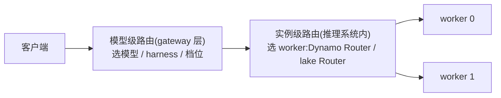

# 模型级路由(Model Router)调研

调研对象:OpenAI / Anthropic / Databricks 等厂商的模型路由产品,以及开源实现与论文。
目的:给 Dynamo / lake 的实例级 Router 找可借鉴的机制。结论在最后一节。

## 先分清两类路由

| | 模型级路由(model routing) | 实例级路由(instance routing) |
|---|---|---|
| **决策** | 这个请求发给哪个模型、哪家 API、哪种 agent harness | 确定模型后,发给哪个 worker 进程 |
| **目标** | 质量与成本的权衡(便宜模型能答就不调贵的) | 缓存命中与负载均衡(谁存着前缀 KV、谁空闲) |
| **典型位置** | gateway / 产品层 | 推理系统内部 |
| **代表** | OpenAI GPT-5 router、Databricks Smart Routing、RouteLLM | Dynamo Router、lake Router |

两层独立存在,可以串联:gateway 的模型路由先选模型,推理系统的实例路由再选 worker。

## 厂商现状

### OpenAI:GPT-5 的 real-time router

GPT-5 不是单个模型,而是一个系统:快速模型 `gpt-5-main` 答大多数问题,深度推理模型 `gpt-5-thinking` 处理难题,前面放一个**实时路由器**决定用哪个([GPT-5 System Card](https://openai.com/index/gpt-5-system-card/))。

- **路由依据**:对话类型、复杂度、工具需求、显式意图(用户写 "think hard about this" 就强制走推理模型)。
- **训练方式**:路由器持续用真实线上信号训练——用户手动切换模型的行为、回答偏好率、实测正确率。
- **兜底**:用量超限后由 mini 版接管剩余请求。
- 不对外暴露:API 里仍是显式指定模型,路由器只在 ChatGPT 产品内工作。

### Anthropic:无官方路由

Anthropic 没有模型路由产品。Claude Code 里是用户手动 `/model` 选择。生态位由社区项目 [claude-code-router](https://github.com/musistudio/claude-code-router)(约 3.6 万 star)占据:本地代理拦截 Claude Code 请求,按**场景规则**分流——`background`(后台任务→便宜模型)、`think`(规划模式→推理模型)、`longContext`(超阈值→长上下文模型)、`webSearch`、`default`。纯规则,无学习成分。

### Databricks:Smart Routing + Omnigent(任务级,选模型也选 harness)

2026 年发布,Beta 状态,文档见 [Smart Routing for coding agents](https://docs.databricks.com/aws/en/ai-gateway/smart-routing),设计细节见官方博客 [Smart Routing in Unity AI Gateway](https://www.databricks.com/blog/smart-routing-unity-ai-gateway-match-frontier-quality-30-lower-cost-task)。面向编程 agent,要点:

1. **任务级而非请求级**。任务开始时定一次模型和 harness,整个会话不再换。原因很直接:大规模下成本由 prompt cache 命中率主导,逐请求换模型会把命中率打没,省的钱不如丢的多。
2. **分类器要便宜**。用一个低延迟小模型读任务描述和元数据,打几个语义标签:改系统的哪部分、提示词带什么代码证据(片段/报错栈/无)、失败形态、改动是否局部、项目类型。由此得出任务族和语言族。
3. **默认中等,双向调整**。路由器默认选中档模型,按标签向上升档(需要前沿能力)或降档(任务简单)。一个策略覆盖整个模型谱系。
4. **模型和 harness 联合选择**。harness(决定每轮发多少上下文、何时调工具、何时压缩上下文)对成本的影响可以超过 2 倍,只换模型不换 harness 拿不到这部分。联合选择由 Omnigent(元 harness,编排多个编程会话)执行;子 agent 启动时独立再过一次路由——初始 prompt 往往欠定义,子任务边界更清晰,路由更准。
5. **效果**:内部 workload 省 35%,公开 benchmark 省 56%,质量追平单用 Opus 5。

博客还写了四个后续方向,都很实在:

- **先做任务边界免费的场景**:PR 评审、子 agent、批量迁移、定时任务——任务描述由机器生成、一开始就完整,不用猜。
- **晚几轮再路由**:首轮 prompt 是信息最差的决策点;让便宜模型先聊几轮澄清需求,任务成形后再路由。
- **会话做小**:一个会话一件事,主题变了就开会话,路由更准也更便宜。
- **换模型要在缓存失效点**:会话中途换模型意味着 cache miss,今天这太贵;压缩(compaction)事件天然在丢缓存,是换模型的低成本时机(提到 Cognition Devin Fusion 就这么做)。长期目标是路由层把 cache miss 显式计价。

### OpenRouter:auto → auto-beta(市场信号)

API 聚合商,`openrouter/auto` 自动选模型。2026 年 8 月换掉原 NotDiamond 引擎,新机制自称 "wisdom of the market"([公告](https://openrouter.ai/blog/announcements/introducing-the-new-auto-router/)):把 prompt 分到约 30 类任务,按**全平台最近 7 天开发者真实消费份额**(周 55T+ token)给该类任务选模型——开发者集体在用脚投票,路由器跟着迁移。用户用 `cost_tier`(low/medium/high/xhigh/max 五档)控制价格带;多轮对话传 `session_id` 保持模型粘连。不收路由费,按选中模型原价计费。

反例:[Martian](https://www.linkedin.com/pulse/martian-vs-openrouter-optimization-trap-vidhi-vashishth-ney8c) 是最早做模型路由的创业公司,已从路由器转型。教训值得记:模型选择是开发者最在乎、也最难验证对错的决策(你永远看不到"另一个模型会怎么答"),纯黑盒自动路由难以建立信任;OpenRouter 先把接入、计费、failover 做好,自动路由只作为可选项。

### vLLM Semantic Router(开源)

[vllm-project/semantic-router](https://github.com/vllm-project/semantic-router):Envoy 的外挂处理器(ext_proc),Rust(Candle/ONNX)跑分类器、Go 对接 Envoy。内置一组 ModernBERT 分类器作为**信号**(意图/领域、PII、越狱、幻觉、反馈),信号经布尔规则组合成路由决策,落到配置的模型池;论文见 [When to Reason(arXiv 2510.08731)](https://arxiv.org/html/2510.08731v1)(按"需不需要推理"分流,MMLU-Pro 上延迟与 token 消耗减半且精度不降)与信号驱动框架论文。另有工作把分类链路本身优化了 98 倍([arXiv 2603.12646](https://arxiv.org/html/2603.12646v1))——佐证"路由器的开销必须远小于省下的钱"。

### LiteLLM / Portkey 等 AI 网关

路由策略是负载均衡与容错型(least-busy、最低延迟、成本上限、顺序 fallback),不做"这个请求哪个模型答得好"的质量预测。与本文主题的模型级路由是近邻但不同类。

## 学术工作

### 成本-质量路由主线

| 工作 | 年份/出处 | 机制 | 备注 |
|------|----------|------|------|
| FrugalGPT([arXiv 2305.05176](https://arxiv.org/abs/2305.05176)) | 2023,Stanford | **级联**:先调便宜模型,DistilBERT 给回答打分,不够再升级更贵的 | 最高省 98% 成本;级联与路由的区别:级联是串行试错,路由是一次决策 |
| HybridLLM([ICLR 2024](https://arxiv.org/abs/2404.14618)) | 2024 | BERT 预测查询难度,小/大模型二选一 | 难度预测路线的代表 |
| RouteLLM([arXiv 2406.18665](https://arxiv.org/abs/2406.18665),[lm-sys/RouteLLM](https://github.com/lm-sys/RouteLLM)) | 2024,LMSYS | 用 Chatbot Arena 偏好数据训练四种路由器(矩阵分解/加权 Elo/BERT/causal LLM);**阈值标定**控制强模型调用比例 | MT-Bench 上省 85% 成本、保持 95% GPT-4 质量;开源、模型数据在 HuggingFace |
| GraphRouter([ICLR 2025](https://arxiv.org/abs/2410.03834)) | 2025 | 任务-查询-模型建异构图,路由=边预测 | 利用任务间结构信息 |
| Avengers([arXiv 2408.12683](https://arxiv.org/abs/2408.12683)) | 2024 | 查询聚类,每类选最优小模型 | 不训练神经网络也有竞争力 |
| 综述([arXiv 2603.04445](https://arxiv.org/html/2603.04445v2)) | 2026 | 路由/级联统一分类 | 入门地图 |

### 评测:方法多,有效的少

- [RouterBench](https://arxiv.org/abs/2403.12031)(2024):11 个模型 × 7 个任务,40 万条预计算输出,路由策略离线评测的事实标准。
- [LLMRouterBench](https://aclanthology.org/2026.findings-acl.1881.pdf)(ACL 2026 Findings):40 万实例、21 个数据集、33 个模型,统一重测 10 个代表性路由方法。结论值得全文引用:**多数方法在统一评测下拉不开差距;若干商业路由器跑不过"永远选最好单模型"这个基线;与理论上限(Oracle)的差距主要来自"该升档的没升"**。Embedding 模型的选择影响有限,模型池越大收益越递减。

### 旁支:预测输出长度用于调度(与实例级路由直接相关)

实例级路由的负载项需要知道"这个请求会占多久",而 decode 长度事先未知。这一支工作专门解决这个问题:

| 工作 | 机制 | 效果 |
|------|------|------|
| SSJF([arXiv 2404.08509](https://arxiv.org/abs/2404.08509),LMSYS) | BERT-base 代理模型预测输出长度,投机式最短作业优先 | 平均完成时间降 30-40%,吞吐 2.2-3.6× |
| ELIS([arXiv 2505.09142](https://arxiv.org/abs/2505.09142)) | BGE 编码器预测长度 + 最短剩余时间优先 | 平均完成时间降 19.6% |
| PARS([arXiv 2510.03243](https://arxiv.org/abs/2510.03243)) | 成对排序(learning-to-rank)预测相对长度,vLLM 实现 | 优于 FCFS 与既有 SJF 变体 |
| TIE([arXiv 2604.00499](https://arxiv.org/pdf/2604.00499)) | 预测长度**分布**而非点估计,按尾部风险惩罚长请求 | 每 token 延迟再降 2.9×(对 SSJF) |

## 跨调研反复出现的三个结论

1. **路由粒度受缓存约束**。逐请求换模型/换实例都会破坏缓存命中:Databricks 因此选任务级,OpenRouter 因此提供 `session_id` 粘连,Dynamo/lake 的实例级路由本来就是前缀亲和。"换档要在缓存失效点做"是共同的纪律。
2. **判断必须便宜**。没有任何一家拿前沿模型当路由器:Databricks 用小模型打标签,vLLM-SR 用 ModernBERT,RouteLLM 用矩阵分解/BERT。路由器成本必须远小于它省下的钱。
3. **评测比方法难**。benchmark 任务太规整,真实会话首轮 prompt 欠定义(Databricks 原话);LLMRouterBench 显示大量发表方法无效。任何路由策略上线前都要用真实 trace 回放评测。

## 与 Dynamo Router 对照

Dynamo Router 是实例级路由([分析见 dynamo/overview.md](dynamo/overview.md) "Router" 节):cost = prefill 负载 × 调整后 prefill 块数 + 预计 decode 块数 + 权重 × 在途请求数;缓存信号来自 worker KV 事件,负载信号来自本地记账,权重手工设定。

从模型级路由借鉴,可做的方向:

1. **decode 长度预测进 cost 函数**。cost 里的 `potential_decode_blocks` 目前是粗估;SSJF/ELIS/PARS 证明轻量预测器(BERT 级)可行且收益明确。预测输出长度还能辅助执行模式选择:预计 decode 很短的请求倾向混部,长的倾向 PD 分离。**lake 可做**:Router 挂一个可选预测器,先用历史请求离线 replay 验证,不进关键路径。
2. **代价权重在线学习**。RouteLLM 证明路由器可以从反馈数据训练;Dynamo 有 FPM 指标回路(每次前向的结构化指标),可用观测到的 TTFT/ITL 对代价权重做闭环调整。用 bandit 级别的方法就够,不需要 RL;先在仿真里跑(Dynamo 侧对应物是 AISimulate/DynoSim)。
3. **难度信号跨层传递**。模型级路由按 lake 的职责划分归 gateway,不在推理系统内实现;但 gateway 判出的难度/任务类型可以作为请求元数据传下来,推理系统用它做调度分级和预放置决策。这与 KVCR hint 协议同构:hint 传 KV 位置,这类元数据传请求属性,都是"上层知道得多、下层执行"的单向传递。
4. **换档代价显性计价**。Databricks 的核心工程结论——路由决策要把 cache miss 计入成本。lake 的执行模式选择函数里 D-direct / PD 分离的传输与重算代价已是显式项,这条已对齐;后续若做"会话中途换档"(如长会话压缩后重选模式),同样要在失效点做并计价。
5. **评测先行**。RouterBench 式离线回放 + 仿真,优于直接上线调参。lake 已有 agentic workload 的 trace 分析([agentic-cache-workload.md](agentic-cache-workload.md)),可作为路由策略的 replay 输入。

不照搬的:

- **级联逐档升级**(FrugalGPT 式):质量层机制,职责在 gateway;与 lake "故障不设降级链"不冲突(那是故障处理),但也不在推理系统内做。
- **语义相似度选模型**(embedding 路由):实例级路由要的是精确的块命中,语义相近不等于 KV 可复用;语义缓存在提示词层的复用是另一个课题,不在 Router 内。

## 参考链接

- OpenAI:[GPT-5 System Card](https://openai.com/index/gpt-5-system-card/)、[Introducing GPT-5](https://openai.com/index/introducing-gpt-5/)
- Databricks:[Smart Routing 博客](https://www.databricks.com/blog/smart-routing-unity-ai-gateway-match-frontier-quality-30-lower-cost-task)、[产品文档](https://docs.databricks.com/aws/en/ai-gateway/smart-routing)
- OpenRouter:[Auto Router 公告](https://openrouter.ai/blog/announcements/introducing-the-new-auto-router/)、[文档](https://openrouter.ai/docs/guides/routing/routers/auto-router)
- 开源:[lm-sys/RouteLLM](https://github.com/lm-sys/RouteLLM)、[vllm-project/semantic-router](https://github.com/vllm-project/semantic-router)、[musistudio/claude-code-router](https://github.com/musistudio/claude-code-router)、[LiteLLM](https://github.com/BerriAI/litellm)
- 论文:FrugalGPT [2305.05176](https://arxiv.org/abs/2305.05176) · HybridLLM [2404.14618](https://arxiv.org/abs/2404.14618) · RouteLLM [2406.18665](https://arxiv.org/abs/2406.18665) · GraphRouter [2410.03834](https://arxiv.org/abs/2410.03834) · RouterBench [2403.12031](https://arxiv.org/abs/2403.12031) · LLMRouterBench [ACL 2026](https://aclanthology.org/2026.findings-acl.1881.pdf) · 路由综述 [2603.04445](https://arxiv.org/html/2603.04445v2) · When to Reason [2510.08731](https://arxiv.org/abs/2510.08731) · SSJF [2404.08509](https://arxiv.org/abs/2404.08509) · ELIS [2505.09142](https://arxiv.org/abs/2505.09142) · PARS [2510.03243](https://arxiv.org/abs/2510.03243) · TIE [2604.00499](https://arxiv.org/abs/2604.00499)
