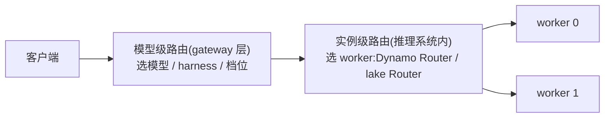

# 路由与调度调研:模型级路由与实例级缓存亲和调度

调研范围:LLM 服务的两层路由——模型级(选哪个模型/哪家 API/哪种 harness)与实例级(选哪个 worker 进程)。
调研目的:为 Dynamo / lake 的实例级 Router 找可借鉴的机制。
文档结构:本文是总览——两类路由的区分、跨层结论、对 Dynamo / lake 的借鉴、相邻主题存档。模型级部分(厂商产品、学术与评测)见 [model-routing/model-level.md](model-routing/model-level.md);实例级部分(约束来源、开源实现、学术原型)见 [model-routing/instance-level.md](model-routing/instance-level.md)。

## 两类路由

| | 模型级路由(model routing) | 实例级路由(instance routing) |
|---|---|---|
| **决策** | 这个请求发给哪个模型、哪家 API、哪种 agent harness | 确定模型后,发给哪个 worker 进程 |
| **目标** | 质量与成本的权衡(便宜模型能答就不调贵的) | 缓存命中与负载均衡(谁存着前缀 KV、谁空闲) |
| **典型位置** | gateway / 产品层 | 推理系统内部 |
| **代表** | OpenAI GPT-5 router、Databricks Smart Routing、RouteLLM | Dynamo Router、lake Router |

两层独立存在,可以串联:gateway 的模型路由先选模型,推理系统的实例路由再选 worker。

```mermaid
flowchart LR
    C[客户端] --> G["模型级路由(gateway 层)<br/>选模型 / harness / 档位"]
    G --> R["实例级路由(推理系统内)<br/>选 worker:Dynamo Router / lake Router"]
    R --> W1[worker 0]
    R --> W2[worker 1]
```

## 跨层结论

1. **路由粒度受缓存约束**。逐请求换模型/换实例都会破坏缓存命中:Databricks 因此选任务级,OpenRouter 提供 `session_id` 粘连、jev-router 把丢失的 prompt cache 显式计入换模型成本(见 [model-routing/model-level.md](model-routing/model-level.md)),Anthropic 从 provider 侧给出原因(换模型=重建整个前缀缓存),SGLang/production-stack 用一致性哈希和 session 策略做粘连。"换档要在缓存失效点做"是共同的纪律。OpenSquilla 的轮次级路由是反例,但它用缓存隔离+自适应提示词把换档代价本身改小了——粒度之争的实质是缓存代价之争。
2. **评测比方法难**。benchmark 任务太规整,真实会话首轮 prompt 欠定义(Databricks 原话);LLMRouterBench 显示大量发表方法无效;RouterArena 榜首 Paix2 从争议到除名(见 [model-routing/model-level.md](model-routing/model-level.md))进一步说明:黑盒榜单连"真会路由"和"拟合了评测集"都区分不了。任何路由策略上线前都要用真实 trace 回放评测。
3. **缓存命中率是一等运维指标**。Anthropic 把命中率下跌当事故(SEV)处理;harness 的提示词排布、工具集恒定、压缩 fork 都是围绕命中率的设计纪律;小米 MiMo 把同会话 99%、跨会话 95% 的命中率当产品卖点公布。推理系统侧同理:命中率应进 SLO 与告警,而不只是性能计数器。

## 对 Dynamo / lake Router 的借鉴

Dynamo Router 是实例级路由([分析见 dynamo/overview.md](dynamo/overview.md) "Router" 节):cost = prefill 负载 × 调整后 prefill 块数 + 预计 decode 块数 + 权重 × 在途请求数;缓存信号来自 worker KV 事件,负载信号来自本地记账,权重手工设定。

公式的演进方向值得注意:Dynamo 早期版本(`lib/llm/src/kv_router/scheduler.rs`)的打分只有一行 `logit = 2.0 * overlap_score - gpu_cache_usage - normalized_active`——命中、显存占用、在途请求三项线性组合;现在的 `lib/kv-router` 演成了多层命中分别计价(device/host/disk/shared 各有权重)加温度采样的多信号代价函数。信号在增加、计价在变细,但权重仍是手工设定的——这是"权重在线学习"一条的动机。

可做的方向,按类型分组:

**给代价函数加信号**

1. **decode 长度预测**。cost 里的 `potential_decode_blocks` 目前是粗估;SSJF/ELIS/PARS 证明轻量预测器(BERT 级)可行,TIE 进一步给出分布形式(按请求预测 log-t 参数 + 尾部惩罚,比点估计稳)。两个注意点:预测器条件于训练时用的模型,**换模型要重校准**(见 [model-routing/instance-level.md](model-routing/instance-level.md));lake 的存储池能看到 decode 中的真实 KV 块数,在线校准信号免费。预测输出长度还能辅助执行模式选择:预计 decode 很短的请求倾向混部,长的倾向 PD 分离。lake 可做:Router 挂一个可选预测器,先用历史请求离线 replay 验证,不进关键路径。
2. **难度信号跨层传递**。模型级路由按 lake 的职责划分归 gateway,不在推理系统内实现;但 gateway 判出的难度/任务类型可以作为请求元数据传下来,推理系统用它做调度分级和预放置决策。这与 KVCR hint 协议同构:hint 传 KV 位置,这类元数据传请求属性,都是"上层知道得多、下层执行"的单向传递。
3. **agent / workflow 级上下文**。production-stack #244、Autellix、Parrot 说明社区已在要 workflow 级路由与指标。lake 的对应面:KVCR hint 协议传会话/工作流元数据,Router 按程序级上下文(而非单请求)做亲和;可复用 agentic workload 的 trace 分析([agentic-cache-workload.md](agentic-cache-workload.md))。

**代价函数本身**

4. **代价权重在线学习**。RouteLLM 证明路由器可以从反馈数据训练;Dynamo 有 FPM 指标回路(每次前向的结构化指标),可用观测到的 TTFT/ITL 对代价权重做闭环调整。用 bandit 级别的方法就够,不需要 RL;先在仿真里跑(Dynamo 侧对应物是 AISimulate/DynoSim)。
5. **可组合打分**(AIBrix)。多策略归一化后按权重混合(`"least-request:2,throughput:1"`),比单一代价函数灵活,且每种策略可独立灰度。lake 的代价函数目前是单一式,演化为 scorer 组合是低风险的扩展路径。

**亲和的边界与降级**

6. **命中阈值与失衡切换**。短请求设命中阈值,不做亲和查询直接负载均衡(production-stack 默认 2000 token);负载严重失衡时缓存亲和整体让位(SGLang 的双阈值切换)。lake 的亲和信息更可靠(存储池权威视图,非推测),这些阈值与切换逻辑可以直接移植。
7. **推测索引**(llm-d)。路由决策到 KV 位置视图更新之间存在窗口期,连续同前缀请求会在窗口期内失去亲和。llm-d 的做法是决策后立即写入短期预测条目(TTL 2 秒),等确认或过期。lake Router 读存储池位置视图,同样有"决策-放置"窗口,这个机制可直接借用。
8. **无状态保底**(KubeAI CHWBL)。位置视图不可用或存储池控制面故障时,Router 可以退到"前缀+模型/LoRA 一致性哈希"——零状态、天然多副本一致、仍保前缀亲和,优于随机,也比"按负载预测"的降级路径更便宜。模型级侧的同款思路:openJiuwen model-router 的远程 state 硬超时返回空视图、降质为冷路由而不是让请求失败(见 [model-routing/model-level.md](model-routing/model-level.md))。
9. **公平与局部性兼得**(D²LPM)。租户公平(按历史用量排队,用量少的优先)与前缀亲和(尽量发给存着该前缀的 worker)天然冲突:严格公平会把请求发到没有它缓存的 worker 上。D²LPM 的解法(机制展开见 [model-routing/instance-level.md](model-routing/instance-level.md)):先按"亏欠账"找出最亏欠的租户,再只在持有其前缀的 worker 里选,并用"(租户 × worker)"配额防止某个热门租户把单个 worker 打爆。lake 里公平性决策归 gateway,这套算法是 gateway 侧现成的参考。

**上线与运维的注意事项**

10. **热路径不阻塞,输入信号要监控**(production-stack #1016/#1074 的教训):路由决策路径上不能有同步阻塞调用(tokenize、RPC 要等);全零的负载数据看起来和"很空闲"一模一样,指标本身要被监控。lake Router 是 Go,异步不是问题,但 tokenize 的位置和信号质量监控要在设计里写明。
11. **换档代价显性计价**。Databricks 的工程结论——路由决策要把 cache miss 计入成本;Anthropic 从 provider 侧给出量化直觉(100k token 会话换便宜模型反而更贵)。lake 的执行模式选择函数里 D-direct / PD 分离的传输与重算代价已是显式项,这条已对齐;后续若做"会话中途换档"(如长会话压缩后重选模式),同样要在失效点做并计价。
12. **评测先行,命中率进 SLO**。RouterBench 式离线回放 + 仿真,优于直接上线调参;Anthropic 把命中率下跌当事故处理,lake 同理应把前缀命中率纳入 SLO 与告警,而不只是性能计数器。

**职责边界的确认**

13. **迁移归池,不归 Router**(Llumnix)。路由只能保证决策时刻最优,负载随 decode 推进不断变化,Llumnix 用 KV 热迁移做运行时纠偏。lake 架构下"迁移"就是存储池的重新放置——归池管,Router 不管;这印证了"池放置·调度读视图"的单向耦合划分,Router 侧对应的补偿机制是第 7 条的推测索引。

不照搬的:

- **级联逐档升级**(先调便宜模型、回答不够好再升级更贵的,即 FrugalGPT 的机制,见 [model-routing/model-level.md](model-routing/model-level.md)):质量层机制,职责在 gateway;与 lake "故障不设降级链"不冲突(那是故障处理),但也不在推理系统内做。
- **语义相似度选模型**(embedding 路由):实例级路由要的是精确的块命中,语义相近不等于 KV 可复用;语义缓存在提示词层的复用是另一个课题,不在 Router 内。

## 相邻主题存档(链接备查,不在本文展开)

以下来自个人技术笔记的整理,与路由相邻但属于别的层次。按"属于哪一层"分三组,每组先说清是什么、与路由什么关系,再列链接。

**KV 显存管理(分配器层)** —— 实例选定之后,实例内部的 KV 怎么摆。lake 对应层:存储池的块管理与碎片整理([`architecture/kv-cache-pool.md`](../architecture/kv-cache-pool.md))。

- vLLM 侧:
  - [cache policy framework(#11928)](https://github.com/vllm-project/vllm/pull/11928):驱逐策略可插拔。
  - [unify allocating slots(#12608)](https://github.com/vllm-project/vllm/pull/12608):统一 slot 分配。
  - [Hybrid Memory Allocator RFC(#11382)](https://github.com/vllm-project/vllm/issues/11382) + [Hybrid KV Cache Manager 设计文档](https://docs.vllm.ai/en/latest/design/hybrid_kv_cache_manager.html):混合 KV(全注意力 + 滑动窗口/SSM)的分配器设计。
- 蚂蚁 [glake](https://github.com/antgroup/glake) 仓(三个子项目):
  - GMLake([arXiv 2401.08156](https://arxiv.org/abs/2401.08156),ASPLOS'24):训练侧显存碎片整理。
  - vTensor:基于 VMM(虚拟内存管理)的虚拟张量管理。
  - LayerKV([arXiv 2410.00428](https://arxiv.org/abs/2410.00428)):按层粒度的 KV 管理,降 TTFT。

**实例内调度** —— batch 内优化,与实例间路由正交。

- vLLM [prefix sorting(#13762)](https://github.com/vllm-project/vllm/pull/13762):batch 内按前缀排序,提高 APC 命中。

**PD 间 KV 传输工程** —— 路由选定 P/D 之后,传输层怎么搬 KV。lake 对应层:Transfer Bus([`mooncake/overview.md`](mooncake/overview.md)、[`hbm-tier-and-offload.md`](hbm-tier-and-offload.md))。

- 要解决的问题:MLA 冗余拉取、GQA 切分不对齐、HCCL 的 2M 地址对齐、小块传输的聚合与双流拷贝。
- 参考实现:
  - [vllm-ascend#1568](https://github.com/vllm-project/vllm-ascend/pull/1568)
  - [Mooncake#502](https://github.com/kvcache-ai/Mooncake/pull/502)
  - [Mooncake#619](https://github.com/kvcache-ai/Mooncake/pull/619)
  - [知乎分析](https://zhuanlan.zhihu.com/p/1946608360259577576)

## 参考链接

**论文:KV 显存管理(存档)**

- GMLake [2401.08156](https://arxiv.org/abs/2401.08156)
- LayerKV [2410.00428](https://arxiv.org/abs/2410.00428)

