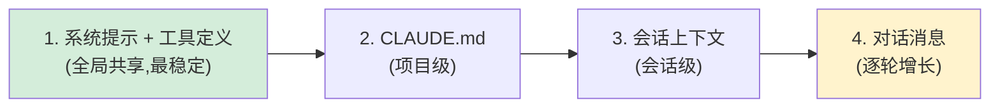
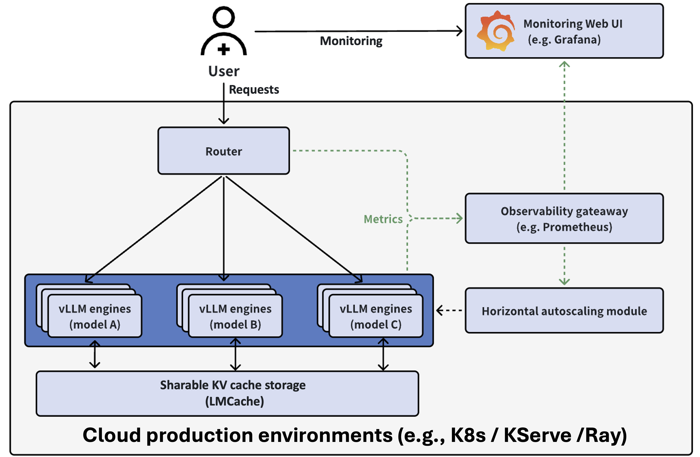
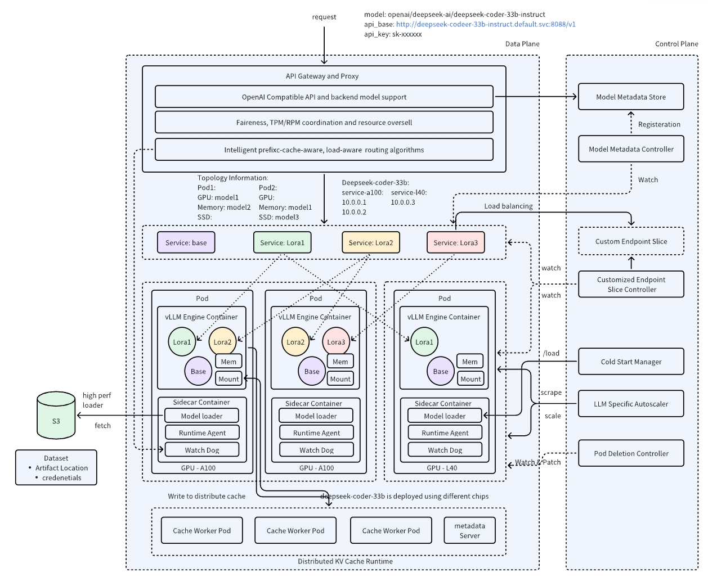
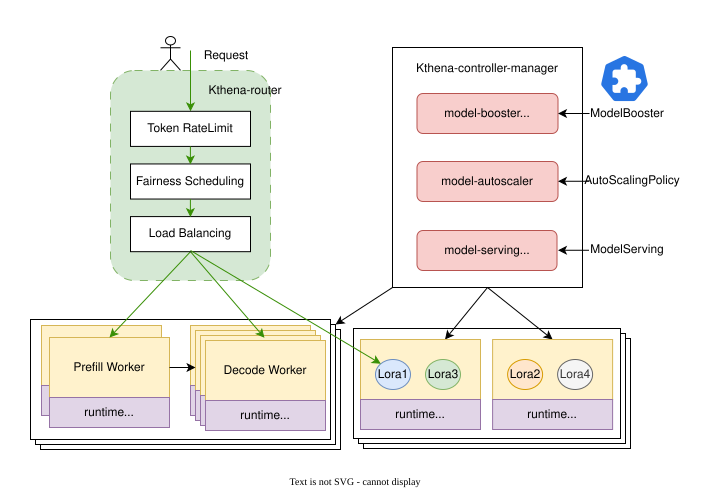
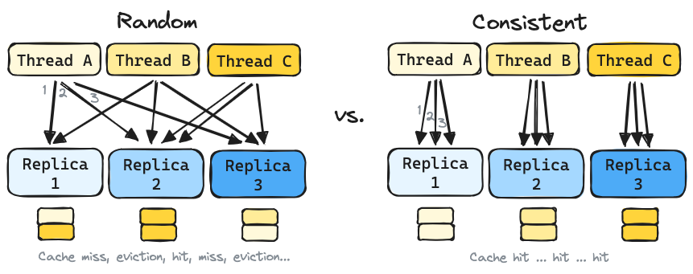
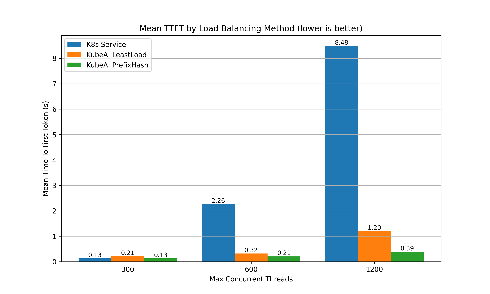
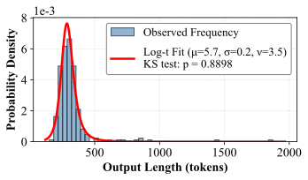
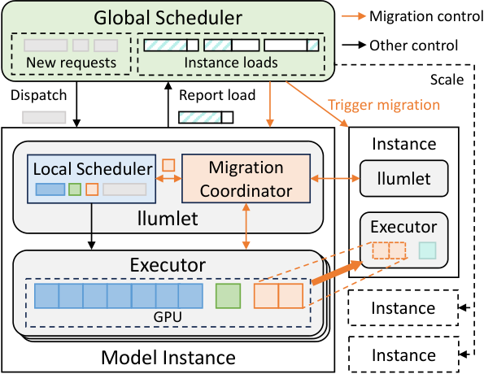

# 实例级路由与调度:缓存亲和

> 路由调研的实例级部分:确定模型后,选哪个 worker 进程。总览、跨层结论与对 lake 的借鉴见 [../model-routing.md](../model-routing.md);模型级部分见 [model-level.md](model-level.md)。

## 约束来源:缓存命中率

实例级路由为什么以缓存命中为核心变量,两个层面各有原因:harness 侧的设计纪律决定前缀的形态(能不能命中),调度侧的策略决定请求落到哪个实例(命中发生在哪)。本节先看 harness 侧,下一节看调度侧。

### Anthropic 的 Claude Code 经验(harness 侧)

[Lessons from building Claude Code: Prompt caching is everything](https://claude.com/blog/lessons-from-building-claude-code-prompt-caching-is-everything)(2026-04,Anthropic 官方)。核心事实:prompt 缓存是**前缀匹配**——前缀里任何一处变了,其后全部失效。Claude Code 的整个 harness 围绕这条约束设计。

提示词的排布顺序(原文无配图,按文中描述整理):



越靠前越稳定、共享面越大;任何一处的改动使其后全部缓存失效。

- **提示词排布:静态在前,动态在后**。系统提示与工具定义(全局共享)→ CLAUDE.md(项目级)→ 会话上下文(会话级)→ 对话消息。他们实际打破过缓存的几种方式:在静态系统提示里放了精确时间戳、工具定义顺序不稳定、改了工具参数。
- **更新走消息,不改提示词**。时间、文件变更这类易变信息,塞进下一轮 user 消息或工具结果里,而不是改系统提示。
- **会话中途不换模型**。缓存按模型隔离:对话进行到 100k token 时,哪怕问题很简单,换便宜模型也比留在贵模型上更贵——要重建整个前缀缓存。要换模型就用子 agent,让主 agent 写交接消息。
- **会话中途不增删工具**。工具定义在缓存前缀里。Plan Mode 的实现方式是把 `EnterPlanMode`/`ExitPlanMode` 本身做成工具,工具集恒定;大量 MCP 工具用 `defer_loading` 发轻量占位(名字+标记),模型需要时再加载完整 schema,占位恒定所以前缀稳定。
- **压缩(compaction)用缓存安全的 fork**:压缩请求复用父会话完全相同的系统提示、上下文和工具定义,把压缩指令作为新的 user 消息追加在末尾——对 API 来说这几乎就是父会话的上一次请求,前缀缓存全部命中。
- **把缓存命中率当可用性指标监控**:命中率掉太多就当事故(SEV)处理。几个百分点的命中率波动对成本和延迟影响巨大。

这篇博客从 provider 侧解释了为什么 Databricks 选任务级路由:换模型的真实成本是缓存重建,不是 token 单价差。

## 开源实现

各家的差别主要在三点:缓存状态从哪来(推测 / 集中记账 / 事件订阅 / 无状态)、命中与负载怎么结合、多副本怎么一致。

一个常见疑问:production-stack 和 AIBrix 都在 vllm-project 下、都有路由器,是否重复开发?答案是否,出身不同:

1. **production-stack**:vLLM 团队自孵化的**参考实现**(Python,轻量,教你怎么把单实例扩成分布式)。
2. **AIBrix**:字节跳动**捐赠**的生产级基础设施(Go,K8s 原生控制面,路由只是其九大功能之一)。

路由重叠是因为路由是任何分布式栈的必备件;维护者在 [#177](https://github.com/vllm-project/production-stack/issues/177) 明确了两家分工,且随着生态向 Gateway API Inference Extension + llm-d EPP 收敛([#1032](https://github.com/vllm-project/production-stack/issues/1032)),两家自研 router 都在退为参考/过渡实现。

这里展开一下这个组合,后文会反复出现:**Gateway API** 是 K8s 官方的流量入口标准(Ingress 的继任者);**Inference Extension** 是它面向推理服务的扩展,定义了"把模型请求路由到后端 pod"的标准接口;**EPP**(Endpoint Picker)是这个接口里的扩展点——网关转发前先调一个外部服务来选 pod,llm-d 的 EPP 实现就是它的 KV 感知路由器。一句话:前者是标准,后者是标准下的一个实现。

### vLLM production-stack

[vllm-project/production-stack](https://github.com/vllm-project/production-stack) 是 vLLM 项目下的 K8s 分布式部署栈(已引入 `3rdparty/production-stack`),其请求路由器(`vllm_router`)的 `routing_logic.py`(本地 `3rdparty/production-stack/src/vllm_router/routers/routing_logic.py`)实现了多种策略。



(图源:[production-stack README](https://github.com/vllm-project/production-stack)。路由器位于客户端与 vLLM 实例之间,是缓存亲和策略的落点。)

| 策略 | 机制 | 适用 |
|------|------|------|
| `roundrobin` | 轮询 | 负载均匀,无缓存亲和 |
| `session` | 按请求头里的 session id 粘连;无 session id 时选 QPS 最低者 | 多轮对话 |
| `prefixaware` | 路由器本地维护前缀树,同前缀永远发同一实例——**即使缓存已被驱逐** | 前缀形态稳定 |
| `kvaware` | 经 **LMCache controller** 集中查询各实例实际持有的前缀,路由到最长命中的实例;低于 `--kv-aware-threshold`(默认 2000 token)或不命中则回退 QPS/轮询 | 缓存状态实时可见 |
| `disaggregated-prefill` 系列 | PD 分离部署的 prefill/decode 分流 | PD 分离 |

`kvaware` 与 `prefixaware` 的差别值得注意:前者查的是**实例真实持有的缓存**(LMCache controller 集中记账),后者查的是**路由器自己的历史记录**(发过的就以为还在)。驱逐之后,后者会把请求发到已经没有数据的实例上。

**设计源头**是 [RFC #59](https://github.com/vllm-project/production-stack/issues/59)(prefix-cache-aware routing),其中明确了一个关键取舍:**token-ID 匹配准但 tokenize 太慢(每请求数微秒起),路由器承担不起,所以改用字符串匹配**;初版用 SQL 库存"链式内容哈希"(`hash(c0+...+ci)` 逐块前缀哈希)加按实例 LRU 淘汰。这个"路由器不做 tokenize"的判断,与后面 #1016 的事故互为印证。

**issue 里的工程教训**:

- **热路径不能阻塞**([#1016](https://github.com/vllm-project/production-stack/issues/1016)):`KvawareRouter` 在 uvicorn 事件循环里做三件同步事——`AutoTokenizer.from_pretrained` 联网拉 tokenizer(模型用别名时永远失败,每请求重试)、把完整 prompt 同步 POST 给 `/tokenize`、同步等 controller 的 ZMQ 往返——结果是路由器自己的 `/health` 答不出来,K8s 探针超时,持续流量下 CrashLoop(实测一小时重启 25 次,请求零完成)。
- **回退路径的信号质量**([#1073](https://github.com/vllm-project/production-stack/issues/1073)):PrefixAwareRouter 低于命中阈值时按 QPS 回退,但用的是过期 QPS 值,把所有回退请求打到同一个后端上。
- **输入信号本身要被监控**([#1074](https://github.com/vllm-project/production-stack/issues/1074)):指标名对不上时,EngineStats 全零——看起来"很空闲很健康",负载均衡被静默喂了假数据。
- **端点生命周期**([#1008](https://github.com/vllm-project/production-stack/issues/1008)):pod 被驱逐后路由器残留幽灵端点,请求超时。
- 2026 roadmap([#855](https://github.com/vllm-project/production-stack/issues/855))里与路由相关的:XpYd 分离 prefill、路由到外部 provider(OpenAI/Anthropic)、router 侧请求排队、**基于未来负载的预测式路由**、优先级路由、用 Rust/Go/Nginx 重写路由器前端(Python 性能到顶)、agent 工作负载的智能路由。

**issue 里的跨仓讨论**:

- **与 AIBrix 的定位之争**([#177](https://github.com/vllm-project/production-stack/issues/177)):维护者答复——production-stack 走轻量、Python 可编程、紧跟 vLLM 上游(经 upstream connector);AIBrix 走 K8s 原生、Go、当时需要修改 vLLM 0.6.1 才能做 KV 操作。评论区的定位:替代 LiteLLM/MLflow 这类通用代理,但深度绑定 vLLM 的指标与运维。
- **agent 负载的路由需求**([#244](https://github.com/vllm-project/production-stack/issues/244)):feature request 要三样东西——跨 agent 的 KV 复用(同一 workflow 的 agent 共享上下文)、按 `session_id`/workflow 元数据的 agent 感知路由、workflow 级指标(跨 agent 命中率、workflow TTFT)。说明"agent 感知路由"已是社区显性需求。
- **K8s 网关生态收敛**([#1032](https://github.com/vllm-project/production-stack/issues/1032)):kgateway 在 2.1 弃用、2.2 移除了 inference extension 支持,production-stack 迁移到 agentgateway + llm-d Router。信号:K8s 原生的推理路由正在向 **Gateway API Inference Extension + llm-d EPP** 这一组合收敛,各家自研 router 的定位都在向"参考实现"退(Kthena 官方也这么自述)。

**要点**:

- `kvaware` 与 `prefixaware` 的本质差别是"知不知道缓存已被驱逐":前者查 LMCache controller 集中记账,后者查路由器本地历史。
- 最大教训是热路径纪律:路由器不 tokenize、不做同步远程调用(#1016 一小时重启 25 次)。
- 生态信号:K8s 推理路由正向 Gateway API Inference Extension + llm-d EPP 收敛。

### SGLang

SGLang 的路由组件(`sgl-model-gateway`,Rust)的策略列表在 `src/policies/` 下,与 APC 相关的两个:

- **`cache_aware`**(`cache_aware.rs` + `tree.rs`):路由器为每个 worker 维护一棵**近似前缀树**(存原始文本而非 token id,省 tokenize 开销),按请求历史推断各 worker 的缓存内容,不查引擎真实状态。匹配率超阈值就发最匹配的 worker,否则发树最小(缓存容量最空)的;后台 LRU 驱逐叶子防内存膨胀。**负载不均衡时**(max-min 超绝对阈值且 max/min 超相对阈值)自动切到最短队列优先,均衡时切回缓存感知——缓存亲和与负载均衡按系统状态二选一,不是加权求和。
- **`consistent_hashing`**(`consistent_hashing.rs`):会话粘连。优先级:显式 `X-SMG-Routing-Key` 请求头 > 隐式稳定头(`authorization` / `x-forwarded-for` / `cookie`)> 匿名请求随机。一致性哈希环保证 worker 上下线时只有少量会话换节点。

**要点**:

- `cache_aware` 用路由器本地近似前缀树(存文本不存 token,零 tokenize 开销)按历史推测缓存,不查引擎。
- 负载失衡时整体切最短队列:缓存亲和与负载均衡是**二选一切换**,不是加权求和。

### AIBrix

[AIBrix](https://github.com/vllm-project/aibrix)(字节跳动发起,现属 vllm-project;已引入 `3rdparty/aibrix`):K8s 推理基础设施,网关插件的路由策略约 19 种独立实现、支持加权组合([文档](https://aibrix.readthedocs.io/latest/features/gateway-plugins.html))。**深度分析见 [`aibrix/`](../aibrix/overview.md)**(overview / architecture / pain-points;含 KV 事件同步、卸载框架、扩缩)。



(图源:[AIBrix README](https://github.com/vllm-project/aibrix)。路由策略在 Gateway Plugins 层,与元数据服务、自动扩缩容并列。)

策略分四类:

| 类 | 策略 | 机制 |
|----|------|------|
| 负载 | least-request / least-busy-time / least-latency / least-kv-cache / throughput / power-of-two | 按 pod 的实时指标选较闲者;power-of-two 是随机抽两个取较闲 |
| 缓存 | `prefix-cache` | 路由器本地维护**固定大小哈希表**(默认 20 万槽位,4 token/块做 xxhash,LRU 淘汰),记录"块→pod";请求按块哈希找持有相同前缀的 pod,再叠加负载项防热点。官方数据:TTFT 比随机路由改善约 45% |
| 缓存 | `prefix-cache-preble` | 实现 ICLR'25 的 Preble 论文(见下文"学术原型"节):索引换成**全局前缀树**(不是哈希表),负载项换成 Preble 的成本模型(prefill/decode 线性回归)。与 `prefix-cache` 的差别在索引结构和成本模型,不是同一策略的两个名字 |
| 公平 | `vtc-basic` | 实现 OSDI'24 的 VTC(见下文"学术原型"节):按每个用户的历史 token 用量做公平调度,用量少的优先 |
| SLO | `slo` / `slo-pack-load` / `slo-least-load` | 按各 pod 的 SLO 达成率选 |

两个工程点:**可组合策略**——每个策略输出归一化分数,按配置里的权重加权求和(如 `"least-request:2,throughput:1"` 表示 least-request 占 2/3、throughput 占 1/3),不是单一写死的代价函数,每种策略可独立灰度;**多副本状态同步**——网关插件多副本时前缀缓存状态经 Redis 增量同步,且必须显式开 `AIBRIX_STATESYNC_ENABLED`,否则各副本各算各的、路由结果不一致(官方文档点名这是最常见的踩坑点)。

实现细节与演进方向(来自源码与 issue):

- `prefix-cache` 的索引是**固定大小哈希表**:默认 20 万个块槽位、每块 4 token 做 xxhash、淘汰线程每秒最多跑 1 秒、清掉 20 分钟前的条目(`3rdparty/aibrix/pkg/plugins/gateway/algorithms/prefix_cache.go` 常量;`prefix_cache_and_load.go` 变体改用 RadixTree)。
- [#672](https://github.com/vllm-project/aibrix/issues/672):考虑从 xxhash 精确匹配转向**一致性哈希 + LSH**(局部敏感哈希)——牺牲一点匹配精度换取扩展性;该 issue 直接引用了 production-stack #59 的讨论。
- [#677](https://github.com/vllm-project/aibrix/issues/677):树版 Preble 实现已完成(`prefixcacheindexer` + `algorithms`),并指出 Preble 的一个实际痛点:**prefill/decode 的成本模型是线性回归,系数按"模型 × GPU"硬编码**——换个硬件就要重新标定。后续参考方向点名了 Preble、SGLang 和 D²LPM。
- CHWBL(见 KubeAI 节)曾被列入计划,因人力原因推迟。

**要点**:

- 策略约 19 种独立实现且**可组合**:归一化分数按权重加权求和,每种策略可独立灰度。
- `prefix-cache` 索引是固定大小哈希表(20 万槽 × 4 token/块),正考虑转向一致性哈希+LSH。
- 多副本状态走 Redis 增量同步,必须显式开 `AIBRIX_STATESYNC_ENABLED`:
  - 不开则各副本各算各的、路由结果不一致,是官方点名的最常见踩坑点。

### llm-d

[llm-d](https://github.com/llm-d/llm-d)(Red Hat/Google/IBM 等联合,K8s 原生分布式推理):路由在 EPP(Endpoint Picker,Gateway API Inference Extension 的扩展点)里,代表"精确派"缓存感知([文档](https://llm-d.ai/docs/architecture/advanced/kv-management/kv-indexer);EPP 代码已引入 `3rdparty/llm-d-router`,索引实现见 `pkg/kvcache/`)。**深度分析见 [`llm-d/`](../llm-d/overview.md)**(overview / architecture / pain-points;含推测索引、PD sidecar、多副本 HA)。


(图源:[llm-d README](https://github.com/llm-d/llm-d)。EPP 在网关路径上,消费各 pod 的 KV 事件流。)

工作方式分四块:

1. **状态来源**:vLLM/SGLang/TRT-LLM 通过 ZMQ 发布 KV 事件(BlockStored / BlockRemoved / AllBlocksCleared)——KV 事件流正在成为生态标准接口,三家引擎都发。
2. **索引与打分**:EPP 的 KV-Cache Indexer 用事件流维护全局"块→pod"索引;scorer 按最长连续前缀给候选 pod 打分,按介质层(HBM/DRAM/SSD)加权。
3. **推测索引**(speculative indexing,独有):解决一个具体的时序问题——路由决策做完到 worker 的 KV 事件传播回索引之间有毫秒级窗口;两个同前缀请求接连到达时,第二个查索引会发现第一个刚写的 KV 还没登记,亲和就断了。做法是决策完成后立刻往索引里写一条"预计这些块会在这个 pod 上"的短期条目(TTL 默认 2 秒),等真实事件到达确认、或过期自动删除。本质是用预测填补事件传播的延迟,思路干净,可直接借用(lake 的对应窗口见[总览](../model-routing.md)"对 Dynamo / lake Router 的借鉴"第 7 条)。
4. **多副本**:每个 EPP 副本独立订阅所有 pod 的事件流,天然收敛到同一索引,active-active,不需要共享存储。

**要点**:

- "精确派"代表:引擎发 KV 事件(BlockStored/BlockRemoved),EPP 维护全局"块→pod"索引。
  - KV 事件流正成为生态标准接口:vLLM / SGLang / TRT-LLM 三家都发。
- 独有**推测索引**:决策后先写 TTL 2 秒的预测条目,填补事件传播的毫秒级窗口,防同前缀请求接连到达时亲和断链。
- 多副本各自订阅全部 pod、天然收敛到同一索引,无需共享存储。

### Kthena

[Kthena](https://github.com/volcano-sh/kthena)(Volcano 社区项目——Volcano 是华为发起并捐给 CNCF 的批计算系统,Kthena 是其下的 LLM serving 子项目,故称华为系):K8s LLM serving 平台,数据面是 kthena-router,filter-score 插件框架。



(图源:[Kthena README](https://github.com/volcano-sh/kthena)。kthena-router 是数据面,缓存感知以插件形式挂入。)

`kvcache-aware` 插件([文档](https://kthena.volcano.sh/docs/user-guide/kvcache-aware))的机制,按四块拆开:

1. **状态来源**:Runtime sidecar 订阅 vLLM 的 ZMQ KV 事件,把 token 块哈希写进 **Redis**;router 请求时查 Redis 给 pod 打分。
2. **匹配深度**:块大小默认 16 token,最多匹配 128 块(`maxBlocksToMatch`,配置项)——即默认最多比对 2048 token 的前缀。
   - 这个 2k 上限在 agent 场景确实可能不够:如果所有请求共享同一段 2k 的系统提示,匹配只能覆盖"大家一样的部分",区分不出会话级亲和。
   - 两点澄清:(a) 它是可配的默认值,调大的代价是每请求的 Redis 查询次数线性增长——上限的本质是热路径开销与匹配深度的权衡;(b) 默认配置的定位是"系统提示词级亲和",会话级长前缀亲和需要调大上限或换索引结构,这是该实现的已知边界。
3. **打分**:filter-score 插件链,可组合。
4. **PD 分离的调度顺序**(与别家相反,值得注意):**先给 decode pod 打分排序,再为选中的 D 配同组 prefill pod**——保证 KV 局部性。官方自述 router 是参考实现,因为 Gateway Inference Extension 不原生支持 PD 分离。

**要点**:

- 状态外置:sidecar 订 KV 事件把块哈希写 Redis,router 查 Redis。
- 默认匹配深度只有 2048 token(128 块 × 16 token,可配):
  - 定位是"系统提示词级亲和";会话级长前缀亲和需调大上限或换索引结构。
- PD 调度顺序独有:**先给 decode pod 打分,再配同组 prefill**(保 KV 局部性)。

### KubeAI:无状态路线

[KubeAI](https://github.com/substratusai/kubeai) 的 PrefixHash 策略([博客](https://www.kubeai.org/blog/2025/02/26/llm-load-balancing-at-scale-chwbl/))与上面所有"记状态"的方案相反,**不维护任何缓存状态**:提取请求前缀(如首条 user 消息)+ LoRA 适配器名,xxHash 后用**带界负载一致性哈希**(CHWBL)选副本。相同前缀天然落同一副本;副本增减时一致性哈希只迁移少量映射;"有界负载"参数(如 `meanLoadFactor: 125`)防止热点。他们明确否决了 sticky session:agent 场景没有浏览器 cookie,客户端 IP 经 NAT 不可靠,且一个 agent 程序会模拟 N 个逻辑会话。

CHWBL 的出处与验证:

1. **出处**:Google Research 2016 年提出([论文 arXiv 1608.01350](https://arxiv.org/abs/1608.01350),[Google Research 博客](https://research.google/blog/consistent-hashing-with-bounded-loads/)),论文自述已用于 Google 的云系统。
2. **公开案例**:视频分发领域的 **Vimeo**——日近 10 亿次 DASH/HLS 请求的打包服务用它做缓存亲和负载均衡(平衡因子 c=1.25),并把实现贡献进了 **HAProxy 1.7**(`hash-balance-factor` 参数,HAProxyConf 2019 有专题分享),HAProxy 内置至今。
3. **与 KubeAI 的关系**:KubeAI 配置里的 `meanLoadFactor: 125` 就是这个 1.25。



(图源:[KubeAI 博客](https://www.kubeai.org/blog/2025/02/26/llm-load-balancing-at-scale-chwbl/)。左:随机路由下同一会话的各轮被打散,缓存难以命中;右:一致性哈希让同前缀请求稳定落同一副本。)

实测(8×L4、Llama 3.1 8B、ShareGPT 会话):

| 指标(1200 并发线程) | 相对 K8s 默认随机路由 |
|---|---|
| TTFT | **降 95%** |
| 吞吐 | **升 127%** |

且并发越高,与随机路由的差距越大(低并发时三者接近):



(图源:KubeAI 博客,同上。横轴为并发线程数,纵轴为 TTFT(对数坐标);并发越高,PrefixHash 与随机路由的差距越大。)

**要点**:

- 无状态前缀哈希(CHWBL)路线:零状态、天然多副本一致、实测 TTFT 降 95%。
- 代价:不知缓存是否已被驱逐,也不感知实时负载(只在超界时让位)。
- 适合"不想维护缓存状态"的场景。

### OpenAI API(托管服务)

OpenAI 的 prompt caching 在服务端做实例级路由([官方文档](https://developers.openai.com/api/docs/guides/prompt-caching) + [Prompt Caching 201 cookbook](https://developers.openai.com/cookbook/examples/prompt_caching201)):

1. **路由依据**:对 prompt 的**前缀头部**算哈希——注意是 OpenAI 自己加的隐藏系统内容(工具定义等)**之后**的约 256 个 token,不是从用户 prompt 第一个 token 算起。同哈希的请求路由到同一台机器。
2. **会话粘连**:`prompt_cache_key` 参数与哈希结合,同 key 的请求尽量落同机。官方案例:某客户命中率从 60% 提到 87%。
3. **溢出**:同一前缀+key 超过 15 RPM 时溢出到其他机器(每台一次性 miss)。
4. **生效条件**:前缀 ≥1024 token,按 128 token 递增匹配。
5. **收益**:官方称最高省 80% TTFT、90% 输入成本。

**要点**:

- 托管服务里"前缀哈希 + 显式 key"的最简形态,与 KubeAI 同族。
- 同样不记驱逐、不感知负载。
- 比 KubeAI 多一个 `prompt_cache_key` 显式粘连(客户实测命中率 60%→87%)。

### 对照表

| 系统 | 缓存状态来源 | 命中与负载的结合 | 多副本一致性 |
|---|---|---|---|
| Dynamo Router | worker 主动发 KV 事件,router 建全局索引(权威在 worker) | 同一 cost 函数加权和 | 各副本订阅事件流收敛;在途负载副本间 best-effort 同步 |
| production-stack `kvaware` | LMCache controller 集中记账 | 命中优先,不达标回退 QPS/轮询 | 单副本为主 |
| SGLang `cache_aware` | router 本地近似树,按历史推测(无权威) | 失衡时整体切最短队列 | — |
| AIBrix `prefix-cache` | 前缀块哈希 + pod 指标周期拉取 | 命中+负载组合打分;多策略可加权混合 | Redis 增量同步(需显式开启) |
| llm-d EPP | KV 事件(ZMQ)→ 全局块索引 + 推测条目 | prefix scorer 与 load scorer 组合 | 各副本独立订阅全部 pod,收敛到同一索引 |
| Kthena | sidecar 订 KV 事件写 Redis,router 请求时查 | filter-score 插件链;PD 先选 D 再配同组 P | 状态外置 Redis |
| KubeAI(CHWBL) | **无状态**:前缀+LoRA 名哈希即路由 | 有界负载防热点,超界才让位 | 无状态,天然一致 |
| OpenAI API | **无状态**:隐藏系统内容之后约 256 token 的前缀哈希 | 同前缀 15 RPM 溢出到其他机器 | 无状态(托管服务内部) |

(Dynamo Router 没有单列小节——它是本调研的对照目标而非调研对象,机制见 [`dynamo/overview.md`](../dynamo/overview.md) "Router" 节与[总览](../model-routing.md)借鉴一节的开头。)

### 归纳:按设计问题对照

上面这张表按系统看,下面这张**按问题看**——每个设计问题有哪几种解法、谁用了哪种(细节回查上文各小节):

1. **缓存状态从哪来**(路由器怎么知道哪个 worker 存着什么):
   - 路由器自己猜(按历史请求推测,零成本,但缓存被驱逐后就失真):SGLang `cache_aware`、production-stack `prefixaware`。
   - 引擎主动上报(引擎每存/删一个 KV 块就发事件,路由器订阅;准,但有毫秒级传播延迟):Dynamo、llm-d、Kthena。
   - 集中记账(一个中心组件掌握权威视图;最准,但要维护这个中心组件):production-stack `kvaware`(LMCache controller)、lake(存储池)。
   - 完全不记(前缀哈希即路由;零状态,但不知道驱逐和负载):KubeAI、OpenAI API。
2. **上报有延迟,窗口期怎么补**:决策做完到事件传播回来之间有毫秒级空窗,同前缀请求接连到达会亲和断链。解法:决策后先写一条"预计这些块会在这个 pod 上"的短期条目(TTL 2 秒),等真实事件确认——llm-d 推测索引(独有)。
3. **命中与负载怎么结合**(想发到有缓存的 worker,但它可能很忙):
   - 加权求和(命中分和负载分加权相加;平滑,但权重难调):Dynamo、AIBrix、llm-d。
   - 阈值切换(平时看命中,失衡了整体切到看负载;简单可预测,但有跳变):SGLang、production-stack。
   - 超界才让位(亲和优先,负载封顶,超了才换 worker):KubeAI(`meanLoadFactor`)、OpenAI(同前缀 15 RPM 溢出)。
4. **会话怎么粘连**(同一对话的各轮发到同一 worker):
   - 显式 key(请求里带会话标识):SGLang `X-SMG-Routing-Key`、OpenRouter `session_id`、OpenAI `prompt_cache_key`、production-stack `session`。
   - 前缀哈希天然粘连(同前缀自然落同机):KubeAI、各缓存感知策略。
5. **热路径纪律**(路由器每请求只有微秒级预算):不 tokenize(用字符串/块哈希代替)、状态查询走本地内存或旁路——全员遵守;反面教材 production-stack #1016(同步调 tokenizer 导致 CrashLoop)。
6. **路由器多副本怎么一致**:
   - 各副本各自订阅事件流,收敛到同一索引:llm-d、Dynamo。
   - 外置共享存储(Redis):AIBrix(需显式开 `AIBRIX_STATESYNC_ENABLED`)、Kthena。
   - 无状态天然一致:KubeAI、OpenAI。
7. **PD 分离先选谁**:先给 decode pod 打分、再配同组 prefill(保 KV 局部性)——Kthena 独有。
8. **匹配深度的上限**:限制最多比对多少块,防热路径过慢;默认值只够"系统提示词级"亲和——Kthena(128 块 × 16 token,可配)。

lake 在这组问题里的位置:缓存状态由存储池权威维护(强于推测、记账、事件收敛三种),会话亲和靠前缀命中自然获得。

## 学术原型

### 预测输出长度

实例级路由的负载项需要知道"这个请求会占多久",而 decode 长度事先未知。这一支工作专门解决"怎么预测":

| 工作 | 怎么预测 | 效果 |
|------|----------|------|
| SSJF([arXiv 2404.08509](https://arxiv.org/abs/2404.08509),LMSYS) | 微调一个 BERT-base,输入 prompt 直接回归输出 token 数;按预测长度做"投机式最短作业优先" | 平均完成时间降 30-40%,吞吐 2.2-3.6× |
| ELIS([arXiv 2505.09142](https://arxiv.org/abs/2505.09142)) | BGE 文本嵌入 + 分类,最短剩余时间优先 | 平均完成时间降 19.6% |
| PARS([arXiv 2510.03243](https://arxiv.org/abs/2510.03243)) | 不预测绝对长度,学成对排序("这两个请求哪个更长")——相对顺序比绝对值更鲁棒;有 vLLM 实现 | 优于 FCFS 与既有 SJF 变体 |
| TIE([arXiv 2604.00499](https://arxiv.org/abs/2604.00499)) | **按请求预测分布,不是预测一个数**:DeBERTa 编码 prompt,两个 MLP 头输出该请求专属的 log-t 分布参数(公式与变量见下);调度分 = 分布期望 + 尾部惩罚,代替长度进 SJF | 在线每 token 延迟比最强基线降 2.31×,离线吞吐升 1.42× |



(图源:[TIE 论文](https://arxiv.org/abs/2604.00499) Figure 1。同一个 prompt 采样 256 次的输出长度直方图,红线是拟合的 log-t 分布——同一个问题的回答长度本身是个重尾随机变量,这是"预测分布而非点估计"的依据。)

**TIE 的分布公式与变量**。输出长度 L 建模为:

```
log L = μ + σ · Y,   Y ~ t(ν),   ν = 3.5(固定)
即 L ~ Log-t(μ, σ, 3.5)——对数之后是 t 分布,原始尺度上就是重尾的
```

逐变量说清:

1. **μ(位置)**:该请求"典型输出长度"的对数——μ 大 = 回答偏长。
2. **σ(展布)**:不确定性——σ 大 = 长度波动大。
3. **ν = 3.5(自由度)**:尾部厚度,全场固定(论文消融选出的最优值,KS 检验通过率 90.6%)。
4. **预测器**:`(μ̂, σ̂) = f_θ(prompt)`,f_θ 是微调的 DeBERTa-v3-base(CLS + mean + max 多池化)接两个 MLP 头;拟合优度 R² 分别为 0.82 / 0.76。实测依据:1K prompt × 各采样 100 次,输出长度平均偏度 3.10、P99/P50 = 10.77(重尾)。
5. **调度分**:

   ```
   Score = E[X̃] + β · CVaR_α[X̃],   其中 X̃ = min(L, max_tokens)
   ```

   即:按 max_tokens 把分布截断,取"期望长度 + β × 尾部条件期望"(CVaR_α = 超过 α 分位数时的平均长度,α = 0.9;β = 尾部惩罚权重)。SJF 里的"长度"换成这个分数——惩罚"有可能变长"的请求。

**换模型怎么办**(关键问题):上面的公式里其实还藏着两个变量——

1. **服务模型 m**:训练数据是 LMSYS-Chat-1M 的 prompt 配上 **Llama-3-8B 各采样 20 次**的输出,所以预测器学到的其实是 `μ(x, m₀=Llama-3-8B)`。换模型后分布确实会漂:论文自己的图(Figure 6)就显示各模型输出长度分布不同,推理模型尤其夸张(DeepSeek-R1-Distill 平均约 1057 token,Mistral-7B 约 128 token,差近 10 倍)。
2. **解码配置**:温度也改变分布(论文在温度 0.7 训练,≥1.6 时所有方法都退化)。

论文的应对是**不重训直接泛化**(同一预测器直接在 70B 和 7 个其他家族的模型上测,声称效果好),理由是分布建模不过拟合、尾部惩罚能吸收预测误差。但这个声称有边界:同族同风格(聊天)模型间泛化可信;换成推理模型这种长度量级都变的,靠泛化不现实。工程上的正经解法三条:

1. **按模型条件化**:预测器输入加 model_id(或每模型一个头),`μ(x)` 变成 `μ(x, m)`。
2. **在线校准**:用观测到的实现长度对 μ̂ 做滑动修正(如按模型维护一个加法偏置)——lake 的存储池能看到 decode 中的真实 KV 块数,校准信号免费。
3. **只重训头**:论文的两阶段训练(先全量、后冻结 encoder 只训头)就是为此设计,换模型只需重训两个 MLP 头,成本低。

另外论文自述的训练数据门槛也值得记住:点估计方法可以直接用生产日志训练,TIE 需要每个 prompt 多次采样来拟合分布,冷启动成本更高。

**产品化现状(提出两年后的检验)**:这一支 2024 年就有了,进产品的情况分两层:

1. **预测输出长度做调度:仍未进主线**。
   - vLLM 主线的 SJF 类 PR([#29366](https://github.com/vllm-project/vllm/pull/29366),2025 年底)是 opt-in,且用 prompt 长度做代理而非输出长度预测,实测收益只有 6–7%。
   - SLO-aware 调度([#53571](https://github.com/vllm-project/vllm/pull/53571))同样用 prompt 长度阈值而非预测。
2. **长度感知调度:已进产品,但用的是观测值不是预测值**。
   - vllm-ascend(华为昇腾的 vLLM 产品化分支)2026 年 8 月合入 DyntraLB([#12292](https://github.com/vllm-project/vllm-ascend/pull/12292)):PD 分离的 decode 节点内,各 DP rank 因请求长度不均会产生通信空泡(快的等慢的);DyntraLB 按**各请求已实现的 KV 块数**(decode 进行中的真实长度)估计负载,对请求做暂停/恢复/准入控制来抹平。
   - 思路与 PARS 同属"按长度调度",但它用的是 decode 中的观测值——不需要预测器,也就没有预测误差。

**预测式调度没进主线的原因**(综合各方讨论,四条):

1. 预测器本身的训练与推理开销不小,且精度受限(SageSched 论文的批评:微调模型既重又测不准)。
2. 连续批处理已经缓解了大部分队头阻塞,预测能再榨出的空间有限。
3. 论文里 2–4 倍的收益按单请求延迟算,生产看的是 SLO 内吞吐,账算过来只有个位数百分比。
4. 纯 SJF 会饿死长请求,还要额外配防饿死机制。

DyntraLB 的选择(用观测值绕开预测)侧面印证了第 1、4 条。对 lake 的结论:做进 Router 前应先离线 replay 验证;decode 中的观测长度(存储池能看到)比预测器更便宜可靠。

### 调度算法

| 工作 | 出处 | 机制 | 与路由的关系 |
|------|------|------|--------------|
| Preble([2407.00023](https://arxiv.org/abs/2407.00023)) | ICLR 2025 | 全局前缀树 + 负载感知放置 | 缓存亲和调度的学术原型;AIBrix `prefix-cache-preble` 与 SGLang `cache_aware` 都源自它 |
| VTC([2401.00588](https://arxiv.org/abs/2401.00588)) | OSDI 2024 | 虚拟 token 计数的多租户公平 | AIBrix `vtc-basic`;lake 里公平性归 gateway |
| DLPM / D²LPM([2501.14312](https://arxiv.org/abs/2501.14312)) | 2025 | **公平 + 局部性统一**:租户公平(按历史用量的"亏欠账")与前缀局部性(发给存着前缀的 worker)天然冲突,DLPM 把两者拼起来(机制展开见表后) | 首个同时保租户公平与前缀局部性的调度;吞吐最高 2.87× VTC;AIBrix #677 点名参考 |
| Llumnix([2406.03243](https://arxiv.org/abs/2406.03243),[开源](https://github.com/AlibabaPAI/llumnix)) | OSDI 2024 | **运行时重调度**:请求连 KV 一起在实例间热迁移,像 OS 的进程调度 | 路由是"决策时最优",迁移是"运行时纠偏"——第三条路;尾延迟改善一个数量级 |
| FastServe([2305.05920](https://arxiv.org/abs/2305.05920)) | NSDI 2026 | skip-join MLFQ,按输出 token 粒度抢占 | 解决实例内队头阻塞;与输出长度预测一支互补 |
| Autellix([2502.13965](https://arxiv.org/abs/2502.13965)) | 2025 | **程序级调度**:把 agent 程序当一等公民,按程序累计服务时间(PLAS)与关键路径(ATLAS)排优先级 | agent 多调用场景的调度;同延迟下吞吐 4-15× |
| Parrot([OSDI'24](https://www.usenix.org/system/files/osdi24-lin-chaofan.pdf)) | OSDI 2024 | Semantic Variable 暴露应用层数据流图 | 让调度器看见请求间依赖,而非孤立请求 |
| Mélange([2404.14527](https://arxiv.org/abs/2404.14527)) | OSDI 2024 | 成本感知的 GPU 选型:按请求尺寸分布 + SLO 解整数线性规划,混配异构 GPU | 模型级路由在基础设施侧的对应物;省 15-77% 部署成本 |
| Mooncake([2407.00079](https://arxiv.org/abs/2407.00079)) | FAST 2025 | KVCache-centric 全局调度器(Conductor):缓存亲和选 P/D 对 + 热点感知 + **预测式早拒**(过载时预测性拒绝而非排队) | 生产级缓存亲和调度的代表;分析见 [`mooncake/overview.md`](../mooncake/overview.md) |
| Marconi([2411.19379](https://arxiv.org/abs/2411.19379)) | MLSys 2025 | 前缀缓存的**准入**与 FLOP 感知驱逐(按命中场景分类预测复用概率) | 缓存管理侧:不是什么前缀都值得缓存;对混合模型(SSM+Attention)尤其关键 |



(图源:[Llumnix 论文](https://arxiv.org/abs/2406.03243) Figure 5。请求分发、KV 热迁移、自动扩缩容由同一个运行时调度器统一决策——路由是决策时最优,迁移是运行时纠偏。)

**D²LPM 机制展开**(表里放不下的部分):

1. **先澄清"公平"的对象**:是**租户之间**的公平(共享集群的不同用户/应用),不是 worker 之间的公平——worker 是被分配的资源,租户是排队等服务的人。
2. **公平层:亏欠账**。给每个租户记一本账:应得服务额度 − 已得额度,差值越大越优先。举例:租户 A 今天已用 1000 万 token,租户 B 只用了 100 万,B 的"亏欠"更大,下一个请求优先调度 B 的。
3. **局部性层:前缀亲和**。尽量把请求发给存着它前缀的 worker(最长前缀匹配)。
4. **两者的冲突与解法**:严格公平可能要求调度 B 的请求,但存着 B 前缀的 worker 已经很忙。DLPM 的做法是先按账本选出最亏欠的租户,再**只在持有其前缀的 worker 里挑**。
5. **分布式版 D²LPM 的加法**:"(租户 × worker)"双级配额——某个热门租户的请求不能全砸到同一个 worker 上,防热点;前缀树全局共享、驱逐信息异步同步。

这一支工作的共同模式:都在补"决策时信息不足"。逐个说清补的是什么:

| 工作 | 补的是什么 | 具体含义 |
|------|-----------|----------|
| Preble / D²LPM | 全局前缀视图 | 调度器知道每个 worker 缓存了哪些前缀,而不是按历史瞎猜 |
| FastServe | 抢占能力 | 长请求 decode 到一半可以被暂停,让短请求先跑完(传统 FCFS 一旦开跑就不能打断) |
| Llumnix | 运行时纠偏 | 请求连 KV 一起在实例间热迁移——开局没分对,中途还能搬 |
| Autellix / Parrot | 程序级上下文 | 调度器知道多个请求属于同一个 agent 程序,按程序的总进度排优先级,而不是孤立地看每个请求 |
| Mélange | 成本模型 | 按请求尺寸分布选配 GPU 型号组合,而不是全场同一种卡 |
| Mooncake | 全局 KV 视图 + 早拒 | 以 KV 为中心选 P/D 对;过载时预测性地拒绝请求,而不是让它们排队超时 |
| Marconi | 准入控制 | 不是所有前缀都值得缓存——按复用概率决定收不收,省得缓存被一次性前缀污染 |

与生产栈的差距也很一致:学术原型大多假设"全局状态免费可得、决策零开销"。上文的生产实现,主要工作就是把这两个假设做实——用事件订阅代替完美视图(llm-d/Kthena),用推测索引补传播窗口(llm-d),用热路径纪律控制决策开销(production-stack 的教训)。

PD 分离一系(DistServe / Splitwise / PD-Serve 等)与本文主题相邻但已在 [`vllm_vs_sglang/pd-disaggregation.md`](../vllm_vs_sglang/pd-disaggregation.md) 覆盖,不重复。

## 参考链接

**实例级调度栈**(前三个已引入 `3rdparty/` 同名 submodule)

- [vllm-project/production-stack](https://github.com/vllm-project/production-stack):
  - [KV-aware routing 文档](https://docs.vllm.ai/projects/production-stack/en/vllm-stack-0.1.11/use_cases/kv-cache-aware-routing.html)
  - issue:[#855 2026 roadmap](https://github.com/vllm-project/production-stack/issues/855)、[#1016 热路径阻塞](https://github.com/vllm-project/production-stack/issues/1016)、[#1073 回退信号过期](https://github.com/vllm-project/production-stack/issues/1073)、[#1074 全零负载假健康](https://github.com/vllm-project/production-stack/issues/1074)
- [vllm-project/aibrix](https://github.com/vllm-project/aibrix):
  - [路由策略文档](https://aibrix.readthedocs.io/latest/features/gateway-plugins.html)
  - issue:[#672 LSH 路由](https://github.com/vllm-project/aibrix/issues/672)、[#677 树版 Preble](https://github.com/vllm-project/aibrix/issues/677)
- [llm-d/llm-d-router](https://github.com/llm-d/llm-d-router):[KV-Cache Indexer 文档](https://llm-d.ai/docs/architecture/advanced/kv-management/kv-indexer)
- SGLang 调度源码(本地 `3rdparty/sglang/sgl-model-gateway/src/policies/`,[GitHub](https://github.com/sgl-project/sglang/tree/main/sgl-model-gateway/src/policies)):`cache_aware.rs`(近似前缀树+失衡切换)、`consistent_hashing.rs`(`X-SMG-Routing-Key` 会话粘连)、`tree.rs`
- [volcano-sh/kthena](https://github.com/volcano-sh/kthena):[kvcache-aware 插件文档](https://kthena.volcano.sh/docs/user-guide/kvcache-aware)
- [substratusai/kubeai](https://github.com/substratusai/kubeai):[CHWBL 博客](https://www.kubeai.org/blog/2025/02/26/llm-load-balancing-at-scale-chwbl/)

**论文:输出长度预测**

- SSJF [2404.08509](https://arxiv.org/abs/2404.08509)
- ELIS [2505.09142](https://arxiv.org/abs/2505.09142)
- PARS [2510.03243](https://arxiv.org/abs/2510.03243)
- TIE [2604.00499](https://arxiv.org/abs/2604.00499)

**论文:实例级调度**

- Preble [2407.00023](https://arxiv.org/abs/2407.00023)
- VTC [2401.00588](https://arxiv.org/abs/2401.00588)
- D²LPM [2501.14312](https://arxiv.org/abs/2501.14312)
- Llumnix [2406.03243](https://arxiv.org/abs/2406.03243)
- FastServe [2305.05920](https://arxiv.org/abs/2305.05920)
- Autellix [2502.13965](https://arxiv.org/abs/2502.13965)
- Mélange [2404.14527](https://arxiv.org/abs/2404.14527)
- Mooncake [2407.00079](https://arxiv.org/abs/2407.00079)
- Marconi [2411.19379](https://arxiv.org/abs/2411.19379)
- CHWBL [1608.01350](https://arxiv.org/abs/1608.01350)([Google Research 博客](https://research.google/blog/consistent-hashing-with-bounded-loads/))


**vLLM 调度 PR**

- [SJF #29366](https://github.com/vllm-project/vllm/pull/29366)
- [SLO-aware #53571](https://github.com/vllm-project/vllm/pull/53571)
- [vllm-ascend DyntraLB #12292](https://github.com/vllm-project/vllm-ascend/pull/12292)
