# 模型级路由:厂商产品、学术与评测

> 路由调研的模型级部分:选哪个模型 / 哪家 API / 哪种 harness。总览、跨层结论与对 lake 的借鉴见 [../model-routing.md](../model-routing.md);实例级部分见 [instance-level.md](instance-level.md)。

## 厂商产品

归类之前先分清两个正交的维度,很多"路线之争"其实是把两个维度混在了一起:

- **决策形式**:发请求前一次性选定(路由),还是先跑便宜模型、不行再升级(级联);
- **判断依据从哪来**:人工规则、请求内容分类、效果数据学习、结构相似性、平台统计。

"轻量分类器"和"偏好数据学习"不是并列的两条路线——分类器是**手段**,偏好数据是**饲料**,完全可以用偏好数据训练一个分类器。所以下面按"判断依据从哪来"归类,决策形式在代表一列标出:

| 判断依据 | 怎么工作 | 训练/数据来源 | 代表(决策形式) |
|----------|----------|----------------|----------------|
| **人工规则** | 按场景/阈值写死规则 | 不学习 | claude-code-router、LiteLLM(路由) |
| **请求内容分类** | 分类器给请求打难度/类型标签,标签映射到模型档位 | 分类器本身怎么来,各家不同:推理时 prompt 小模型现打、是否专门训练未公开(Databricks);本地训练的 LightGBM,数据来自自家 harness 日志回流(OpenSquilla,飞轮机制公开);公开数据集微调的 ModernBERT,训练流程与数据集全部公开(vLLM-SR,见下文) | Databricks、OpenSquilla、vLLM-SR、HybridLLM(路由) |
| **效果数据学习** | 直接学习"这个请求哪个模型能答好" | 人类对战偏好(RouteLLM 用 Chatbot Arena);线上隐式反馈(OpenAI 用**用户手动切换模型的行为**当"选错了"的监督信号,再加偏好率与实测正确率);事后回放打分(FrugalGPT 的打分器) | RouteLLM、OpenAI(路由) |
| **先试再升** | 不预测,先跑便宜模型,给实际回答打分,不够再升级更贵的 | 打分器用回放数据训练(标签="便宜模型的回答对不对",来自标准答案或 judge 模型的事后判定) | FrugalGPT(级联) |
| **结构相似性** | 查询聚类或任务-模型建图,按同类查询上各模型的历史表现选 | 各模型的历史表现回放 | Avengers、GraphRouter(路由) |
| **平台统计** | 不学习,按全平台真实消费份额选每个任务类别的胜出者 | 平台最近 7 天消费数据 | OpenRouter auto-beta(路由) |

离线路线(RouteLLM/FrugalGPT 等)的标签本质是"**把候选模型都跑一遍、看谁够用**"的事后回放——RouterBench(见下文"评测"节)就是把这些回放结果公开成数据集;有产品日志的(OpenAI/Databricks/OpenSquilla)则把线上行为变成持续的数据飞轮。

两条共同约束贯穿所有路线:**做判断的组件必须比省下的钱便宜**(所以没有一家用前沿模型当路由器);**换模型的时机受缓存约束**(换模型=重建前缀缓存,见 [instance-level.md](instance-level.md))。

### OpenAI:GPT-5 系列的 real-time router

GPT-5 不是单个模型,而是一个系统:快速模型答大多数问题,深度推理模型处理难题,前面放一个实时路由器决定用哪个([GPT-5 System Card](https://openai.com/index/gpt-5-system-card/))。GPT-5.2 延续了这个结构,ChatGPT 里的 "Auto" 档就是路由器:在 Instant / Thinking / Pro 三档之间选([GPT-5.2 发布文](https://openai.com/index/introducing-gpt-5-2/))。

- **路由依据**:对话类型、复杂度、工具需求、显式意图(用户写 "think hard about this" 就强制走推理模型)。
- **训练方式**:持续用真实线上信号训练——用户手动切换模型的行为、回答偏好率、实测正确率。除此之外(分类器形态、特征、阈值)未公开。
- **兜底**:用量超限后由 mini 版接管剩余请求。
- **不对外暴露**:API 里仍是显式指定模型,路由器只在 ChatGPT 产品内工作。
- **用户接受度是真实问题**:路由器上线后引发强烈反弹——用户想知道自己用的是哪个模型;OpenAI 一周内恢复了模型选择器,2025 年 12 月进一步对 Free/Go 免费档**回滚**了自动路由(默认 Instant,推理模型改手动选),付费档保留 Auto([WIRED 报道](https://www.wired.com/story/openai-router-relaunch-gpt-5-sam-altman/))。

以上是模型级。OpenAI 的实例级路由(围绕缓存命中率)有公开文档,放在实例级篇与开源实现一起讲(见 [instance-level.md](instance-level.md) "OpenAI API" 小节)。

### Anthropic:无官方路由

Anthropic 没有模型路由产品,Claude Code 里是用户手动 `/model` 选择。生态位由社区项目 [claude-code-router](https://github.com/musistudio/claude-code-router)(约 3.6 万 star)占据:本地代理拦截 Claude Code 请求,按场景规则分流——`background`(后台任务→便宜模型)、`think`(规划模式→推理模型)、`longContext`(超阈值→长上下文模型)、`webSearch`、`default`。纯规则,无学习成分。

### Databricks:Smart Routing + Omnigent(任务级,选模型也选 harness)

2026 年发布,Beta 状态,文档见 [Smart Routing for coding agents](https://docs.databricks.com/aws/en/ai-gateway/smart-routing),设计细节见官方博客 [Smart Routing in Unity AI Gateway](https://www.databricks.com/blog/smart-routing-unity-ai-gateway-match-frontier-quality-30-lower-cost-task)。面向编程 agent。

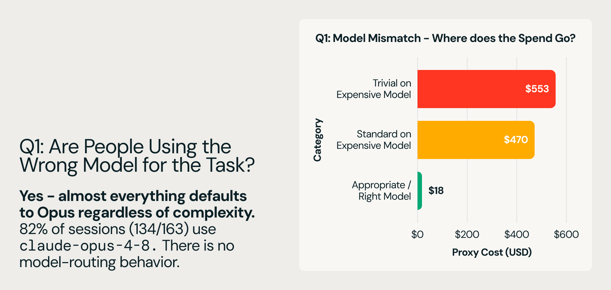

(图源:[Databricks 博客](https://www.databricks.com/blog/smart-routing-unity-ai-gateway-match-frontier-quality-30-lower-cost-task)。编程任务的成本-质量前沿上,模型与 harness 的组合高度分散,大量日常工作不需要最贵组合——这是路由存在的理由。)

要点:

1. **任务级而非请求级**。任务开始时定一次模型和 harness,整个会话不再换。原因:大规模下成本由 prompt cache 命中率主导,逐请求换模型会显著拉低命中率,省下的费用抵不过命中率下降的损失。
2. **分类器要便宜**。用一个低延迟小模型读任务描述和元数据,打几个语义标签:改系统的哪部分、提示词带什么代码证据(片段/报错栈/无)、失败形态、改动是否局部、项目类型。由此得出任务族和语言族。**训练方式未公开**:博客只说了"用小模型打标签",这个模型是 prompt 出来的通用模型还是专门训练的分类器、升/降档策略如何标定,都没有披露;公开的是评估方法——全量 session trace 落 Unity Catalog,AI 加人工复盘路由质量。
3. **默认中等,双向调整**。路由器默认选中档模型,按标签向上升档(需要前沿能力)或降档(任务简单)。一个策略覆盖整个模型谱系。
4. **模型和 harness 联合选择**。harness(决定每轮发多少上下文、何时调工具、何时压缩上下文)对成本的影响可以超过 2 倍,只换模型不换 harness 就得不到这部分收益。联合选择由 Omnigent(元 harness,编排多个编程会话)执行;子 agent 启动时独立再过一次路由——初始 prompt 往往欠定义,子任务边界更清晰,路由更准。

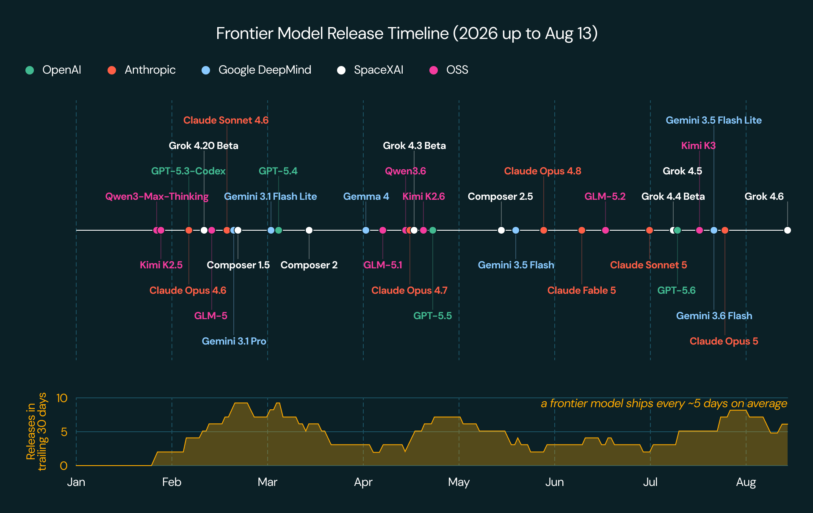

(图源:Databricks 博客,同上。任务级路由的流程:分类器读任务描述打标签 → 默认中档、按标签升/降档 → 整个会话保持该模型与 harness。)

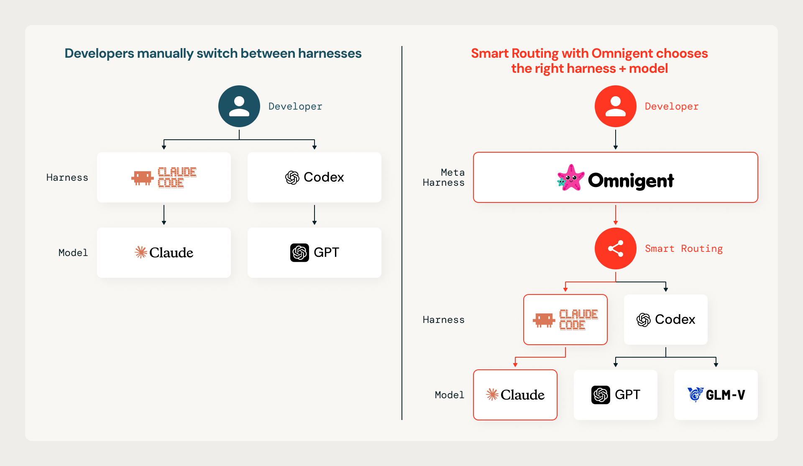

(图源:Databricks 博客,同上。Omnigent 作为元 harness 编排多个编程会话:主任务过一道路由,每个子 agent 启动时独立再过一道。)

效果(博客给出的实测数字):

| 评测集 | 成本 | 质量 |
|--------|------|------|
| 内部 coding workload | Opus 5 单模型的 65%(省 35%) | 超过任一单模型 |
| 公开 coding benchmark | 省 56% | 追平 Opus 5 |

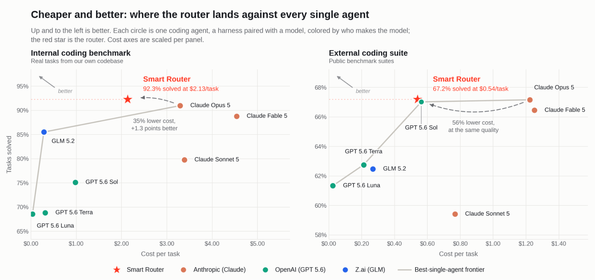

(图源:Databricks 博客,同上。路由把成本-质量权衡曲线推向左上:同等质量下成本更低。)

博客给出的四个后续方向:

- **先做任务边界免费的场景**:PR 评审、子 agent、批量迁移、定时任务——任务描述由机器生成、一开始就完整,不用猜。
- **晚几轮再路由**:首轮 prompt 是信息最差的决策点;让便宜模型先聊几轮澄清需求,任务成形后再路由。
- **会话做小**:一个会话一件事,主题变了就开会话,路由更准也更便宜。
- **换模型要在缓存失效点**:会话中途换模型意味着 cache miss;压缩(compaction)事件天然在丢缓存,是换模型的低成本时机。长期目标是路由层把 cache miss 显式计价。
  - 按这个思路做的产品:**Cognition Devin Fusion**([官方博客](https://cognition.com/blog/devin-fusion),2026-06):
    - 结构:一个前沿"主 agent"与一个便宜"sidekick"模型并行——主 agent 管规划、疑难和终审,sidekick 管代码探索、批量修改、跑测试等机械活。
    - 缓存:两者各自维护独立的缓存上下文,避免互相调用时重复付上下文的钱。
    - 换档时机:轻量分类器判断当前任务超出 sidekick 能力时,**卡在上下文压缩的时点换模型**——反正压缩要丢缓存,换模型不再额外花钱。
    - 效果(官方口径):自家编程评测 FrontierCode 上保持前沿质量、省约 35% 成本。

### OpenSquilla:开源 agent 的轮次级路由

[TokenRhythm/opensquilla](https://github.com/TokenRhythm/opensquilla)(Apache 2.0,基元律动)是微内核架构的开源 AI agent,模型路由是它的省钱手段之一,实现为 **SquillaRouter**。技术报告《OpenSquilla: Token-Efficient Agent = Models + Routing Harness》([aiXiv 260822.000001](https://aixiv.science/abs/aixiv.260822.000001),[中文 ChinaXiv 202608.00176](https://chinaxiv.org/abs/202608.00176));另有一篇讲路由数据飞轮的 [arXiv 2607.11399](https://arxiv.org/abs/2607.11399)。

**分类器是什么**。SquillaRouter 是本机运行的传统机器学习分类器:LightGBM(梯度提升树,传统 ML 而非神经网络,训练快、推理是微秒级)加 ONNX Runtime(跨平台推理引擎,模型文件随仓库用 Git LFS 分发)。给**每一轮**请求提取特征——长度、语言、是否含代码片段、关键词、语义嵌入——输出 C0–C3 四档的概率向量,按阈值映射到"能胜任的最便宜档"。整个推理在本机完成,零 token 消耗,提示词不出本机;原生库缺失或 `--router disabled` 时降级为直连单模型。

**分类器怎么训练**。数据来自 harness 数据飞轮(arXiv 2607.11399):每一轮路由把"选了哪个模型"与"任务最终成败"**分开记录**——成败由环境自动打标签(测试是否通过等),不需要人工标注;积累下来的错误决策就是下一版分类器的训练数据。新模型离线评估通过才上线,发现回归自动回滚。论文把这条路叫 "staged router-model path":冷启动用开源的 LightGBM ranker,随着日志积累逐步换成更强的路由模型。

**三层模型池的终局设想**(同篇论文,需要展开):飞轮的数据有**两个**消费者——既训练路由器(选得更准),也蒸馏/微调一个"harness 原生模型"(在这个 harness 的任务分布上比同价位通用模型更强)。两者互相加强:路由越准,原生模型拿到的训练数据越对口;原生模型越强,需要昂贵模型的轮次越少。收敛后的模型池分三层:

1. **超廉价快速通道**:最小模型吃掉占大头的机械轮次(代码探索、格式化、简单编辑),单轮成本趋近于零;
2. **harness 原生模型**:飞轮蒸馏出的专用模型,接管中间档;
3. **通用基座兜底**:前沿模型只处理前两层都搞不定的难题。

**每轮重选模型,缓存命中怎么保持**。换模型确实会丢 prompt cache,它的解法有两层:一是 **prompt 缓存隔离**——按档位划分缓存命名空间,同一档位的各轮共享该档位的前缀缓存;换档不是全部作废,而是回到该档位上次使用时的前缀位置继续。二是**自适应提示词**——简单轮次连系统提示都换成轻量版,前缀短,重建代价同步缩小。也就是说,轮次级路由把"换档丢缓存"从全损改成了按档位分段的部分损失。报告披露到这一层,更细的实现(历史消息如何裁剪进各档位命名空间)未公开。

与 Databricks 对照,它的差异点:

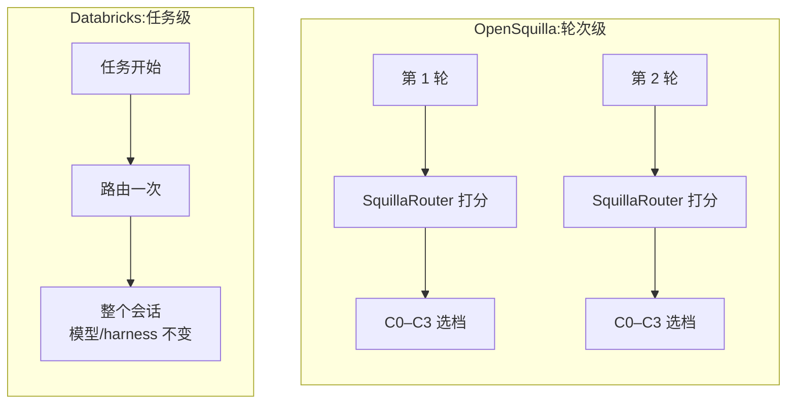

1. **粒度更细:轮次级**。Databricks 是任务级(任务开始定一次,保缓存);OpenSquilla 每一轮都重新选模型,靠上面的缓存隔离把换档代价改小。两种粒度谁更优,取决于 provider 侧缓存价格与命中形态,没有通用答案。
2. **路由之外还有集成**。难题不只路由给一个模型,而是分发给多个候选模型再聚合作答(mixture-of-agents 思路),报告声称在深度研究任务上以 Fable 5 的 31% 成本拿到更高分;带成本感知回退——单模型够用时自动跳过集成。
3. **思维深度分级**:简单轮次直接关闭推理(reasoning)输出,不为"你好"付推理 token 的钱。

技术报告的实测数字:

| 评测 | 对比对象 | 质量 | 成本 |
|------|----------|------|------|
| 全量任务 | 固定旗舰模型 | 保留 99.96% | 降 88.9% |
| PinchBench 25 任务 | OpenClaw + Opus 4.7 | 同分 0.925 | $0.688 vs $6.233 |

### 小米 MiMo Desktop:Smart 调度(产品公告,机制细节未公开)

[小米 MiMo 桌面客户端开放邀测](https://mp.weixin.qq.com/s/Ey0GaGl3erC6sm_ubOOEEQ)(2026-09,小米大模型公众号)。桌面 agent 产品,内置 "Smart" 调度,路线与 Databricks 一致——评估任务后同时选模型和执行框架,但路由维度分得更细:

- **任务评估**:识别任务类型(办公/编程/研究/设计/混合)、所需推理深度、工具范围和交付标准。
- **模型路由**:标准模型与旗舰模型之间动态选择——日常任务走标准模型(快、便宜),复杂推理与长链路任务走旗舰模型。
- **Harness / Agent / Skill 三级路由**:按任务类型选 harness;大任务拆给多个 agent(调研/规划/执行/复核);执行过程中按需调用 skill。
- **多会话协同**:多个会话组成角色团队,各自保持独立的记忆、工作区和任务状态,会话间自动通信。

成本侧给了两个数字:同会话缓存命中率最高 99%,**跨会话最高 95%**(公告口径,测试条件未公开)。

这节值得记的不是机制——**任务评估用什么模型、分类器是否专门训练、训练数据从哪来,公告全部未公开**——而是两个信号:模型+harness 联合路由正在成为 agent 产品的常见配置(OpenAI、Databricks、OpenSquilla 之后又一例);跨会话 95% 的命中率说明其调度在刻意维持跨会话的前缀亲和,可作为[总览](../model-routing.md)跨层结论第 3 条的又一个产品侧数据点。

### OpenRouter:auto → auto-beta(市场信号)

OpenRouter 是 API 聚合商:一个 key 调各家的模型,按选中模型的原价计费,自动路由不另收费。它的自动选模型功能叫 `openrouter/auto`——2026 年 8 月之前由第三方路由创业公司 NotDiamond 的引擎驱动(NotDiamond 是一家专门做"帮你在多个模型间自动选模型"的公司,训练自己的元模型做选择),之后换成了自研的 auto-beta([公告](https://openrouter.ai/blog/announcements/introducing-the-new-auto-router/))。

新机制不训练任何模型,而是统计平台自己的消费数据,自称 "wisdom of the market":把 prompt 分到约 30 个任务类别(怎么分的未披露),对每个类别看**全平台开发者最近 7 天真实把钱花在了哪个模型上**(平台周流量 55T+ token),选份额最高的。用户可以用 `cost_tier`(low/medium/high/xhigh/max 五档价格带)限定只在某个价位内选;多轮对话传 `session_id` 保持模型粘连。

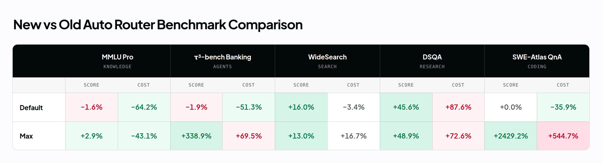

(图源:[OpenRouter 公告](https://openrouter.ai/blog/announcements/introducing-the-new-auto-router/)。读法:**行是用户指定的 `cost_tier` 价格档**——`default` 表示不指定档位,low/medium/high/xhigh/max 是五档价格带;**列是任务类别**;格子是该价格档 × 该类别下平台消费份额最高的模型及份额。同一类别在不同价格档下胜出者不同,路由就是把请求分到对应格子的胜出者。)

2026 年 9 月底,OpenRouter 上线第二个自动路由 [`typesafe/jev-router`](https://openrouter.ai/typesafe/jev-router)(2026-09-25 发布,免费,与 auto-beta 并存),由第三方 TypeSafe 的决策模型 **Jev** 驱动:

- **Jev 不是生成模型,是"决策模型"**(TypeSafe 称之为 System One model):输入一段状态文本加一组带候选答案的问题,输出各答案的概率分布,不生成文本([Jev 文档](https://openrouter.ai/docs/guides/community/jev))。第三方逆向分析([BestHub,未经官方证实](https://www.besthub.dev/articles/reverse-engineering-jev-10k-api-calls-expose-closed-source-model-architecture-27085f944485))指向两个实现特征:分类头直接从最终隐向量出概率(不做逐 token 解码);共享前缀推理——同一份 state 编码一次,多个问题分支复用 KV。
- **路由策略逐轮、缓存感知**:每轮读对话文本,对任务类型、难度、精度要求、"更大模型或更多推理是否有帮助"、"更便宜模型是否够"、"任务是否变了"分别打分,然后:
  1. 当前模型仍胜任就**保持**(会话粘连);
  2. 只调推理档位(reasoning effort)能解决的**不换模型**;
  3. 只在预期质量收益大于切换成本时才换模型,**切换成本显式包含丢失的 prompt cache**——第一家把"换模型=丢缓存"写进公开路由策略的产品(对照[实例级篇](instance-level.md)里 Anthropic 从 provider 侧给的解释)。
- **数字(官方口径,未经第三方复测)**:423 个 agent 任务上解出 237 个,对照 Auto Router 的 130 个。
- 零数据保留(ZDR);**附件不进路由决策**——jev-router 端点接受图片/PDF 等附件并随请求转发给最终模型,但 Jev 本身的输入只有文本(state + questions,32K 上下文),路由判断看不到附件内容;LiteLLM 的 Auto Router 已支持 `classifier_type: jev` 接入。

反例:**Martian** 是最早做模型路由的创业公司(2023 年种子轮 $9M,NEA/General Catalyst 投资)。

1. **思路**:"model mapping"——用可解释性方法分析各模型的内部表示,**不运行模型就预测**"这个请求哪个模型能答好";自称可解释性的第一个商业应用,还开源了 RouterBench(见下文"评测"节)。
2. **结局**:已从路由器转型为可解释性研究公司,routerbench 仓库 2024 年 6 月后停更。
3. **转型原因**([The LLM router was three products wearing one name](https://www.thedeepfeed.ai/posts/2026-06-09-llm-router-three-products-one-name/),2026-06 的分析):
   - **模型间价差塌缩**:便宜档模型降到每百万 token 几毛美元后,"选对模型"能省的绝对金额趋近于零,而路由器的延迟、维护和质量风险是固定成本,账算不过来。
   - **中间层两头不靠**:"一个入口接所有模型"的价值被聚合商(OpenRouter)拿走。
   - **信任难建立**:模型选择是开发者最在乎、也最难验证对错的决策(看不到"另一个模型会怎么答"),纯黑盒自动路由难以建立信任([相关讨论](https://www.linkedin.com/pulse/martian-vs-openrouter-optimization-trap-vidhi-vashishth-ney8c))。
4. **对照**:OpenRouter 的玩法正好绕开这三点——先把接入、计费、failover 做好,自动路由只作为可选项。

### vLLM Semantic Router(开源)

[vllm-project/semantic-router](https://github.com/vllm-project/semantic-router):挂在 Envoy 网关上的外挂处理器(ext_proc),用 Rust(Candle/ONNX)在本地跑分类器,Go 负责与 Envoy 对接。工作方式很直接:请求进来后先过一组本地小分类器,分类结果按人工写的布尔规则组合,决定发给模型池里的哪个模型。

**训练完全公开**([训练文档](https://llm-semantic-router.readthedocs.io/en/latest/training/datasets/)):共享一个 ModernBERT-base 骨干(BERT 架构的现代化版本),上面挂四个分类头,各用一个公开数据集微调——领域分类(MMLU-Pro,10 类)、PII 检测(Microsoft Presidio 数据集,6 类实体)、越狱检测(越狱分类数据集,二分类)、意图分类(Glaive Function Calling,8 类)。模型和代码都在 HuggingFace / GitHub 上。这是"分类器路线"里训练过程最透明的一家,可以直接复现。

论文 [When to Reason(arXiv 2510.08731)](https://arxiv.org/html/2510.08731v1) 验证了其中一个场景的收益:先判断"这题需不需要推理",不需要就走非推理模型——MMLU-Pro 上延迟与 token 消耗减半且精度不降。

**分类链路本身的开销**也值得记([arXiv 2603.12646](https://arxiv.org/html/2603.12646v1)):原始实现处理 8K token 输入要 **4,918ms**(标准 attention 是 O(n²) 内存,3 个并发分类器光 attention mask 就要约 4.5GB,与 vLLM 共享 GPU 时直接 OOM)。三段优化后到 **50ms**(累计 98 倍):

1. 自研 Flash Attention 算子(ONNX Runtime / ROCm),attention 内存降到 O(n):4,918 → 127ms(38.7 倍);
2. 经典 NLP 压缩(TextRank、TF-IDF、位置加权、新颖度打分)把任意长度输入先压到约 512 token 再进分类器,延迟与显存都与原长度脱钩:127 → 62ms(2 倍);
3. 近流式请求体处理(自适应分块 + 零拷贝 JSON):62 → 50ms(1.2 倍)。

最终 16K token 的路由 108ms 完成,路由器显存占用 <800MB——可以与 LLM 服务共享一张卡,不需要独占加速器。

### SwitchYard(NVIDIA,开源)

[NVIDIA-NeMo/Switchyard](https://github.com/NVIDIA-NeMo/Switchyard)(Apache 2.0,2026):agent 场景的模型路由库,两种部署形态——独立代理(agent 把 base_url 指过来)或进程内中间件。内置三类路由器,按"要不要额外调模型、要不要训练"区分([NVIDIA 博客](https://developer.nvidia.com/blog/route-ai-agent-workloads-across-models-with-nvidia-nemo-switchyard/)):

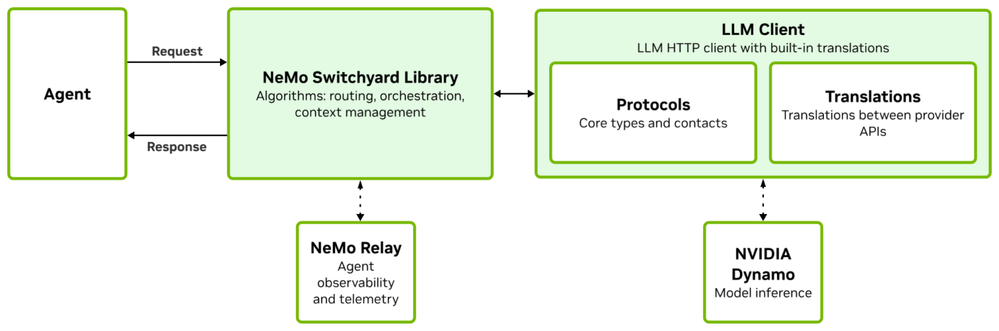

(图源:[NVIDIA 博客](https://developer.nvidia.com/blog/route-ai-agent-workloads-across-models-with-nvidia-nemo-switchyard/) Figure 3。Switchyard Server 内嵌 Routing Core(路由策略)、Session Manager(会话状态)、Usage & Telemetry(用量计量),向上接 agent/应用,向下接各模型提供方;路由配置、策略、会话存储、遥测导出构成控制面。)

1. **LLM classifier(免训练)**:一个小 judge 模型辅助决策,三种模式——capability(逐调用选目标)、**escalation**(每个任务都从便宜模型开始,judge 逐轮读已完成轮次投票,连续两次否定把该任务升档到贵模型,单向门不再降回)、custom(自定义)。
2. **Stage router(免训练,启发式)**:不加任何模型调用,纯规则判断"agent 当前处于工作流的哪个阶段"——以编码 agent 为例:前期在探索代码库、从错误里恢复(需要强模型),后期进入机械的写改实现(便宜模型就够)。它逐轮检查最近的工具活动:严重错误、反复无效劳动、长时间探索 → 推向强模型;稳定写入/编辑、测试已通过 → 推向便宜模型;信号不明确时可再问一次 LLM judge,仍不明则落默认档。延迟接近零,但只在 agent 流量里确实有这些信号时有效(LangChain 的实测没覆盖它)。
3. **Prefill-activation MLP(可训练,研究阶段)**:不读请求文本,读**模型读到这个请求时的内部状态**。做法:让模型对请求做 prefill,抽出残差流激活(这是比文本表面特征更丰富的难度信号;用哪个模型的 prefill,博客未披露),送给一个 **shared-trunk MLP**——"共享主干 + 每个候选模型一个输出头"的 MLP:主干做共享的特征变换,每个头预测池里对应模型"能答对这个请求"的成功率。再按策略把各模型的预测成功率与成本、延迟混合打分,选分最高的。

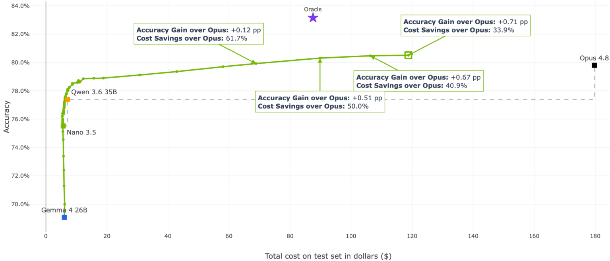

(图源:NVIDIA 博客,同上,Figure 5。读法:横轴 = 测试集总成本,纵轴 = 准确率;散点是池子里各个固定模型,折线是训练后的 prefill router 在不同成本预算下的表现——routing 不是总选最强模型,而是在预算约束下选"最可能达标"的模型,折线全程压在单模型点族的左上方。)

LangChain 的独立实测([博客](https://www.langchain.com/blog/switchyard-agent-routing-benchmark),2026-08,escalation 模式,145 个多步 agent 任务、平均 6.3 次调用)值得记三个数字:

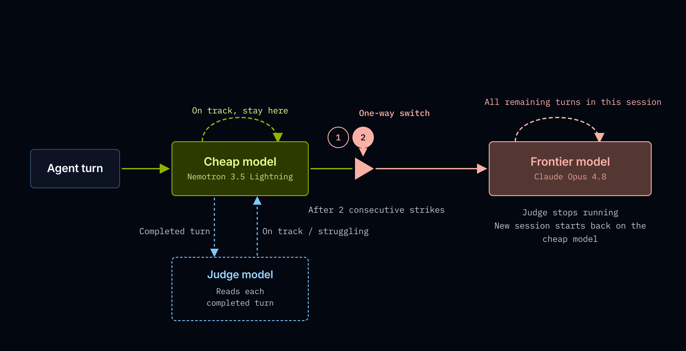

(图源:[LangChain 博客](https://www.langchain.com/blog/switchyard-agent-routing-benchmark)。escalation 是单向门:任务从便宜模型开始,judge 逐轮投票,连续两次否定后该任务永久升档到贵模型。)

1. **93% 的调用由 30B 模型完成,只占 10.4% 的花费;7% 升档到 Opus 的调用占 68.4%**——"多少轮次真的需要旗舰模型"在这个 workload 上的答案是 7%。路由后比全跑 Opus 便宜 74%,准确率低 6 个点(86.0% → 80.0%)。

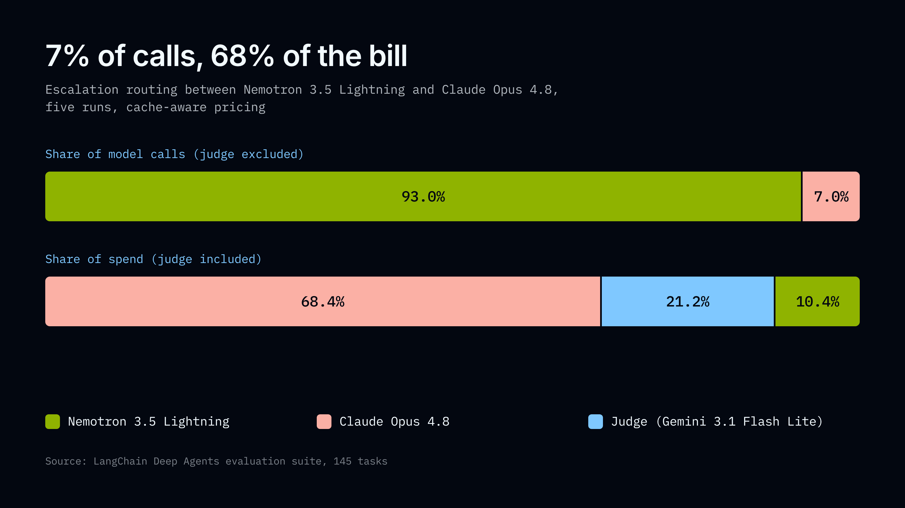

(图源:LangChain 博客,同上。读法:左环是调用量分布,右环是花费分布——30B 模型接了 93% 的调用只花 10.4% 的钱;judge 模型调用不多但占 21.2% 的花费,因为它每轮都跑且吃不到 prompt 缓存。)
2. **judge 模型吃掉路由后花费的 21.2%**:它在每个未升档的轮次都要跑,且"享受不到 prompt 缓存"——这是博客原文的实测陈述,机制未披露。注意不能按"judge 每轮读完整对话"去推:那样它自己的连续调用是前缀递增的,理论上反而吃得到缓存。更可能的原因是 judge 每轮只读**最新一轮**的内容(官方描述为 "reads each completed turn and votes"),跨轮没有增长的共享前缀,只有短短的评审指令头共享,缓存收益趋零;前沿模型则相反,多轮会话前缀递增、轮轮命中。这是"做判断的组件必须比省下的钱便宜"的又一次量化。博客给出判据公式:**最小卸载比例 = judge 成本 ÷(贵模型与便宜模型的每轮价差)**。读法:judge 是每 run 的固定税(本次 $0.64/run),只有卸载到便宜模型的轮次才省钱(每轮省一份价差,本次 $10.73/run),盈亏平衡要求卸载比例 > 0.64/10.73 ≈ 5.9%(实际卸载 93%,16 倍过线)。若两个模型价差很小,算出的最小卸载比例会超过 100%——即使把请求全部发给便宜模型,省下的钱也抵不上 judge 税,路由必然亏本;例外是便宜模型自托管(推理成本趋零,价差重新拉大)。
3. **路由 vs 全跑便宜模型**:+2.3 分准确率、4.2 倍成本,小于 run 间波动(±2.7 分)——不能宣称路由稳赢便宜模型。路由的价值在博客的"事后诸葛"论证里:评测分数是事后才知道的,生产里请求刚到达时你不知道它难还是易,全跑便宜模型就得在难题上也接受它的答案;路由是"不用提前猜哪题难"的保险费,同时压低花费上限(最差的一次路由 run $3.61,约为全跑 Opus 的三分之一)。

### UncommonRoute(开源,agent 步级)

[CommonstackAI/UncommonRoute](https://github.com/CommonstackAI/UncommonRoute)(MIT):本地运行的 OpenAI 协议代理,即插到 Claude Code / Cursor / Codex。每个请求(每个 agent 步)过三个本地信号,投票出复杂度档位,再从用户配置的上游里挑能力匹配的最便宜模型:

1. **元数据信号**:会话结构、工具使用、上下文深度,开销极低;
2. **嵌入信号**:BGE 分类器读请求 + 近期 agent 状态 + 元数据;**KNN 回退**指分类器置信度低时退到 k 近邻投票——把请求嵌入后,在历史请求索引里找最相似的 k 条,用它们的复杂度标签投票(这个索引靠高置信决策持续扩充,见下);
3. **结构信号**:文本与会话复杂度。README 原话 "active only when needed, shadow-tracked otherwise":平时只做廉价的后台跟踪(影子模式——算出结果但不参与投票),其他信号不确定时才激活参与决策。

两个设计与[总览](../model-routing.md)的跨层结论呼应:**会话不绑定模型**(逐步重选,但遵守 Anthropic thinking 续段等协议约束);**本地反馈学习**——高置信的一致决策用来扩充嵌入索引,低置信预测直接升档,而不是静默发给弱模型。自报数字(注意自评属性):SWE-bench Verified 100 例 held-out 上 75/100(Opus 单模型 74/100)、成本 $25.66 vs $54.73,省 53.1%;评测基建是同团队开源的 TwinRouterBench(见下文"评测"节)。

### openJiuwen model-router(华为,开源路由内核)

[openJiuwen-ai/model-router](https://github.com/openJiuwen-ai/model-router)(Apache 2.0,2026-09 开源)是华为 openJiuwen agent 框架([论文](https://arxiv.org/abs/2608.27969))的模型路由内核。与前面各家的最大不同:它做的不是"一个路由器",而是**路由内核 + 算法槽**——算法是可替换的纯函数,内核只管契约、状态与装配。Rust 核心(protocol / state / algorithms / runtime 四层 crate)+ PyO3 的 Python 门面;端云同一套决策契约,差异只落在 TOML profile(端侧进程内 state / 云侧远程 state)。

内核的四条设计纪律([架构文档](https://github.com/openJiuwen-ai/model-router/blob/main/docs/zh/architecture.md)):

1. **决策与执行分离**:算法只返回 `selected_model_id` 加 `reasoning`,模型调用由宿主自己完成,路由器不经手流量,不会成为瓶颈。
2. **算法是纯函数**:同样的 (request, ctx) 必须给出同样的决策;算法不持有可变状态、不调用目标模型。
3. **状态是外置的 hint**:跨请求记忆全部放在 StateProvider(snapshot / report);状态丢失只降质为冷路由,远程 state 硬超时返回空视图,而不是让请求失败。
4. **反馈驱动排除**:宿主 report 的 Feedback(Overflow / Unavailable)写入排除 hint,下次 route 自动避开故障模型。

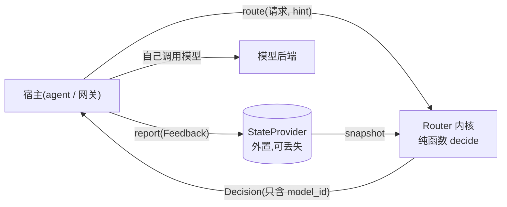

(按官方架构文档的时序图重绘:route/report 闭环。注意 State 与 Algorithm 之间无直接调用,唯一耦合是 RouteContext 里的视图数据。)

自带的生产级算法是 **x-router**(Python 侧,[README](https://github.com/openJiuwen-ai/model-router/blob/main/python/openjiuwen/x_router/README.md)):

1. **分档**:进程内小分类器(Qwen3-0.6B,greedy 解码保证同请求同档)把会话打进 SIMPLE / MEDIUM / COMPLEX / RESEARCH / REASONING 五档;不高于本地能力线的留本地模型,超出的按档位映射到云端模型。
2. **失败只降不升**("No failure escalates"):分类器缺失、超时、输出解析失败,都降级到本地模型或启发式,绝不因路由故障把请求发到更贵的模型。每次决策带一个格式稳定的 `reasoning` 字符串,记两个独立事实:`rule=` 命中了哪条规则、`source=` 决策来自哪(classifier / heuristic_fallback / parse_failed)。格式稳定就可聚合——统计日志里 `source=heuristic_fallback` 和 `source=parse_failed` 的占比,就是分类器故障率的免费监控指标,不用额外埋点。
3. **可选 bandit 层**(默认关):记住历史会话的结果,当"相似请求在另一档上持续表现更好"(相似近邻 ≥5 且分差 >0.3)时覆盖分类器的档位;效用函数 U = 质量 − λ×成本——正是下文"机制展开"里的效用式成本感知选择;每轮质量由 judge 模型(本地 1.7B+ 或任意 OpenAI 兼容 API)在 report 返回后异步打分,打分队列满则丢而不是阻塞。
4. **状态侧配套**:k-NN 检索历史闭环记录(top_k=10、相似度阈值 0.5),forgetting_gamma 折扣旧策略版本的记录;免费档位必须上报 cost=0——成本未知的档位在成本有权时永不入选。

与 lake 的对照:这是模型级路由,但设计纪律与 lake 实例级 Router 的原则同构——Router 是纯函数 f(请求, 状态快照)、状态外置、决策与执行分离。差异在状态的可靠性假设:model-router 把状态显式设计成可丢失的 hint(硬超时返回空视图),因为选错档只影响成本;lake Router 读的是存储池的权威位置视图,由存储控制面保证可用——位置视图是执行模式选择的输入,降质成"可丢失"会把 D-direct 决策变成猜测。

当前状态(2026-09-30):仓库是按蓝图搭好的骨架——契约、装配、一条可跑的 ReAct 验证路径已对齐;加权算法、远程 state gRPC、完整 PyO3 绑定仍是桩;`evolving/mf.rs` 的矩阵分解在线演进算法只有空壳(`fit` 返回空工件)——MF 在路线图里,尚未落地。

### LiteLLM / Portkey 等 AI 网关

路由策略是负载均衡与容错型(least-busy、最低延迟、成本上限、顺序 fallback),不做"这个请求哪个模型答得好"的质量预测。与模型级路由是近邻但不同类。

## 学术与评测

### 成本-质量路由主线

| 工作 | 年份/出处 | 机制(具体怎么判断) | 备注 |
|------|----------|------|------|
| FrugalGPT([arXiv 2305.05176](https://arxiv.org/abs/2305.05176)) | 2023,Stanford | **级联**:先调最便宜的模型,用一个微调过的 DistilBERT 给实际回答打分(够不够对),够就直接返回,不够再调更贵的,逐级升级。打分器的训练数据 = 把各模型在历史数据上都跑一遍、对照标准答案回放打分 | 最高省 98% 成本。与路由的区别:路由在发请求**前**做一次选择;级联是拿到回答**后**再决定要不要升级,可能串行调多个模型,延迟逐级叠加 |
| HybridLLM([ICLR 2024](https://arxiv.org/abs/2404.14618)) | 2024 | 微调 BERT 预测"这个查询小模型能不能答",能就走小模型、不能走大模型;标签来自事后回放判定 | 难度预测路线的代表 |
| RouteLLM([arXiv 2406.18665](https://arxiv.org/abs/2406.18665),[lm-sys/RouteLLM](https://github.com/lm-sys/RouteLLM)) | 2024,LMSYS | 用 Chatbot Arena 真人对战数据训练四种路由器:**相似度加权排名**(把查询嵌入,找 Arena 里最相似的对战记录,按相似度加权算出"强模型在这类查询上的胜率")、矩阵分解、BERT 分类器、causal LLM 分类器;再用一个阈值控制"胜率差多大才值得调强模型",阈值越高越省钱 | MT-Bench 上省 85% 成本、保持 95% GPT-4 质量;开源、模型数据在 HuggingFace |
| GraphRouter([ICLR 2025](https://arxiv.org/abs/2410.03834)) | 2025 | 把任务、查询、模型建成异构图的节点,"某模型能答好某查询"是边;路由变成预测边——相似任务之间可以互相提供证据 | 利用任务间结构信息 |
| Avengers([arXiv 2408.12683](https://arxiv.org/abs/2408.12683)) | 2024 | 最简单的一支:把历史查询按嵌入**聚类**(嵌入后按向量距离分组),统计每个簇里哪个小模型历史平均分最高;新查询落入哪个簇,就用那个簇的冠军 | 不训练任何神经网络也有竞争力 |
| Avengers-Pro([arXiv 2508.12631](https://arxiv.org/abs/2508.12631)) | 2025 | Avengers 的成本版,三步轻量操作:嵌入(Qwen3-embedding-8B)→ k-means 聚成 60 簇 → 每个簇给每个模型算"性能-效率分"(参数 α 加权该簇上的准确率与成本);推理时把查询嵌入选最近的 4 个簇,按簇分数加总选模型。调 α 就在"更准"与"更省"之间滑动 | 6 个 benchmark、8 个旗舰模型上:同等成本比 GPT-5-medium 高 +7% 准确率,同等质量省 27% 成本;LLMRouterBench 里表现最好的方法(见下) |
| LLMRank([arXiv 2510.01234](https://arxiv.org/abs/2510.01234)) | 2025 | 特征驱动排序:从 prompt 抽**人可读**特征(任务类型、推理模式、复杂度指示、句法线索、轻量代理求解器的信号),神经排序模型预测每个模型的效用(质量 − λ×成本);训练目标是 pointwise 回归 + listwise KL 的混合(见下"机制展开") | RouterBench 上达 89.2% 的 oracle 效用;可解释归因——能说清"因为哪个特征选了这个模型" |
| 综述([arXiv 2603.04445](https://arxiv.org/html/2603.04445v2)) | 2026 | 路由/级联统一分类 | 入门地图 |

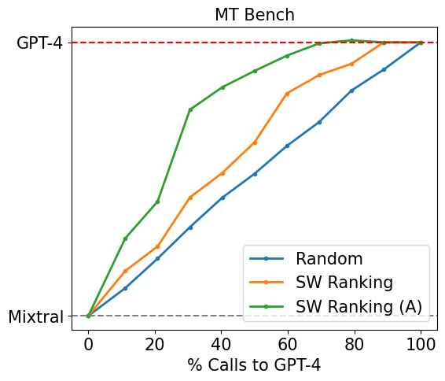

(图源:[RouteLLM 论文](https://arxiv.org/abs/2406.18665) Figure 2。读法:横轴 = 调用强模型(GPT-4)的比例,近似成本;纵轴 = MT-Bench 质量。四条实线是论文训练的四种路由器——SW ranking = 相似度加权排名,Matrix factorization = 矩阵分解,BERT / Causal LLM = 两种分类器,**(A) = 训练时做了数据增强**;灰色虚线是"按同样比例随机调用 GPT-4"的基线。曲线越靠左上越好:花同样的强模型调用比例,拿到更高的质量。)

### 机制展开:质量预测 + 成本感知选择(MF 与 ListNet)

上表的路由方法里,除 FrugalGPT 是级联(拿到回答后再决定要不要升级)外,其余都是**单轮路由器**(调用前一次选定模型)。它们多数可以拆成同一个三步结构:**给每个候选模型预测质量分 → 按成本做选择 → 用排序损失训练**。围绕这三步有几个反复出现的术语,集中解释一次:

1. **MF(矩阵分解)是什么**:从推荐系统借来的质量预测器。把"查询 × 模型"的质量矩阵分解成低秩嵌入的乘积,学一个隐评分函数 δ(M,q) 表示"模型 M 答查询 q 的质量"。RouteLLM 的 MF 路由器是双线性形式:模型嵌入与查询嵌入(投影到同维)逐位相乘,再过线性层出标量分;EmbedLLM 同样用 MF 学模型的紧凑嵌入,路由时预测"哪个模型能答对"。优点是极小、推理微秒级;缺点是**新模型入池要重训**(冷启动问题,见"评测"节的 MonoScale)。
2. **ListNet 是什么**:learning-to-rank 的 listwise 损失(Cao et al., 2007)。把一个查询下所有候选模型的预测分过 softmax 变成概率分布,与真实效用(谁答对、答得多好)的分布算交叉熵,直接对齐"整个候选列表的排序"。它的两个对照范式:
   - **pointwise**:逐个模型独立回归分数,不管相对顺序;
   - **pairwise**:两两比大小——RouteLLM 的 sigmoid 胜率(强模型胜过弱模型的概率)就是 pairwise。
3. **怎么用在 router 里**:质量预测头(MF 或其他)出分之后,**成本感知选择**有两种常见形式:
   - **阈值式**:RouteLLM——预测"强模型胜率"超过阈值才调强模型,阈值就是成本旋钮;
   - **效用式**:选 argmax(质量 − λ×成本),λ 是成本旋钮——LLMRank 用的这种。
   
   训练目标的选取与池子大小有关:二元池(强/弱两个模型)用 pairwise 就够;**多模型池更适合 listwise**——pairwise 只学相对胜负、比较对数随池子平方增长,listwise 直接对整个候选分布对齐。LLMRank 是"质量预测 + listwise 训练 + 成本效用选择"三者齐备的具体例子(RouterBench 上训练,89.2% oracle 效用)。
4. **bandit(赌博机)是什么**:上面三步都是离线训练视角;上线后要边服务边学,标准框架是 bandit。名字来自赌场:你面前一排老虎机,每台中奖率不同且未知,每次只能拉一台、只能看到这一台的结果,目标是用最少的试错找出最好的那台。对应到路由:
   - 每个候选模型 = 一台老虎机;路由一个请求 = 拉一次;奖励 = 这次调用答得好不好、花了多少钱。
   - 核心困难是**部分可观测**:选了便宜模型答错了,你永远不知道贵模型当时能不能答对——没拉的臂没有结果。
   - 所以要在两件事间权衡:**利用**(选目前估计最好的模型)与**探索**(偶尔选数据少的模型攒信息,否则新模型永远没有机会证明自己)。
   - **上下文 bandit**(contextual bandit)= 拉臂前允许看一眼请求特征(内容、长度、类型),即每台机器的中奖率随请求而变。经典算法 LinUCB 给每台机器拟合一个"请求特征 → 奖励"的线性回归,并给估计加上不确定度,选"估计值 + 不确定度"最高的——数据少的机器不确定度大,会自然被偶尔选中,探索自动发生。
   
   与离线训练的对比:离线训练要"每个模型 × 每个查询"的完整标注(RouterBench 那样预计算),bandit 不需要,边服务边学;代价是反事实(没选的模型会怎样)永远未知,见下"路由器的自我演进"节。上文 openJiuwen 的 bandit 层、下文 RouterArena 的 OrcaRouter-Adaptive、自我演进节的 PILOT / BaRP / ParetoBandit 都是这一族。

### 评测:方法多,有效的少

- [RouterBench](https://arxiv.org/abs/2403.12031)(2024,Martian 开源):11 个模型 × 7 个任务,40 万条预计算输出。做法是把"每个模型在每个请求上答得怎么样、花多少钱"事先算好公开,新路由器不用重跑模型就能离线评测——路由策略离线评测的事实标准。
- [LLMRouterBench](https://aclanthology.org/2026.findings-acl.1881.pdf)(ACL 2026 Findings,上海 AI Lab):更大规模的统一重测——40 万实例、21 个数据集、33 个模型,构建花约 1.8B token、1K GPU 时加 $2.7K API 费。被测的 10 个方法覆盖各路线:RouterDC、EmbedLLM、MODEL-SAT、Avengers、HybridLLM、FrugalGPT、RouteLLM、GraphRouter、Avengers-Pro,以及**商业产品 OpenRouter**。它分两个设定,参照系不同,读结果时不能混:

  **设定一:性能设定**(20 个约 7B 的轻量模型池,只看准确率)。参照系:Random(随机选,下限)、Best Single(事后知道的全局最强单模型)、**Dataset Oracle**(每个数据集固定选该数据集的最强单模型)、Oracle(逐题选对且最便宜,理论上限)。结果:

  1. 领先方法彼此接近(EmbedLLM / GraphRouter / MODEL-SAT / Avengers 的 AvgAcc 在 70.3–71.9 之间),且都接近 Dataset Oracle 的 73.10。**为什么这说明收益来自粗粒度领域结构**:Dataset Oracle 只做一件粗粒度的事——"认出这是数学题,就派数学最强的模型",不做任何逐请求的精细判断;最好的路由器几乎追平它,说明现有方法的收益绝大部分来自这一层。反过来说,论文里各种精巧的逐请求判断,相对"按域选模型"几乎没带来额外收益。
  2. 与理论上限的差距(Gap@O 约 21%)主要来自**模型召回失败**:只有不超过 3 个模型能答对的题(占测试集 11.9%),路由器准确率只有约 24%;即使放宽到"正确答案在路由器的前 3 个候选里"(Recall@3)也只有约 50%。精细判断不是没收益,是现有方法做不到。
  3. 对部署友好的结论:Avengers 不训练神经网络(纯聚类)也在第一梯队;embedding 骨干换成弱模型几乎不影响结果;**模型池越大收益越递减,精心挑选的小池子更划算**——原因是路由的收益来自模型间的互补(各有所长):Oracle 曲线显示从 2 个模型加到 4-6 个时上限提升最大,之后新模型擅长的领域大多已被覆盖,边际互补趋零;同时候选越多,路由器选错的概率越高。按"覆盖更多领域"挑 4-6 个互补的模型,比堆 20 个更划算。

  **设定二:性能-成本设定**(13 个旗舰模型池,参照系 Best Single = GPT-5)。指标:PerfGain(质量相对 GPT-5 的增减)与 CostSave(质量不低于 GPT-5 前提下的最大省钱幅度)。结果:**OpenRouter 的 PerfGain 是 −24.7%**——质量比"所有请求都发给 GPT-5"还差 24.7%,质量不达标所以 CostSave 记 N/A(论文脚注:OpenRouter 用自己平台的模型池,不可配置)。这与设定一不矛盾:Dataset Oracle 是轻量池里的上界参照,−24.7% 是旗舰池里相对 GPT-5 基线的差距,两个设定两批模型。表现最好的 **Avengers-Pro**:PerfGain +4.0%、CostSave +31.7%,几乎独占 Pareto 前沿(机制见上表);RouteLLM +2.6% / +11.4%;HybridLLM、FrugalGPT 两个二分类级联/路由器都是负收益。
- **模型池不是越大越好**(2026 年的四篇后续研究,把上面设定一结论 3 往深推了一层):
  1. **OrchSLM**([arXiv 2609.13470](https://arxiv.org/abs/2609.13470)):小模型编排的系统扫描——oracle 覆盖率随池子规模持续上升,但**路由准确率通常在 3-4 个模型时见顶**;再加模型会引入"稳定的错误支持"(某些模型稳定地给出同一个错答案),让正确答案更难被识别。池子构成变化还会改变最优路由策略本身——选池与选路由策略是耦合决策,不是先后两个阶段。
  2. **Mo' Models, Mo' Problems**([arXiv 2609.17306](https://arxiv.org/abs/2609.17306)):多智能体系统(路由/多数投票/LLM judge 三种形态)里,**扩大候选池几乎总是损害性能**;按"同家族、答案多样性"等预言指标精选的小池子反而最好。
  3. **MonoScale**([arXiv 2601.23219](https://arxiv.org/abs/2601.23219)):池子**动态扩大**时的失败模式是冷启动误路由——新模型入池,路由器对它没有经验,naive 扩池直接塌(GAIA 上 DeepSeek-V3.2 从 5 个 agent 的 0.558 掉到 10 个的 0.491);给路由器加"熟悉化任务 + 记忆更新"后,扩展才恢复单调收益。即使把路由器换成 GPT-5 级,面对含故障成员的噪声池一样崩。
  4. **The Routing Plateau**([arXiv 2606.07587](https://arxiv.org/abs/2606.07587)):从另一侧印证——把路由训练数据从 3 万扩到 30 万、编码器从 ModernBERT-base 升到 large、端到端微调,三招合计只多补 2.13 个百分点(oracle gap 的 14.6%);剩余差距需要"模型池感知的目标函数"和超越静态查询表示的信号。
- [TwinRouterBench](https://arxiv.org/abs/2605.18859)(2026,CommonstackAI,[代码与数据](https://github.com/CommonstackAI/TwinRouterBench),Apache 2.0):**步级**(step-level)路由评测,补前两个 benchmark 的盲区。用一个例子说清两种评测的样本长什么样:

- RouterBench/LLMRouterBench 的一个样本 = **一道独立的题**:"证明 √2 是无理数" → 路由器选一个模型 → 结束、记分。样本之间互相独立,每道题只决策一次。
- TwinRouterBench 的一个样本 = **一个任务进行到一半的断面**:"[系统提示 + 用户报的 bug + 前 17 步的模型输出与工具返回 + 刚跑挂的测试日志]——第 18 次调用该用哪档模型?"同一任务的第 19 步是另一个样本。

差别有两层:一是**输入形态**(自包含的短问题 vs 累积的长前缀);二是**决策结构**(一道题决策一次 vs 一个任务连续决策几十次,且各步难度天差地别——"读一下这个文件"和"想清楚这个测试为什么挂"是同一任务里的相邻两步)。旧 benchmark 的盲区主要在第二层:agent 的账单是几十次调用的总和,大部分是机械步、少数是关键步;"整任务选一次模型"的评测测不出路由器能不能在长前缀里认出"当前这步是机械步、便宜档就够"。双轨制:
  1. **静态轨**:970 个"路由器可见前缀"快照,来自 520 个实例、5 种 workload(SWE-bench / BFCL / mtRAG / QMSum / PinchBench);每条标注"最便宜够用档"(low/mid/mid_high/high 四档),标签由 downgrade-and-cascade 协议生成(从高档逐步降档 + 混合模型执行验证,确认降档后任务仍成功);打分是确定性算术(档位标签 × 轨迹归属 × token 成本),**评测侧不用在线 LLM judge**。
  2. **动态轨**:live 跑 SWE-bench Verified(论文报告 100 例 held-out,与静态轨的 SWE 监督切分不相交),每次调用路由器从锁定模型池选具体模型,按官方 resolution 判定 + 实际 API 花费(含缓存计费)+ 未解决罚分结算。

  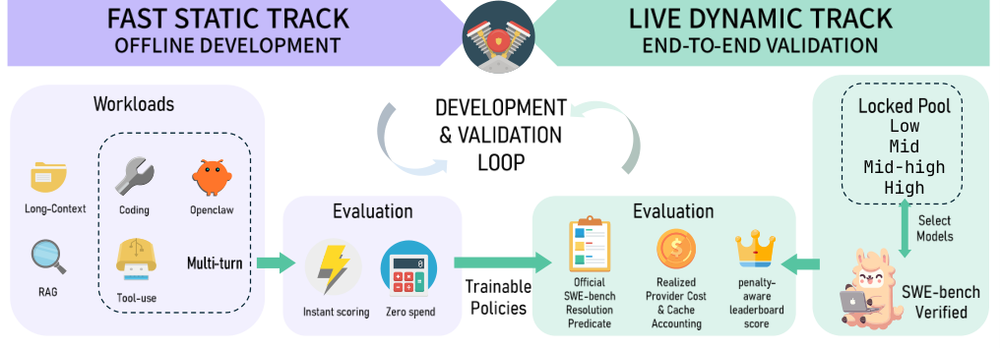

  (图源:[TwinRouterBench 论文](https://arxiv.org/abs/2605.18859) Figure 1。读法:上路是静态轨——从成功轨迹里逐步降档、执行验证,产出带"最便宜够用档"标签的 970 个步级快照,供离线快速迭代;下路是动态轨——路由器接进 live agent  harness 跑完整 SWE-bench,按任务解决率与实际账单结算。)

  头部数字:训练出的路由器 75/100、$25.66,全 Opus 参照 74/100、$54.73——质量持平、省 53.1%。注意这个 benchmark 与 UncommonRoute 同源(见上文 UncommonRoute 节),读其"训练路由器"结果时留意自评属性。三个评测集连起来看,形态演进是:单轮离线回放(RouterBench)→ 大规模统一重测(LLMRouterBench)→ 步级 agentic 双轨(TwinRouterBench)。
- [RouterArena](https://arxiv.org/abs/2510.00202)(ICLR 2026,[排行榜](https://routeworks.github.io/)):实时排行榜形态,把路由器当黑盒测(各家用各自的模型池),主指标 Arena Score 是准确率与 log₂ 成本的加权调和平均。榜单滚动更新、榜首更迭很快,以下以 **2026-09-29 的榜单数据**为准(9 月初的榜首 Paix2 已被暂时除名,见第 4 条):

  1. **前五名**(KT-ModelRouter 76.28 / Sqwish 76.21 / Divyam 75.85 / Cross-Router 75.75 / LLM Router 75.69):全部是个人或商业提交,路由原理均未公开。但提交以 PR 形式进 [RouteWorks/RouterArena](https://github.com/RouteWorks/RouterArena) 仓,`router_inference/config/` 下的配置文件公开了各家的**模型池**——这本身就很有信息量:
     - **KT-ModelRouter**(第 1):池子 5 个(deepseek-v4-flash/pro、gemma-4-31b、gemini-3-flash、qwen3-235b),描述只有一句"内部训练的路由策略"。
     - **Sqwish**(第 2):商业,池子 5 个(qwen3-235b、qwen3-next-80b、Qwen3-Coder-Next、gemini-3.1-flash-lite、deepseek-v4-flash)。
     - **Divyam**(第 3)/ **Cross-Router**(第 4):个人提交,池子 4 / 7 个,原理未公开。
     - **LLM Router**(第 5):池子 5 个(qwen3-235b、qwen3-next-80b、Qwen3-Coder-Next、gemini-3.1-flash-lite、deepseek-v4-flash——与 Sqwish 的池子完全重合),原理未公开。
  2. **公开原理的最高名次**:
     - **vLLM-SR**(第 8,74.86):ModernBERT 多分类器(见上文 vLLM Semantic Router 节)。
     - **nadir-caliper**(第 9,74.55):Nadir 作者的校准变体,细节未公开。
     - **Weave Router**(第 12,72.82,[源码可得](https://github.com/workweave/router),Elastic License):**Avengers-Pro 的产品化**——进程内 ONNX 小模型做嵌入,对冻结的意图簇中心打分(簇打分器从 Avengers-Pro 改来,用生产流量重训),选该簇上历史表现追平旗舰的最便宜模型;按 action(单次 API 请求)路由,带会话粘连保缓存;决策 <50ms。
     - **Nadir Router**(第 13,72.29,[开源](https://github.com/NadirRouter/NadirClaw)):嵌入质心二分类——all-MiniLM-L6-v2 嵌入后与"简单/复杂"两个质心比余弦相似度,再叠加规则覆盖(检测到工具调用强制走强模型、检测到推理标记走推理模型、超长换长上下文模型、会话内保持同模型)。
     - **OrcaRouter-Adaptive**(第 14,72.08,[开源](https://github.com/Continuum-AI-Corp/OrcaRouter-Lite)+[论文](https://arxiv.org/abs/2605.30736)):**LinUCB 上下文 bandit**——用词法 + 句嵌入特征,离线阶段在精选 prompt 集上全信息评估每个候选模型、每臂拟合一个岭回归,上线后按 bandit 反馈只更新被选中那一臂。
  3. **知名商业/旗舰反而靠后**:**OpenRouter Auto Router 第 20**(70.05,$0.12/1K——便宜但准确率平平)、GPT-5 第 25(64.32,贵)、NotDiamond 第 29(57.29,频繁选贵模型);学术基线整体垫底(carrot 第 26、routerbench_mlp 第 28、graphrouter 第 30、routellm 第 32、RouterDC 第 33)。
  4. **Paix2 事件(榜首被除名)**:9 月初的榜首 Paix2(77.63,池子只有 4 个小模型——MiniMax-M3 / agnes-2.0-flash / DeepSeek-R1-Qwen3-8B / GLM-4-9B)被两个 issue 质疑:[#190](https://github.com/RouteWorks/RouterArena/issues/190) 指其提交在已记录全部候选答案与分数之后修改了 294 题的路由选择,"最优选择率"从 66.35% 跳到 89.68%、最优准确率变成 100%——疑似看了评测结果再定路由(榜单规则明确禁止在评测数据上调路由器);[#203](https://github.com/RouteWorks/RouterArena/issues/203) 指其 MiniMax-M3 结果经 OpenRouter 复现不出(84.12% vs 65–69%,输入 token 数也对不上)。两个 issue 截至 2026-09-30 仍 open,官方已将 Paix2 **暂时移出榜单**等待诚信审查(审查跟踪:[#211](https://github.com/RouteWorks/RouterArena/issues/211))。

  从这份榜单能读出三个结论:

  1. **头部全是"小而便宜的精选池"**(4-7 个模型,以 flash/小杯为主)——正是上文 LLMRouterBench"精心挑选的小池子更划算"结论的实战版。
  2. **公开原理的上榜者仍是"嵌入特征 + 轻量分类/回归/bandit"一族**,与 LLMRouterBench 里 Avengers 系表现最好互相印证。
  3. **黑盒榜单防不住"看了答案再路由"**:Paix2 从榜首到除名是"评测比方法难"(见[总览](../model-routing.md)跨层结论)的极端案例——只交预测文件不交代码的赛制,区分不了"真会路由"和"拟合了评测集";榜单方的处理(暂时除名 + 公开审查)是目前唯一的防线。

  论文总结的共同短板:现有路由器都不擅长识别"这题便宜模型就够了"的查询。
- **数字打架,怎么理解**(梳理而非堆砌):关于路由能省多少钱,四类来源的数字差出一个数量级——

  | 来源 | 数字 | 口径 |
  |------|------|------|
  | 学术论文(FrugalGPT / RouteLLM) | 省 85–98% | 两极模型池(旗舰 vs 极小)、单题 benchmark、质量阈值宽松 |
  | 厂商自报(Factory / Databricks / OpenSquilla) | 省 20% / 35–56% / **88.9%** | 各自 workload、各自基线,口径互不可比 |
  | 独立重测(LLMRouterBench) | 最好省 31.7%(Avengers-Pro);OpenRouter 为负 | 统一数据、统一基线(GPT-5) |
  | 第三方综合([Sean Geng](https://seangeng.com/writing/the-honest-guide-to-llm-routing)) | 生产混合流量约 **20–25%** | 综合多家实测后的估计 |

  梳理后的结论:省钱幅度 ≈ **池子档差 × 简单流量占比**。论文数字大是因为池子两极化(旗舰和 7B 差百倍价格)且题目里简单题占大头;生产池档差小、难题占比高,所以 20–25% 才是可信区间。OpenSquilla 自报的 88.9% 看着夸张,但按这个公式反而说得通:它的池子有"单轮成本趋近于零"的超廉价档(档差极大),且 agent 流量里机械轮次占大头(简单流量占比极高)——两个因子都拉满。所以凡是声称 90% 的,先问它池子和流量分布。

### 路由器的自我演进(RSI × 路由)

上面的方法都把路由器当静态工件:离线训练、上线冻结、池子变了再重训。2026 年出现的一条新线是把它接进**递归自我改进(RSI)**的环。RSI 一脉([STOP](https://arxiv.org/abs/2310.02304)、[Darwin Gödel Machine](https://arxiv.org/abs/2505.22954))证明系统可以改写自身的 scaffold 与代码;路由场景的特殊之处是**路由日志天然是训练标签**——路由器每步都在记录"预测的能力需求 → 实际派发的模型 → 任务结果",这正是特化训练要的难度估计与缺陷信号;反过来模型变强后,路由器的质量模型必须跟着更新。闭环天然存在,相关工作按闭环层级分三层:

**闭环整体:NeoHorse-1**([arXiv 2609.08183](https://arxiv.org/abs/2609.08183),2026-09,[代码](https://github.com/TokenRhythm/NeoHorse))。标题即命题——"RSI via Agentic Post-Training **with Routing Harness**";出自 TokenRhythm(即 OpenSquilla 团队,见上文),产出是一族 agent-native 模型(4B/9B)。机制要点:

1. **每轮记三个数**:harness(执行层)的路由模块对每个用户轮次分别记录——预测档(路由器估计"这轮需要多强的模型")、派发档(实际用了哪个模型)、结果(任务完成 / 验证反馈 / 恢复成本),与轨迹对齐成"预测–动作–结果"三元组。
2. **预测档当难度标签,派发档不当**:课程排序需要一个干净的"这轮有多难"标签。派发档(实际用了哪个模型)混入了与难度无关的因素——用户手动指定模型、该档当时限流只能降档、免费档固定走便宜模型——所以"派了便宜模型"不等于"这轮简单";拿被污染的标签排序,会把难题错排成简单题,课程就错了。预测档是路由器在执行前对请求本身的估计,不受这些事后因素污染。因此训练只用预测档排序——按难度从低到高排成三阶段 SFT 课程,同一套难度顺序再用来调度 on-policy 蒸馏的起始上下文;派发档只和结果字段一起用于事后评估路由本身的质量。
3. **结果字段当缺陷信号**:哪类轮次老失败,下一轮训练数据就多配哪类(能力导向的数据配比)。
4. **闭环**:新 checkpoint 回到 harness 继续服务,新轨迹暴露下一批能力缺口,回到第 1 步——原话 "what the system learns to do influences what it learns from next"(系统学会了什么,决定它接下来从什么里学)。

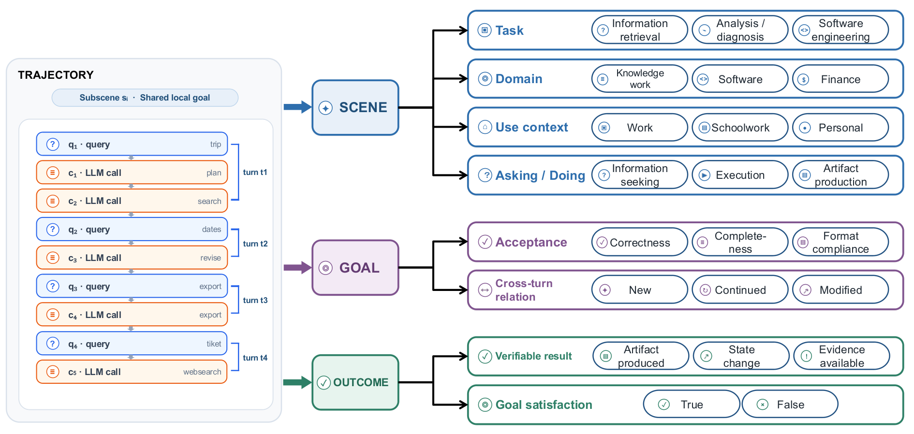

(图源:[NeoHorse-1 论文](https://arxiv.org/abs/2609.08183) Figure 2。读法:harness 带 agentic routing 服务真实流量,逐用户轮落盘;数据引擎做质量打分、场景刻画、路由信号对齐;分配层按课程与能力缺口配数据;更新层 SFT + on-policy 蒸馏出新模型,回到 harness。)

注意:自评属性强——团队、harness(OpenSquilla)、数据飞轮论文([arXiv 2607.11399](https://arxiv.org/abs/2607.11399),本文参考链接已收录)同源,评测(QwenClawBench / PinchBench)也跑在自家 harness 上,结果待独立复现。

**共同进化(路由器 ↔ 被路由对象)**:

- [EvolveRouter](https://arxiv.org/abs/2604.05149)(2026-04):路由器训练时收集各 agent 的失败模式 → 生成指令修订、只保留可靠改进 → 改进后的 agent 反过来提供更干净的监督信号重训路由器,交替共进化;推理侧按 router 加权一致度动态决定参与 agent 数 K。
- [EvoRoute](https://aclanthology.org/2026.acl-long.1771/)(ACL 2026):经验库驱动的自路由——每步从不断膨胀的历史记录里检索候选、按模型聚合(精度/成本/延迟)后做 Pareto 筛选;GAIA / BrowseComp+ 上成本最高 −80%、延迟 −70% 以上。
- [NVIDIA Data Flywheel Blueprint](https://github.com/NVIDIA-AI-Blueprints/data-flywheel):工业版飞轮——生产日志带 workload 标识落 Elasticsearch,分层抽样出训练/评测集,LoRA 蒸馏小模型,LLM-judge 打分后晋升。定位是"发现与晋升服务",晋升前人工评审,不是全自动替换;路由器的 workload 标签正是它分层抽样的依据。

**路由器在线学习(闭环的下半圈,最成熟)**——上下文 bandit 一脉(术语见"机制展开"第 4 条):

- [PILOT](https://aclanthology.org/2025.findings-emnlp.1301/)(EMNLP 2025):LinUCB + 离线偏好数据预训练的共享嵌入空间,上线后用 bandit 反馈持续微调;用户预算建模成多选背包。
- [BaRP](https://arxiv.org/abs/2510.07429):bandit 反馈 + 偏好向量条件化,测试时免重训调节质量-成本权衡;比离线路由器至少 +12.46%。
- [MixLLM](https://aclanthology.org/2025.naacl-long.545/)(NAACL 2025):持续学习 + 候选池可变;GPT-4 质量的 97.25% @ 24.18% 成本。
- [ParetoBandit](https://arxiv.org/abs/2604.00136):在线对偶变量做预算 pacing + **几何遗忘**对抗非平稳 + 模型热插拔。
- [StageRoute](https://arxiv.org/abs/2506.17254):联合优化"部署哪些模型"与"怎么路由",regret Õ(T^2/3) 带匹配下界。
- 工程化样本:[VDF 自演进路由器白皮书](https://vdf.ai/white-papers/the-self-evolving-model-router/)——六级 dispatcher 逐层 feature-gate、信号缺失时降级到更简单策略;LinUCB 逐请求 Sherman–Morrison 秩一更新;失败不丢弃、折算 0.15 惩罚;**challenger 双路由**(小比例流量同时打两个模型做活体偏好学习);离线批量重导先验、原子热替换进在线策略;作者明确"不过度声称实测收益"。
- 文档内的同族实例:上文 openJiuwen 的 bandit 层(forgetting_gamma 折扣旧策略版本)、本节 RouterArena 第 14 名 OrcaRouter-Adaptive(LinUCB)。

**支撑:池演化与新模型冷启动**——池子会变(新模型上线、旧模型下线),路由器不能每变一次就重训:

- [Universal Model Routing](https://arxiv.org/abs/2502.08773):用"代表性 prompt 集上的预测正确向量"表示模型——新模型只需在一小撮代表性 prompt 上跑一遍、记下对错向量,就能接入路由,免重训;带 excess risk 上界。
- [RouteProfile](https://arxiv.org/abs/2605.00180):从 model card 公开信号(家族/描述/benchmark 分数)构图,做零交互冷启动;结论是"新模型接入需要 profile–router 协同设计"。
- [SemiRouter](https://aclanthology.org/2026.eacl-long.228/)(EACL 2026):冻结骨干 + 轻量 adapter,稀疏数据下接入新模型。
- 反面证据见上文"模型池不是越大越好"组的 MonoScale:池动态扩大时冷启动误路由直接塌,要给路由器加记忆。

读穿这层工作,联合演进成立有四个条件:

1. **非平稳性是核心敌人**。模型一更新,路由器的质量模型就过期——"这个模型擅长什么"的答案随时间变化,而路由器的知识全部来自历史反馈。三种解法对应三种变化时间尺度:
   - **几何遗忘**(ParetoBandit)治**缓慢漂移**:每条臂的历史统计按指数衰减加权,越旧的观测权重越小;模型更新后旧观测自动淡出,路由器跟着近期数据走。
   - **策略版本折扣**(openJiuwen forgetting_gamma)治**版本切换**:每条历史记录打上"产生它时的策略/模型版本",检索相似记录时旧版本记录按比例折扣;模型换版后旧记录自然失效,不用清库。
   - **原子热替换**(VDF)治**结构突变**:新模型入池、特征空间变化这类事不在在线路径上边服务边改,而是离线批量重训出新先验,整个原子换进在线策略(hot-reload),出问题可回滚。

   共同前提:**策略是版本化数据,不是代码**——策略能当数据换,热替换和回滚才可能。
2. **部分可观测**。bandit 反馈只见所选模型的结果;反事实评估要么靠 judge(贵——LangChain 实测 judge 吃掉 21.2% 路由花费,见上文 SwitchYard 节),要么靠探索流量(VDF challenger 是真金白银)。
3. **数据与池都不是越多越好**。The Routing Plateau:数据扩 10 倍只 +2.13pp;OrchSLM:路由准确率 3–4 个模型见顶(均见上文)。共同演进不应无限扩池、无限堆数据。
4. **自指风险**。路由器用自己的 judge 打分、用自己的日志训练,回路会放大自身偏差;需要锚定外部执行验证(TwinRouterBench 动态轨这类)。

对 lake 的意义:

- openJiuwen 的"算法纯函数 + 状态外置 + artifact 版本化"(见上文)正是让在线演进安全的架构——策略可原子热替换、状态丢失降质为冷路由;VDF 的 priors 热替换、TensorCast 的 binding 版本热替换([tensorcast/architecture.md](../tensorcast/architecture.md))同构。
- lake 存储池把 `(model_id, revision)` 当一等公民,共同演进环里"新 revision 注册、旧 revision GC"有现成机制;路由质量模型按 revision 键控,模型更新不污染旧键。
- 独有角度:上面所有工作都在**文本层**复用经验(日志 → 数据集)。lake 的存算分离让经验可以在 **KV 层**复用——成功轨迹的前缀 KV 进存储池,下次同类请求 D-direct 零传输命中。训练时飞轮(慢循环)× 推理时 KV 复用(快循环)× 纯函数路由器,这个三层叠合目前没人做过,是 lake 可以占的位置。

## 参考链接

**模型级路由:厂商**

- OpenAI:
  - [GPT-5 System Card](https://openai.com/index/gpt-5-system-card/)
  - [Introducing GPT-5.2](https://openai.com/index/introducing-gpt-5-2/)
  - [Prompt caching 文档](https://developers.openai.com/api/docs/guides/prompt-caching)(实例级前缀哈希路由)
  - [Prompt Caching 201 cookbook](https://developers.openai.com/cookbook/examples/prompt_caching_201)
  - [WIRED:路由器回滚报道](https://www.wired.com/story/openai-router-relaunch-gpt-5-sam-altman/)
- Databricks:
  - [Smart Routing 博客](https://www.databricks.com/blog/smart-routing-unity-ai-gateway-match-frontier-quality-30-lower-cost-task)
  - [产品文档](https://docs.databricks.com/aws/en/ai-gateway/smart-routing)
- Cognition:[Devin Fusion 博客](https://cognition.com/blog/devin-fusion)
- OpenRouter:
  - [Auto Router 公告](https://openrouter.ai/blog/announcements/introducing-the-new-auto-router/)
  - [文档](https://openrouter.ai/docs/guides/routing/routers/auto-router)
  - Jev Router:[模型页](https://openrouter.ai/typesafe/jev-router)、[Jev 文档](https://openrouter.ai/docs/guides/community/jev)、[第三方逆向分析(BestHub)](https://www.besthub.dev/articles/reverse-engineering-jev-10k-api-calls-expose-closed-source-model-architecture-27085f944485)
- SwitchYard(NVIDIA):[仓库](https://github.com/NVIDIA-NeMo/Switchyard)、[NVIDIA 博客](https://developer.nvidia.com/blog/route-ai-agent-workloads-across-models-with-nvidia-nemo-switchyard/)、[LangChain 实测](https://www.langchain.com/blog/switchyard-agent-routing-benchmark)
- UncommonRoute:[仓库](https://github.com/CommonstackAI/UncommonRoute)
- openJiuwen model-router(华为):[仓库](https://github.com/openJiuwen-ai/model-router)([架构文档](https://github.com/openJiuwen-ai/model-router/blob/main/docs/zh/architecture.md)、[x-router README](https://github.com/openJiuwen-ai/model-router/blob/main/python/openjiuwen/x_router/README.md))、[openJiuwen 论文](https://arxiv.org/abs/2608.27969)
- OpenSquilla:
  - [GitHub](https://github.com/TokenRhythm/opensquilla)
  - [技术报告](https://aixiv.science/abs/aixiv.260822.000001)([中文](https://chinaxiv.org/abs/202608.00176))
  - [数据飞轮论文 arXiv 2607.11399](https://arxiv.org/abs/2607.11399)
  - [官网](https://opensquilla.ai/zh/)
- 小米 MiMo:[桌面客户端开放邀测(Smart 调度)](https://mp.weixin.qq.com/s/Ey0GaGl3erC6sm_ubOOEEQ)
- Anthropic:[Prompt caching is everything](https://claude.com/blog/lessons-from-building-claude-code-prompt-caching-is-everything)

**模型级路由:分析与实测**

- Martian 分析:[The LLM router was three products wearing one name](https://www.thedeepfeed.ai/posts/2026-06-09-llm-router-three-products-one-name/)
- 独立实测:[The honest guide to LLM model routing](https://seangeng.com/writing/the-honest-guide-to-llm-routing)
- [Factory Router](https://factory.ai/news/factory-router)

**模型级路由:开源**

- [lm-sys/RouteLLM](https://github.com/lm-sys/RouteLLM)
- [vllm-project/semantic-router](https://github.com/vllm-project/semantic-router)([训练与数据集文档](https://llm-semantic-router.readthedocs.io/en/latest/training/datasets/))
- [musistudio/claude-code-router](https://github.com/musistudio/claude-code-router)
- [LiteLLM](https://github.com/BerriAI/litellm)
- RouterArena 系:[workweave/router(Weave)](https://github.com/workweave/router)、[NadirRouter/NadirClaw](https://github.com/NadirRouter/NadirClaw)、[Continuum-AI-Corp/OrcaRouter-Lite](https://github.com/Continuum-AI-Corp/OrcaRouter-Lite)

**论文:模型级路由**

- FrugalGPT [2305.05176](https://arxiv.org/abs/2305.05176)
- HybridLLM [2404.14618](https://arxiv.org/abs/2404.14618)
- RouteLLM [2406.18665](https://arxiv.org/abs/2406.18665)
- GraphRouter [2410.03834](https://arxiv.org/abs/2410.03834)
- Avengers [2408.12683](https://arxiv.org/abs/2408.12683)
- Avengers-Pro [2508.12631](https://arxiv.org/abs/2508.12631)
- LLMRank [2510.01234](https://arxiv.org/abs/2510.01234)
- When to Reason [2510.08731](https://arxiv.org/abs/2510.08731)

**论文:评测**

- RouterBench [2403.12031](https://arxiv.org/abs/2403.12031)
- LLMRouterBench [ACL 2026](https://aclanthology.org/2026.findings-acl.1881.pdf)
- TwinRouterBench [2605.18859](https://arxiv.org/abs/2605.18859)([代码与数据](https://github.com/CommonstackAI/TwinRouterBench))
- RouterArena [2510.00202](https://arxiv.org/abs/2510.00202)([排行榜](https://routeworks.github.io/);[提交仓 RouteWorks/RouterArena](https://github.com/RouteWorks/RouterArena)——各路由器的模型池配置在 `router_inference/config/`;Paix2 争议:[issue #190](https://github.com/RouteWorks/RouterArena/issues/190)、[#203](https://github.com/RouteWorks/RouterArena/issues/203),除名审查 [#211](https://github.com/RouteWorks/RouterArena/issues/211))
- 路由综述 [2603.04445](https://arxiv.org/html/2603.04445v2)

**论文:模型池规模**

- OrchSLM [2609.13470](https://arxiv.org/abs/2609.13470)
- Mo' Models, Mo' Problems [2609.17306](https://arxiv.org/abs/2609.17306)
- MonoScale [2601.23219](https://arxiv.org/abs/2601.23219)
- The Routing Plateau [2606.07587](https://arxiv.org/abs/2606.07587)

**论文:路由器的自我演进与在线学习**

- NeoHorse-1 [2609.08183](https://arxiv.org/abs/2609.08183)([代码](https://github.com/TokenRhythm/NeoHorse))
- EvolveRouter [2604.05149](https://arxiv.org/abs/2604.05149)
- EvoRoute [ACL 2026](https://aclanthology.org/2026.acl-long.1771/)
- PILOT [EMNLP 2025 Findings](https://aclanthology.org/2025.findings-emnlp.1301/)
- BaRP [2510.07429](https://arxiv.org/abs/2510.07429)
- MixLLM [NAACL 2025](https://aclanthology.org/2025.naacl-long.545/)
- ParetoBandit [2604.00136](https://arxiv.org/abs/2604.00136)
- StageRoute [2506.17254](https://arxiv.org/abs/2506.17254)
- Universal Model Routing [2502.08773](https://arxiv.org/abs/2502.08773)
- RouteProfile [2605.00180](https://arxiv.org/abs/2605.00180)
- SemiRouter [EACL 2026](https://aclanthology.org/2026.eacl-long.228/)
- VDF:[The Self-Evolving Model Router 白皮书](https://vdf.ai/white-papers/the-self-evolving-model-router/)
- NVIDIA [Data Flywheel Blueprint](https://github.com/NVIDIA-AI-Blueprints/data-flywheel)
- RSI 背景:STOP [2310.02304](https://arxiv.org/abs/2310.02304)、Darwin Gödel Machine [2505.22954](https://arxiv.org/abs/2505.22954)
