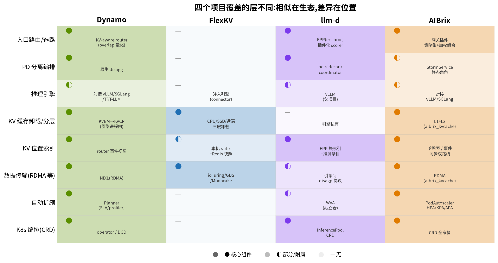
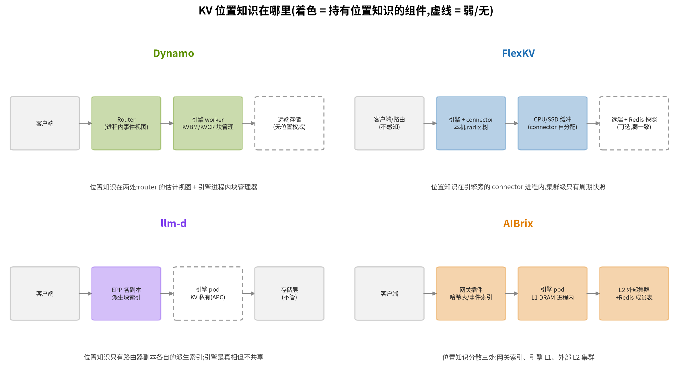
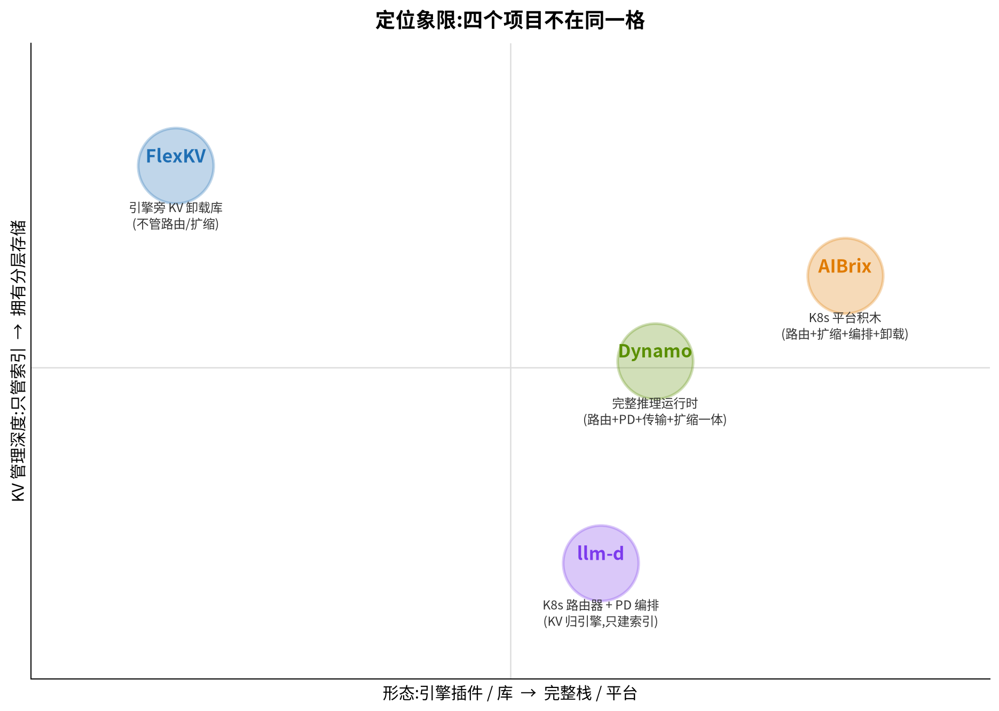

# Dynamo / FlexKV / llm-d / AIBrix — 四栈对比

> 调研快照:2026-09-11。各项目深挖文档:[dynamo/](dynamo/overview.md)、[flexkv/](flexkv/overview.md)、[llm-d/](llm-d/overview.md)、[aibrix/](aibrix/overview.md);KVCR 见 [kvcr/](kvcr/overview.md)。  
> 这篇回答一个问题:**四个项目看起来都在做"KV 复用 + 智能路由 + PD 分离",区别到底在哪?**

## 1. 一句话各自是什么

1. **Dynamo**(NVIDIA):完整的**分布式推理运行时**——路由、PD 分离、KV 块管理、RDMA 传输、SLA 扩缩全在一个框架里,Rust 核心。
2. **FlexKV**(腾讯云 TACO):一个**引擎旁 KV 卸载库**——只管"GPU 放不下时把 KV 卸到 CPU/SSD/远端",以 connector 注入现有引擎,不做路由、不做扩缩。
3. **llm-d**(Red Hat/Google/IBM 等):K8s 原生推理栈,核心是 **EPP 路由器**——挂在 Envoy 扩展点上做精确缓存感知选路,外加 PD sidecar;KV 存储本身留给引擎。
4. **AIBrix**(字节跳动 → vllm-project):K8s **平台积木全家桶**——网关路由、自动扩缩、编排 CRD、元数据服务、KV 卸载框架,九大件可拼装。

## 2. 为什么看起来相似

1. **同一个生态**:都围绕 vLLM/SGLang,都在 K8s 上跑(FlexKV 除外)。
2. **同一个动机**:KV cache 复用是推理省钱省延迟的关键,大家都围绕它做文章。
3. **同一批技术**:radix/哈希块索引、引擎 KV 事件(ZMQ)、RDMA 传输、Envoy/网关扩展点。
4. **同一个收敛方向**:K8s 侧都在向 Gateway API Inference Extension 靠拢,llm-d EPP 是该标准下的参考实现,production-stack 与 kgateway 都在向它迁移。

相似的是**词汇表**,不同的是**各自动的是哪一层、状态归谁**。下面两节是关键。

## 3. 覆盖的层不同

读法:

1. **Dynamo 是唯一全栈**:八层都有自家组件(引擎靠对接,不自研)。
2. **FlexKV 只做中间三层**:卸载、索引、传输;路由、扩缩、编排一概没有——它是库,不是平台。
3. **llm-d 集中在入口与编排**:路由(EPP)、PD 编排、K8s CRD 是核心;KV 存储明确不管(引擎私有),扩缩在独立仓(WVA)。
4. **AIBrix 覆盖最广但每块停在平台常规深度**:路由、扩缩、编排、卸载都有,但卸载以引擎为中心(L1 进程内),索引是网关侧估计。

## 4. KV 状态归谁:最本质的区别

四个项目对"**哪个块在哪、能不能用**"这个问题的回答方式完全不同:

| 项目 | 位置知识在哪 | 一致性 |
|------|-------------|--------|
| Dynamo | router 进程内事件视图(估计)+ 引擎 worker 进程内块管理器(KVBM→KVCR) | 事件流最终一致;块管理器私有 |
| FlexKV | 引擎旁 connector 进程内,每层一棵 radix 树;集群级只有 Redis 周期快照(可选) | 本机权威;集群弱一致 |
| llm-d | EPP 各副本各自订阅事件流、各自维护派生索引;引擎是真相但不共享 | 各副本最终一致;幽灵条目可能 |
| AIBrix | 分散三处:网关索引(哈希表或事件同步两条路线)、引擎进程内 L1、外部 L2 集群(Redis 成员表) | 全部最终一致 |

一句话:**没有一家有全局强一致的 KV 位置权威**——区别只在"估计"发生在哪、有几份、怎么同步。Dynamo 和 llm-d 把估计放在路由器(事件驱动);AIBrix 放在网关(估计或事件二选一);FlexKV 放在引擎旁(本机精确,集群靠快照)。

## 5. 定位象限

- **FlexKV** 在"库 × 深存储"格:功能面最窄,KV 管理钻得深。
- **llm-d** 在"栈 × 浅 KV"格:路由与编排做透,KV 存储不碰。
- **Dynamo** 在"运行时 × 中深 KV"格:什么都管,但 KV 管理仍以引擎进程为单位。
- **AIBrix** 在"平台 × 中深 KV"格:面最广,K8s 耦合最深。

## 6. 逐维度对比

### 6.1 路由

| | Dynamo | FlexKV | llm-d | AIBrix |
|---|---|---|---|---|
| 形态 | 独立 router 进程 | 无 | EPP(Envoy ext-proc) | Envoy ext-proc 网关插件 |
| 索引 | 链式块哈希 + 事件流 | — | 逐块索引 + 推测条目(TTL 2s) | 本地哈希表 / 事件同步索引 |
| 策略 | KV-aware + overlap 量化 | — | 插件 scorer 加权组合(14+ 种) | 策略集加权组合(数量最多) |
| 多副本 | 各自维护视图 | — | 各自订阅收敛 | 默认各自为政,可选 Redis 同步 |

**小结**:llm-d 与 AIBrix 都挂在 Envoy ext-proc 上,差别在索引精度(llm-d 逐块精确 + 推测补窗;AIBrix 两条路线并存)和插件体系规整度(llm-d 更规整);Dynamo 走自家 router 进程,不依赖 Envoy;FlexKV 不参赛。

### 6.2 PD 分离

| | Dynamo | FlexKV | llm-d | AIBrix |
|---|---|---|---|---|
| 地位 | 一等公民,旗舰特性 | 无关 | 主路径(sidecar)+ 备选(coordinator) | 静态角色(StormService)+ 雏形 |
| 决策 | 部署拓扑 + planner | — | 逐请求 decider(可按前缀命中决定不拆) | 部署拓扑为主 |
| 执行 | NIXL 直传 | — | decode 先选,sidecar 串 prefill | PD + Mooncake 传输未落地(TODO) |

**小结**:Dynamo 把 PD 当默认架构;llm-d 把 PD 做成可编排的多阶段流水线,且"先选 decode 再倒推 prefill"的决策顺序最讲究;AIBrix 的 PD 更多是编排层概念;FlexKV 不涉及。

### 6.3 自动扩缩

| | Dynamo | FlexKV | llm-d | AIBrix |
|---|---|---|---|---|
| 组件 | Planner(框架内) | 无 | WVA(独立仓 `workload-variant-autoscaler`) | PodAutoscaler(框架内 CRD) |
| 信号 | SLA 反推 + profiler 标定曲线 | — | KV 利用率/队列深度/饱和度(Prometheus) | KV 使用率/排队长度/延迟 |
| 特点 | 按 TTFT/ITL 目标反推 prefill/decode 各自副本数 | — | 变体(variant)间成本感知:便宜的先扩、贵的先缩;指标交 HPA/KEDA 执行 | HPA/KPA/APA 三算法,APA 可接 GPU Optimizer 做异构 |

**小结**:三家都有 KV 感知的扩缩,但分工不同——Dynamo 是 SLA 反推型(要 profiler 先标定),llm-d WVA 是优化器型(出目标副本数、交给标准 HPA 执行),AIBrix 是传统控制器型(指标直接驱动副本数)。WVA 有论文(arXiv 2603.09730):比 HPA 有效吞吐 +37%、请求失败降 10×。

### 6.4 KV 卸载与存储

| | Dynamo | FlexKV | llm-d | AIBrix |
|---|---|---|---|---|
| 组件 | KVBM(已 sunset)→ KVCR | FlexKV 本体 | 无(引擎私有) | aibrix_kvcache |
| 层 | GPU→CPU→SSD→对象存储 | CPU/SSD/远端 | — | L1 DRAM + L2 外部集群 |
| 位置 | 引擎进程内 | connector 进程内 | — | 引擎进程内 + 外部集群 |
| 传输 | NIXL(RDMA) | io_uring/GDS/Mooncake TE | — | RDMA/TCP |

**小结**:FlexKV 与 aibrix_kvcache 严格同层(引擎旁卸载框架),FlexKV 层数更多、引擎接入面更宽;Dynamo 的 KVBM 已官宣 sunset,继任者 KVCR 换成"引擎进程内二级存储 + router hint 驱动 P2P"的路子;llm-d 明确不做存储。

### 6.5 分布式模型与 HA

| | Dynamo | FlexKV | llm-d | AIBrix |
|---|---|---|---|---|
| 元数据权威 | 无单点权威;etcd/nats 传事件 | 本机树;Redis 快照可选 | 引擎事件是真相,EPP 索引是派生缓存 | K8s etcd(编排)+ Redis(用户/限流) |
| 副本一致性 | 各 router 各自收敛 | 无副本概念 | 各 EPP 副本各自订阅收敛 | 默认各自为政,可选 Redis 最终一致 |
| HA | 控制面 etcd/nats 可集群化 | 进程随引擎生死 | Active-Passive 选主 / fail-open 直打 | 网关无状态,Redis 单点风险 |

**小结**:四家都属于"事件/快照最终一致"这一类(distributed-models.md 的 C 类);没有一家给 KV 位置知识配强一致权威。HA 思路上 llm-d 最直白:索引是派生的,丢了重建,所以敢 fail-open。

### 6.6 其余硬条件

| | Dynamo | FlexKV | llm-d | AIBrix |
|---|---|---|---|---|
| 语言 | Rust 核心 + Python | C++ 内核 + Python | 几乎纯 Go | Go + Python + TS |
| K8s 耦合 | 可独立可 K8s(operator/DGD) | 无 | 深(Gateway API 标准) | 最深(全是 CRD) |
| 引擎 | vLLM/SGLang/TRT-LLM | vLLM/SGLang/TRT-LLM/Dynamo | vLLM 为主 | vLLM/SGLang |
| 背景 | NVIDIA | 腾讯云 TACO | Red Hat/Google/IBM 等 | 字节跳动捐给 vllm-project |

## 7. 它们之间不是纯竞争

1. **FlexKV 可以插进 Dynamo**:Dynamo 官方支持 `--connector flexkv`,卸载库与运行时组合使用。
2. **llm-d EPP 是 K8s 路由的收敛方向**:production-stack(#1032)与 kgateway 都在向 Gateway API Inference Extension + EPP 迁移,AIBrix 自研网关长期看也面对这个标准。
3. **llm-d 与 AIBrix 消费同一类事件**:都是 vLLM 的 ZMQ KV 事件,各自实现订阅管线;生态上可能进一步共用。
4. **Dynamo KVBM sunset 后的空位**由 KVCR(引擎内二级存储)接,与 FlexKV/AIBrix 的卸载框架形成同层竞争。

## 8. 怎么选(场景导向)

1. **要开箱即用的完整 PD 分离栈,且在 NVIDIA 生态** → Dynamo。
2. **已有 vLLM/SGLang 服务,只想加 KV 卸载,不想动平台** → FlexKV(免补丁、库形态)。
3. **要 K8s 标准路线、精确缓存感知路由、可插拔策略** → llm-d(EPP + InferencePool)。
4. **要从零搭平台,路由/扩缩/编排/元数据/卸载全家桶一次拿齐** → AIBrix。
5. **只想要一块能搬走的**:路由插件形态看 llm-d;卸载框架看 FlexKV;扩缩指标选型看 AIBrix 与 WVA。

---

各项目与 lake 的逐条对照,见各自的 pain-points 文档:[dynamo](dynamo/overview.md) · [flexkv](flexkv/pain-points.md) · [llm-d](llm-d/pain-points.md) · [aibrix](aibrix/pain-points.md)。
