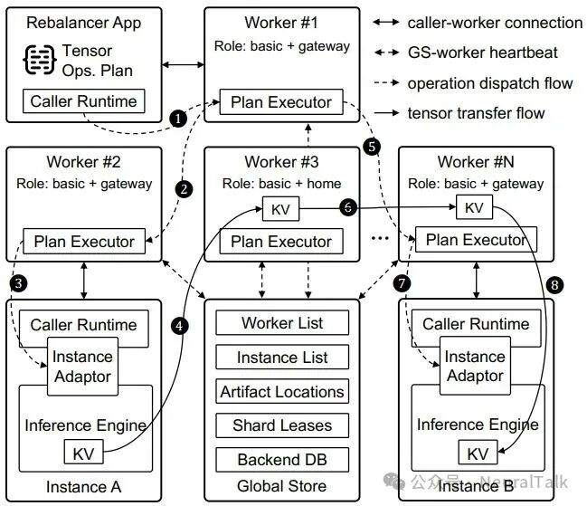

# TensorCast — 运行时架构深挖

> 前置:[`overview.md`](overview.md)(定位 / TaaS 范式 / 与 lake 对照)。本文是**实现级**解读:素材取自论文 §4(系统架构)/§5(实现)+ 上游 `docs/architecture/` 五篇(architecture-overview / p2p-transfer-strategies / artifact-views-and-retrieval / view-replicas-and-assembly / high-availability-design)+ `3rdparty/tensorcast` 源码锚点。所有 `文件:符号` 锚定 submodule,行号会漂移,符号名是稳定锚点。
>
> 论文 §4 讲"逻辑架构"(worker/instance/GS 三角),上游 `docs/architecture/` 讲"代码架构"(Global Store / Store Daemon / User Process Worker 三进程)——两套词汇是一一对应的:**论文的 worker ≈ 代码的 Store Daemon +(可选)网关/分片宿主角色**,论文的 instance ≈ 引擎进程 + 进程内 Instance Adaptor,GS 两边一致。本文以代码词汇为主线。

## 1. 进程拓扑与总原则



```
            ┌──────────────────────────────────────────┐
            │  Global Store(Python gRPC + DuckDB)       │
            │  artifact 注册表·副本位置·chunk 目录        │
            │  view 元数据·分片租约·worker 心跳/对账       │
            └───────────────────┬──────────────────────┘
                                │ gRPC(只走元数据,绝不走张量字节)
        ┌───────────────────────┼───────────────────────┐
        ▼                       ▼                       ▼
┌───────────────┐     RDMA/MTCP P2P     ┌───────────────┐
│ Store Daemon  │◄─────────────────────►│ Store Daemon  │  …(C++,Bazel 构建)
│ StoreEngine   │                       │ StoreEngine   │
│ UMA 内存账本   │                       │ UMA 内存账本   │
└──────┬────────┘                       └──────┬────────┘
       │ CUDA IPC(零拷贝)                     │
       ▼                                       ▼
  User Process Worker                     User Process Worker
  (PyTorch / 引擎进程,内嵌 Instance Adaptor)
```

三条总原则(上游 architecture-overview 的 "Key Design Principles"):

1. **控制面/数据面分离**:GS 只处理元数据与协调;张量字节永远在 daemon 之间 P2P 直传。"Artifact data never flows through Global Store"。
2. **零拷贝供给**:artifact 由 daemon 加载进 GPU 显存**一次**,同机多个客户端进程通过 CUDA IPC handle 映射同一份显存——消掉冗余拷贝与显存占用。
3. **最终一致 + 心跳对账**:GS 用 DuckDB 持久化;daemon 本地缓存元数据、靠增强心跳 + Reconcile 协议与 GS 收敛(见 §6)。

与 lake 对照:拓扑上这就是 lake 的"存储控制面(Rust)+ KV Node / tiered-store(Rust)+ 计算 worker(Python)"三角——但 TensorCast 控制面是 **Python + DuckDB**,lake 选 Rust + etcd checkpoint。控制面哲学上两边根本分歧:lake 留了一个**单写者权威**(CP 进程内存,提交态不分叉;agent 本地先写、异步提交,Router/agent 读最终一致的镜像,拿不准就回查权威),GS 则是**协调者 + 对账者**(只存租约等轻量元数据,KV 副本账分散在各分片宿主,心跳收敛)。后面各节会反复看到这个分歧的体现。

## 2. Global Store:轻量控制面

**职责**(论文 §4.1 + 上游文档):worker/instance 状态、低基数张量的副本位置、**per-chunk 目录元数据**(`remote_memory_keys`/`buffer_sizes`)、view 元数据(view spec、view hash、部分叶子摘要,由 `ViewStateService` 持久化)、分片租约发放、集群可观测性入口。

**实现**:`tensorcast/global_store/grpc_service.py`(Python gRPC)+ **DuckDB** 持久化(`database.db_file`)。worker 本地缓存元数据,通过 update exchange 刷新,大多数工作流旁路 GS。

**副本选择的原子认领**(对照 lake 的"位置视图一跳命中"最有意思的一段):daemon 要拉一个 artifact 时,GS 在 `replica_repository.py::find_available_for_transport` 里用**一条 SQL 完成"选源 + 认领"**:

```sql
WITH candidate AS (
    SELECT r.replica_id FROM artifact_replicas r
    LEFT JOIN replica_counters rc ON rc.replica_id = r.replica_id
    LEFT JOIN workers w ON r.worker_id = w.worker_id
    WHERE r.artifact_id = ?
      AND COALESCE(rc.current_requests, 0) < r.max_concurrency   -- 并发槽未满
      AND r.is_available = TRUE
      AND w.accepting_new_requests = TRUE                        -- worker 在接客
      AND w.inactive_at IS NULL                                  -- 未被标记退役
      AND EXTRACT(epoch FROM w.last_heartbeat) > ?               -- 心跳新鲜
    ORDER BY
        CASE r.memory_type WHEN 'GPU' THEN 0 WHEN 'RAM' THEN 1 WHEN 'DISK' THEN 2 ELSE 3 END,
        r.max_concurrency ASC,
        COALESCE(rc.current_requests,0) * 1.0 / GREATEST(r.max_concurrency,1),  -- 负载比
        r.updated_at ASC
    LIMIT 1
)
UPDATE replica_counters SET current_requests = current_requests + 1, ...
RETURNING replica_id
```

即:介质优先(GPU>RAM>DISK)→ 并发槽 → 负载比 → 最旧副本,选中即原子 `+1`。找不到时由 `TransportService.request_transport` 重试到超时。**lake 对照**:lake 由 Rust 控制面进程内存里的位置视图直接回答"在哪",不做事物性认领(认领语义在 Router 的选路 + 池的引用计数里);TensorCast 把"选源 + 占用"合并成一次 DB 原子更新——实现简单,但每次物化都过 GS(低基数路径),且并发上限/负载感知是 GS 侧职责而非调用者侧策略,与"策略在调用者"的说法存在轻微张力。

**guardrail**:选源前过滤 `accepting_new_requests`、心跳新鲜度、`inactive_at`——退役/过载节点不会被选为源。

**SDK 硬规则**(上游 AGENTS.md):**Python SDK 绝不直连 GS**(不允许建 gRPC channel 到 GS),所有 key 映射、元数据、控制路径必须经 Store Daemon。这保证了"应用进程不耦合控制面"的边界,lake 的 worker 同理(worker 只认池 agent/控制面的既定 RPC)。

## 3. Store Daemon:数据面引擎

C++ 服务(`daemon/`,`StoreDaemonServiceImpl` 是薄 gRPC 层),核心是 `core/store/` 的 **StoreEngine**。运行时由 `RuntimeEnv` 拉起 `RuntimeContext`(设备管理器、钉选缓冲池、通信管理器、指标收集、GS 客户端、ingestion 事件总线)。

### 3.1 UMA 内存模型

StoreEngine 用 **UnifiedMemoryAuthority(UMA)单账本**内存模型(`core/store/replica/unified_memory_authority.h`):所有层(GPU VRAM / CPU pinned / DRAM / 磁盘映射)的分配都过同一账本,虚拟地址空间统一(`core/common/memory/virtual_address_space.h`)。副本状态机:

```
UNALLOCATED --allocate_memory--> ALLOCATED --load_async_from_source--> LOADING
LOADING --commit+set_state--> LOADED        LOADING --load error--> FAILED
FAILED --release_memory+reset--> UNALLOCATED
```

GPU 加载在 `ResourceExhausted` 时**先驱逐再重试一次**才报错——驱逐策略在 daemon 内,对照 lake"驱逐归池控制面、daemon 只执行"。

### 3.2 VRAM Leased-In-Place(LIP):引擎显存原地租给 TensorCast

**这是与 lake"池拥有全部内存"最不一样的一个机制**。正常入池是引擎把字节交给 TensorCast,daemon 拷进自己的内存;LIP 反过来——**引擎(或任何持有显存的进程)把自己已加载的 GPU 显存按租约租给 daemon**,字节原地不动,daemon 只登记托管,Commit 时不再拷贝进 daemon 自有 VRAM:

- 注册:引擎侧调 `LeaseOptions.in_place=true` 并报自己的进程号(`owner_pid`);Commit 把租来的显存段线性化算出 `mi2:` 身份(段间空洞补 PAD=0)。
- 谁能用:同一块 GPU 上的使用方**不许**直接读租来的显存(防止引擎和 daemon 对同一块内存的生命周期纠缠);其他 GPU 要用,daemon 先 D2D 拷一份到自己持有的显存,再给别人。
- 跨机:**只允许 staged**——租来的显存上不注册 RDMA MR,发送方先 GPU→host pinned 拷一遍再上网。
- 生命周期:Commit 后按 TTL/2 节奏 KeepAlive;TTL 过期即从选源里摘除;引擎进程(`owner_pid`)退出,租约自动撤销。
- 校验:Commit 时生成轻量 KEY_POINTS 元数据,供后续 offer 附带。

(上文及他处出现的"v1/v2"是上游 view-replicas-and-assembly 文档的版本标注:v1 = 当前实现的约束集,含 "No LIP pieces";v2 = 规划扩展,含 LIP piece、transpose 感知 assembly 等。不是 API 版本号。)

**LIP 的技术谱系(不是新发明)**:底层零拷贝机制是 **NVIDIA CUDA IPC**——`_LeaseUploader`(`tensorcast/api/_register.py`)就是调 `get_cuda_memory_handle_with_offset` 把引擎显存的 IPC handle 导给 daemon,C++ 侧 `core/cuda/cuda_backend_real.cc` 用 `cudaIpcGetMemHandle`;租约层(TTL/心跳/owner 退出撤销)是标准分布式簿记。TensorCast 的独创只在**包装**:把 CUDA IPC 共享 + 租约 + 内容寻址身份(mi2)组合成一个注册模式。先例一大堆:Ray Plasma(2017,daemon 持内存、client 零拷贝 attach 的 CPU 版祖宗)、NVIDIA Triton 的 CUDA shared memory region、NCCL/TP 框架的 IPC 共享 buffer、ServerlessLLM(TensorCast 部分代码源自它,见 NOTICE;其核心就是 checkpoint 驻留内存被多实例共享)、Mooncake 的 segment 注册(自己的内存注册成可寻址段给别人 RDMA 直读——同一形状,只是无租约语义)。lake 的 L0 arena 启动注册 + worker attach 也是同一形状,区别只在所有权一开始就归池,不需要"租"。

对照 lake:方向正好相反。lake 的 L0 是"池把 block 放进 worker HBM,worker 不拥有"——KV 产出即落进池分配的 L0 slot,`publish` 只上报"产出了哪些 block"、不含地址,**天生零拷贝入池**;LIP 要解决的"引擎持有的张量想入池"问题,对 lake 的 KV 不存在。LIP 是反方向的"引擎显存原地租借给池",对 lake 的参考价值在**权重侧**:未改造引擎按自有路径加载权重后,把已加载的显存租给池、供其他实例共享,可作"引擎零改造入池"的过渡兼容路径(lake 权重缓存的正路是池主导加载 + 引擎 attach,即 TensorCast 的 bind 模式)。而 LIP 的四条约束(同设备禁消费、staged-only P2P、TTL 心跳续租、owner 退出即撤销)精确展示了"借别人显存"的代价——只适合临时共享,做不了权威副本;lake 用"池拥有 arena + L0 易失、L2 durable 兜底"把这整类约束消掉。

**HBM 归属一览**(Caller-Leased 所有权的投影):

| 场景 | HBM 归谁 |
|------|---------|
| KV(引擎后端) | **引擎**(L1,引擎的 radix 管);池副本在 daemon 侧 UMA |
| 权重 bind/IPC | **daemon** VRAM,引擎 CUDA IPC 零拷贝 attach |
| 权重 transform_into | **引擎**自有参数缓冲 |
| LIP | 引擎显存**原地租借**给池,不交字节;但 v1 禁止 piece 走 LIP,而 KV 发布是"交字节的 sealed artifact"模型——KV 用不上 |

### 3.3 Ingestion 管线(物化的统一入口)

所有物化(disk/P2P/本地复制)都过同一条五阶段管线(`core/store/runtime/ingestion/`):

```
SourceAdapter(选源:P2P / disk / 本地)
  → MetadataStage(重建或拉取 canonical index;规划 view;descriptor schema v3)
  → AllocationStage(UMA 分配副本;P2P GPU 加载遇 ResourceExhausted 先驱逐重试)
  → VerificationStage(verification_json 关键点校验 + 可选全量摘要 + view hash)
  → HandleStage(产出 ReplicaHandle / 导出 CUDA IPC handle)
```

控制流:`MaterializationService` 按序尝试 **复用已有副本 → 本地 CPU→GPU 拷贝 → AUTO 模式 P2P**;P2P 由 `MaterializeOrchestrator` 编排——向 GS 申请 transport grant、构造 `P2PSource`(带对端 `verification_json` 与内存注册信息)、**无论成败都调 `complete_replica_transport`**(及时释放源端计数器)、有 daemon 解析出的 disk source 时回退 disk。

**Auto-publish**:每次 ingestion 铸一个 `publish_context_id`,完成事件经事件总线进 `MetadataGateway` 向 GS 注册副本;orchestrator 显式注册复用同一 context,重复发布被去重。——加载即发布,副本一可用就进全局目录,这与 lake"写回 Pool 即可被全局命中"同向。

### 3.4 客户端(User Process Worker)

- **handle 优先**:`tensorcast.artifact(...)` 返回绑定 store 的懒句柄(暴露 `tensor_names`/`describe`),物化走 `MaterializeReplica` / `MaterializeIntoTarget`(`ArtifactSelection`,RFC-0017)。
- **进程级元数据缓存**:`ArtifactCache`(TTL 600s、上限 1000 条)避免重复查 daemon。
- **view 组合纯客户端**:`.view()/.subset()/.slice()` 由本地 composer 派生子句柄,**不发 daemon RPC**。
- **批与异步**:`BatchContext` 合并同步取;`.tensor_async()` 经 `MaterializationBatcher` 在 store 事件循环上合并。
- **from_disk 导入是引用注册**:`ImportArtifactFromPath` 只对 payload 字节做引用登记(可回填 `artifact_descriptor.json` / safetensors `tensor_index.json`),返回 `artifact_id` + canonical index + generation。
- **prefetch** 返回 `Operation[PrefetchedReplica]`(status/wait/cancel),默认 `NO_LEASE`(daemon 持有的进程无关暖缓存)。

## 4. 数据面传输:RDMA pull / MTCP push / 流控

传输引擎是 `core/communicator/` 的 `Communicator`(RDMA 或 MTCP)。拓扑建模(`core/communicator/topology`:Pool/Endpoint/Link 可达性,含交换机端点)已存在,但**路由包装层尚未接入 P2PLoader**(Phase 4 才做直连链路/NVLINK 选择)——"topology-aware"目前更多是设计预留。

### 4.1 源端:内存导出

`RegistrationBackend::commit` 调 `MemoryExportRegistry::export_chunks`:把 chunk 范围**合并**后注册进 communicator。CPU 导出**不注册 MR**(`register_mr=false`,持 UMA keepalive + stable lease);GPU 导出在 RDMA 开启时注册 MR,若不需要 staging 则置 `direct_rdma_enabled`。注册随 `register_memory_replica` 把 `remote_memory_keys`/`buffer_sizes`/`verification_json` 发进 GS 的 chunk 目录——**对端拿到的不是"文件路径"而是可直接 RDMA READ 的内存钥匙**。

### 4.2 RDMA(pull 模型)

- 控制通道是 TCP:`ENGINE_OP_READ_REQUEST` / `ENGINE_OP_READ_RESPONSE_EX`;服务端回 RDMA 段(addr, rkey, bytes, window_seq)。
- 客户端用 `RdmaTransport::read_multi` 发 RDMA READ;完成后回 `ENGINE_OP_RDMA_READ_DONE_EX` 窗口 ACK,服务端据此释放 staging credit。
- **零拷贝路径**:GPU 内存带 `direct_rdma_enabled` 时,服务端直接拿原始 MR 当 staging 窗口(无中间缓冲)。
- 否则走 `MemoryStager` 三种:`HostPinnedGpuStager`(GPU D2H 到 pinned)、`GpuVramRdmaStager`(D2D 到每 GPU 的 VRAM staging 池,`rdma.staging_backend=GPU_VRAM`)、`HostPinnedCpuStager`(CPU 到 pinned)。

### 4.3 MTCP(push 模型)

RDMA 不可用(或显式指定)时走用户态 mTCP:多 socket(`tcp_conn_count`)+ 独立 staged-send 线程;staging 窗口切片铺到多条 lane,段完成即释放 credit。GPU 接收:读进 `StreamingPinnedBuffer` 再由 `AsyncCopyManager` 排 H2D;CPU 接收:直写目标缓冲,零额外拷贝。**论文 §6.3 里"关 RDMA 反超 Mooncake"靠的就是这条用户态多路径栈**(减内核拷贝、聚合有效带宽)。

### 4.4 流控与线程模型

- `FlowCreditLedger`(每 channel,`stager.buffers_per_flow` 定额度)+ `StagingWindow`(每请求切成 credit 有界窗口,`max_window_segments` 封顶)+ `StageLeaseRegistry`(跟踪活跃 staged 段;RDMA ACK / MTCP 发送完成 / GC reaper 回收租约返还 credit)。
- 目标端 `TransferService` 为每会话建 `StreamingPinnedBuffer`(池 slice 必须整除 `artifact_chunk_bytes`,防跨 chunk slice);`pump_ranges` 跑生产者/消费者管线;**DirectWrite 快路径**:源支持直写(RDMA)且汇是 CPU(`DirectWriteCapable`)时,从 UMA 申请 `DirectWriteGrant` 窗口,`RemoteKeySource::read_into` 直接 RDMA 读进 CPU 虚拟地址,免 staging。
- 线程:communicator 有请求循环/信道 GC/握手重试/MTCP staging 线程;RDMA 每设备 `RdmaThread`(send/poll/recv 三线程);MTCP 每连接收发线程对;**每 GPU 的传输会话被 `GpuSchedHandle` 串行化**(1 active transfer/GPU/session)——防止 H2D 与 RDMA 争抢把 GPU 打爆。
- 失败:RDMA 握手失败**不自动降级 MTCP**(显式报错);staging 等 credit 超 `staging_wait_timeout` 报 `ResourceExhausted`;`MuxSeekableSource` 提供**按读回退**(P2P 短读/出错时剩余字节从 disk 补齐)。

**lake 对照**:这套"合并注册 + rkey 目录 + pull 模型 + 窗口 credit"与 Mooncake Transfer Engine 的 segment 注册 + `BatchTransfer` 是同一族设计(lake `rust/transfer` 的 `Transport` trait 原型也是这族);TensorCast 额外给了 MTCP 用户态降级与 DirectWrite。lake P5 接 Mooncake TE FFI 时,可对照这里的 stager/credit 设计决定哪些能力让 TE 兜、哪些在 Rust 侧自建。

### 4.5 路径多样性的边界:多路径 ≠ DualPath

TensorCast 的 KV/artifact 流动确实是多路径的,但多的是"选源 × 选传输 × 兜底"三层:

- **选源**:`GetArtifactOptions(source=local/disk/prefer_p2p)`;P2P 时由 GS 按介质(GPU>RAM>DISK)→ 并发槽 → 负载比挑副本(§2 的原子认领 SQL)。
- **选传输**:同机 CUDA IPC / 跨机 RDMA pull(零拷贝或 staged)/ mTCP push(用户态多 lane)。
- **兜底**:`MuxSeekableSource` 按读回退——P2P 短读/出错,剩余字节从 disk 补齐。

对照 [DualPath](../dualpath.md)(双物理网络隔离下,借 decode 闲置 SNIC 加载、经 CNIC 回传 prefill),TensorCast 缺两个维度:

1. **NIC 级选路**:拓扑建模(`core/communicator/topology`:Pool/Endpoint/Link)有了,但路由包装层未接进 P2PLoader(上游标注 Phase 4 才做)——选源看介质和负载,**不看双网络隔离与 NIC 空闲**。DualPath 的带宽套利(哪边 SNIC 闲就从哪边拉)在它的模型里表达不了。
2. **引擎直达**:KV 路径的端点永远是"引擎 HBM ↔ daemon 内存",引擎之间不相连。因 HBM 归引擎,不存在 lake 的"D 侧 L0 已在 HBM → 零存储读取直传 P"特例——那条路的前提是 HBM 归池、池 agent 直接调度 L0→L0。

对 lake 的启示:DualPath 式选路要求选择器**同时看得见 KV 位置和双网络带宽视图**——lake 两者都在池(位置视图 + NIC 带宽视图,见 [`../../architecture/kv-cache-pool.md`](../../architecture/kv-cache-pool.md) "双网络路径")。TensorCast 的 GS 选源 SQL(介质 + 负载比)可借,NIC 维度得自己加。

## 5. View 体系:ByteSpace、assembly 与 MI2 内容寻址

### 5.1 canonical index 与 ByteSpace

每个 artifact 有一个 **canonical index(index v3)**,定义**规范 ByteSpace**:以 `index_multihash` 为锚,覆盖 `[0, total_size)`。view 定义**变体 ByteSpace**:以 `view_id` 为锚,覆盖 `[0, view_size)`。谈覆盖/校验必须先指明哪个 ByteSpace;**缺失的字节段永不隐式填补**,以 `UNAVAILABLE` + `PartialCoverageDetail` 显式上报。

### 5.2 ViewSpec 与身份

v1 只支持两种 per-tensor 算子:`narrow(dim, start, length)`(单维、step=1)与 `transpose(dim0, dim1)`;**每个 tensor 二选一**,未列出的 tensor 是恒等。`view_id` 由归一化 ViewSpec + canonical index 身份确定性导出(恒等 view 折叠进 canonical 路径);`view_data_hash` 是物化后 view ByteSpace 的 TreeHash(≠ view_id)。

规划与执行集中在 C++ core(检索与注册共用同一套数学):`ViewPlanner` 从 canonical index + ViewSpec 产出 `SelectionPlan`(规范空间的字节范围)+ `TransformPlan`(transpose)+ 反向的 `ViewWritePlan`;`ViewPlanSource` 从任意 `SeekableSource` 流式取数(narrow(axis=1) 做跨步合并避免 IOPS 打爆);`ViewIngestExecutor` 用逆映射写回。`MaterializeIntoTarget` 直接把字节流灌进**调用者提供的 CUDA 区域**(合并的 `TargetLayout`,支持 canonical 或 view 索引、packed subset)——"deferred slice loading"就是 SDK 先注册自有 CUDA 区域、最后 `commit()` 发一次 `MaterializeIntoTarget`。

### 5.3 piece / assembly / sealing:分布式拼出一个 artifact

- **Assembly** = 未封印的 artifact 身份(`assembly_id = cgid:...`),绑定 canonical index 但还没有规范数据哈希。
- **Piece** = `(assembly_id, view_id)` 下的**稠密 view 副本**,活在 view ByteSpace;覆盖情况由 canonical 覆盖元数据跟踪(不存稀疏规范缓冲)。
- **Sealing** = 覆盖完整后校验覆盖、计算 `data_multihash`、持久化 `assembly_id → mi2` 绑定;封印后 **MI2(`mi2:index_multihash:data_multihash`)成为权威身份**,该 assembly 的 piece 注册被拒,策略可迁移/退役缓存 view。

v1 约束:piece 只允许 narrow(不许 transpose)、不同 view_id 的 canonical 覆盖不许重叠、不支持 LIP piece、**必须部分覆盖**(全覆盖走 canonical 注册或 sealing)、稠密字节(对齐 padding 清零)。v2 规划:transpose 感知的 assembly、`REPLICATE_EQUAL` 重叠(带 proof commitment)、LIP piece、LayoutSpec 绑定。

**lake 对照**:这套"分片各自发布、覆盖齐了封印出规范身份"就是**分布式 checkpoint/权重重分片的组装协议**——RL 场景里训练端 TP=8 切出来的 8 片,可以作为 8 个 piece 发布,推理端 TP=2 直接按自己的 view 拉取重组。lake 的权重缓存若支持"按 revision 分片发布 + 按 TP 布局物化",assembly/sealing 是现成的形式化参照;MI2 双哈希(index 哈希 + 数据哈希分离)也比单哈希更细:index 同而数据不同(如量化参数不同步)能被区分。

## 6. HA:心跳、对账与故障矩阵

实现集中在 `daemon/ha/worker_lifecycle_manager.cc`(daemon 侧)+ `tensorcast/global_store/services/recovery_service.py` + `grpc_service.py`(GS 侧),proto 在 `proto/tensorcast/global_store/v1/global_store.proto`。

### 6.1 启动恢复

GS 启动时跑一趟受保护恢复(`RecoveryService.initiate_recovery`,幂等短路):校验 DuckDB、**把所有 worker 和副本标记 stale**、保留持久化的 state version/checksum。stale 标记强制每个 daemon 重新注册 + 对账后才能接流量——注册表漂移不会漏进路由。

### 6.2 增强心跳与 Reconcile V2

- 心跳必须带非零 `state_version`(否则拒收),载荷含可用内存、接客标志、`state_version`、`state_checksum`、已注册 artifact 集、上次同步时间、连接状态、capability flags。GS 比对 version + checksum(FNV-1a,对排序后的 `(artifact_id, node_id, 地址, 端口, 内存类型, 设备, 可用性)` 清单),发散则回 `state_sync_required`。
- 对账(`ReconcileWorkerState`)请求身份是 `(worker_id, daemon_id, generation, request_seq)`(generation 标识 daemon 化身,防旧实例复活);GS 回**类型化结果**:`APPLIED` / `NOOP` / `IGNORED_STALE` / `RETRY_LATER`(带 retry_after_ms)/ `REBASE_REQUIRED`(附权威 `expected_replicas` 快照,daemon 按之 rebase)/ `FATAL`。
- 删除按副本键 `(artifact_id, memory_type, device_id)` 粒度应用(GPU/CPU 层独立对账);**SNAPSHOT 时空清单是权威的**(允许排空退役),DELTA 时空清单保守不动。
- **安全退役**:移除先进 safe-retire 队列——引用计数、使用租约、放置 pin、传输锁全部清零后才真正 unload;心跳里的"obsolete 提示"只供诊断,**绝不直接触发卸载**。
- 不变量:daemon 的 `local_replicas` 是本地存在的权威;**加优于删**(无清单不删);幂等(重复 add 收敛);只通告 publishable + resident 副本。

### 6.3 故障矩阵(文档级行为承诺)

| 故障 | 行为 |
|------|------|
| **GS 宕机/重启** | daemon 心跳退避重试;已物化副本**本地照常服务**;新副本无法注册;在途传输继续流(数据面不过 GS),`complete_replica_transport` 可能失败、计数器暂时泄漏,GS 的 sweeper 清理。GS 回来后心跳可能拿 `NOT_FOUND` → daemon 保留身份重注册 + 对账自举 |
| **Daemon 崩溃** | 心跳停 → `heartbeat_timeout` 后标记 stale → inactive → 移出选源;卡住的源端传输被 GS sweeper 强制完成;重启后重注册 + 对账 + 本地剪除 obsolete 副本,无需人工清理 |
| **网络分区(daemon↔GS)** | 重试预算耗尽后判定断连;本地读仍成功;需要协调的操作(注册/transport 申请/chunk 同步)对客户端 **fail fast**;恢复后自动重注册 + 对账 |
| **P2P 传输失败** | orchestrator 必调 `complete_replica_transport`(释放源端计数);有 disk 提示则回退 disk;GPU 内存压力先驱逐 + 重试一次;否则把传输错误透给 SDK |

连接管理:所有 GS RPC 走 `GlobalStoreClient::execute_rpc_with_retry`(有界重试,指数退避 + ±50% 抖动,初始 100ms,上限 3 次,每次带 deadline);启动时先 `HealthCheck`(可配 `meta.cluster_token` 防串集群)。**注意:当前只用 `global_store_endpoints` 的第一个条目——多 GS 端点被忽略,GS 实质单点**;论文说生产可上 Paxos/Raft/链式复制,但开源代码里没有。

**lake 对照**:这套"增强心跳 + 版本/校验和对账 + 类型化结果 + 安全退役"是**最终一致控制面**的标准做法,工程完成度很高;lake 走的是"单写者权威 + etcd 降频 checkpoint"路线——权威本身不分叉(单写者),所以**权威侧**不需要对账协议;但 lake 的镜像侧照样会滞后(agent 异步提交、stream 推送镜像),靠"回查权威 + miss 回填"兜底而不是对账。lake 欠的是**控制面进程重启后的恢复协议**——TensorCast 的 startup recovery(全 stale → 逐个重注册/对账)正是 lake 控制面从 etcd checkpoint 恢复后可以参照的流程。反向地,TensorCast 的 GS 单点与"分区时协调类操作 fail fast"在 lake 的设计里对应"控制面不可用 = 不可选路"(lake 目前假设控制面高可用由部署保证,同样欠账)。

## 7. 可观测性与运维(湖可直接抄的部分)

- **OTEL 全覆盖**:SDK 每个动词(`Store/Register`/`Put`/`Get`/`GetInto`)一个 span,带低基数属性(daemon、session、状态、重试次数、回退决策);指标 `tc_store_operation_latency_seconds` / `_errors_total` / `_retries_total`;**高基数属性默认过滤**(`TC_OTEL_ALLOW_HIGH_CARDINALITY_ATTRS=1` 调试时开)。
- **GS Prometheus**:`tc_active_workers`、`tc_replicas_total`、`tc_state_sync_total{result}`、transport 计数(`inc_transport_request`/`observe_transport_wait`/active transports)。
- **Store Session Registry**:SDK 把会话清单(daemon 端点、PID、能力摘要、活跃租约/挂起 future 计数)持久化到 `~/.tensorcast/store_sessions/<session_id>.json`,`tensorcast daemon status` 直接打印——客户端异常退出后运维能查孤儿租约。
- **发布/回滚手册**:staging 三联(GS migration + daemon 二进制 + SDK wheel)→ 集成测试 → OTEL 观察灰度 → 生产;回滚即重装旧 wheel/二进制,会话清单向后兼容。

lake 的池 agent/控制面还没有成形的可观测性规范,这一节基本可以整章借用(尤其"高基数属性默认过滤"和"会话清单落盘"两条,直接对应 lake worker 的 lease/future 排查痛点)。

## 8. 一页对照总表(架构维度)

| 维度 | TensorCast | lake |
|------|-----------|------|
| 控制面实现 | Python gRPC + **DuckDB** | Rust + etcd(降频 checkpoint) |
| 一致性 | 最终一致(心跳 + Reconcile V2 收敛) | 权威单写者线性一致;Router/agent 读镜像最终一致,回查权威兜底 |
| 选源/认领 | GS 一条 SQL 原子"选 + 占"(GPU>RAM>DISK、并发槽、负载比) | 位置视图一跳查询;认领在 Router 选路 + 池引用计数 |
| 数据面 | 生产级 C++:daemon 间 RDMA pull / MTCP push,窗口 credit 流控,每 GPU 串行会话 | `rust/transfer` Transport trait(P4 Rust-native TCP 原型,P5 接 Mooncake TE RDMA) |
| 内存所有权 | daemon(UMA 单账本)+ LIP 原地租借;**KV 的引擎 HBM 归引擎**(权重 bind 模式 VRAM 可归 daemon) | 池拥有全部层**含 L0 HBM**;worker 零拥有 |
| 身份 | MI2 内容寻址(index+数据双 multihash) | 前缀链 hash(沿 token 前缀逐级链接) |
| 分片/变换 | view 元数据(narrow/transpose v1)+ piece/assembly/sealing | KV 不解释布局;(权重侧未来可参考) |
| 高基数元数据 | 分片宿主 + HRW 租约(k=3,fencing token) | 统一进控制面 radix + 位置视图(不分片) |
| KV 路径多样性 | 选源(local/disk/P2P)× 选传输(RDMA/mTCP/IPC)× 按读回退;**无 NIC 级选路**(拓扑未接路由)、**无引擎直达** | 双网络路径(compute/storage NIC 带宽归池)+ D→P 零存储读取特例(DualPath 原生) |
| 放置智能 | TaaS 不内置放置策略(Signal 暴露状态,prefetch/pin 归 caller 编程);驱逐是 daemon 本地反应式 | 池按热度**主动**迁移(promotion/demotion/L0 预放置)+ 被动兜底;调度器单向读视图(方案 Z) |
| 前缀共置/碎片整理 | 无(不懂前缀,无法共置) | 逻辑共置 + 物理压实,后台带宽池 <10% |
| 控制面位置 | GS 在物化/miss 路径,每请求不经过 | 位置视图在每请求关键路径(Router 读本地镜像,零 RPC,5ms 预算;拿不准回查 CP 权威) |
| 故障恢复 | 租约过期重建(高基数)/ 持久副本(低基数);GS 单点 | F4 重路由 + L2 durable 恢复点;控制面 HA 待做 |
