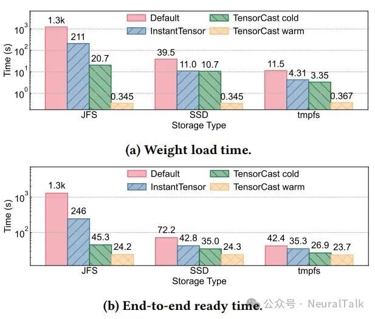
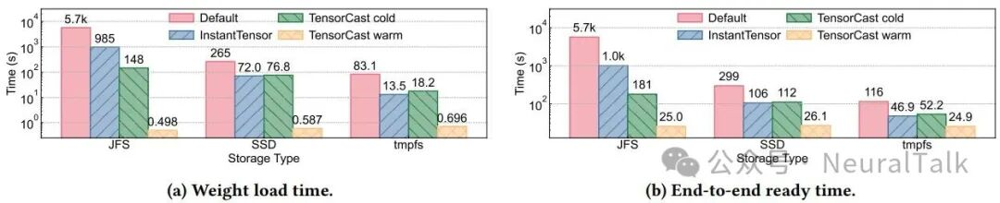
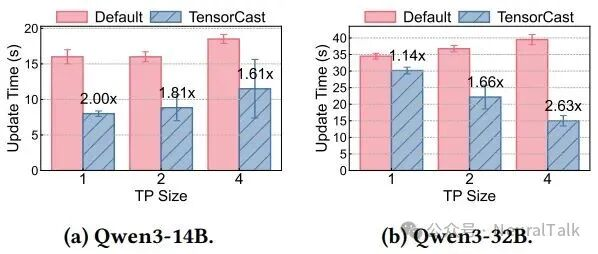
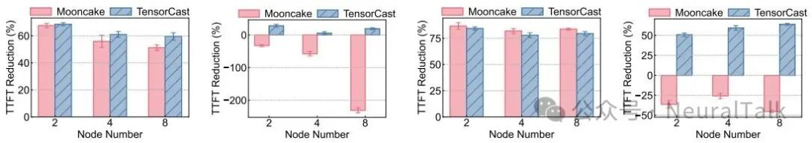
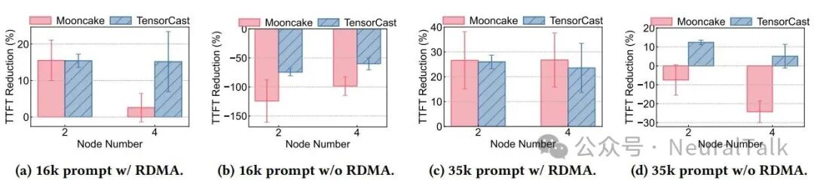
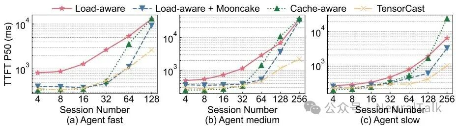
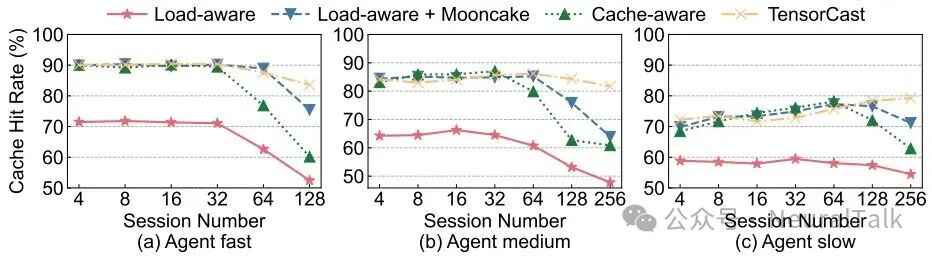

# TensorCast — 论文实验详录(arXiv:2608.06007 §6/§7)

> 前置:[`overview.md`](overview.md)(结论表)、[`architecture.md`](architecture.md)(机制)。本文完整记录论文 §6 四组实验的**设置、数字、机制归因**,附 Listing 1 全文与 §7 讨论,最后给出对 lake(P7 性能校准)的参考。所有数字来自论文原文;论文未给绝对值处如实标注。

论文用四组实验回答两个问题:① 统一抽象能否在**机制效率**上比肩专用系统(§6.1–6.3);② 可编程组合能否带来**专用系统做不了的**新优化(§6.4)。集成对象:vLLM(权重物化)与 SGLang(权重同步、KV 后端、可编程路由)。

## §6.1 模型权重物化(冷启动)

**场景**:MaaS 自动扩缩容——新实例要尽快就绪。TensorCast 作为 vLLM 的权重加载模块。

**设置**:单节点 64 CPU / 500GB DRAM / 8×H800,vLLM TP=8。权重为 safetensors,三种存储:JuiceFS(分布式文件系统,MaaS 常见托管方式)、本机 SSD、本机 DRAM(tmpfs)。四种方案:

| 方案 | 说明 |
|------|------|
| Default | vLLM 原生加载器 |
| InstantTensor | 专用快速加载器(流水线 + 零拷贝 I/O) |
| TensorCast-cold | worker 从存储读**按 rank 切分的权重切片**物化进 VRAM,vLLM 经 `tensor_dict` 消费 |
| TensorCast-warm | 权重切片已用 `prefetch` 预物化在本机,vLLM 直接消费(CUDA IPC 零拷贝) |

**结果**(JuiceFS 场景,Qwen3-30B-A3B):冷启动权重加载比 Default 快 **60.7×**、比 InstantTensor 快 **10.2×**;端到端就绪快 **28.5× / 5.4×**。预热模式 vLLM 消费已物化张量**不到 1 秒**,端到端只剩运行时初始化——Qwen3-235B-A22B 端到端加速 **228.6× / 40.7×**(对 Default / InstantTensor)。





**机制归因**:① 并发读——每个 rank 读自己的分片 view,且每个分片再开多路读流;② 传输流水线——H2D 拷贝被流水线隐藏;③ 预热 = CUDA IPC 零拷贝。

**lake 注**:这正是 lake 权重缓存(F2)要复现的场景。"cold 也快 60×"的关键不在缓存而在**分片 view + 多路读 + H2D 流水线**——lake 的 tiered-store pipeline 已具备同构路径;"warm < 1s"对应 lake 的 L0 预放置(池放置·调度读视图:池主动把权重/前缀 KV 预置到 HBM)。注意基线是**分布式文件系统**——对象存储/共享盘慢是放大的前提,本地 SSD 上差距会收窄(论文图 5/6 有三存储对比,正文只引 JFS 数字)。

## §6.2 模型权重同步(训练 → 推理)

**场景**:RL 后训练——trainer 发布新版本权重,rollout worker 周期同步。TensorCast 作为 SGLang 的权重更新模块。

**设置**:2 节点,各 64 CPU / 500GB DRAM / 4×H800。一端用 `WeightPublisher`(对 `put()` 的封装)发布不同版本权重;另一端 SGLang 实例从集群拉取。**每个 TP rank 只经 `view()` 拉自己的切片**——同一份共享权重服务不同并行度,免存多副本。**为公平对比默认基线(从 JFS 按文件全量拉取),TensorCast 侧关闭 RDMA**。

**结果**:加速 **1.14×–2.63×**。Qwen3-14B:TP=1/2/4 分别 2.00×/1.81×/1.61×(TP 升高→切片开销变大,主导成本从传输转向切片);Qwen3-32B:TP=1/2/4 分别 1.14×/1.66×/2.63×(大模型多 view 并发打满带宽,TP 越高收益越大)。



**lake 注**:① 加速比不大(对比 §6.1 的 60×)——因为基线(文件全量拉)在大文件上本来就能跑满带宽,收益只来自"按 rank 切片 + 并发 view";② **关了 RDMA 才 2.63×**,RDMA 下论文未给数;③ "一份权重服务多种 TP"对 lake 权重缓存是直接需求(混部集群里不同实例 TP 不同),view 机制的价值在这里比在 KV 侧更实。

## §6.3 高基数张量管理(KV 缓存,对比 Mooncake)

**场景**:TensorCast 集成进 **SGLang HiCache 模块当 KV 存储后端**(每 KV 页 = 一个高基数 Artifact,散布在各 worker),对比 SGLang + Mooncake。

**设置**:N 节点,各 64 CPU / 1TB DRAM / 8×H800 / 200Gbps RDMA;每节点 1 worker + 1 SGLang 实例。先用 LongBench 提示词打满单实例生成 KV,再**把同样提示词同时发给其余 N−1 个实例**——强制 100% 缓存命中,压测高基数并发拉取。提示词分两档:平均 16k(短)与 35k(长)token。指标:后续 N−1 实例相对首个实例的**平均 TTFT 降幅**。

**结果**:

- **开 RDMA**:两者相当,TTFT 降 **60%–87.5%**(即 2.5×–8× 加速);**节点越多 TensorCast 越优**——高基数元数据分散在分片宿主,不打中心。
- **关 RDMA**:**TensorCast 显著反超**——用户态 mTCP 多路径减少内核拷贝、聚合更高有效带宽(论文引 Mooncake 自己的跨数据中心场景论证无 RDMA 的现实性)。
- **Qwen3-235B-A22B(TP=8)**:结论一致,但 TP=8 带来 4× 并发 KV 页拉取,争用上升,两个系统的 TTFT 改善都收窄。





**lake 注**:① 这是"通用抽象无 overhead"的关键证据,但注意**前缀匹配是 HiCache 的 radix 做的**,TensorCast 只提供 artifact 存取——它替代的是 Mooncake-store 那一层,不是 HiCache。打平也不等于两者一样:负载只调 exists/get/put,TensorCast 的其他能力全不触发,区别被场景压平(打平正是论文要的卖点);② 100% 命中 + 全实例同时拉是**压力上限**而非典型负载,真实混合负载下的表现论文未测;③ mTCP 反超 Mooncake 值得 lake 记一笔:P5 若走 Mooncake TE,无 RDMA 环境的回退路径(TE 的 TCP)可能就是短板,TensorCast 的 MTCP(多 lane + staged-send + credit)是自建回退的参照。

## §6.4 可编程请求路由(93.2% 的来源)

**场景**:把"负载均衡 + KV 局部性"的联合策略写成调用者侧程序——这是 TaaS 独有、专用系统给不出的能力。SGLang 实例内嵌 instance adaptor,支持 Table 2 的全部实例操作。

**设置**:4 节点,各 2×H20;每节点 1 个 Qwen3-32B 实例(TP=2)。四个路由对比(基线都在 SGLang model gateway 里实现):

| 路由 | 说明 |
|------|------|
| 纯负载感知 | power-of-two-choices |
| 负载 + Mooncake | 负载感知 + Mooncake 跨实例共享 KV |
| 纯缓存感知 | 路由到本地前缀匹配最长的实例 |
| **TensorCast 重平衡** | 缓存感知 + 周期性把选中请求连同 KV 从最忙迁到最闲(Listing 1 的 Plan) |

**负载**:SWE-Gym 任务池 + OpenHands agent 跑约 **2400 个真实 Python 仓库任务**生成多轮轨迹;每条轨迹 = 一个多轮会话;会话内请求间隔采 LogNormal(右偏,拟合人类操作间隔),三档预设(论文 Table 3):

| 预设 | μ | σ | 中位 | 均值 | P5 | P95 | 代表 |
|------|---|---|------|------|----|-----|------|
| fast | 2.1 | 0.6 | 8.2s | 9.8s | 3.0s | 22.0s | 紧凑编码 agent 循环,短工具回复为主 |
| medium | 3.0 | 0.8 | 20.1s | 27.7s | 5.4s | 75.0s | 典型 SWE agent(看/改/跑混合) |
| slow | 4.1 | 1.0 | 60.3s | 99.5s | 11.6s | 311s | 长工具主导,研究/规划类 agent |

**重平衡策略**(论文附录 §A):每周期用 EWMA 更新各实例负载估计(负载 = 等待 + 运行中的队列深度);**负载差与负载比都超阈值**才触发;候选请求按 `token 数 × 活跃度因子 × 历史迁移惩罚` 三维打分,选最高者迁移。

**结果**:并发会话升高,所有方案中位 TTFT 都涨,但 TensorCast 始终最低。最高负载(fast 128 会话 / medium、slow 256 会话)下,对比"负载 + Mooncake",中位 TTFT 分别降 **71.4% / 93.2% / 70.4%**。缓存命中率:并发升高所有方案都掉(实例本地容量有限 + Mooncake 过载),TensorCast **掉得最慢**——既保 KV 局部性又动态均衡,同会话请求始终落在能命中的实例上。





**lake 注**:① 93.2% 的**分母是"负载感知 + Mooncake"在最高负载下的中位 TTFT**,不是"无缓存";② 这个策略在 lake 的框架里对应 **Router 的集群级调度 + 池的 KV 迁移**——lake 的 Router 本就拥有逐请求选路权(PD/混部/D-direct),TensorCast 证明的是"请求级 KV 迁移"这一动作的**收益上限**;lake 的混合执行模式天然包含"把请求挪到 KV 所在节点"(D-direct),TensorCast 做的是反向动作"把 KV 挪到请求所在/空闲节点"——两个方向都该在 Router 的策略空间里;③ 三档 LogNorm 间隔预设可直接借为 lake P7 的 agentic 负载模型。

## Listing 1(论文原文):带 KV 重平衡的 LLM 路由器

```python
import tensorcast as tc

rt = tc.connect(gateway_addr)   # 调用者的 TensorCast runtime

def rebalance():
    # 由重平衡策略决定:把 inst1 的某个请求迁到 inst2
    instances = rt.signals().list_instances()
    inst1, inst2, req_id = decide(instances)

    # 用一个 Plan 完成 KV 迁移
    ctx = tc.CallContext(id="tracing_id", deadline_ms=5000, idempotency_key="idem_key")
    plan = tc.Plan(ctx)
    # 把请求的 KV 从 inst1 导出为 artifact 注册进集群
    flush_res = plan.on_instance(inst1).publish(req_id)
    # 可选:把所有 KV 预热到 inst2 所连 worker 的 CPU DRAM
    plan.on_worker(inst2.worker).prefetch_many(flush_res.artifact_result, device="cpu")
    # 把请求的 KV 装载进 inst2
    plan.on_instance(inst2).hydrate(req_id, flush_res.artifact_result)
    # 按依赖执行整个生命周期工作流
    plan.run(concurrency=1)
```

错误处理从略。`prefetch_many` 可选:`hydrate` 对已注册的 artifact 会自动拉取;显式预取是为了把传输排在装载前、重叠延迟。

## §7 讨论(论文自认的边界)

- **推理之外的适用性**:checkpoint 可映射为**带版本的系统所有 Artifact**(`view()` + `transform_into()` 表达按 rank 重分片);梯度、优化器状态、长寿命激活可映射为**调用者租借**张量。与 Megatron-LM / DeepSpeed 的集成留作未来工作——**训练侧未实测**。
- **集成成本与抽象开销**:解耦不消除引擎相关集成——TensorCast 把引擎内张量的导出/导入/变换收敛到 instance adaptor,让策略在 caller 侧演化而不反复改引擎/传输/存储。**论文明确不声称通用抽象天然比每个专用实现都快**:§6.1–6.3 证明机制可比,§6.4 证明组合能开新优化空间。

## 对 lake P7(性能校准)的参考

1. **负载模型**:三档 LogNorm 会话间隔(8.2s/20.1s/60.3s 中位)+ SWE-Gym/OpenHands 轨迹生成法,可直接搬来做 lake 的 agentic 基准。
2. **指标口径**:TTFT 降幅用"后续实例相对首实例"的相对值;重平衡用**中位** TTFT(不是 P99)——lake 写 SLO 对照实验时注意口径对齐,否则数字不可比。
3. **基线选择**:权重冷启动基线要含"分布式文件系统"这一档(JuiceFS),否则 60× 级别的收益无从谈起;KV 后端对比要开/关 RDMA 各测一轮(mTCP 反超是重要信号)。
4. **待验证的湖侧假设**:TensorCast 证明"请求级 KV 迁移"在 agentic 负载下收益巨大(93.2%)——这直接支撑 lake 混合执行模式里"迁移/重放"动作的价值;但 lake 的 D-direct(请求去找 KV)与 TensorCast 的 hydrate(KV 来找请求)哪个在同等负载下更优,需要 P7 实测,这是 TensorCast 没回答、lake 必须自己回答的问题。
