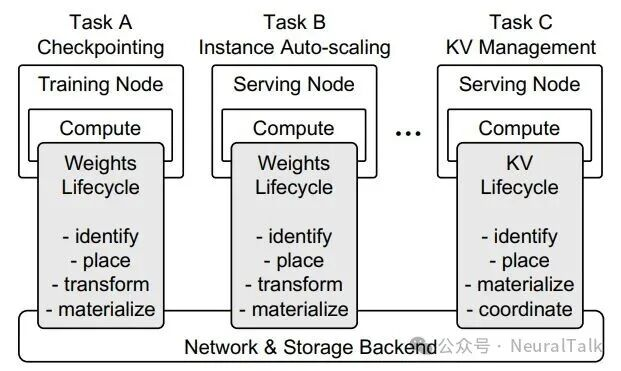
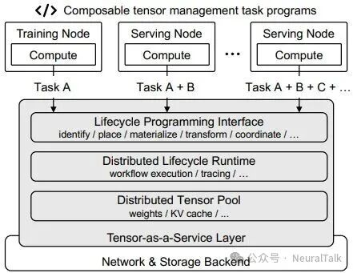
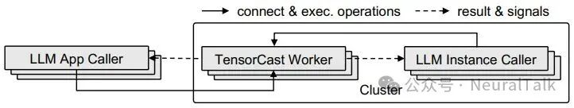

# TensorCast — 张量状态基础设施层(总览)

> 源码:`3rdparty/tensorcast`(submodule,HEAD `19f54d60`,v0.1.0+6,2026-06-17)。上游 [tensorcast-ai/tensorcast](https://github.com/tensorcast-ai/tensorcast)。许可:MIT / Apache-2.0 混合(部分源自 ServerlessLLM)。PyPI:`tensorcast`;Python 3.10–3.12 + torch 2.11.0 + CUDA 12.8;C++ core(Bazel,~160K 行)+ Python SDK(~95K 行)。  
> 论文:TensorCast: The Missing Tensor Management Layer in Large Language Model Infrastructure,arXiv:2608.06007(北京大学 · 阶跃星辰 · 北京邮电大学)。NeuralTalk 2026-08-09 解读([微信](https://mp.weixin.qq.com/s/BqxPZItMx0s2EF0f8yhWTg))。论文提出的 **Tensor-as-a-Service(TaaS,张量即服务)** 范式是本文抽象层定位的理论依据。  
> 上游架构/HA/P2P/view 文档见 `docs/architecture/`(architecture-overview / artifact-views-and-retrieval / p2p-transfer-strategies / view-replicas-and-assembly / high-availability-design);与 lake 对照见下。

**本目录文档**:

| 文档 | 内容 |
|------|------|
| `overview.md`(本文) | 定位、问题动机、TaaS 范式与设计原则、四抽象与 API、与 lake 的全面对照(关系/借鉴/差异/局限) |
| [`architecture.md`](architecture.md) | 运行时深挖:GS(DuckDB)/Daemon/ingestion 管线、UMA 内存模型与 LIP、RDMA/MTCP 传输与流控、view/ByteSpace/assembly、HA 故障矩阵 |
| [`evaluation.md`](evaluation.md) | 论文 §6 四组实验详录(设置/数字/机制归因)+ 代码清单 1 + §7 讨论 + 对 lake P7 的校准参考 |

## 一句话定位

TensorCast 把**模型权重、KV cache、checkpoint、RL 参数、激活**等张量状态从应用进程里**抽取出来**,作为**分布式 artifact**统一管理。控制面(Global Store)规划放置与 fanout,数据面(Store Daemon)持有本地张量内存、同机走 CUDA IPC 零拷贝、跨机走 RDMA/TCP P2P。口号:"load once, share everywhere"。

定位上是**纯状态层**:它不调度请求、不做 PD/colocate/D-direct 选路、不跑模型——只管"张量状态住哪、怎么搬、使用方要哪个 view"。这与 lake 的**存储层 + 权重缓存**同层。

## 问题动机:张量管理的"烟囱困境"

论文的出发点是一个观察:今天的 LLM 系统里,张量(权重、KV cache、checkpoint、RL 参数)早已不只是计算的中间产物,而是**跨组件共享的持久化状态**——但行业的主流做法仍是为每一类场景单独造一套管理方案。



论文归纳了三类典型负载:

1. **服务扩缩容下的权重分发**:Serverless/MaaS 要求实例随请求量启停,上百 GB 权重快速分发到新实例。现有方案要么改存储后端的加载流水线,要么从已有实例拉副本——都是针对"权重加载"单点的垂直优化。
2. **KV 缓存管理**:上下文拉长 + 多轮对话,KV 从临时缓冲区变成可复用、可迁移、可卸载的持久状态。PD 分离、前缀共享、跨节点传输各自诞生了专用系统,但 KV 放置/移动机制与调度策略深度绑定,难以复用到别的场景。
3. **动态 checkpoint 与权重同步**:训练周期落盘、RL 后训练把新权重同步到推理 rollout 节点、并行策略切换时的重分片——同样有专用系统,彼此逻辑互不通用。

**三类场景底层在重复同一组生命周期原语**,论文 §2.2 提炼为五类(中文译名对照论文原词):

- **身份与所有权**(Identify and Own):张量要有稳定身份、元数据和归属,否则无法跨引擎、跨进程、跨时间共享;
- **放置与移动**(Place and Move):按策略决定放哪,复制 / 迁移 / 预取;
- **物化**(Materialize):逻辑状态最终要变成引擎里可计算的形态——落到具体设备、具体布局的真实张量;
- **变换**(Transform):跨并行度、跨引擎时的切片、视图、布局转换、重分片;
- **组合与协同**(Compose and Coordinate):真实负载是多步串联(发布 → 迁移 → 变换 → 加载),需要策略层把这些步骤协调起来。

既然操作高度同质,就没有理由为每类任务重复建管理栈——这是 TaaS 抽象成立的核心前提。

论文 Table 1 把四类负载 × 张量状态 × 生命周期挑战 × 共享原语列为一张表(注意第四类 agentic reasoning 已把"推理状态的分叉/卸载/恢复"纳入张量管理范畴):

| 负载 | 张量状态 | 生命周期挑战 | 共享原语 |
|------|---------|-------------|---------|
| MaaS 服务扩缩容 | 模型权重 | 把不可变权重分发到新实例 | identify, place, transform, materialize |
| KV 缓存管理 | KV cache 块 | 跨请求/跨实例共享可复用上下文 | identify, place, materialize |
| RL 后训练 | 模型权重 | 把更新权重从训练端同步到 rollout worker | identify, transform, materialize |
| Agentic 推理 | 推理状态 | 跨实例分叉、卸载、恢复状态 | identify, materialize, coordinate |

垂直优化的代价集中在两点。**机制重复建设**:每类新需求重写一套放置/迁移/物化,并与引擎/网络/存储深度绑定——论文点名 Mooncake 作例:它的 min-TTFT 调度需要引擎估 prefill 时长、网络侧估 KV 传输时间,机制与策略焊死,这套放置/传输机制无法被别的负载复用;把 PD 调度从 min-TTFT 换成缓存亲和+负载均衡(引用 DualMap),要穿透路由层、KV 系统、推理引擎做侵入式修改。**跨组件组合优化无法落地**:既要负载均衡又要 KV 局部性还要状态可迁移,各自为政的系统只能靠定制代码硬凑。NeuralTalk 解读把这个局面比作**"操作系统诞生前"——每个应用自己管理内存、磁盘与 IO**(注意:这是解读的比喻,论文原文只说 "missing abstraction layer")。这个判断与 lake [`../../architecture/kv-virtual-memory.md`](../../architecture/kv-virtual-memory.md) 的叙事同构,两家独立得出,互为印证。

## TaaS 范式:张量生命周期作为独立抽象

论文的核心论点:**张量生命周期管理是现代 LLM 基础设施中缺失的一层抽象**。权重加载、KV 管理、checkpoint 同步等各自做了垂直优化,但管理机制与执行引擎/网络层/存储后端深度绑定,形成"优化孤岛"——跨组件联合优化(如同时兼顾负载均衡与 KV 亲和的请求调度)无法落地。TaaS 把张量管理从计算逻辑中解耦成独立服务层。

**合格的 TaaS 层必须满足三项要求**(论文 §2,设计的准绳):① **张量原生抽象**——不能像对象存储那样把数据当不透明字节块,必须原生理解张量的身份、布局、设备归属、变换规则,提供一等张量句柄;② **可编程生命周期管理**——不内置死某几种优化策略,提供可组合原语让调用者按业务编排(与计算框架"调度任务"不同,TaaS"编排张量状态");③ **集群级执行能力**——统一管理跨集群的异构内存/网络/存储层级,支持分布式元数据与容错,执行路径保持极低开销。

落到 TensorCast 系统,是**三条设计原则**(论文 §1):**张量原生**(张量是一等系统对象,带显式身份/所有权/生命周期语义,与物理放置解耦)、**可编程生命周期**(可组合原语,调用者定义策略而不重实现机制)、**策略与机制分离**(调用者写普通程序编排策略,runtime 透明执行,不动底层引擎)。



论文把上面五类原语映射成 **四个编程抽象**:

| 抽象 | 对应原语 | 语义 | lake 对应 |
|------|---------|------|----------|
| **Artifact** | 身份与所有权 | 张量全局身份证 + 逻辑句柄(不可变,带规范身份);拿到 handle 即可操作,不知实际在哪节点/哪层/哪种布局 | KV block 位置视图 / 权重条目(handle) |
| **Operation** | 放置与移动 / 变换 / 物化 | 有限可扩展的生命周期原语;工作者操作(预取/固定,纯 TaaS 层内) vs 实例操作(发布/加载/填入,需与引擎交互);携带 trace/deadline/幂等键,支持懒执行 | 池 agent 的 publish/pull/fence/demote/promote |
| **Plan** | 组合与协同 | 多 Operation 按 DAG 组织,共享执行上下文,自动依赖调度;**刻意不提供 ACID 事务/回滚**(张量多不可变副本可重算,部分结果可保留复用) | — (lake 无等价编排 DSL;F4 重决策哲学与之同向) |
| **Signal** | (无对应原语,是反馈通道) | 运行时状态反馈(节点内存/网络压力、实例负载与归属 worker)给调用者,**TaaS 不内置调度/放置策略**,策略在调用者侧 | 池上报容量/队列/in-flight 信号供 gateway/Router 决策(过载归 gateway 边界一致) |

**编程模型是 caller-worker**:用户在 caller 侧写张量管理程序,每个 caller 连一个 TensorCast worker 拿到 `Runtime` 句柄;worker 持有张量状态、分布式执行操作,把结果连同内部状态信号返回给 caller 做错误处理/追踪/策略决策。



调用者分两类:**应用调用者**(业务级策略:请求路由/扩缩容/多实例编排,逻辑上在集群外)与**实例调用者**(引擎对接的机制边界,只暴露引擎内张量的读写,不含业务策略——如最小 SGLang 集成就是实现 HiCache 接口 + 连一个 worker,让整个 TensorCast 集群充当 KV 后端)。严格**策略与机制分离**:调策略不动引擎,换引擎只换实例适配层。

**Artifact 的两种所有权模式**(对照 lake 时很关键):**系统所有**(System-Owned)——TensorCast 全权负责生命周期,适合权重这类持久全局张量;**调用者租借**(Caller-Leased)——调用者保留所有权,只把临时管理权租给系统,适合 KV cache 这类临时但可共享的张量。

注意"租"的是什么:**租出去的是管理权——登记元数据、搬副本、到期清理——不是显存本身**。以 KV 为例:引擎 HBM 里的 KV 本体始终只有引擎能读写,TensorCast 管的是 `publish` 把字节拷出引擎之后、住在 worker 内存里的那份副本。所以"TensorCast 管理 KV"的准确含义是"管理 KV 的池侧副本",它**管不到 HBM 里面的 KV**——那是引擎的自留地(唯一的例外机制是 LIP 原地租借,但 v1 用不到 KV 上,见「KV 接入详解」)。lake 则把 KV 所有权连显存一起收归池,比"系统所有"还彻底(见「关键差异」)。

**完整 API 面**(论文 Table 2,数量精简但表达力强——绝大多数张量管理场景可由这些接口组合出来):

| 类别 | 接口 | 语义 |
|------|------|------|
| Artifact | `register(tensor, art_id)` / `put(tensor, art_id)` / `artifact(art_id)` | 注册调用者租借张量 / 置入系统所有张量 / 按 ID 拿句柄 |
| | `Artifact.tensor_meta()` / `tensor_dict()` / `view(slice, name)` | 元数据 / 物化(阻塞) / 派生视图 |
| Plan | `context(id, ddl, key)` / `plan(ctx)` / `on_worker(w)` / `on_instance(i)` / `run(concurrency)` | 调用上下文 / 建计划 / 两类步骤 / 按并发度执行 |
| Worker Operation | `prefetch(artifact, device)` / `prefetch_many(...)` / `pin(artifact, device)` | 副本搬到 worker 设备 / 批量 / 固定驻留 |
| Instance Operation | `publish(req_id, ttl)` / `manifest(req_id)` / `hydrate(req_id, artifacts)` / `evict(req_id)` / `transform_into(artifact, spec, target)` | 导出请求 KV / 查 KV 的 artifact 集 / 装载回引擎 / 驱逐 / 变换后填入引擎自有缓冲区 |
| Signal | `connect(worker_addr)` / `list_instances()` / `list_workers()` | 连运行时 / 实例状态 / worker 状态 |

## 与现有系统的定位区分(论文)

- **vs 传统分布式对象存储**:对象存储只存取不透明字节块,不理解张量语义,无生命周期编排 → TaaS **张量原生**(身份/布局/设备/变换一等公民)。
- **vs Ray 等通用分布式计算框架**:Ray 以**任务**为中心(调度计算)→ TaaS 以**数据**为中心(编排张量状态移动与变换)。
- **vs Mooncake / LMCache 等专用 KV 系统**:专用系统把 KV 传输机制与调度策略**绑定**,只服务 KV 场景 → TaaS 把机制抽成通用原语,**KV 管理只是其应用场景之一**(权重加载/checkpoint 同步/agent 状态管理同理)。

### 示例:几十行代码的 KV 缓存重平衡(93.2% 的机制)

论文 §3.3 的例子直观展示编程体验:定期观察各实例负载,把选中的请求连同它的完整 KV,从最忙实例迁到最闲实例。传统架构要做这件事,得同时改请求路由器、KV 系统、推理引擎;TensorCast 里只是应用调用者侧的普通程序:

1. **Signal**:`list_instances()` 拿各实例负载与归属 worker,按业务策略选出要迁移的请求与源/目实例;
2. **publish()**(实例操作):源实例把 KV 导出为 Artifact 注册进集群;
3. **prefetch_many()**(工作者操作,可选):把 Artifact 预取到目标实例所在 worker——可选,因为 hydrate 会自动拉取已注册的 Artifact;
4. **hydrate()**(实例操作):在目标引擎内物化这份 KV。

三步操作组成一个 Plan(共享执行上下文、幂等重试),不动 SGLang 调度器、KV 后端、TensorCast 运行时中的任何一个。§6.4 的 93.2% 中位 TTFT 收益就来自这个策略。值得注意的不是数字本身,而是它的成本:传统架构里要穿透路由器、KV 系统、引擎三层才能做的优化,这里只是调用者侧的一段普通程序。

论文 Listing 1 原文(错误处理从略),这就是"几十行代码"的实际形态:

```python
import tensorcast as tc

rt = tc.connect(gateway_addr)            # 调用者连到网关 worker,拿 Runtime

def rebalance():
    instances = rt.signals().list_instances()          # Signal:观察实例状态
    inst1, inst2, req_id = decide(instances)           # 业务策略:选请求与源/目实例

    ctx = tc.CallContext(id="tracing_id", deadline_ms=5000, idempotency_key="idem_key")
    plan = tc.Plan(ctx)
    flush_res = plan.on_instance(inst1).publish(req_id)                     # ① 源实例导出 KV
    plan.on_worker(inst2.worker).prefetch_many(flush_res.artifact_result,
                                               device="cpu")                # ② 可选:预取到目标 worker
    plan.on_instance(inst2).hydrate(req_id, flush_res.artifact_result)      # ③ 目标实例装载
    plan.run(concurrency=1)
```

## 与本系统的关系

| TensorCast 概念 | 本系统对应 | 关系 |
|-----------------|-----------|------|
| **artifact**(张量状态 + 元数据:name/shape/dtype/view/replica/routing hint) | KV block(不透明字节)+ 权重条目 | **形态对立**:TensorCast 张量感知(shape/dtype/view),lake KV 刻意不透明字节(模型无关池)。权重侧 lake 也可走张量感知,但 KV 池坚持不解释布局 |
| **Global Store**(控制面:artifact 元数据 + replica 路由 + fanout 规划) | Rust 存储控制面(位置视图权威 + radix + 配额/GC) | **职责同向**;差异在一致性强度(见下) |
| **Store Daemon**(数据面:持有本地张量内存 + CUDA IPC + RDMA/TCP) | Transfer Bus / tiered-store engine + worker L0 载体 | **同构**:daemon 拥有内存、worker attach,正是 lake"计算节点不拥有内存" |
| **policy 预设**(cache/durable/ha/cold/warm/pinned) | L0–L3 分层放置 + 副本/冻结/驱逐语义 | **词汇可直接借鉴**(见借鉴点 1) |
| **retrieval source**(local/disk/p2p,realize 时选) | 本地命中(D-direct)/ L2 / 池传输 | **同口径**:policy 定"住哪",source 定"从哪取",二者分离——与 lake 放置(池定) vs 选路(Router 读视图)的边界一致 |
| **lazy artifact handle**(put 返回 handle,realize 才搬字节) | 权重缓存 handle / KV block 位置视图 | **可借鉴**的"身份 ≠ 物化位置"解耦 |
| **binding**(daemon 持稳定 CUDA layout,`swap` 换版本) | 权重热替换 / model revision 切换 | **直接借鉴**版本热替换模式 |
| **tensor view / in-flight transform**(TP shard/slice/transpose 作元数据,realize 时应用) | (未来 TP)分片 | **未来 TP 参考**:shard 表达为元数据,source 选择 + 物化统一管线 |
| **统一物化管线**(DISK→DRAM→VRAM 显式异步) | L3→L2→L1→L0 流水线 | **同构**;lake 已有 tiered-store pipeline |
| **topology-aware P2P fanout**(replica 位置 + 介质层 + 负载 + 拓扑距离) | Transfer Engine / 池放置·调度读视图 | **同向**:fanout 规划基于元数据 = lake"池放置、调度读视图" |

**核心结论**:TensorCast ≈ lake 的**存储层 + 权重缓存**(张量状态抽取 + daemon 拥有内存 + 分层物化 + 放置策略),**但不含** radix 前缀复用控制面、请求级 PD/D-direct 选路、计算层。它是 lake 存算分离论点的**工业级佐证**(独立状态层、worker 无状态化),但在 KV 前缀复用与一致性权威上**不如 lake 彻底**。

## 架构

> 本节是鸟瞰;实现级深挖(GS 的 DuckDB 原子认领、Daemon 五阶段 ingestion 管线、UMA 内存模型与 VRAM LIP、RDMA pull / MTCP push 与流控、view/assembly/MI2、HA 故障矩阵)见 [`architecture.md`](architecture.md)。


```
                 ┌─────────────────────────────────────┐
                 │  Global Store(控制面)                │
                 │  artifact 元数据 · replica 路由      │
                 │  fanout 规划(位置+介质+负载+拓扑)    │
                 └────────┬────────────────────────────┘
                          │ 元数据 / 路由
        ┌─────────────────┼─────────────────┐
        ▼                 ▼                 ▼
  ┌──────────┐      ┌──────────┐      ┌──────────┐
  │ Daemon A │◄────P2P(RDMA/TCP)──►│ Daemon B │◄──►│ Daemon C │
  │ 持本地张量│      │ 持本地张量│      │ 持本地张量│
  │ CUDA IPC │      │ CUDA IPC │      │ CUDA IPC │
  └────┬─────┘      └────┬─────┘      └────┬─────┘
       │ CUDA IPC        │                  │
       ▼                 ▼                  ▼
    worker(A)         worker(B)           worker(C)
    (attach,不拥有内存)
```

### 三类可组合 Worker 角色(论文)

工作节点**不拆成独立服务**,而是角色化叠加:每节点至少**基础角色**(贡献内存/磁盘到统一张量池 + 执行本地计划步骤),可叠加**网关角色**(调用者提交工作流入口,解析依赖分发操作),可叠加**分片宿主角色**(管高基数张量分片的所有权与一致性)。部署灵活:高性能节点可直接设为 KV 分片宿主。

### 高低基数差异化管理(论文核心)

**基数(cardinality)就是"这类张量在集群里有多少个不同的个体"**。权重:一个模型就那几百个张量,少。KV 页:每个请求几十上百页,全集群百万级,多。统一张量池按这个数量级差异,给两类张量配了完全不同的记账方式——这是 TensorCast 元数据能扩展的关键;lake 当前 L0–L3 统一编址不分基数,值得对照:

| 类别 | 代表 | 特性 | 元数据怎么记 |
|------|------|------|-----------|
| **低基数** | 模型权重 | 少、大、不可变、低频访问 | 副本位置**全部集中存在 GS**。总共没几条,谁要用就问 GS 查一下,中心查询不是瓶颈 |
| **高基数** | KV cache 页 | 极多、碎、频繁创建复用 | GS 存不下也查不过来 → 把全部 KV 页的元数据**切成 N 堆(分片,shard),每堆外包给一个 worker 管**,这个 worker 叫**分片宿主**(shard home),它对自己这堆的所有权和一致性负责。GS 只记 N 条"哪堆归谁"(租约),不记每一页 |

**分片租约机制**要防的是**脑裂**:网络分区时,两个 worker 可能同时以为自己是同一堆的宿主,各自收写,账就分叉了。防法是给租约配一个**单调递增的隔离令牌**(fencing token,可以理解成"第几届宿主"的届号):

- 每个分片一个租约,内容 = 宿主是谁 + 过期时间 + 届号;
- 候选排名用 HRW 哈希(Highest Random Weight:所有节点拿 `shard_id + worker_id` 各自算一遍哈希,不用通信就能得出同一份排名),**前 3 名去 GS 抢租约,先到先得**;
- 宿主用心跳续租;宿主死了,租约过期,别人接管,**届号 +1**;
- 所有节点见到届号比当前旧的操作一律拒绝——旧宿主即使活过来也说了不算,脑裂被令牌挡住。

效果:GS 的元数据流量只有 N 条租约的规模,海量 KV 页的元数据压力分散到各分片宿主。

> **看着像 lake 的 agent,其实不是一回事**。lake 的 agent 管的是**本机物理资源**——本机 L0 的 slot、free-list、本地引用计数,是"我这台机器的内存哪块在用"的账,本地权威;而"哪个 block 在全局哪、前缀谱系"这本账的权威在 CP,agent 只持只读镜像 + 异步上报。TensorCast 的分片宿主相反:它管的是**全局元数据的一片**——这一片所有 KV 页的 artifact 账归它记,GS 手里没有全量。一个是"物理资源本地自治,全局账本归中心",一个是"全局账本切片外包"。故障语义也因此不同:lake 的 agent 死了,CP 权威还在,位置视图不丢,只是那台机的段被标失效;TensorCast 的分片宿主死了,那一片的元数据要等租约过期、新宿主接管重建,期间这片不可用。

### 运行时其他要点

- **CLI 管服务 + SDK 连接**:运维/启动脚本起 Global Store + Store Daemon,Python worker 只 `tc.init(mode="connect")` 连本机 daemon。服务生命周期显式,worker 不持有基础设施进程。
- **artifact handle 懒**:创建/发现 artifact 不搬字节;`tensor_dict`/`bind`/`prefetch` 等 realize 时才物化。
- **DISK→DRAM→VRAM 统一异步管线**:disk 加载、checkpoint 恢复、内存 staging、网络传输、张量物化共用一条显式、有界、可复用的数据路径。
- **无中心调度器**:Plan 分布式执行,网关解析依赖分发到各 worker;数据面张量传输**全程旁路全局存储**,worker 间 P2P 直连(RDMA 优先,回退用户态 mTCP 多连接 TCP);GPU 传输用钉选流式缓冲区 + 异步 CUDA 流,数据移动与计算重叠。
- **容错**:低基数靠持久化副本(物理副本在即可恢复);高基数靠分片租约(故障后租约过期,分片暂不可用待重建/重发布);全局存储元数据落后端数据库,生产可经共识协议 HA。

## 放置 / 持久化 policy(核心特性)

`policy` 是 artifact 的**放置与持久化契约**(retrieval source 在 realize 时另选):

| policy | 语义 | lake 对应 |
|--------|------|----------|
| `cache` | 快速本地稳定内存,best-effort,可驱逐 | L0/L1 缓存副本(可驱逐) |
| `durable` | 必落共享盘,并保留本地稳定副本 | L2(NVMe)+ L1 本地副本 |
| `ha` | durable + 本地与远端稳定副本(尽可能) | L2/L3 + 多副本 |
| `cold` | 必落共享盘,本地稳定内存按 TTL 暂留 | L3 权威 + L1 TTL 暂留 |
| `warm` | 偏好本地稳定内存,溢出时**拒绝**而非驱逐/落盘 | 软配额 + 拒绝(对应 lake 硬配额返回写入背压) |
| `pinned` | 本地稳定内存**必须且 pin**,溢出拒绝 | ref>0 冻结 / 不可驱逐 |

retrieval source(`GetArtifactOptions(source=...)`):`local` / `disk` / `prefer_p2p`(`allow_p2p`/`allow_disk`)——**policy 定"住哪"、source 定"从哪取"**,二者解耦。

## 实测(论文,对照专用系统)

> 本节是结论表;各实验的完整设置、数字分解、机制归因见 [`evaluation.md`](evaluation.md)。

四组实验的结论:统一抽象在基础场景上不输专用系统,可编程路由还拿到了专用系统给不出的收益:

| 场景 | 对比方案 | 结果 |
|------|---------|------|
| **权重量化冷启动**(MaaS 扩缩容,8×H800,Qwen3-30B/235B) | vLLM 原生 / InstantTensor / TensorCast 冷启 / 预热 | 分布式文件系统下冷启动比原生快 **60.7×**、比 InstantTensor 快 **10.2×**;端到端启动快 28.5×/5.4×。预热 IPC 零拷贝,235B 端到端启动 **>200×**。收益来自并发多路读分片 view + H2D 流水线 |
| **权重同步**(训练→推理,2 节点 4×H800,关 RDMA 公平对比) | 默认文件全量拉取 | TP=1/2/4 加速 **1.14×–2.63×**(大模型 + 高并行度收益放大)。同一共享权重可按需给不同并行度实例提供切片,免存多副本 |
| **KV 缓存管理**(集成进 SGLang HiCache 作 KV 后端 vs Mooncake,8×H800 200Gbps RDMA,100% 命中) | Mooncake | RDMA 开启时**两者相当**(TTFT 降 60%–87.5%,节点越多 TensorCast 越优,得益于分片元数据);**关 RDMA 时 TensorCast 反超**(用户态 mTCP 多路径减少内核拷贝,聚合更高有效带宽) |
| **可编程重平衡路由**(4 节点 2×H20,Qwen3-32B,SWE-Gym/OpenHands agent 轨迹) | 纯负载感知 / 负载+Mooncake KV / 纯缓存感知 / TensorCast 重平衡 | 中位 TTFT 最高降 **93.2%**(对比负载+Mooncake);既保 KV 局部性又动态均衡负载,缓存命中率下降最慢。整个策略**在调用者侧几十行代码**,不动 SGLang 调度器/KV 后端/运行时 |

重平衡策略本身(论文 §6.4)很简洁:每周期用 EWMA 更新各实例负载估计,负载差与负载比都超阈值时触发迁移;候选请求按"token 数(KV 复用收益)× 活跃度因子 × 历史迁移惩罚"三维打分,选最高者迁移。快/中/慢三档 agent 交互节奏下,最高负载时中位 TTFT 分别降 71.4% / 93.2% / 70.4%。

## 引擎接入(无自有计算层)

TensorCast **没有也不打算有计算层**——计算寄生在 vLLM/SGLang 上,适配层跑在引擎进程内(`engine_adapter/adapter.py`::`TargetRegistry`/`TransformRegistry`)。

**接入架构是两层**(设计文档 `docs/designs/0102-engine-artifact-integration-and-high-cardinality-manifest-orchestration.md`),而且**框架核心刻意无 KV 语义**。早期草稿曾在核心里放 KV 专属词汇(`KvKeySet`/`kvcache_flush`/`kvcache_prefetch`),被正式否决。否决的道理(0102 原文:"couples framework core to one business domain"):核心一旦懂"KV key、请求、前缀"这些概念,就和"推理 KV"这一个业务焊死了——权重、checkpoint 用不上这些概念却被迫带着;KV 语义哪天一变(比如换前缀方案),核心也得跟着改;未来别的高基数场景(非 token/请求中心)更难接。所以核心只留通用词,KV 语义全部推到引擎适配层。

KV 在通用词里的表达是 **manifest(清单)**:一张"这个请求的 KV 由哪几个 artifact 组成"的 artifact ID 列表,带一份清单摘要做校验。叫"**高基数** manifest"是因为这种清单的数量级——每个请求一张,每张几十上百个页,全集群百万级,正对应上一节的高基数分片管理。

1. **数据面:引擎存储后端插件** → TensorCast 数据面。SGLang 的 HiCache 后端槽、vLLM 的 `KVConnectorBase_V1` 槽都属于这层。
2. **控制面:进程内编排适配器** → Plan/Runtime。实例操作(`manifest`/`publish`/`hydrate`/`evict`)由 NodeAgent 执行(`node_agent/executor.py::_manifest/_publish/_hydrate`),结果走规范类型(`engine_adapter/artifact_api.py`::`ManifestResult`/`PublishResult`/`HydrateResult`,经 `ManifestArtifactSetBridge` 桥接成 `ArtifactSetRef`)。
3. 边界:`engine_request_id` 只是适配层句柄,**不进 artifact 身份**;集成层不许另起控制通道,重试/等待/重放都复用 `Operation[T]`。

### 2×2 现状(证据分级,别被论文的实验选择误导)

| | vLLM | SGLang |
|---|------|--------|
| **权重** | ✅ 论文 §6.1 实测:定制 model loader(`load_format="tensorcast"`,fork 内 `tensorcast_loader.py::TensorcastModelLoader`)+ `bind()`/`swap()` 热切换 | ✅ 论文 §6.2 实测:权重更新模块(`WeightPublisher` 发布 + `view()` 按 rank 拉切片) |
| **KV** | ❌ **论文未做、开源仓无码、全文无 connector 字样**;候选槽位是现成的 `KVConnectorBase_V1`(NIXL/Mooncake connector 同位)+ 同上两层架构 | ✅ 论文 §6.3/§6.4 实测:HiCache 存储后端(`mem_cache/storage/backend_factory.py::StorageBackendFactory.register_backend`,与 mooncake_store 同槽)+ 适配器四钩子 |

两段实测集成都做在**引擎侧**(SGLang 后端插件、vLLM fork),均未进开源仓;开源的是引擎中立的两层骨架(adapter/NodeAgent/规范结果类型)。

### KV 接入详解(lake 最关心的一条)

生命周期(两引擎同构):**`manifest(req_id)`** 拿请求的 KV artifact 清单 → **`publish(req_id, ttl)`** 把 KV 页从引擎 HBM 导出、经数据面拷到 worker(DRAM/VRAM)注册为 artifact → 可选 `prefetch` 到目标侧 → **`hydrate(req_id, artifacts)`** 物化回目标引擎的 KV 缓冲区 → **`evict(req_id)`** 清本地。前缀匹配、LRU、L1 管理**全部留在引擎**(SGLang 里是 HiCache 的 radix),TensorCast 只见"req_id → 一组不透明 artifact"。

三条要点:

- **HBM 归引擎,池只拿副本**。KV 本体始终在引擎自己的显存里;TensorCast 持有的是 `publish` 拷出去之后、住在 daemon 侧(UMA)的副本。publish/hydrate 各有一次 HBM↔daemon 的拷贝(同机可走 IPC,跨机 RDMA/mTCP)。这是 Caller-Leased 的直接投影——对照 lake:**L0 HBM 归池、引擎零地址**,产出即入池,没有 publish 这次拷出。
- **KV 发布绕不开这次拷贝,LIP 救不了**。"拷不拷贝"按场景摊开,主角只有两个——推理引擎和 TensorCast 的 daemon:
  - **权重 bind:不拷贝**。TensorCast 的 daemon 把权重读进 **daemon 自己的**显存,引擎通过 CUDA IPC 直接挂接 daemon 的显存来用。
  - **LIP:也不拷贝,但方向反过来**。引擎已经把权重加载进**引擎自己的**显存,于是对 TensorCast 说"这块显存租给你一段时间"(`register(in_place=true)`)。daemon 不拷字节,只登记"这块显存归我托管";租约按 TTL/2 心跳续,引擎进程一退出,租约自动作废。别的 GPU 要用这份张量,daemon 得先把它拷进自己持有的显存再给别人;跨机传输也只能先拷到主机内存再上网(机制细节见 [`architecture.md`](architecture.md) §3.2)。
  - **KV publish:必须拷**。publish 的输入是 `SealedByteArtifact`,`payload` 就是字节本体(Python bytes)——引擎得先把 KV 从 HBM 拷出来交给 TensorCast,才谈得上注册。

  所以 LIP 和 KV 是两条不接的路:LIP 是"引擎不交字节、只租显存",KV 发布是"引擎必须交字节";上游当前实现(view-replicas 文档标注的 v1 约束集)还明文禁止 piece 用 LIP 注册,LIP 的用例本来就只针对权重这种一整块、长期不动的张量。就算硬接,百万级 KV 页每页挂一份租约、逐页心跳续租也不现实。**"零拷贝发布 KV"在 TensorCast 当前版本仍是空白**。
- **vLLM KV 的空缺本身就是信息**:接 KV 的真实成本在**引擎侧**(要在引擎里实现 manifest/publish/hydrate 语义、动 KV 管理器),不在 TensorCast 侧。这印证了 lake 的判断:KV 接入成本与引擎让渡多少所有权成正比——TensorCast 选了最小让渡(四个钩子),代价是前缀语义永远留在引擎手里。

### 权重接入(参考)

- **vLLM**:`load_format="tensorcast"` 的定制 loader;daemon 把权重物化进**自己的 UMA VRAM**,vLLM 经 CUDA IPC/binding 零拷贝消费(§6.1 warm <1s 的原因),`binding.swap()` 换版本;或 `transform_into` 变换后**填入引擎自有缓冲**。
- **SGLang**:§6.2 的权重更新模块——训练端 `WeightPublisher`(封装 `put()`)发版本,推理端按 `view()` 只拉本 rank 切片进引擎参数缓冲。
- HBM 归属:bind/IPC 模式归 **daemon**,transform/fill 模式归**引擎**——权重侧两种都支持;KV 侧只有"归引擎"一种。

## 局限与边界

**论文自认**:① 验证集中在推理场景,训练侧(checkpoint/梯度/优化器状态)理论上可映射到 TaaS 但未实测;② 更大规模集群、复杂 agent 状态、跨数据中心调度未覆盖。

**分析性**(对照 lake 视角):

- **KV 无内容寻址与前缀语义**:KV 只是一种 artifact,复用靠副本 + retrieval source;跨请求前缀共享不是它的职责(给 SGLang 当后端时前缀匹配仍是 HiCache 在做)。
- **高基数 KV 故障语义弱**:分片租约下节点故障 → 租约过期 → 分片**暂时不可用,等重建/重发布**;KV 无持久化恢复点(对照 lake L2 durable = F4 恢复点),单分片宿主在租约过期前是事实单点。
- **无 ACID 的残留成本**:Plan 部分执行的半成品(已发布的 KV、已预取的副本)会残留,清理靠各操作语义,调用者要容忍。
- **只卖可编程性,不卖默认策略**:Signal 只暴露状态,路由/重平衡策略全在调用者侧自己写;93.2% 依赖策略写对,开箱无任何调度。
- **GS 可用性留给部署方**:开源版 Global Store 单点,"生产可经共识协议 HA"是论文一句话,非系统能力。
- **评测边界**:KV 实验是 100% 命中人工压力场景;93.2% 是特定 agent 轨迹 + 特定基线下的中位 TTFT,非端到端 SLO;权重同步为公平对比关了 RDMA,RDMA 下收益未展示。
- **工程成熟度**:v0.1.0(2026-06),部分源自 ServerlessLLM,Bazel C++ core,早期项目。

## 借鉴点(对应我们的设计)

| TensorCast 设计 | 我们对应 | 说明 |
|-----------------|----------|------|
| **policy 预设词汇**(cache/durable/ha/cold/warm/pinned) | L0–L3 放置 + 冻结/副本/驱逐语义 | 可直接借为 lake 放置策略的**命名层**:cache=L0/L1 可驱逐、durable=L2+本地、ha=多副本、pinned=ref>0 冻结、warm=软配额拒绝、cold=L3+TTL。比当前裸 tier 编号更易表达意图 |
| **lazy artifact handle**(身份 ≠ 物化位置) | 权重缓存 handle / KV block 位置视图 | 权重侧可借:weight artifact handle 解耦"权重身份"与"物化在哪层哪节点",realize 时再物化。lake KV block 已是此模式(位置视图 = handle) |
| **binding + `swap`**(稳定 daemon CUDA layout,版本热替换) | model revision / 权重热替换 | 直接借鉴:binding 持稳定地址,`binding.swap(next_artifact)` 换底层版本,使用方地址不变——lake 权重缓存热替换 / 灰度 revision 的现成模式 |
| **LIP**(引擎显存原地租借给池) | (KV 侧无需借鉴) | KV 不需要:lake 的 KV 产出即落进池分配的 L0 slot,天生零拷贝入池,LIP 要解决的问题不存在。**权重侧可作兼容路径**:未改造引擎自加载权重后原地租给池共享,是"引擎零改造入池"的过渡方案。其约束集(同设备禁消费 / staged-only P2P / 心跳续租 / owner 死即撤销)是"池为何要拥有内存"的反面论证 |
| **tensor view 作元数据**(TP shard/slice/transpose,realize 时应用) | (未来 TP)rank-local 分片 | 未来 TP 支持:shard 表达为 artifact 元数据,source 选择 + P2P 路由 + 校验 + 物化共用同一管线,不必每个使用方拉全量再 reshape |
| **统一物化管线 DISK→DRAM→VRAM**(显式、有界、跨工作流复用) | tiered-store pipeline(L3→L2→L1→L0) | 同构;TensorCast "bounded, reusable across workflows" 的表述强化 lake 设计 |
| **topology-aware P2P fanout**(replica 位置 + 介质 + 负载 + 拓扑距离) | 池放置·调度读视图 | fanout 规划基于 artifact 元数据 = lake"池主动放置、调度单向读视图" |
| **高低基数差异化元数据**(权重集中 vs KV 分片租约) | (lake 当前 L0–L3 统一编址,不分基数) | **lake 可借鉴**:高基数 KV 元数据若不走统一权威而分片,可缓解中心元数据压力。但 lake 选择单写者权威位置视图(见差异),分片租约是另一种扩展性取舍,需权衡 |
| **分片租约 + HRW + 隔离令牌**(防脑裂、去中心元数据) | 控制面单写者 + etcd checkpoint | 对照而非照搬:lake 用单点权威换"随时能问到底"(守 5ms),TensorCast 用分片租约换元数据扩展性。lake 多节点扩展到极大规模时,分片租约是备选 HA/扩展路径 |
| **Signal 反馈闭环**(TaaS 不内置策略,暴露状态给调用者) | 池上报容量/队列/in-flight 供 gateway/Router | **边界一致**:TensorCast 策略在调用者、机制在 TaaS;lake 过载归 gateway、执行归推理系统。同一"机制/策略分离"哲学 |
| **Plan 无 ACID/回滚**(张量不可变可重算,部分结果可保留) | F4 失败重决策(不设 mode-to-mode fallback) | **哲学同向**:都拒绝通用强事务,用"状态可重算/可重决策"换轻量。lake 重决策是请求级,TensorCast 是张量级 |

## 关键差异(我们更彻底)

- **分层模型**:TensorCast 的"层"是**单个 artifact 在单个 daemon 内的物化阶段**(DISK/DRAM/VRAM),无"全局分层池"概念,daemon 各管本地;lake 的 **L0–L3 是全局统一管理的池层**,跨所有 artifact、所有 `(model_id, revision)`、所有节点统一编址、放置/驱逐/副本/GC/碎片整理/配额。
- **KV 前缀复用**:TensorCast 把 KV 当作**与权重/checkpoint 同列的一种 artifact**,**无 radix 前缀树、无跨请求/跨实例前缀共享**(KV 复用靠 artifact 副本 + retrieval source,非前缀树);lake 有 radix tree + 前缀复用 + 跨实例命中(KV 复用是 lake KV 池的核心价值,非"又一个 tensor")。
- **与 Mooncake 打平怎么读(场景压平)**:TensorCast 与 HiCache 不在一层——它是 HiCache 的后端,正确对照是 Mooncake。§6.3 打平,是因为这个负载只调 exists/get/put:内容寻址、分片租约、view 全不触发,区别被场景压平——打平本身就是论文要的卖点(通用抽象不输专用系统)。区别在场景之外:一套栈同时管权重/checkpoint(Mooncake 不能);publish/hydrate 让调用者能主动搬 KV(Mooncake 只有写穿/命中两条被动路径);规模上去后分片元数据优于集中 master。对 lake 的参考价值因此在权重侧(view/binding/assembly)与工程侧(HA/mTCP/可观测性),不在 KV 控制面。
- **KV 所有权哲学(租借 vs 收归)**:TensorCast 的 KV 是 **Caller-Leased**——引擎保留所有权,只把临时管理权租给系统,迁移时 publish/hydrate 由引擎侧适配器执行。lake 把 KV 所有权**收归池**(比 TensorCast 的 System-Owned 更彻底):引擎零地址、不持索引,KV 的生死/位置/谱系全归池权威。租借模式引擎改造小、接入快(manifest/publish/hydrate/evict 四个实例钩子);收归模式换来池的全局前缀复用/放置/故障恢复与 worker 可销毁。这是"TensorCast ≈ lake 存储层 minus radix 控制面"在所有权维度的另一种表述。
- **一致性权威(单点一本账 vs 分片各记各的)**:先把 lake 自己说准。有人会问:agent 是异步提交 CP 的,那不就是最终一致吗?——**对,写入传播确实是最终一致的**:agent 热路径先写本地 overlay,满块注册、位置变化批量异步报给 CP,事件到达之前 CP 的账就是旧的。"强一致"说的不是传播,是**提交点之后**:① CP 进程内存是单写者,事件一旦提交,账永远只有一本、不分叉,同步读必拿到最新提交态(线性一致);② 搬 KV、确认位置时同步查 CP 权威,不走镜像。所以 lake 的全貌是"**最终一致的传播 + 一个能问到底的权威**":Router 平时读本地镜像(零 RPC),误判了回查 CP、miss 回填,只损性能不损正确性。这跟纯最终一致的差别在于:纯最终一致系统里你问到的永远是"可能是旧的",lake 里你总能花一次同步 RPC 问到确定答案。TensorCast 没有这个单点:GS 只存 N 条分片租约,KV 页的副本账分散在各分片宿主本地,worker 缓存租约、心跳对账——**没有任何一处能一跳回答"这页 KV 全局在哪"**。这会导致什么:lake 的 Router 任何时候都能从本地镜像(必要时回查 CP)拿到全局提交态,D-direct 决策守得住 5ms 预算;代价是 CP 是中心——单点写、内存装全量元数据、HA 靠 lease + checkpoint 重建,规模到极致是瓶颈。TensorCast 元数据压力天然分散,百万级 KV 页打不爆中心;代价是读者拿到的可能是旧账(租约缓存没刷新、心跳没收敛),选错副本就传输失败重试、回退 disk 读,故障分片在租约过期前事实不可用。两家都接受"陈旧只损性能不损正确性",差别在 lake 留了一个能问到底的权威,TensorCast 没有。
- **放置智能归谁(池自治 vs 调用者编程)**:lake 的池**主动**按热度迁移(promotion/demotion/L0 预放置),调度器单向读视图;TensorCast **刻意不内置放置策略**——Signal 只暴露状态,prefetch/pin/迁移全由调用者编程,daemon 的驱逐只是本地反应式(GPU 满了先驱逐再重试)。这是"纯状态层"定位的代价与自觉:优化智商全在调用者侧,池本身不替任何人做决定。
- **张量感知 vs 不透明字节(最尖锐对立)**:论文明确主张 TaaS **"不能像对象存储那样把数据当不透明字节块"**,必须张量原生(理解身份/布局/设备/变换),才能做 in-flight transform、view、按并行度切片;lake **KV 刻意不透明字节**(模型无关池,接新模型只注册 `model_id` 命名空间,池不解释张量布局)。这是**有意的根本对立**——TensorCast 用结构换灵活性与联合优化,lake 用不透明换模型无关与池统一。权重侧 lake 可择机引入张量感知(view/分片),**KV 侧坚持不透明**(前缀复用靠 radix hash,不靠张量语义)。
  - 不透明 ≠ 不管布局。lake 的答案是**布局一致性靠命名空间约定,不靠池解释**:注册 `(model_id, revision)` 时 `ModelDescriptor` 就带上 `num_layers`、`BlockSpec`(block_tokens、bytes_per_block)、`hash_algo`,接入该命名空间的所有 worker 必须按同一布局生产/消费;同一模型换布局(FP8↔BF16 KV、改 block 大小、变头配置)→ 注册成新 revision,即新命名空间——schema 本就约定 KV 不跨 revision 复用,布局隔离正好落在这道现有边界上。池唯一能做的校验是块大小对不上就拒写;块内字节怎么排,池永远不看。代价:布局兼容性由接入方自律,池不替你发现"同 hash 不同字节"的误接——这是不透明字节省掉转换逻辑的同时让渡出去的检查。
  - 那 PD 分离时 P 和 D 两边 layout 不一致怎么办?分两种。**排布不同**(P 的 kernel 按 layer-first 写、池里流通的是 page-first):数学内容相同,只是内存摆法不同,在 worker↔池边界由 agent 一次 kernel launch 转掉(见 [`../../architecture/kv-cache-pool.md`](../../architecture/kv-cache-pool.md)「布局转换」)——P 和 D 各自内部用什么排布随意,出池/入池时对齐到池约定。**内容/规格不同**(dtype、头数、block 大小变了):转换无意义,本来也不该共享,必须各注册各的命名空间。
- **内容寻址(同)与前缀链(异)**:有一点两家**不约而同**——artifact/block 身份都是内容寻址:TensorCast 的规范身份是 **MI2 = `mi2:index_multihash:data_multihash`**(canonical index 与数据的双 multihash,见 [`architecture.md`](architecture.md) §5),lake KV block 是**前缀链 hash**(`hash(parent_hash ‖ token_ids)`)。差异在"链":lake 的 hash 沿前缀逐级链接,天然支持 radix 树去重与共享;TensorCast 的 hash 是整块 artifact 的平哈希,支持完整性校验与确定性身份,但**不表达前缀包含关系**——这正是它做不了前缀复用的身份层根因。
- **请求级选路**:TensorCast **不做** PD/colocate/D-direct 选路,纯状态层(可编程路由是调用者侧业务策略,非内置);lake Router 依前缀本地命中/带宽/角色逐请求选路。二者**互补**而非竞争——TensorCast 可作 lake 存储层/权重缓存的实现参照,但不能替代 Router/计算层。
- **系统范围**:TensorCast 是独立张量基础设施(CUDA IPC + 自有 daemon);lake 是完整存算分离推理系统(存储 + 控制面 + 计算)。TensorCast ≈ lake 的存储层 + 权重缓存,minus radix KV 控制面、minus Router、minus 计算层。

## 代码索引

> `文件:符号` 锚定 `3rdparty/tensorcast`。Python SDK 在 `tensorcast/`,C++ core/daemon 在 `core/`·`daemon/`。符号名是稳定锚点,行号会漂移,找不到时 `grep -n "符号名" 3rdparty/tensorcast/<路径>`。

| 概念 | 文件:符号 |
|------|-----------|
| Store 门面(register/put/artifact/from_disk/import_from_disk) | `tensorcast/api/store/__init__.py`::`Store.register` / `Store.put` / `Store.artifact` / `Store.from_disk` / `Store.import_from_disk`(模块级同名函数 `register`/`put`/`artifact` 亦在) |
| registration 实现 | `tensorcast/api/store/registration.py`::`register` / `put` |
| Artifact 对象(view/tensor_dict/bind/prefetch) | `tensorcast/api/store/artifact.py`::`Artifact`(`view` :1765 / `bind` :1793 / `tensor_dict` :1509 / `tensor_dict_with_diagnostics` :1522 / `tensor_dict_into` :1689) |
| Operation 生命周期原语 | `tensorcast/api/operation.py`::`Operation`(:84,泛型,携带 trace/deadline/幂等键,懒执行) |
| Plan(DAG 工作流,无 ACID) | `tensorcast/api/plan/plan.py`::`Plan`(:1194)+ `prefetch`(:759) |
| Signal(状态反馈闭环) | `tensorcast/api/signals.py`::`TensorCastSignals` / `SignalSnapshot` / `WorkerStatus` |
| 版本热替换 swap | `tensorcast/api/store/owned_binding_slot.py`::`OwnedBindingSlot.swap`(:1259) |
| policy 预设枚举(cache/durable/ha/cold/warm/pinned) | `tensorcast/api/_config.py`::`StorePolicyProfile`(:79)+ `PolicyTier` / `PolicyScope` / `RetentionPolicy` |
| retrieval source 选项 | `tensorcast/api/__init__.py`::`GetArtifactOptions` |
| 物化管线内核 | `tensorcast/api/store/realization_kernel.py`::`tensor_dict`(:3108) |
| Store Daemon(gRPC 服务) | `daemon/service/grpc_service_impl.h`::`StoreDaemonServiceImpl` + `daemon/app/daemon_app.h`::`DaemonApp`;控制器:`byte_artifact_authority_service` / `replica_lifecycle_service` / `target_publish_service` / `assembly_operation_service` |
| 引擎适配层(跑在引擎进程内) | `tensorcast/engine_adapter/adapter.py`::`TargetRegistry` / `TransformRegistry` / `TransformPlugin` + `artifact_api.py`;vLLM binding 指南 `docs/guides/steptron-vllm-binding-integration.md` |
| Global Store(控制面 gRPC) | `tensorcast/global_store/grpc_service.py` + `cluster_runtime_rpc.py`;配置 `global_store/config/settings.py`(`OperationLeasePolicyConfig` / `RetentionPolicyConfig` / `GroupDispatchPolicyConfig` / `TransportSchedulerPolicyConfig`) |
| **分片租约(高基数 KV 防脑裂)** | `tensorcast/global_store/rpc/shard_home_lease_rpc_handler.py`::`ShardHomeLeaseRpcHandler`(`acquire_shard_home_lease` :62,lease_token 隔离令牌);RPC 路由 `rpc_servicer_mixins.py`::`AcquireShardHomeLease`(:442) |
| 操作租约(Plan 执行) | `rpc_servicer_mixins.py`::`AcquireOperationLease` / `KeepaliveOperationLease` / `ReleaseOperationLease`(:184/187/192) |
| replica 路由 / fanout | `tensorcast/global_store/repositories/replica_repository.py`::`GroupSourceSpreadPolicy`(:145) |
| C++ store core | `core/store/` · `core/checkpoint/` · `core/communicator/` · `core/cuda/` |
| proto | `proto/tensorcast/`(gRPC stub:`StoreDaemonService` / Global Store service) |
| ingestion 五阶段管线 | `core/store/runtime/ingestion/`::`IngestionPipeline`(SourceAdapter → `MetadataStage` → `AllocationStage` → `VerificationStage` → `HandleStage`)+ `MaterializationFacade` / `MaterializeOrchestrator` |
| 远端内存导出(RDMA 注册) | `core/store/replica/memory_export_registry.cc`::`MemoryExportRegistry::export_chunks`(chunk 合并 + MR 注册 + `direct_rdma_enabled`) |
| GS 原子认领副本(选择源) | `tensorcast/global_store/repositories/replica_repository.py`::`find_available_for_transport`(一条 SQL:GPU>RAM>DISK → 并发槽 → 负载比 → 最旧,原子 `current_requests+1`) |
| RDMA pull / MTCP push 传输 | `core/communicator/`(`RdmaTransport::read_multi` / `MTcpTransport` / `MemoryStager`:`HostPinnedGpuStager`·`GpuVramRdmaStager`·`HostPinnedCpuStager` / `FlowCreditLedger`·`StagingWindow`·`StageLeaseRegistry`) |
| view 规划/执行 | `core/store/materialization/dataplane/view/`::`ViewPlanner`(SelectionPlan+TransformPlan+ViewWritePlan)/ `ViewPlanSource` / `ViewIngestExecutor` |
| piece/assembly/sealing(MI2) | `core/store/runtime/metadata/registration_backend.{h,cc}` + `daemon/service/controllers/registration_controller.cc` + GS `services/view_state_service.py` |
| HA:生命周期/心跳/同步 | `daemon/ha/worker_lifecycle_manager.cc` + `core/store/components/global_store_client.{h,cc}`::`execute_rpc_with_retry` + GS `services/recovery_service.py` |
| VRAM Leased-In-Place(LIP) | `LeaseOptions.in_place` + `owner_pid`(注册路径);语义见上游 `docs/architecture/architecture-overview.md`「VRAM Leased-In-Place」节 |
| 上游架构文档 | `docs/architecture/{architecture-overview,artifact-views-and-retrieval,p2p-transfer-strategies,view-replicas-and-assembly,high-availability-design}.md`;另 `docs/internals/`(model-loading / disk-load-strategy / preemptible-memory / byte-range-mapping-and-execution 等)与 `docs/designs/`(0007 content-addressed-artifact-id / 0055 programmable-framework / 0086 source-side-remote-view-transport 等) |

## 源码关注点(对照 lake 的待读项)

TensorCast 与 lake 存储层/权重缓存高度同构,做源码级回溯时优先读:

- **Global Store 一致性模型**(`grpc_service.py` + `cluster_runtime_rpc.py`):强一致?best-effort?——对照 lake 控制面单写者线性一致 + etcd checkpoint;
- **Store Daemon CUDA IPC 句柄生命周期 + 多进程共享 VRAM**(`core/cuda/` + `daemon/service/byte_artifact_authority_service`):对照 lake L0 本地命中/D-direct 零拷贝;
- **binding `swap` 的并发与可见性**(`owned_binding_slot.py::swap`):对照 lake 权重热替换/revision 灰度;
- **policy 预设到 tier 放置的映射**(`_config.py::StorePolicyProfile` + `PolicyTier`):对照 lake 放置策略命名层;
- **高低基数差异化 + 分片租约**(`shard_home_lease_rpc_handler.py` + `rpc_servicer_mixins.py::AcquireShardHomeLease`):高基数 KV 元数据分片 + 租约/隔离令牌防脑裂——对照 lake 单点权威位置视图的扩展性取舍;
- **Plan 无 ACID 的依赖调度与幂等重试**(`plan.py::Plan`):对照 lake F4 重决策(都拒强事务,用可重算换轻量);
- **Signal 状态反馈**(`signals.py::TensorCastSignals`):对照 lake 池上报容量信号供 gateway/Router;
- **DISK→DRAM→VRAM 物化管线 backpressure/取消**(`realization_kernel.py`):对照 lake tiered-store pipeline;
- **HA 设计**(`docs/architecture/high-availability-design.md` + `daemon/ha/`):对照 lake F4 故障恢复。

## 参考链接

- **论文**:TensorCast: The Missing Tensor Management Layer in Large Language Model Infrastructure,arXiv:2608.06007([abs](https://arxiv.org/abs/2608.06007) / [pdf](https://arxiv.org/pdf/2608.06007)),北京大学 · 阶跃星辰 · 北京邮电大学。
- **代码**:[github.com/tensorcast-ai/tensorcast](https://github.com/tensorcast-ai/tensorcast);本仓 submodule `3rdparty/tensorcast`(HEAD `19f54d60`,v0.1.0+6)。
- **解读**:NeuralTalk 2026-08-09《张量即服务,打破KV与权重优化孤岛》([微信](https://mp.weixin.qq.com/s/BqxPZItMx0s2EF0f8yhWTg))——"操作系统诞生前"比喻的出处;论文图 1–11 取自该文,存于 `img/`。
- **上游文档**(submodule 内):`docs/architecture/`(architecture-overview / artifact-views-and-retrieval / p2p-transfer-strategies / view-replicas-and-assembly / high-availability-design)、`docs/internals/`(model-loading / disk-load-strategy / preemptible-memory 等)、`docs/designs/`(0007 content-addressed-artifact-id / 0055 programmable-framework / 0086 source-side-remote-view-transport 等)。
- **本目录**: [`architecture.md`](architecture.md)(运行时深挖)、[`evaluation.md`](evaluation.md)(实验详录)、`img/`(论文原图)。
- **lake 侧对照**: [`../../architecture/kv-virtual-memory.md`](../../architecture/kv-virtual-memory.md)(KV 虚拟内存叙事,业界对比含 TensorCast)、[`../../architecture/kv-cache-pool.md`](../../architecture/kv-cache-pool.md)、[`../3rdparty-reference.md`](../3rdparty-reference.md)。
