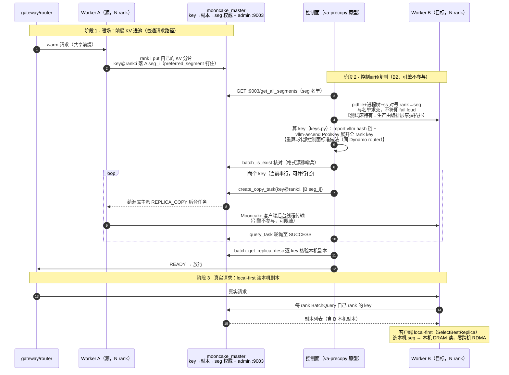
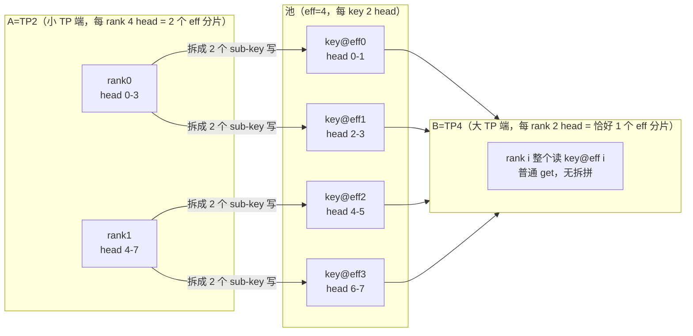

# va-precopy

在 **vllm-ascend** 上做 Mooncake KV **预复制（pre-copy）**：真实请求打到目标实例之前，用 Mooncake `create_copy_task` 把已有前缀 KV 复制到该实例的本机 DRAM segment，让读路径 local-first，避免跨机拉 KV。引擎不参与复制；不引入额外控制面框架。

本目录自包含，只依赖：

- 镜像 / 环境：`vllm-ascend`（建议 `v0.26.0rc1`）
- 池：`mooncake_master` + `AscendStoreConnector(backend=mooncake)`
- 控制面：本目录 Python（`create_copy_task` / `query_task` / `batch_get_replica_desc`）

官方 Store 基线：[KV Pool（Ascend Store）](https://docs.vllm.ai/projects/ascend/en/v0.26.0rc1/user_guide/feature_guide/kv_pool.html)

## 验证状态

环境：`quay.io/ascend/vllm-ascend:v0.26.0rc1`；`preferred_segment: true`；A2 RoCE（不开必然失败，`HcclBatchPut=4`）；主机 `7.242.105.245` / `7.242.105.217`。

| 场景 | 结果 |
|------|------|
| 同构同机 TP=2（rank↔seg 新路径，2026-10-09） | **通过**：12 keys 对号入 B 两 seg；hit 768/801 ≈ **95.9%** |
| 同构跨机 TP=1/2、TP=4 27B Mamba（旧 key×N 广播路径，2026-10-08） | 通过：~95%+（Mamba ≈92.1% 满块，`--block-size 1536`）；新路径未单独重跑 |
| 异构同机 双向 TP2↔TP4（2026-10-09，需容器补丁） | **通过**：24/24 key 对号，95.9%，零 invalid，A/B 输出逐字一致 |
| 异构跨机 245(TP2)→217(TP4)（2026-10-09，需容器补丁） | **通过** + **杀源实例法铁证读本机副本**（仅剩 217 副本时 B 首中 768 token 全部外部 get 成功） |

完整实验史（总表 12 条 + 异构实录 + 撤回记录）见 [EXPERIMENTS.md](EXPERIMENTS.md)；复现步骤与「读本机副本」判定金标准见 [REPRODUCE.md](REPRODUCE.md)。未做：layerwise、编排层、落盘、copy 并行（见「开放问题」）。

## 快速开始

### 前置：A2 环境变量（硬依赖）

与官方 `kv_pool.md` A2 分支一致，`cluster/start_worker.sh` 在 `ENABLE_ASCEND_A2=1`（默认）且 `protocol=ascend` 时自动 `source cluster/env_ascend_a2.sh`：

| 变量 | 作用 |
|------|------|
| `HCCL_INTRA_ROCE_ENABLE=1` | 卡间 RoCE 单边通信（缺则 `HcclBatchPut=4`） |
| `HCCL_IF_IP` | 主机业务 IP（与 segment 名中的 IP 一致） |
| `HCCL_SOCKET_IFNAME` / `GLOO_SOCKET_IFNAME` / `TP_SOCKET_IFNAME` | 业务网卡名 |
| `PYTHONHASHSEED=0` | legacy 防御；仅 block hash algo=builtin 时影响与控制面对齐（默认 sha256 不需要） |
| `HCCL_NPU_SOCKET_PORT_RANGE` | 同机多 worker 分端口段（脚本按 ROLE 默认 26000/26100） |

非 A2（如 A3 HCCS）设 `ENABLE_ASCEND_A2=0` 并按官方文档导出对应变量。

### A. 无 NPU：看计划 / 跑 store 半程

```bash
cd va-precopy

DRY_RUN=1 bash run_e2e.sh

# 通用/CPU Mooncake：
PROTOCOL=tcp bash tools/run_store_demo.sh

# vllm-ascend 镜像内 store 半程（三张空闲卡）：
PROTOCOL=ascend SOURCE_DEVICE=4 TARGET_DEVICE=5 COORD_DEVICE=6 \
  bash tools/run_store_demo.sh
```

### B. 有 NPU：端到端（推荐一键，TP=1）

在 **vllm-ascend** 容器内：

```bash
cd va-precopy

# 显式指定主机 IP + 业务网卡（官方 A2 要求；也可让 env_ascend_a2.sh 猜测）
export LOCAL_IP=7.242.105.245
export NIC_NAME=enp67s0f5

MODEL=/data/models/Qwen3-VL-8B-w8a8c16 \
  MODEL_NAME=Qwen3-VL-8B-w8a8c16 \
  DEVICES_A=0 DEVICES_B=1 TP=1 MAX_MODEL_LEN=4096 \
  bash run_e2e.sh
```

成功标志：

- 控制面打印 `[precopy] READY`
- `worker_B.log` 出现 `External prefix cache hit rate`（暖前缀足够长时可达 ~90%+）

停集群：

```bash
bash cluster/stop_cluster.sh           # 只停 A/B
STOP_MASTER=1 bash cluster/stop_cluster.sh
```

### C. 分步（调试用）

```bash
source cluster/env_ascend_a2.sh   # 需 LOCAL_IP / NIC_NAME

bash cluster/start_master.sh

ROLE=A PORT=8001 LOOKUP_ID=0 ASCEND_RT_VISIBLE_DEVICES=0 TP=1 \
  MODEL=/data/models/Qwen3-VL-8B-w8a8c16 MAX_MODEL_LEN=4096 \
  bash cluster/start_worker.sh

ROLE=B PORT=8002 LOOKUP_ID=1 ASCEND_RT_VISIBLE_DEVICES=1 TP=1 \
  MODEL=/data/models/Qwen3-VL-8B-w8a8c16 MAX_MODEL_LEN=4096 \
  bash cluster/start_worker.sh

# warm（前缀需够长以产生多个 full block；默认 *80 ≈ 801 tokens）
python3 - <<'PY' | curl -s http://127.0.0.1:8001/v1/completions \
  -H 'Content-Type: application/json' -d @-
import json
prefix = "va-precopy shared prefix for store warmup. " * 80
print(json.dumps({"model":"qwen","prompt":prefix,"max_tokens":1,"temperature":0}))
PY

# 单入口：warm prompt → 进程内 resolve seg → 算 key → batch_is_exist 核对 → copy → READY
python3 precopy/precopy.py \
  --master 127.0.0.1:50088 \
  --protocol ascend \
  --role B --tp-size "${TP:-1}" \
  --model /data/models/Qwen3-VL-8B-w8a8c16 \
  --model-name Qwen3-VL-8B-w8a8c16 \
  --prefix "va-precopy shared prefix for store warmup. " \
  --prefix-repeat 80 \
  --dump-keys prefix_keys.txt \
  --dry-show-before
# 成功：READY（rank i → B segs[i]）；key 全程内存，--dump-keys 只是调试留档
# 已知 seg 时显式 --targets seg0,seg1,... 跳过解析（生产编排已知拓扑）
```

### D. 跨机（摘要）

master 在源机 `0.0.0.0:50088`；B 机 worker 配 `MC_MASTER=A_IP:50088`、`LOCAL_IP=B_IP`、`HCCL_IF_IP=B_IP`。Mamba 模型 `--block-size 1536`。

```bash
# 机 A：master + worker-A；机 B：worker-B
python3 precopy/precopy.py --master A_IP:50088 --protocol ascend \
  --role B --tp-size 4 \
  --ssh 'ssh root@B_IP' --pidfile /root/va-precopy/logs/worker_B.pid \
  --model ... --model-name ... --block-size 1536 \
  --prefix-repeat 80 --dry-show-before
# 再打 B:8002；看 external_prefix_cache_*
```

## 怎么运作

B2：请求前把前缀 KV 放到目标实例本机 DRAM。先把三个对象讲清楚（以 VL-8B、TP=2、801 token 前缀为例），再说每样做到了什么。

### 三个对象

- **key —— KV 在池里的存取单位**。KV 不是作为一个整体进池的：引擎把它按 block 切开（本模型一块 = 128 token），**每个满块、每个 rank 的切片，各是池里一个独立对象，各配一把 key**。801 token 前缀 = 6 个满块 × 2 个 rank = **12 把 key**；余下 33 个 token 不满一块不进池——所以命中只有 768/801 ≈ 95.9%，尾巴由引擎重算补齐。预取的本质：把这 12 把 key 对应的对象逐个复制到目标侧。
- **seg —— KV 的物理落点**。worker 每个 rank 起机时在本机 DRAM 划一块区域注册进池，这块区域叫一个 segment（seg），名字就是它的地址 `IP:rpc_port`。**一个 rank 一个 seg**（TP=2 的实例有 2 个 seg）。master 记录「每把 key 的副本落在哪些 seg 上」，get 时按这个视图选副本。所谓 local-first：key 在**本 rank 自己的 seg** 上有副本 → 读本机 DRAM，不走网络。
- **head_or_tp_rank —— key 尾部的切片编号**。TP 下每个 rank 只持有 KV head 的一部分（8 KV head ÷ TP=2 → 每 rank 4 个 head 的 KV）。同一 block 在不同 rank 上的切片内容不同，key 尾部带编号区分「这是哪个 rank 的切片」，避免撞名——这就是 `head_or_tp_rank`，通常等于 `tp_rank`（rank0 的块 → `…@head_or_tp_rank:0@…`，rank1 → `:1@…`）。例外：KV head 数比 TP 还小时（如 MLA 只 1 个 KV head，各 rank 内容相同），多个 rank 共用一个编号（`put_step` 折叠，全 rank 都写 `:0@`）——所以枚举 key 的编号范围是 `0 .. N/put_step-1`，不一定是 `0..N-1`。

| 项 | 现状 |
|----|------|
| **Key 集合** | `precopy.py` prompt 模式内嵌 `collect_keys()` 展开 `head_or_tp_rank:0..N/put_step-1` × 满块（`precopy/keys.py`；key 全程内存） |
| **多 seg** | `precopy.py --targets seg0,seg1,...`：**rank i 的 key 只 copy 到 `targets[i]`**（不再 key×N 广播） |
| **调度** | 仍 **按 key 串行** `create_copy_and_wait`；映射已对号入座 |
| **解析 seg** | `precopy.py` 缺省即内嵌 `resolve.resolve_segments()`（`precopy/resolve.py`）：master admin API 名单 ∩ pidfile 进程树 `ss` 端口；rank 取自 `VLLM::Worker_TP<N>` 进程名，对不上即 fail loud，**不读日志**；显式 `--targets` 可跳过 |
| **未做** | 多 key/多 seg **并行**；跨机一份 + 同机扩散；异构 TP 见下节（已验证，需容器补丁） |

注意 `4×K` 把 key ≠ 4 倍数据：每把 key 只是**某个 rank 的切片**，合起来才是一份完整 KV（总字节 ≈ 一份逻辑 KV）——不是每把 key 都在 4 个 seg 上各留全量副本。

### 拓扑与时序

```text
mooncake_master
     |
+----+----+
|         |
worker-A  worker-B     各跑 vllm OpenAI server + AscendStoreConnector
(源 segment) (目标 segment)
     |
precopy.py / run_e2e.sh    独立进程：create_copy_task → READY
```

时序：

1. 在 worker-A 上暖前缀（KV 写入池，落在 A 的 segment）
2. 控制面把 key 复制到 B 的 `local_seg`
3. 轮询任务完成 + `batch_get_replica_desc` 确认 B 上有内存副本 → `READY`
4. **之后**再把真实请求打到 worker-B（get session 建立时锁定本机副本）

复制晚于 get session 则本次请求仍可能读远端；下一个请求会重新选副本。

全流程（同构 TP=N；异构只是 key 命名空间换成 eff rank、映射换成 `targets[i // num_sub_keys]`）：



注：图中「READY → 放行」目前由 `run_e2e.sh` / 手工顺序保证，接 gateway/router 的编排集成见「开放问题 #2」；「哪个 key 在哪个 seg」无需通知任何人——master 是放置权威，get 时 `BatchQuery` 现查；副本无 pin，READY 后受池驱逐策略管理。

### 数据来源与日志边界

**设计约束：任何脚本不得解析任何日志来做控制决策。** 控制流每个输入都有 API / OS 级来源：

| 控制面需要 | 来源 | 性质 |
|-----------|------|------|
| B 的 seg 名单 | `GET :9003/get_all_segments`（master admin，纯文本逐行） | master API（`cluster/start_master.sh` 默认开 9003） |
| rank↔seg 对号 | `logs/worker_<ROLE>.pid` → 进程树 → `ss -ltnp` 端口 ∩ 名单；rank 取 `VLLM::Worker_TP<N>` 进程名 | OS 级（跨机经 `--ssh`） |
| key 名单核对 | `batch_is_exist` / `batch_get_replica_desc` | 客户端 API |
| READY 判定 | `query_task` + `batch_get_replica_desc` | 客户端 API |
| worker 就绪 | 轮询 HTTP `/v1/models` | HTTP API |

日志只剩**人工取证**角色，不参与任何控制流：分 rank `MooncakeBackend.get enter keys=`（0.3.11 无等效 API，vLLM `/metrics` 只有聚合 external hit）、源侧 `replica_copy_success` 计数——这些是版本限制下的取证手段，REPRODUCE §3 的三层判据靠人读，脚本不读。

**key 格式与 hash 一律 import 上游权威实现，不自己搬**：block hash 链 import vllm `kv_cache_utils`，PoolKey 字符串格式 import vllm-ascend `PoolKey`/`KeyMetadata`（都在 `precopy/keys.py`；rc1=`config_data.py` / main=`metadata.py` 自适应，按字段名构造——rc1 有 `pcp_rank`、main 已删，位置参数构造会漂移）。上游改格式时 import 自动跟随；两道哨兵兜底：`batch_is_exist` 存在性核对（precopy prompt 模式内置，缺 key 即 exit 2）与 `tools/test_keys.py::test_upstream_parity`（容器内镜像 vs 上游逐字节比对）。`precopy/keys.py` 内置的 rc1 纯 Python 镜像只作离线 fallback（打印 WARN）。

### 异构 TP（A/B 不同 tp_size）

问题：A=TP2、B=TP4 能否像「原生 Mooncake/connector」一样共享同一套 shard？结论：**能——AscendStore 原生支持；单机双向（TP2→TP4 / TP4→TP2）与跨机（245→217）均已实测通过**（external hit 95.9%、零 invalid、A/B 输出逐字一致；跨机读本机副本经杀源实例法铁证），**但 v0.26.0rc1 必须打补丁**（见下）。实测实录见 [EXPERIMENTS.md](EXPERIMENTS.md)「实验实录」节（总表 #5/#6/#8/#12）。

| 层 | 结论 |
|----|------|
| **Mooncake Store** | 不管 TP；只认 `key → segment 副本`。 |
| **AscendStore**（`v0.26.0rc1`） | **原生支持**异构：extra_config `prefill_tp_size` / `decode_tp_size` → `config_data.py::infer_tp_mismatch_info`。语义：`effective_tp = max(local, peer)`；条件：TP 不同、非 MLA、非 hybrid、`num_kv_heads % effective_tp == 0`；`num_sub_keys = local_heads_per_rank // effective_heads_per_rank`；key 的 `head_or_tp_rank` 改写为 `effective_rank = tp_rank * num_sub_keys + sub_idx`（`pool_worker.py::_build_tp_mismatch_keys_and_addrs`），KV 按 head 切片 strided 读写。限制：不支持 layerwise / sparse / hybrid(Mamba/DSV4)。 |
| **上游 vLLM `MooncakeStoreConnector`** | 有异构 Store-TP / LCM（[PR #53129](https://github.com/vllm-project/vllm/pull/53129)）。 |
| **SGLang HiCache** | `tp_lcm_size` + head split。 |

#### sub-key 读写机制（小 TP 拆拼、大 TP 退化）

池的 key 永远按 `effective_tp = max(双方 TP)` 编号，每个 eff key 装 `num_kv_heads / effective_tp` 个 head 的切片。规则一句话：**谁的 TP < effective_tp，谁的一个 rank 就对应多个 eff key，读写必须拆/拼；谁的 TP = effective_tp，一个 rank 恰好一个 key，退化为普通路径**。eff 取 max 的原因：命名空间要让双方都能寻址，每个 eff key 成为双方所需粒度的最小公单位。

以 GQA 8 KV head、A=TP2 → B=TP4（eff=4）为例：



- **正向（TP2→TP4）**：A 是小 TP 端 → sub-key put（strided head 切片，`_build_tp_mismatch_keys_and_addrs`，`pool_worker.py`）；B 是大 TP 端 → 普通 get。
- **反向（TP4→TP2）**：A 是大 TP 端 → plain put；B 是小 TP 端 → sub-key get（`_load_kv_tp_mismatch` 读多个 eff key、按 head 切片拼回本地）。
- 数学关系：`num_sub_keys = local_heads_per_rank ÷ effective_heads_per_rank`（`config_data.py::infer_tp_mismatch_info`，main 已改名 `metadata.py`）；eff key 命名 `effective_rank = tp_rank × num_sub_keys + sub_idx`。

#### 上游 bug（v0.26.0rc1）：tp_mismatch put/get 是死代码

`pool_worker.py::_start_kv_transfer_threads` 构造 `KVCacheStoreSendingThread` / `KVCacheStoreRecvingThread` 时**漏传 `worker=self`**，而 `kv_transfer.py` 的 tp_mismatch put/get 分支都 gate 在 `self.worker is not None`（`:681` / `:934`）。后果：put 走普通路径，key 用**本地 rank 名**、值是**全本地 head 切片**——消费方（更大 TP）按 eff-rank 名找 key，部分「同名碰撞」会读到错误字节，其余直接 miss。

**上游已修**：[vllm-ascend #15835](https://github.com/vllm-project/vllm-ascend/pull/15835)（fix #15842，2026-09-09 合入 main，merge commit `9f8773ea`；根因 = #11444 重构丢了 #11582 引入的接线）。除两处线程构造补 `worker=self if self.tp_mismatch else None`，还恢复了 `start_load_kv` 同步 load 的 mismatch 分发。**rc1 / rc2 均不含，仅 main 有**。

补丁：`patch_tp_mismatch_worker.patch`（标准 unified diff，三处 hunk 锚定 rc1 唯一上下文）——**#15835 完整版 backport 到 rc1**：两处线程构造补 `worker=self if self.tp_mismatch else None`（同 TP 传 None、不碰普通路径）+ `start_load_kv` 恢复同步 load 的 mismatch 分发。容器内应用：`cd /vllm-workspace/vllm-ascend && git apply --check patch_tp_mismatch_worker.patch && git apply -v patch_tp_mismatch_worker.patch`（或 `patch -p1`）；`git apply -R --check` 探测是否已打。打上后小 TP 消费者同步 load 亦可走 `_load_kv_tp_mismatch`，**`LOAD_ASYNC=1` 由硬约束降为推荐项**（异步仍是 overlap 更优路径）。注意：本目录全部异构实测在旧 python 子集补丁 + 异步路径下完成（[EXPERIMENTS.md](EXPERIMENTS.md) #5/#6/#8/#12），同步 mismatch 路径按上游修复恢复、未在本测试床单独复测；0.26 rc 镜像必须打本补丁（rc1/rc2 均不含上游修复）。

参考：`pool_worker.py`（`put_step`/`head_or_tp_rank`/`_build_tp_mismatch_keys_and_addrs`）；`docs/research/sglang/storage-backends.md`。

## 目录结构

按调用链归位（2026-10-10 二次重组）：控制面 = `precopy/` 一个 Python 包，三个能力各一模块（keys/resolve/common），编排 = `precopy.py`；`cluster/` 只剩集群生命周期；历史章节中的 `collect_prefix_keys.py`（→`precopy/keys.py`）、`cluster/resolve_segments.sh`（→`precopy/resolve.py`）与 `tools/check_exists.py`（→`keys.py --keys-file --check-master`）按此映射。

```text
va-precopy/
├── run_e2e.sh            # 一键入口：双 worker 编排 + 自动 warm/precopy/hit B
├── precopy/              # 产品控制面（Python 包，三个能力 + 编排）
│   ├── precopy.py        #   单入口：warm prompt → resolve segs → 算 key → 核对 → copy → READY
│   ├── keys.py           #   能力1·key 计算：prompt→hash 链→PoolKey 枚举（import 上游权威；CLI 可单跑）
│   ├── resolve.py        #   能力2·seg 解析：admin API + pidfile/ss/ssh 对号（stdlib-only；CLI 可单跑）
│   └── common.py         #   能力3·store 封装：setup_store / copy / replica 查询
├── cluster/              # 集群生命周期（shell）
│   ├── start_master.sh   #   拉起 mooncake_master
│   ├── start_worker.sh   #   拉起单实例 vllm-ascend + AscendStoreConnector
│   ├── stop_cluster.sh   #   停 worker（可选停 master）
│   └── env_ascend_a2.sh  #   A2 RoCE 环境（HCCL_INTRA_ROCE_ENABLE 等），供 source
├── tools/                # 调试 / 演示 / 测试
│   ├── store_demo.py     #   Store 半程（无 vLLM）
│   ├── run_store_demo.sh #   跑 store 半程
│   ├── test_keys.py      #   keys.py 单测 + 容器内 upstream 一致性哨兵
│   └── test_resolve.py   #   resolve.py 单测（纯逻辑 + 真实 socket/pidfile/HTTP 集成）
├── conf/                 # mooncake 配置（样例 + 生成的 mooncake.<ROLE>.json）
├── logs/                 # pidfile / 日志（gitignore）
├── patch_tp_mismatch_worker.patch  # 异构 TP 必打（#15835 rc1 backport）
└── README.md / REPRODUCE.md / EXPERIMENTS.md
```

| 文档 | 作用 |
|------|------|
| `README.md` | 本文：端到端说明 |
| `REPRODUCE.md` | 客户复现参考：结论 + 必配项 + 「读本机副本」判定金标准 |
| `EXPERIMENTS.md` | 实验总表 12 条 + 异构实录 + 踩坑记录（含撤回历史） |

## 操作参考

### Worker 配置要点

`start_worker.sh` 只挂 **AscendStoreConnector**：

```json
{
  "kv_connector": "AscendStoreConnector",
  "kv_role": "kv_both",
  "kv_connector_extra_config": {
    "backend": "mooncake",
    "lookup_rpc_port": "<LOOKUP_ID>",
    "use_layerwise": false
  }
}
```

并设置 `MOONCAKE_CONFIG_PATH` → `conf/mooncake.<ROLE>.json`（NPU 上 `protocol=ascend`，`device_name=""`）。

**同机多 worker 必须 `preferred_segment: true`**：否则仅有 `prefer_alloc_in_same_node` 时，写路径可能把 KV 分到同机**另一个** worker 的 segment（B2 预复制场景退化成「KV 本来就在目标机」）。`start_worker.sh` 默认已开。

`lookup_rpc_port` 在 AscendStore 里是 **lookup id 后缀**（拼本地 IPC 路径），不是 TCP 端口；A/B 用不同 id（0/1）。

### Key 与 segment（操作指针）

概念见「怎么运作 · 三个对象」，这里是操作指针：

- **key 枚举**：`precopy/keys.py --model ... --prefix ...`（prompt 模式）、`--chunk-hashes`（离线）或 `--keys-file`（读留档 key 文件，配 `--check-master` 做事后逐 key 副本取证）——hash 链与 PoolKey 格式都 **import 上游权威实现**（见「数据来源与日志边界」）；内置镜像仅离线 fallback。
- **seg 解析**：`precopy/resolve.py --role B --tp N` 可单跑（调试）；产品路径由 `precopy.py` 内嵌调用（**不读日志**）：名单 = `GET :9003/get_all_segments`；对号 = `logs/worker_B.pid` → 进程树 → `ss -ltnp` 端口 ∩ 名单；rank 号取进程名 `VLLM::Worker_TP<N>`（TP=1 不需要）。任何一步对不上即 fail loud。跨机：`--ssh 'ssh root@B_IP' --pidfile <B 机路径>`（把 resolve.py 源码 pipe 到 B 机 `python3 -` 执行，不依赖远端路径）。
- **chunk hash**：`--hash-algo`（默认 sha256）与引擎 `prefix_caching_hash_algo` 一致即可；`PYTHONHASHSEED=0` 只在 algo=builtin 时才需要（legacy 防御）。

### 验收

| 步骤 | 判据 |
|------|------|
| `DRY_RUN=1 bash run_e2e.sh` | 打印 master / A / B / precopy 步骤 |
| `run_e2e.sh`（TP=1 + A2 env） | `[precopy] READY`；B 侧 External prefix hit |
| `precopy.py --targets` | 各 key AFTER 仅含其 mapped seg |
| `python3 precopy/resolve.py --role B --tp N` | 输出 rank↔seg 映射（admin API + pidfile/ss，无日志）；任一源不符即 fail loud |
| api_server `/proc/<pid>/environ` | 含 `HCCL_INTRA_ROCE_ENABLE=1` |
| `python3 tools/test_keys.py && python3 tools/test_resolve.py` | `PASS` |

## 边界与已知限制

- `protocol`：store 半程可用 `tcp`；接 vllm-ascend NPU 集群用 `ascend`，须与 `mooncake.json` 一致。
- 控制面发起 `create_copy_task`；`mooncake_master` 调度；引擎不调用该 API。
- 本目录只验证 **非 layerwise** + **本机 DRAM**；生成物已 `.gitignore`。
- 同构 **TP=2 rank↔seg** 已通过；TP=4 新路径未重跑。旧 key×N 历史结果仍有效作对照。
- copy 仍按 key **串行**；未做并行 / 本机扩散 / 带宽限速（与在线读共享带宽）。
- 副本 **无 pin**：READY 后仍可能被池驱逐；源属主客户端（worker-A）必须在线，掉线则 copy 失败。
- `precopy/resolve.py` 的依赖：master admin `:9003` 在线（`cluster/start_master.sh` 默认开）；`cluster/start_worker.sh` 写的 pidfile（跨机经 `--ssh` 在 B 机读）；TP>1 时 rank 号依赖 vLLM 进程名 `VLLM::Worker_TP<N>`——vLLM 改命名会 **fail loud**（不会静默错配），届时按 `pgrep -af 'VLLM::'` 实际输出更新模块内模式。
- `precopy.py` 退出期偶发 allocator abort / 挂起：**已修复**（READY 后显式 `store.close()`，与 keys `--check-master` / store_demo 对齐；此前 precopy 是唯一不 close 的脚本）。根因 = 客户端退出期 teardown 竞态：GC/atexit 触发的乱序析构与在途收尾操作（copy-task 收尾连接、重连协程）竞争，0.3.11.post1 缺上游 #3943（teardown drain）等修复；旧日志中出现时 READY 已打印即可忽略。
- **异构 TP（A/B 不同 tp_size）**：AscendStore **原生支持**（`prefill_tp_size`/`decode_tp_size` → tp_mismatch sub-key），但 v0.26.0rc1 put 路径有 bug 需补丁（见「怎么运作 · 异构 TP」）。

## 开放问题（待讨论）

底层 B2 已实测；下列未在本目录闭环，生产前需选型。

### 1. Layerwise

当前 e2e：`use_layerwise=false`。池侧有两条 layerwise 线（vllm-ascend）：

| 路线 | 大致配置 | 含义 |
|------|----------|------|
| Mooncake block_key | `backend=mooncake` + `use_layerwise=true` | 逐层 range 读；HBM 仍全层；壳请求同步占槽 |
| MemCache gva | `backend=memcache` + `use_layerwise=true` | HBM 可减量；预热落点更偏本机 DRAM |

待定：生产默认走 MemCache，还是留 Mooncake 并补测 layerwise + B2（get session 是否仍选本机 DRAM）。不建议自研 Mooncake GVA。

### 2. 上层编排（现只有底层）

现状：手工 / `run_e2e.sh`：warm → keys → `create_copy_task` → READY → **再**打目标。缺「谁预取、何时放行、失败重试」。

待定：独立 **Prefetch Orchestrator**（旁路进程或并入 Router）：收 intent → 调 B2 → READY 栅栏 → gateway/router 放行。过载/准入仍归 gateway；引擎不参与策略。

### 3. 落盘（SSD / disk）

B2 目标是 worker 挂载的 **DRAM segment**。Mooncake 可有 DRAM→SSD 分层（`enable_ssd_offload`，本目录默认 `false`），那是池内冷热，不是「预复制直指定 disk」。

待定：产品语义是否 **READY = 本机 DRAM 必达**；SSD 仅作容量/恢复异步 demote。以 disk 为 READY 会吃掉预热收益。

### 4. 其它生产缺口（短清单）

- **B 侧重复请求偶发 1-token 贪心翻转**（仅前置实验 B 非 DEBUG 实例出现：同 prompt 奇数次输出与 A 一致、偶数次在近平局 token 处偏移；A 稳定、B 冷 prompt 稳定、DEBUG 新实例 3 连跑未复现）——疑外部 KV 加载路径与 local 路径交替时的数值扰动，非字节错乱（纯外部读首请求输出与 A 逐字一致）；复现条件与根因待查，**生产化前必须闭环**
- EP：持 KV 的 rank/多机拓扑尚未测
- master HA、监控（READY 延迟、copy 失败率、external hit）
- 源 worker 掉线则 copy 失败，与故障重路由如何衔接
- 方案 A（壳请求进 HBM）是否还要、与 B2 叠加顺序
